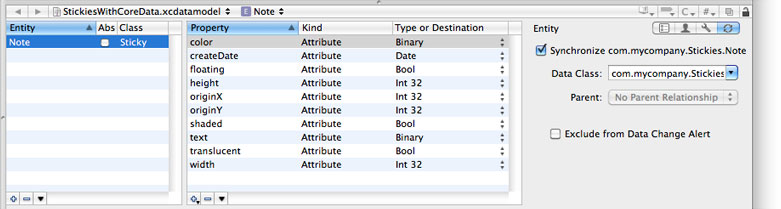
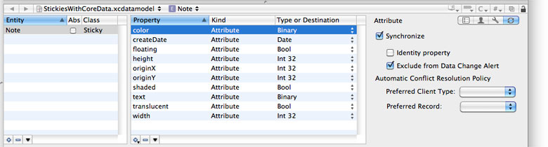

> 导航：[总目录](../../../README.md) · [documentation](../../../_indexes/documentation.md) · [Sync Services Programming Guide](Introduction%20to%20Sync%20Services%20Programming%20Guide.md)


[Next](Syncing%20Preferences.md)[Previous](Using%20a%20Session%20Driver.md)

# Syncing Core Data Applications

Core Data provides a robust and reliable persistent store ideal for syncing applications. Using Core Data to store local sync records greatly simplifies your application. When you use Core Data, you don’t need to worry about modeling your entities, saving and loading records, and tracking changes between sync sessions. However, sync clients and sync sessions are not automatically created for you, so you still need to follow some of the steps described in this document to sync your application. Managing a sync session is also simplified using a delegate, similar to the `ISyncSessionDriver` class and `ISyncSessionDriverDataSource` protocol. This article describes some of the same and alternate steps to create a syncing Core Data application.

Follow these general steps to create a Core Data application that syncs managed objects:

1. Create a Core Data application using Xcode and add `SyncServices.framework` to the project.
2. Create a managed object model using the data modeling tool in Xcode.
3. Add additional syncing information to the entities and properties in the model that you want to sync.

   Read [Adding Information to Managed Object Models](#apple-f4xwc4dqnrsv64tfmyxwi33df52wszbpkridimbqga2temzsfvjvony) in this article for how to add this information.
4. Create a sync schema that registers the managed object model directly.

   Read [Registering Managed Object Models](#apple-f4xwc4dqnrsv64tfmyxwi33df52wszbpkridimbqga2temzsfvjvooa) in this article for how to add managed object models to sync schemas.
5. Register the schema.

   Read [Registering Schemas](Registering%20Schemas.md#apple-f4xwc4dqnrsv64tfmyxwi33df52wszbpkridimbqgaytcnjufvbuuqsfjbaucry) for how to register your schema.
6. Create and register your sync client.

   Read [Registering Clients](Registering%20Clients.md#apple-f4xwc4dqnrsv64tfmyxwi33df52wszbpkridimbqgaytcnjvfvbuuqsfjbaucry) for how to create clients.
7. Start a sync session.

   Read [Starting Core Data Sync Sessions](#apple-f4xwc4dqnrsv64tfmyxwi33df52wszbpkridimbqga2temzsfvjvoni) in this article for how to start a Core Data sync session.
8. Optionally, register a handler to control a Core Data sync session.

   Read [Controlling Core Data Sync Sessions](#apple-f4xwc4dqnrsv64tfmyxwi33df52wszbpkridimbqga2temzsfvjvona) in this article for how to intervene during a Core Data sync session.

This chapter uses code fragments from the _[StickiesWithCoreData](../../../samplecode/StickiesWithCoreData/StickiesWithCoreData.md#apple-f4xwc4dqnrsv64tfmyxwi33df52wszbpirkfgnbqgaydsmbvgi)_ sample code project. Also read _ISyncSessionDriverDataSource Protocol Reference_ and _ISyncSessionDriver Class Reference_ for a complete description of the data source and delegate methods. See _[Core Data Programming Guide](https://developer.apple.com/library/archive/documentation/Cocoa/Conceptual/CoreData/index.html#//apple_ref/doc/uid/TP40001075)_ and _[Core Data Framework Reference](https://developer.apple.com/documentation/coredata)_ for more information about Core Data.

Use the Xcode data modeling tool to create managed object models that work with Sync Services. However, you need to add additional information to entities and properties in the model so Sync Services knows how to handle the corresponding records during a sync session. This information is in the form of key-value pairs similar to the properties you use to create a sync schema from scratch, described in [Creating a Sync Schema](Creating%20a%20Sync%20Schema.md#apple-f4xwc4dqnrsv64tfmyxwi33df52wszbpkridimbqgaytcnjtfvbuuqsfjbaucry).

Typically, you use the sync pane in the Xcode data modeling tool to set the keys, as shown in Figure 1. The controls in this pane correspond to the keys described in [Table 1](#apple-f4xwc4dqnrsv64tfmyxwi33df52wszbpkridimbqga2temzsfvjvomq). You can also use the user information dictionary pane in the data modeling tool to set these keys directly. If you are creating your managed object model programmatically, use the [setUserInfo:](https://developer.apple.com/documentation/coredata/nsentitydescription/1425117-userinfo) method of the [NSEntityDescription](https://developer.apple.com/documentation/coredata/nsentitydescription) and [NSPropertyDescription](https://developer.apple.com/documentation/coredata/nspropertydescription) classes to set these keys. This article describes how to set these keys using the data modeling tool only.

Open the managed object model in Xcode and set the keys using the controls in the sync pane. Select the managed object model file—for example, select `Stickies.xcdatamodel`—in the Groups & Files outline view to edit the model. Select an entity in the entities pane of the model browser and click the sync pane icon in the detail pane as shown in Figure 1.

__Figure 1__  A sync pane for an entity



Most of the settings have default values. By default, all entities in the managed object model are synced unless you specifically deselect the Synchronize... option. You cannot change the `com.apple.syncservices.SyncName` key option using the sync pane because this key can be derived from the entity name. You can choose a data class from the Data Class combo box or type one in. The data class should use a reverse DNS-style name as in `com.mycompany.stickies` and match the data class name used in the schema file as shown in [Listing 1](#apple-f4xwc4dqnrsv64tfmyxwi33df52wszbpkridimbqga2temzsfvjvonq). You can also select a parent from the Parent pop-up menu if applicable.

Both the entity and the property sync pane contain an “Exclude from Data Change Alert” option that corresponds to the `com.apple.syncservices.ExcludeFromDataChangeAlert` key described in [Table 1](#apple-f4xwc4dqnrsv64tfmyxwi33df52wszbpkridimbqga2temzsfvjvomq). Use this option to reduce the number of data change alerts. Only changes to entities and properties that the user recognizes and deems significant should cause data change alerts to appear. By default, all changes cause data change alerts, so you definitely should consider selecting this option to exclude some types of changes.

For example, in the StickiesUsingCoreData application, changes to the appearance of a sticky note do not trigger data change alerts but changes to the creation date and text attributes do. To configure this behavior, select the Exclude from Data Change Alert option for all the entities and properties you want to exclude. For example, exclude changes to the `color`, `floating`, `shaded`, and `translucent` attributes of a `Note` entity.

__Table 1__  Entity user information dictionary keys

| Key | Description |
| `com.apple.syncservices.SyncName` | The name of the entity that is registered with Sync Services. Typically, the sync name is different from the name used by the managed object model to refer to this entity. This key is the same as the `Name` property of an entity in a sync schema. Read [Entity Properties](Creating%20a%20Sync%20Schema.md#apple-f4xwc4dqnrsv64tfmyxwi33df52wszbpkridimbqgaytcnjtfuytgojzgq4a) for a complete description of this value. This key is optional.  If this key is not in the user information dictionary, then Sync Services attempts to construct a unique sync name as follows. If the managed object model entity name contains a `.` then it is used as the sync name. Otherwise, the sync name is the concatenation of the data class name, dot (`.`), and the entity name. For example, if the data class name is `com.apple.contacts` and the entity name is `Contact`, then the sync name is `com.apple.contacts.Contact`. |
| `com.apple.syncservices.DataClass` | The name of the entity's data class. This key is the same as the `Name` property of a data class in a sync schema. Read [Data Class Properties](Creating%20a%20Sync%20Schema.md#apple-f4xwc4dqnrsv64tfmyxwi33df52wszbpkridimbqgaytcnjtfuytgojyg44q) for a complete description of this value. This key is required. |
| `com.apple.syncservices.Parent` | This key is the same as the `Parent` property of an entity in a sync schema. Read [Entity Properties](Creating%20a%20Sync%20Schema.md#apple-f4xwc4dqnrsv64tfmyxwi33df52wszbpkridimbqgaytcnjtfuytgojzgq4a) for a complete description of this value. This key is optional. |
| `com.apple.syncservices.Syncable` | A Boolean value of `YES` or `NO`. If `YES`, this entity is synced; otherwise, it is ignored. The default value is `YES`. This key is optional. |
| `com.apple.syncservices.ExcludeFromDataChangeAlert` | A Boolean value of `YES` or `NO`. If `YES`, a change to this entity is used by a data change alert; otherwise, it is ignored. This key is the same as the `ExcludeFromDataChangeAlert` property of an entity in a sync schema. Read [Entity Properties](Creating%20a%20Sync%20Schema.md#apple-f4xwc4dqnrsv64tfmyxwi33df52wszbpkridimbqgaytcnjtfuytgojzgq4a) for a complete description of this value. The default value is `NO`. This key is optional. |
| `com.apple.syncservices.IdentityProperties` | The set of properties used to identify records of this entity. An array of arrays containing strings where the first array contains the identity property names (currently, any additional arrays in the parent array are ignored). This key is similar to the `IdentityProperties` property of an entity in a sync schema. Read [Identity Properties](Creating%20a%20Sync%20Schema.md#apple-f4xwc4dqnrsv64tfmyxwi33df52wszbpkridimbqgaytcnjtfuytiojwgyya) for a complete description. By default, none of the properties are identity properties. This key is optional. |

Table 2 describes the keys you set for a property in the managed object model. The keys are optional and have default values. For example, by default, all properties are synced and none of the properties are used to identify a record if a conflict occurs.

__Table 2__  Property user information dictionary keys

| Key | Description |
| `com.apple.syncservices.Syncable` | A Boolean value of `YES` or `NO`. If `YES`, this property is synced; otherwise, it is ignored. The default value is `YES`. This key is optional. |
| `com.apple.syncservices.ExcludeFromDataChangeAlert` | A Boolean value of `YES` or `NO`. If `YES`, a change to this property is used by a data change alert; otherwise, it is ignored. This key is the same as the `ExcludeFromDataChangeAlert` property of an attribute or relationship in a sync schema. Read [Attribute Properties](Creating%20a%20Sync%20Schema.md#apple-f4xwc4dqnrsv64tfmyxwi33df52wszbpkridimbqgaytcnjtfuytimbqhe2a) for a complete description of this value. The default value is `NO`. This key is optional. |

Use the sync panel, shown in Figure 2, for a property to configure these keys. Select the Synchronize option to sync a property. Select the “Identity property” option if a property should be used to identify a record. Select the “Exclude from Data Change Alert” option if a change to a property should not display a change alert. For example, in Figure 2, the `color` attribute is synced and excluded from data change alerts —its value affects only the appearance of a sticky note.

__Figure 2__  A sync pane for a property



For a property such as `createDate`, the “Identity property” option would be selected but not the “Exclude from Data Change Alert” option because a change to this property should display a change alert.

If you define your entities and properties entirely in the managed object model, then all you need to do is create a sync schema and set the `Name`, `DataClasses`, and `ManagedObjectModels` properties. Read [Creating a Sync Schema](Creating%20a%20Sync%20Schema.md#apple-f4xwc4dqnrsv64tfmyxwi33df52wszbpkridimbqgaytcnjtfvbuuqsfjbaucry) for how to create a sync schema from scratch.

Use the `ManagedObjectModels` property to register the Core Data entities directly with Sync Services. For example, Listing 1 shows the `Schema.plist` for the Stickies sync schema used by the FrancyStickiesUsingCoreData application. You do not need to declare the entities in the schema file because this information is already in the managed object model. Next register the schema with Sync Services by following the steps in [Registering Schemas](Registering%20Schemas.md#apple-f4xwc4dqnrsv64tfmyxwi33df52wszbpkridimbqgaytcnjufvbuuqsfjbaucry).

__Listing 1__  Stickies schema property list

```xml
<plist version="1.0">
<dict>
    <key>DataClasses</key>
    <array>
        <dict>
            <key>ImagePath</key>
            <string>Stickies.icns</string>
            <key>Name</key>
            <string>com.mycompany.Stickies</string>
        </dict>
    </array>
      <key>ManagedObjectModels</key>
    <array>
        <string>../../../StickiesUsingCoreData.mom</string>
    </array>
    <key>Name</key>
    <string>com.mycompany.Stickies</string>
</dict>
</plist>
```


Although managing a sync session is handled for you, you still need to register your client and start sync sessions programmatically. Read [Registering Clients](Registering%20Clients.md#apple-f4xwc4dqnrsv64tfmyxwi33df52wszbpkridimbqgaytcnjvfvbuuqsfjbaucry) for how to create and register a client. The sync sessions for your Core Data application are not started automatically—it’s application-dependent how often you sync and trickle sync. For example, you might sync every time the user saves the managed object context.

Before starting any sync sessions, you need to specify where to store information about which entities to sync in the next sync session. Don’t skip this step if you want your application to trickle sync—fast sync frequently to improve performance. Send `setStoresFastSyncDetailsAtURL:forPersistentStore:` to your `NSPersistentStoreCoordinator` object to specify the detail file that is updated every sync session. Typically, you do this just after you create the `NSPersistentStoreCoordinator` object.

Send `syncWithClient:inBackground:handler:error:` to your `NSPersistentStoreCoordinator` object to begin a sync session, as in this code fragment:

```
[[[self managedObjectContext] persistentStoreCoordinator] syncWithClient:client inBackground:NO handler:self error:&error];
```

Optionally, you can sync asynchronously in the background by passing `YES` as the `inBackground:` parameter. Otherwise, you block the user interface while syncing. The advantage of blocking the user interface is that users can’t edit managed objects and create conflicts that need to be resolved after syncing.

If you need to process managed objects before the pushing and after the pulling phases of a sync session—for example, convert Core Data data types to Sync Services data types—then read [Controlling Core Data Sync Sessions](#apple-f4xwc4dqnrsv64tfmyxwi33df52wszbpkridimbqga2temzsfvjvona).

If you register a handler with your `NSPersistentStoreCoordinator` object that conforms to the `NSPersistentStoreCoordinatorSyncing` protocol, then you can intervene during a sync session to control how managed objects are pushed and pulled. This is very similar to how you control a sync session using the `ISyncSessionDriver` class described in [Using a Session Driver](Using%20a%20Session%20Driver.md#apple-f4xwc4dqnrsv64tfmyxwi33df52wszbpkridimbqgaztmmbqfvjvona). The responsibility of the handler is to optionally intervene during the syncing process to perform application-specific tasks.

You set a handler when you start a sync session using the `syncWithClient:inBackground:handler:error:` method as show in [Starting Core Data Sync Sessions](#apple-f4xwc4dqnrsv64tfmyxwi33df52wszbpkridimbqga2temzsfvjvoni). All the methods in the `NSPersistentStoreCoordinatorSyncing` protocol are optional, although some are recommended.

If you sync asynchronously, by passing `YES` as the `inBackground:` parameter to the `syncWithClient:inBackground:handler:error:` method, then you should also implement the `managedObjectContextsToMonitorWhenSyncingPersistentStoreCoordinator:` protocol method.

It is recommended that you at least implement the `managedObjectContextsToReloadAfterSyncingPersistentStoreCoordinator:` method to return your persistent store coordinator objects; otherwise, it’s your responsibility to reload the persistent store coordinator objects after a sync session. Use the [refreshObject:mergeChanges:](https://developer.apple.com/documentation/coredata/nsmanagedobjectcontext/1506224-refreshobject) method of `NSManagedObjectContext` to refresh an object.

Use the other methods in the `NSPersistentStoreCoordinator` to modify the behavior of a Core Data application sync session. For example, the StickiesUsingCoreData application implements the `persistentStoreCoordinator:willPushRecord:forManagedObject:inSyncSession:` method to transform the data type of the `color` property of a Note object from an `NSData` to an `NSColor` object before pushing the record. Conversely, StickiesUsingCoreData implements the `persistentStoreCoordinator:willApplyChange:toManagedObject:inSyncSession:` method to transform the data type from an `NSColor` to an `NSData` object before applying the change.

Read _NSPersistentStoreCoordinator Sync Services Additions Reference_ and _NSPersistentStoreCoordinatorSyncing Protocol Reference_ for details on programmatically controlling aspects of a Core Data sync session.

[Next](Syncing%20Preferences.md)[Previous](Using%20a%20Session%20Driver.md)

