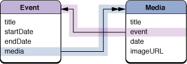

> 导航：[总目录](../../../README.md) · [documentation](../../../_indexes/documentation.md) · [Sync Services Programming Guide](Introduction%20to%20Sync%20Services%20Programming%20Guide.md)


[Next](Syncing%20with%20Other%20Clients.md)[Previous](Registering%20Clients.md)

# Syncing Relationships

To sync relationships, you need to describe the relationships in your schema and add code to your pushing and pulling methods to handle the relationships. Typically, you transform your representation of relationships (for example, a collection of objects) to Sync Services’ representation of relationships (an array of record identifiers) and back.

You add relationships to your object model by adding a `Relationships` key-value pair to your entity descriptions in your schema. See [Creating a Sync Schema](Creating%20a%20Sync%20Schema.md#apple-f4xwc4dqnrsv64tfmyxwi33df52wszbpkridimbqgaytcnjtfvbuuqsfjbaucry) for a complete list of entity and relationship properties. This article contains an example of a to-one and inverse to-many relationship as shown in [Figure 1](#apple-f4xwc4dqnrsv64tfmyxwi33df52wszbpkridimbqgaytcnjxfuytinrygiys2qsdjfduussdii).

__Figure 1__  Object model for MediaExample



For example, follow these steps to add a to-one relationship from Media to Event in the MediaExample schema.

1. Add a `Relationships` key and an array value to the `com.mycompany.syncexamples.Media` entity description.
2. Add a single dictionary to the array describing the to-one relationship.
3. Set the name of the relationship to `event`.
4. Optionally, set the display name to `Event`.
5. Set the ordinality to `one`.
6. Set the target to an array containing a single entity name: `com.mycompany.syncexamples.Event`.

The following property list fragment describes the to-one relationship, called `event`, from `com.mycompany.syncexamples.Media` to `com.mycompany.syncexamples.Event`:

```
        <dict>
            <key>Name</key>
            <string>com.mycompany.syncexamples.Media</string>
            ...
            <key>Relationships</key>
            <array>
                <dict>
                    <key>Name</key>
                    <string>event</string>
                    <key>Ordinality</key>
                    <string>one</string>
                    <key>Target</key>
                    <array>
                        <string>com.mycompany.syncexamples.Event</string>
                    </array>
                </dict>
            </array>
        </dict>
```


Similarly, you can define a to-many relationship from Media to Event by following the same steps in [Describing To-One Relationships](#apple-f4xwc4dqnrsv64tfmyxwi33df52wszbpkridimbqgaytcnjxfuytinbyg43a) except that you set the ordinality to `many`. The following property list fragment describes a to-many relationship, called `media`, from `com.mycompany.syncexamples.Event` to `com.mycompany.syncexamples.Media`.

```
        <dict>
            <key>Name</key>
            <string>com.mycompany.syncexamples.Event</string>
            ...
            <key>Relationships</key>
            <array>
                <dict>
                    <key>Name</key>
                    <string>media</string>
                    <key>Ordinality</key>
                    <string>many</string>
                    <key>Target</key>
                    <array>
                        <string>com.mycompany.syncexamples.Media</string>
                    </array>
                </dict>
            </array>
        </dict>
```


Sync Services supports inverse relationships and will maintain them in the sync engine even if you don’t maintain them in your local data source. You are not required to push both sides of an inverse relationship.

For example, the to-one and to-many relationships between the Media and Event entities are inverse relationships (see [Figure 1](#apple-f4xwc4dqnrsv64tfmyxwi33df52wszbpkridimbqgaytcnjxfuytinrygiys2qsdjfduussdii)). Every time you set the `event` property of a Media object, you would expect that Media object to be added to the Event’s collection of Media objects, called `media`. Similarly, if you add a Media object to an Event object’s `media` property, you would expect the Media object’s `event` property to be set to that Event object.

You specify an inverse relationship by adding an `InverseRelationship` property to the relationship description. For example, in the description of the `event` to-one relationship from Media to Event, you add the following `InverseRelationship` key-value pair. The `EntityName` property of an inverse relationship specifies the destination entity, and the `RelationshipName` property specifies the relationship in the destination entity that is inverse.

```
<key>InverseRelationships</key>
<array>
    <dict>
        <key>EntityName</key>
        <string>com.mycompany.syncexamples.Event</string>
        <key>RelationshipName</key>
        <string>media</string>
    </dict>
</array>
```

Similarly, in the description of the `media` to-many relationship from Media to Event, you add this `InverseRelationship` key-value pair:

```
<key>InverseRelationships</key>
<array>
    <dict>
        <key>EntityName</key>
        <string>com.mycompany.syncexamples.Media</string>
        <key>RelationshipName</key>
        <string>event</string>
    </dict>
</array>
```


Typically, you need to transform your objects to sync records before pushing them to the sync engine. If you want to sync relationships in your object model, you need to convert your representation to the sync engine’s representation.

The sync engine represents to-one and to-many relationships as arrays of record identifiers belonging to the destination objects. The value of a to-one relationship contains a single record identifier whereas the value of a to-many relationship may contain many record identifiers.

For example, the following output shows a Media record containing a to-one relationship called `event`:

```
MediaAssets[789] pushing sync record={
    "com.mycompany.syncservices.RecordEntityName" = "com.mycompany.syncexamples.Media";
    date = 2004-05-22 00:00:00 -0700;
    event = ("3571D5D0-C0A5-11D8-A57D-000A95BF2062");
    imageURL = "file://2004/05/22/IMG_1106.JPG";
    title = "IMG_1106.JPG";
}
```

Conversely, the following output shows an Event record containing a to-many relationship called `media`:

```
MediaAssets[789] pushing sync record={
    "com.mycompany.syncservices.RecordEntityName" = "com.mycompany.syncexamples.Event";
    media = (
        "3DD4A368-C0A5-11D8-B7DA-000A95BF2062",
        "3DD4EDAD-C0A5-11D8-B7DA-000A95BF2062",
        "3DD53833-C0A5-11D8-B7DA-000A95BF2062",
        "3DD5838E-C0A5-11D8-B7DA-000A95BF2062",
        "3DD5CDE3-C0A5-11D8-B7DA-000A95BF2062"
    );
    startDate = 2004-05-22 00:00:00 US/Pacific;
    title = "Burning Down the House";
}
```


Typically, when pulling records, you need to convert the sync representation of relationships to your representation. You can transform relationships when pulling records or later when you go to use them. Be aware that some destination objects may be new—not pulled from the sync engine yet—so if you are resolving relationships when pulling records, you should resolve them _after_ all records are pulled.

Be careful when pulling relationships and changing record identifiers at the same time. When you use the `changeEnumeratorForEntityNames:` method to pull changes, the targets for any pulled relationships use the old record identifiers, not new record identifiers that you can change using the `clientAcceptedChangesForRecordWithIdentifier:formattedRecord:newRecordIdentifier:` method. If you change record identifiers as you apply changes, then it is your responsibility to fix relationships pulled during the same sync session that may use the old identifier. For example, if you pull a new record that has an inverse to-one relationship to another record and change the record identifiers, then the targets of the relationships, stored in the `ISyncChange` object, still use the old identifiers. It’s your responsibility to keep track of the new and old identifiers to resolve these relationships at the end of the pulling phase. Alternatively, you can change record identifiers after applying all changes using the `clientChangedRecordIdentifiers:` method.

Similar to [Pushing Relationships](#apple-f4xwc4dqnrsv64tfmyxwi33df52wszbpkridimbqgaytcnjxfuytimzuha2a), pulled relationships are represented by arrays of record identifiers. It’s the application’s responsibility to implement the code that takes a record identifier and returns an instance of the corresponding entity. Remember that record identifiers are unique across all entities.

[Next](Syncing%20with%20Other%20Clients.md)[Previous](Registering%20Clients.md)

