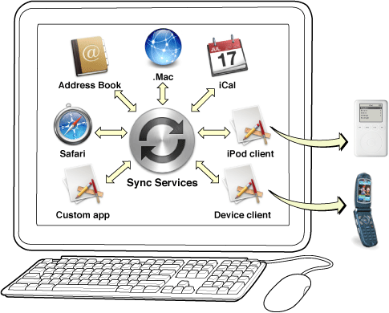

> 导航：[总目录](../../../README.md) · [documentation](../../../_indexes/documentation.md) · [Sync Services Programming Guide](Introduction%20to%20Sync%20Services%20Programming%20Guide.md)

[Next](Sync%20Services%20Overview.md)[Previous](Introduction%20to%20Sync%20Services%20Programming%20Guide.md)

# Why Use Sync Services?

Applications that sync allow users to access their data when and where they want it. Applications can sync with other applications and devices on the same computer, or other computers over the network via MobileMe. Ideally, user data is synced automatically without the user even thinking about it.

Users might have several computers, at home and at work, an iPhone, an iPod and other cell phones. Users will want to automatically sync data on all their computers and devices—especially, contacts and calendars which are supported on most devices.

For example, users may want to sync their phone and iPod devices with Address Book and iCal (see [Figure 1](#apple-f4xwc4dqnrsv64tfmyxwi33df52wszbpkridimbqgaytcnjqfuytkojsgizs2q2kijbucqsfie)). If they have a MobileMe account, they might want to sync their contacts, calendars, and bookmarks across multiple computers. But why stop there? They might want to sync their music, photos, some arbitrary folders, and Mail rules, too. Even large enterprises such as companies and universities might want to sync their custom objects across the network. Syncing is a service available to all applications, not just Apple applications.

The goal is for syncing to be ubiquitous, available to all as just another service on Mac OS X, so that users don’t have to think about syncing; all applications, devices, and computers should sync quickly and quietly in the background.

__Figure 1__  Syncing your data

Sync Services is a framework for Mac OS X developers who want to sync user data. Users can sync new devices using existing schemas, extend existing schemas, or sync custom objects. All user data can be synced via MobileMe, too—custom schemas automatically appear in the Sync pane of MobileMe preferences in System Preferences. Sync Services has the following features:

- It’s a system service that’s available everywhere.
- It’s under the control of the application to sync.
- It’s reliable—when used properly it doesn’t lose user data.
- It’s lightweight enough for an application to sync frequently.
- It allows multiple applications and devices to sync simultaneously.
- It can filter both entities and properties (records and fields) defined in a schema.
- It’s not limited to existing schemas. You may extend existing schemas or create your own.

Ideally all applications and devices sync small sets of changes frequently. This process is called _trickle syncing_. For example, Address Book and iCal might initiate a sync each time they save their records to disk in order to push recent changes. Applications such as the MobileMe client might sync every 5 minutes to pull local changes and push remote changes made by other MobileMe clients running on other computers. The order in which applications sync, and the frequency of that syncing, doesn’t matter as long as the syncs are fast and efficient.

When Sync Services is used by most Mac OS X applications, a user’s computer will behave something like this. Imagine that the user adds a new contact to her phone and independently adds a new event to iCal and a new contact to Address Book.

The user connects her iPod to her computer, which syncs. The new iCal event is added to the iPod. The user connects her phone and it syncs, too. The new iCal event and Address Book contact are added to the phone.

Syncing the phone may alert MobileMe and other applications that sync the same types of objects—for example, objects such as calendars and contacts. Address Book then syncs and adds the new phone contact. MobileMe is also alerted: It adds the new phone contact, Address Book contact, and iCal event.

Syncing MobileMe may apply changes to contacts and calendars made on other computers. Since Address Book, iCal, and the phone are all syncing together, they may apply these changes when MobileMe syncs. Sync Services merges all the changes and computes which changes need to be applied by which applications.

Joining a sync session is optional—for example, an application may decline an invitation if the user is busy making other changes. If so, it can just sync later.

If applications periodically sync and join related sync sessions, the user is unaware that their data is being synced—the data just appears in the right place when the user wants it. For example, the iPod was not actually part of the simultaneous sync session described above but will get the MobileMe changes if it periodically syncs.

[Next](Sync%20Services%20Overview.md)[Previous](Introduction%20to%20Sync%20Services%20Programming%20Guide.md)

