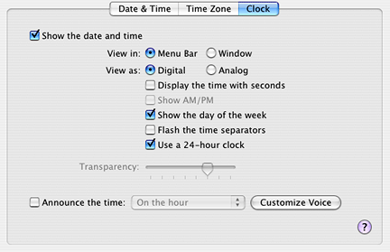

> 导航：[总目录](../../../README.md) · [documentation](../../../_indexes/documentation.md) · [Tab View Programming Topics](Introduction%20to%20Tab%20Views.md)

[Next](Managing%20Tab%20View%20Items.md)[Previous](Introduction%20to%20Tab%20Views.md)

# How Tab Views Work

An NSTabView provides a convenient mechanism for presenting information in a multi-page format. The view usually contains a row of tabs that give the visual appearance of folder tabs, as shown in the figure below. To select the desired page. the user clicks a tab or uses the arrow keys. Each page displays a view that your application provides.

An NSTabView also supports a multi-page format without visible tabs. For example, instead of tabs, you might use a pop-up menu or radio buttons, similar to those shown in the illustration, to let the user select from several view pages. When a tab view is drawn with tabs (the default), the border must be bezeled. When a tab view is drawn without tabs, the view can have a bezeled border, a lined border, or no border.

An NSTabView keeps a zero-based array of NSTabViewItems, one per tab in the view. A tab view item provides access to a tab’s color, state, label text, initial first responder, and associated view.Your application can supply each tab view item with an optional identifier object to customize tab handling.

Tab label text defaults to the default font and font size used for standard interface items, such as button labels and menu items. When you invoke `setFont:` to change the tab view’s font, tab height and width is adjusted automatically to accommodate a new font size. If the view allows truncating, tab labels are truncated as needed.

[Next](Managing%20Tab%20View%20Items.md)[Previous](Introduction%20to%20Tab%20Views.md)

