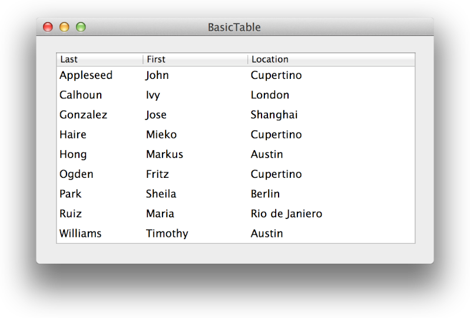

> 导航：[总目录](../../../README.md) · [documentation](../../../_indexes/documentation.md)

[Next](Understanding%20Table%20Views.md)

# About Table Views in OS X Applications

A table view displays data for a set of related records, with rows representing individual records and columns representing the attributes of those records. For example, in a table of employee records, each row represents one employee, and the columns might represent employee attributes such as the last name, first name, and office location.

A table view can have a single column or multiple columns, and it allows vertical and horizontal scrolling, content selection, and column dragging. Each row in a table view has at least one corresponding cell that represents a field in a data collection.

Understanding the structure of a table view, and knowing how to build one, lets you create Mac apps that present tabular data in an attractive, functional way.

### Tables Use a Collection of Classes to Manage Content

The various components of a table view—including column, row, header, and cell—are each supported by a distinct [NSView](https://developer.apple.com/documentation/appkit/nsview) subclass. These classes work together with the [NSTableView](https://developer.apple.com/documentation/appkit/nstableview) class itself to display content and to enable behaviors such as animation, column rearrangement, sorting, and selection. And, because most tables use `NSView` objects to represent individual cells, it’s easy to design custom cell views in Interface Builder and to support animation and column management.

### Interface Builder Makes It Easy to Create Tables

Using Interface Builder, you add a table view to a window or superview, add and arrange columns, and specify column headers. Then, you typically create cell view prototypes that your app uses to provide the content layout for each table cell. (If you’re working with an `NSCell`-based table, you create subclasses of `NSCell` for each table cell.) Many aspects of tables can be set directly in Interface Builder, which means that you can avoid writing additional code.

### Tables Can Get Data in Two Ways

You must provide data to the table view. You can do this in one of two ways:

- Programmatically, by implementing a data source class
- Using Cocoa bindings

To provide data programmatically, you create a class that conforms to the [NSTableViewDataSource](https://developer.apple.com/documentation/appkit/nstableviewdatasource) protocol and implement the method that provides the row and column data as requested.

Use Cocoa bindings to create a relationship between a controller class instance, which manages the interaction between data objects, and the table view. When you use the bindings approach, you don’t create a data source class for providing the data or supporting editing.

The techniques you use to create and populate a table differ depending on whether the table is `NSView` based or `NSCell` based.

### A Table’s Appearance and Behaviors Are Customizable

You can customize various aspects of a table’s appearance, including background color, row color, and grid line color. You can also specify how a table should behave when users make selections or sort table data. (The techniques you use to modify a table’s appearance and behavior are the same for both `NSView`-based and `NSCell`-based tables.)

### NSCell-Based Tables Are Still Supported

In OS X v10.6 and earlier, each table view cell was required to be a subclass of [NSCell](https://developer.apple.com/documentation/appkit/nscell). This approach caused limitations when designing complex custom cells, often requiring you to write your own `NSCell` subclasses. Providing animation, such as progress views, was also extremely difficult. In this document these types of table views are referred to as `NSCell`-based table views. `NSCell`-based tables continue to be supported in OS X v10.7 and later, but they’re typically used only to support legacy code. In general, you should use `NSView`-based tables.

Although you use the same Interface Builder techniques to create both `NSView`-based and `NSCell`-based table views (and to add columns to a table), the code required to provide individual cells, populate the table view, and support programmatic editing differs depending on the table type. In addition, you use different Cocoa bindings techniques depending on whether you’re working with an `NSView`-based or `NSCell`-based table.

To develop successfully with the [NSTableView](https://developer.apple.com/documentation/appkit/nstableview) class, you need a strong grasp of the [Model-View-Controller](https://developer.apple.com/library/archive/documentation/General/Conceptual/DevPedia-CocoaCore/MVC.html#//apple_ref/doc/uid/TP40008195-CH32) design pattern. To learn more about this fundamental pattern, see [Model-View-Controller in Cocoa (OS X)](../../General/Concepts%20in%20Objective-C%20Programming/Model-View-Controller.md#apple-f4xwc4dqnrsv64tfmyxwi33df52wszbpkridimbqgeydqmjqfvbuqmjufvjvomjv).

`NSTableView` instances can be used with Cocoa bindings, both in `NSView`-based and `NSCell`-based tables. However, it’s strongly suggested that you thoroughly understand the programmatic interface of the table view before beginning to use the more advanced Cocoa bindings. For a brief overview of bindings, see [Cocoa bindings](https://developer.apple.com/library/archive/documentation/General/Devpedia-CocoaApp-MOSX/Bindings.html#//apple_ref/doc/uid/TP40009448-CH15); to learn more, read _[Cocoa Bindings Programming Topics](../Cocoa%20Bindings%20Programming%20Topics/Introduction%20to%20Cocoa%20Bindings%20Programming%20Topics.md#apple-f4xwc4dqnrsv64tfmyxwi33df52wszbpgeydambqge3do2i)_.

To learn about the recommended appearance and behavior of table views in the user interface, see _OS X Human Interface Guidelines_.

The following sample code projects are instructive when designing your own table view implementations:

- _[TableViewPlayground: Using View-Based NSTableView and NSOutlineView](../../../samplecode/TableViewPlayground-%20Using%20View-Based%20NSTableView%20and%20NSOutlineView/TableViewPlayground-%20Using%20View-Based%20NSTableView%20and%20NSOutlineView.md#apple-f4xwc4dqnrsv64tfmyxwi33df52wszbpirkfgnbqgaytanzsg4)_
- _[AnimatedTableView](../../../samplecode/AnimatedTableView/AnimatedTableView.md#apple-f4xwc4dqnrsv64tfmyxwi33df52wszbpirkfgnbqgaydqobwgm)_
- _[iSpend](../../../samplecode/iSpend/iSpend.md#apple-f4xwc4dqnrsv64tfmyxwi33df52wszbpirkfgmjqgaydgnrsgu)_
- _With and Without Bindings_
- _[Cocoa Tips and Tricks](../../../samplecode/Cocoa%20Tips%20and%20Tricks/Cocoa%20Tips%20and%20Tricks.md#apple-f4xwc4dqnrsv64tfmyxwi33df52wszbpirkfgnbqgaytambthe)_
[Next](Understanding%20Table%20Views.md)

