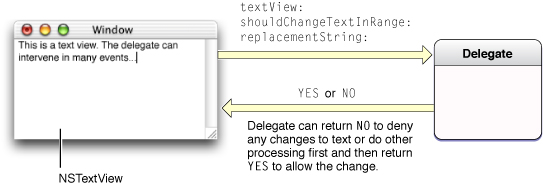

> 导航：[总目录](../../../README.md) · [documentation](../../../_indexes/documentation.md) · [Text Editing Programming Guide](Introduction%20to%20Text%20Editing%20Programming%20Guide%20for%20Cocoa.md)

[Next](Subclassing%20NSTextView.md)[Previous](Intercepting%20Key%20Events.md)

# Delegate Messages and Notifications

An `NSTextView` object can have a delegate that it informs of certain actions or pending changes to the state of the text. The delegate can be any object you choose, and one delegate can control multiple `NSTextView` objects (or multiple series of connected `NSTextView` objects). Figure 1 illustrates the activity of the delegate of an `NSTextView` object receiving the delegate message `textView:shouldChangeTextInRange:replacementString:`.

__Figure 1__  Delegate of an NSTextView object

The `NSText` and `NSTextView` class reference documentation describes the delegate messages the delegate can receive. The delegating object sends a message only if the delegate implements the method.

All `NSTextView` objects attached to the same `NSLayoutManager` share the same delegate. Setting the delegate of one such text view sets the delegate for all the others. Delegate messages pass the `id` of the sender as an argument.

The notifications posted by `NSTextView` are:

- `NSTextDidBeginEditingNotification`
- `NSTextDidEndEditingNotification`
- `NSTextDidChangeNotification`
- `NSTextViewDidChangeSelectionNotification`
- `NSTextViewWillChangeNotifyingTextViewNotification`

It is particularly important for observers to register for the last of these notifications. If a new `NSTextView` object is added at the beginning of a series of connected `NSTextView` objects, it becomes the new notifying text view. It doesn’t have access to which objects are observing its group of text objects, so it posts an `NSTextViewWillChangeNotifyingTextViewNotification`, which allows all those observers to unregister themselves from the old notifying text view and reregister themselves with the new one. For more information, see the description for this notification in _[NSTextView Class Reference](https://developer.apple.com/documentation/appkit/nstextview)_.

For information about controlling the editing behavior of text fields through delegation and notification, see [Using Delegation and Notification With the Field Editor](Working%20With%20the%20Field%20Editor.md#apple-f4xwc4dqnrsv64tfmyxwi33df52wszbpgiydambrhaytkljrgmytcnrv).

[Next](Subclassing%20NSTextView.md)[Previous](Intercepting%20Key%20Events.md)

