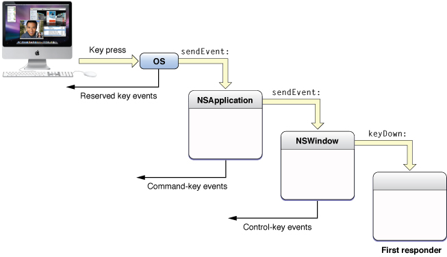
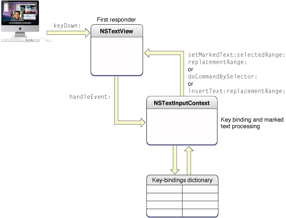

> 导航：[总目录](../../../README.md) · [documentation](../../../_indexes/documentation.md) · [Text Editing Programming Guide](Introduction%20to%20Text%20Editing%20Programming%20Guide%20for%20Cocoa.md)

[Next](About%20Key%20Bindings.md)[Previous](Introduction%20to%20Text%20Editing%20Programming%20Guide%20for%20Cocoa.md)

# Overview of Text Editing

The Cocoa text system implements a sophisticated editing mechanism that enables input and modification of complex text character and style information. It is important to understand this mechanism if your code needs to hook into it to modify that behavior.

The text system provides a number of control points where you can customize the editing behavior:

- Text system classes provide methods to control many of the ways in which they perform editing.
- You can implement more control through the Cocoa mechanisms of notification and delegation.
- In extreme cases where the capabilities of the text system are not suitable, you can replace the text view with a custom subclass.

Text editing is performed by a text view object. Typically, a text view is an instance of `NSTextView` or a subclass. A text view provides the front end to the text system. It displays the text, handles the user events that edit the text, and coordinates changes to the stored text required by the editing process. `NSTextView` implements methods that perform editing, manage the selection, and handle formatting attributes affecting the layout and display of the text.

`NSTextView` has a number of methods that control the editing behavior available to the user. For example, `NSTextView` allows you to grant or deny the user the ability to select or edit its text, using the `setSelectable:` and `setEditable:` methods. `NSTextView` also implements the distinction between plain and rich text defined by `NSText` with its `setRichText:` and `setImportsGraphics:` methods. See _[Text System User Interface Layer Programming Guide](../Text%20System%20User%20Interface%20Layer%20Programming%20Guide/Introduction%20to%20Text%20System%20User%20Interface%20Layer.md#apple-f4xwc4dqnrsv64tfmyxwi33df52wszbpgeydambqga4ta2i)_ programming topic and the `NSTextView` and `NSText` class specifications for more information.

An editable text view can operate in either of two distinct editing modes: as a normal text editor or as a field editor. A field editor is a single text view instance shared by many text fields belonging to a window in an application. This sharing results in a performance gain. When a text field becomes the first responder, the window inserts the field editor in its place in the responder chain. A normal text editor accepts Tab and Return characters as input, whereas a field editor interprets Tab and Return as cues to end editing. The `NSTextView` method `setFieldEditor:` controls this behavior.

When you want to modify the way in which Cocoa edits text, it’s helpful to understand the message sequence that defines the editing mechanism, so you can select the most appropriate point at which to add your custom behavior.

The message sequence invoked when a text view receives key events involves four methods declared by `NSResponder`. When the user presses a key, the operating system handles certain reserved key events and sends others to the `NSApplication` object, which handles Command-key events as key equivalents. The key events not handled are sent by the application object to the key window, which processes key events mapped to keyboard navigation actions (such as Tab moving focus on the next view) and sends other key events to the first responder. Figure 1 illustrates this sequence.

__Figure 1__  Key-event processing

If the first responder is a text view, the key event enters the text system. The key window sends the text view a `keyDown:` message with the event as its argument. The `keyDown:` method passes the event to `handleEvent:`, which sends the character input to the input context for key binding and interpretation. In response, the input context sends either `insertText:replacementRange:`, `setMarkedText:selectedRange:replacementRange:`, or `doCommandBySelector:` to the text view. Figure 2 illustrates the sequence of text-input event processing.

__Figure 2__  Text-input key event processing

For more information about text-input key event processing, see “[Text System Defaults and Key Bindings](https://developer.apple.com/library/archive/documentation/Cocoa/Conceptual/EventOverview/TextDefaultsBindings/TextDefaultsBindings.html#//apple_ref/doc/uid/20000468)” in _[Cocoa Event Handling Guide](../Cocoa%20Event%20Handling%20Guide/Introduction.md#apple-f4xwc4dqnrsv64tfmyxwi33df52wszbpgeydambqga3da2i)_.

When the text view has enough information to specify an actual change to its text, it sends an editing message to its `NSTextStorage` object to effect the change. The methods that change character and attribute information in the text storage object are declared in the `NSTextStorage` superclass `NSMutableAttributedString`, and they depend on the two primitive methods `replaceCharactersInRange:withString:` and `setAttributes:range:`. The text storage object then informs its layout managers of the change to initiate glyph generation and layout when necessary, and it posts notifications and sends delegate messages before and after processing the edits. For more information about the interaction of text view, text storage, and layout manager objects, see _[Text Layout Programming Guide](../Text%20Layout%20Programming%20Guide/Introduction%20to%20Text%20Layout%20Programming%20Guide.md#apple-f4xwc4dqnrsv64tfmyxwi33df52wszbpgeydambqge2tq2i)_.

Delegation provides a powerful mechanism for modifying editing behavior because you can implement methods in the delegate that can then perform editing commands in place of the text view, a technique called delegation of implementation. `NSTextView` gives its delegate this opportunity to handle a command by sending it a `textView:doCommandBySelector:` message whenever it receives a `doCommandBySelector:` message from the input context. If the delegate implements this method and returns `YES`, the text view does nothing further; if the delegate returns `NO`, the text view must try to perform the command itself.

Before a text view makes any change to its text, it sends its delegate a `textView:shouldChangeTextInRange:replacementString:` message, which returns a Boolean value. (As with all delegate messages, it sends the message only if the delegate implements the method.) This mechanism provides the delegate with an opportunity to control all editing of the character and attribute data in the text storage object associated with the text view.

For more information about text view delegation, see [Delegate Messages and Notifications](Delegate%20Messages%20and%20Notifications.md#apple-f4xwc4dqnrsv64tfmyxwi33df52wszbpgiydambqheztelkdjjbeuschifdq).

Using `NSTextView` directly is the easiest way to interact with the text system, and its delegate mechanism provides an extremely flexible way to modify its behavior. In cases where delegation does not provide required behavior, you can subclass `NSTextView`. See [Subclassing NSTextView](Subclassing%20NSTextView.md#apple-f4xwc4dqnrsv64tfmyxwi33df52wszbpgiydambqheztolkdjjbeuschifdq) for more information on how to implement a subclass of `NSTextView`.

A strategy even more complicated than subclassing `NSTextView` is to create your own custom text view object. If you need more sophisticated text handling than `NSTextView` provides, for example in a word processing application, it is possible to create a text view by subclassing `NSView`, implementing the `NSTextInputClient` protocol, and interacting directly with the input management system. For information on creating custom text views, see Creating Custom Views. Also refer to the reference documentation for `NSText`, `NSTextView`, `NSView`, `NSTextInputContext`, and the `NSTextInputClient` protocol.

[Next](About%20Key%20Bindings.md)[Previous](Introduction%20to%20Text%20Editing%20Programming%20Guide%20for%20Cocoa.md)

