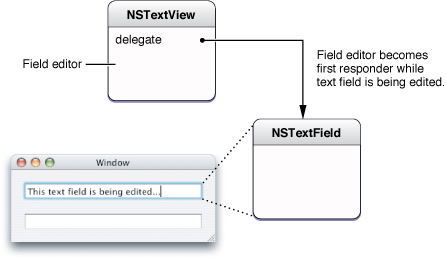

> 导航：[总目录](../../../README.md) · [documentation](../../../_indexes/documentation.md) · [Text Editing Programming Guide](Introduction%20to%20Text%20Editing%20Programming%20Guide%20for%20Cocoa.md)


[Next](Handling%20Drops%20in%20a%20Text%20Field.md)[Previous](Setting%20Focus%20and%20Selection%20Programmatically.md)

# Working With the Field Editor

This article explains how the Cocoa text system uses the field editor and how you can modify that behavior. In most cases, you don’t need to be concerned about the field editor because Cocoa handles its operation automatically, behind the scenes. However, it’s good to know of its existence, and it’s possible that in some circumstances you could want to change its behavior.

The field editor is a single `NSTextView` object that is shared among all the controls in a single window, including buttons, table views, and text fields. This text view object provides text entry and editing services for the currently active control. When the user clicks in a text field, for example, the field editor begins handling keystroke events and text display for that field.

The field editor provides significant optimization. Because only one control can be active at a time, the system needs only one `NSTextView` instance per window to be the field editor. This results in a performance gain because `NSTextView` is a relatively heavyweight object. Note, however, that you can substitute custom field editors, as described in [Using a Custom Field Editor](#apple-f4xwc4dqnrsv64tfmyxwi33df52wszbpgiydambrhaytkljrgmytgmjq), in which case a window could have more than one field editor.

The text system automatically instantiates the field editor from the `NSTextView` class when the user begins editing text of an `NSControl` object such as a text field. While it is editing, the system inserts the field editor into the responder chain as first responder, so it receives keystroke events in place of the text field. This mechanism can be confusing if you’re not familiar with the workings of the field editor, because the `NSWindow` method `firstResponder` returns the field editor, which is not visible, rather than the on-screen object that currently has keyboard focus.

The field editor designates the current text field as its delegate, which enables the text field to control changes to its contents. When the focus shifts to another text field, the field editor attaches itself to that field instead. Figure 1 illustrates the field editor in relation to the text field it is editing.

__Figure 1__  The field editor



Among its other duties, the field editor maintains the selection for the text fields it edits. Therefore, a text field that's not being edited does not have a selection (unless you cache it).

A field editor is defined by its treatment of certain characters during text input, which is different from an ordinary text view. An ordinary text view inserts a newline when the user types Return or Enter, it inserts a tab character when the user types Tab, and it ignores a Shift-Tab. In contrast, a field editor interprets these characters as cues to end editing and resign first responder status, shifting focus to the next object in the key-view loop (or in the case of a Shift-Tab, the previous key view).

The end of editing triggers synchronization of the contents of the field editor and the `NSTextFieldCell` object that controls editing in the text field. At that point Cocoa detaches the field editor from the text field and restores the text field to its original place in the view hierarchy.

You can control the editing behavior of text fields by interacting with the field editor through delegation and notification. Because the field editor automatically designates any text field it is editing as its delegate, you can often encapsulate special editing behavior for a text field with the text field itself.

It’s straightforward to change the default behavior of the field editor by implementing delegate methods. For example, the delegate can change the behavior that occurs when the user presses Return while editing a text view. By default, that action ends editing and selects the next control in the key view loop. If, for example, you want pressing Return to end editing but not select the next control, you can implement the `textDidEndEditing:` delegate method in the text field. The field editor automatically calls this method, if the delegate implements it, and passes `NSTextDidEndEditingNotification`. The implementation can examine this notification to discover the event that ended editing and respond appropriately.

Users can easily put newline characters into a text field by pressing Option-Return or Option-Enter. However, there may be situations in which you want to allow users to enter newlines without taking any special action, and you can do so by implementing a delegate method.

The easiest approach is to call `setFieldEditor:NO` on the window's field editor. But, of course, this approach changes the behavior of the field editor for all controls. It looks promising to use the `NSControl` delegate message `control:textShouldBeginEditing:`, which is sent to a text view’s delegate when the user enters a character into the text field. Because it passes references to both the text view and the field editor, you could test to see if the text view is one into which you want to enter newlines, then simply send `setFieldEditor:NO` to the field editor. However, this method is not called until after the user has entered one character into the text field, and if that character is a newline, it is rejected.

A better method is to implement another `NSControl` delegate method, `control:textView:doCommandBySelector:`, that enables the text field’s delegate to check whether the user is attempting to insert a newline character and, if so, force to field editor to insert it. The implementation could appear as shown in Listing 1.

__Listing 1__  Forcing the field editor to enter a newline character

```objc
- (BOOL)control:(NSControl *)control textView:(NSTextView *)fieldEditor
                                    doCommandBySelector:(SEL)commandSelector {
     BOOL retval = NO;
     if (commandSelector == @selector(insertNewline:)) {
         retval = YES;
         [fieldEditor insertNewlineIgnoringFieldEditor:nil];
     }
     return retval;
}
```

This method returns `YES` to indicate that it handles this particular command and `NO` for other commands that it doesn’t handle. This approach has the advantage that it doesn’t change the setup of the field editor but handles just the special case of interest. Because the delegate message includes a reference to the control being edited, you could add a check to restrict the behavior to a particular class, such as `NSTextField`, or an individual subclass.

To customize behavior in ways that go beyond what the delegate can do, you need to define a subclass of `NSTextView` that incorporates your specialized behavior and substitute it for the window’s default field editor.

It’s not necessary to use a custom field editor if you simply need to validate, interpret, format, or even edit the contents of text fields as the user types. You can attach an `NSFormatter`, such as `NSNumberFormatter`, `NSDateFormatter`, or a custom formatter, for that purpose. See _[Data Formatting Guide](../Data%20Formatting%20Guide/Introduction%20to%20Data%20Formatting%20Programming%20Guide%20For%20Cocoa.md#apple-f4xwc4dqnrsv64tfmyxwi33df52wszbpgeydambqgazds2i)_ for more information about using formatters. Delegation and notification also provide many opportunities for you to intervene, as described previously in [Using Delegation and Notification With the Field Editor](#apple-f4xwc4dqnrsv64tfmyxwi33df52wszbpgiydambrhaytkljrgmytcnrv).

A secure text field is an example of truly specialized handling of data that goes beyond what can be reasonably handled by formatters or delegates. A secure text field must accept text data entered by the user and validate the entries, which are easily done with a regular text field and a formatter. But it must display some bogus characters to keep the real data secret while it preserves the real data for an authentication process or other purpose. Moreover, a secure text field must keep its data safe from unauthorized access by disabling features, such as copy and cut, and possibly encrypting the data. To implement these specialized requirements, it is easiest to deploy a custom field editor. In fact, Cocoa implements a custom field editor in the `NSSecureTextField` class.

As another example, you must use a custom field editor to support drag and drop in a text field that has keyboard focus. You can add support for drag and drop in a subclass of `NSTextField` itself, and it works fine as long as the text field is not currently being edited. During editing, however, the field editor becomes the first responder, so it is the target of a drop in the text field. Therefore, to handle drag and drop while the text field is being edited, you must implement support in a subclass of the field editor. This procedure is described in [Handling Drops in a Text Field](Handling%20Drops%20in%20a%20Text%20Field.md#apple-f4xwc4dqnrsv64tfmyxwi33df52wszbpgiydambrhaytilkdjjbeoqsjijba).

Any situation requiring unusual processing of data entered into a text field, or other individualized behavior not available through the standard Cocoa mechanisms, is a good candidate for a custom field editor.

You can substitute your custom field editor in place of the window’s default version by implementing the `NSWindow` delegate method `windowWillReturnFieldEditor:toObject:`. You implement this method in the window’s delegate, which could be, for example, the window controller object. The window sends this message to its delegate with itself and the object requesting the field editor as arguments. So, you can test the object and make substitution of your custom field editor dependent on the result. The window continues to use its default field editor for other controls.

For example, the implementation shown in Listing 2 tests whether or not the requesting object is an `NSTextField`, and, if it is, returns a custom field editor.

__Listing 2__  Substituting a custom field editor

```objc
- (id)windowWillReturnFieldEditor:(NSWindow *)sender toObject:(id)anObject
{
    if ([anObject isKindOfClass:[NSTextField class]])
    {
        if (!myCustomFieldEditor) {
        myCustomFieldEditor = [[CustomFieldEditor alloc] init];
        [myCustomFieldEditor setFieldEditor:YES];
        }
        return myCustomFieldEditor;
    }
    return nil;
}
```

If the requesting object is not a text field or subclass, the delegate method returns `nil` and the window uses its default field editor. This arrangement has the advantage that it does not instantiate the custom field editor unless it is needed. The custom field editor should be released in an appropriate place, such as the `dealloc` method of the window delegate object (if the field editor was never instantiated, the `release` message has no effect and is harmless).

In OS X v10.6 and later, another way of providing a custom field editor is to override the `NSCell` method `fieldEditorForView:`. This method, rather than the window delegate method, is more suitable for custom cell subclasses.

You can find more information about subclassing `NSTextView` in [Subclassing NSTextView](Subclassing%20NSTextView.md#apple-f4xwc4dqnrsv64tfmyxwi33df52wszbpgiydambqheztolkdjjbeuschifdq).

This section lists the Application Kit methods most directly related to the field editor. You can peruse these tables to understand where Cocoa provides opportunities for you to interact with the field editor. Refer to the Application Kit reference documentation for details. The `NSWindow` methods related to the field editor are listed in Table 1.

__Table 1__  `NSWindow` field editor–related methods

| Method | Description |
| `fieldEditor:forObject:` | Returns the receiver’s field editor, creating it if needed. |
| `endEditingFor:` | Forces the field editor to give up its first responder status and prepares it for its next assignment. |
| `windowWillReturnFieldEditor: toObject:` | Delegate method invoked when the field editor of sender is requested by an object. If the delegate’s implementation of this method returns an object other than `nil`, `NSWindow` substitutes it for the field editor. |

The `NSTextFieldCell` method related to the field editor is listed in Table 2.

__Table 2__  `NSTextFieldCell` field editor–related method

| Method | Description |
| `setUpFieldEditorAttributes:` | You never invoke this method directly; by overriding it, however, you can customize the field editor. |

The `NSCell` methods related to the field editor are listed in Table 3.

__Table 3__  `NSCell` field editor–related methods

| Method | Description |
| `fieldEditorForView:` | The primary way to substitute a custom field editor in OS X v10.6 and later. |
| `selectWithFrame:inView: editor:delegate:start:length:` | Uses the field editor passed with the message to select text in a range. |
| `editWithFrame:inView:editor:delegate:event:` | Begins editing of the receiver’s text using the field editor passed with the message. |
| `endEditing:` | Ends any editing of text, using the field editor passed with the message, begun with either of the other two `NSCell` field editor–related methods. |

The `NSControl` methods related to the field editor are listed in Table 4. The `NSControl` delegate methods listed in Table 4 are control-specific versions of the delegate methods and notifications defined by `NSText`. The field editor, derived from `NSText`, initiates sending the delegate messages and notifications through its editing actions.

__Table 4__  `NSControl` field editor–related methods

| Method | Description |
| `abortEditing` | Terminates and discards any editing of text displayed by the receiver and removes the field editor’s delegate. |
| `currentEditor` | If the receiver is being edited, this method returns the field editor; otherwise, it returns `nil`. |
| `validateEditing` | Sets the object value of the text in a cell of the receiving control to the current contents of the cell’s field editor. |
| `control:textShouldBeginEditing:` | Sent directly to the delegate when the user tries to enter a character in a cell of the control passed with the message. |
| `control:textShouldEndEditing:` | Sent directly to the delegate when the insertion point tries to leave a cell of the control that has been edited. |
| `controlTextDidBeginEditing:` | Sent by the default notification center to the delegate (and all observers of the notification) when a control begins editing text, passing `NSControlTextDidBeginEditingNotification`. |
| `controlTextDidChange:` | Sent by the default notification center to the delegate and observers when the text in the receiving control changes, passing `NSControlTextDidChangeNotification`. |
| `controlTextDidEndEditing:` | Sent by the default notification center to the delegate and observers when a control ends editing text, passing `NSControlTextDidEndEditingNotification`. |

The `NSResponder` methods related to the field editor are listed in Table 5.

__Table 5__  `NSResponder` field editor–related methods

| Method | Description |
| `insertBacktab:` | Implemented by subclasses to handle a “backward tab.” |
| `insertNewlineIgnoringFieldEditor:` | Implemented by subclasses to insert a line-break character at the insertion point or selection. |
| `insertTabIgnoringFieldEditor:` | Implemented by subclasses to insert a tab character at the insertion point or selection. |

The `NSText` methods related to the field editor are listed in Table 6.

__Table 6__  `NSText` field editor–related methods

| Method | Description |
| `isFieldEditor` | Returns YES if the receiver interprets Tab, Shift-Tab, and Return (Enter) as cues to end editing and possibly to change the first responder; NO if it accepts them as text input. |
| `setFieldEditor:` | Controls whether the receiver interprets Tab, Shift-Tab, and Return (Enter) as cues to end editing and possibly to change the first responder. |
| `textDidBeginEditing:` | Informs the delegate that the user has begun changing text, passing `NSTextDidBeginEditingNotification`. |
| `textDidChange:` | Informs the delegate that the text object has changed its characters or formatting attributes, passing `NSTextDidChangeNotification`. |
| `textDidEndEditing:` | Informs the delegate that the text object has finished editing (that it has resigned first responder status), passing `NSTextDidEndEditingNotification`. |
| `textShouldBeginEditing:` | Invoked from a text object’s implementation of `becomeFirstResponder`, this method requests permission to begin editing. |
| `textShouldEndEditing:` | Invoked from a text object’s implementation of `resignFirstResponder`, this method requests permission to end editing. |

[Next](Handling%20Drops%20in%20a%20Text%20Field.md)[Previous](Setting%20Focus%20and%20Selection%20Programmatically.md)

