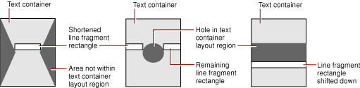

> 导航：[总目录](../../../README.md) · [documentation](../../../_indexes/documentation.md) · [Text Layout Programming Guide](Introduction%20to%20Text%20Layout%20Programming%20Guide.md)

[Next](Laying%20Out%20Text%20Along%20an%20Arbitrary%20Path.md)[Previous](Typesetters.md)

# Line Fragment Generation

An `NSTypesetter` object lays text within an `NSTextContainer` object in lines of glyphs. The layout of these lines within an `NSTextContainer` object is determined by its shape. For example, if the text container is narrower in some parts than in others, the lines in those parts must be shortened; if there are holes in the region, some lines must be fragmented; if there’s a gap across the entire region, the lines that would overlap it have to be shifted to compensate.

The built-in typesetters currently provided with text system support only horizontal text layout. However, the text system can support typesetters that lay out text along lines that run either horizontally or vertically, and in either direction. This type of movement is called the _sweep direction_ and is expressed by the `NSLineSweepDirection` type in Objective-C and the sweep direction constants in Java. The direction in which the lines then progress is called the _line movement direction_ and is expressed by the `NSLineMovementDirection` type in Objective-C and the line movement constants in Java. Each affects the adjustment of a line fragment rectangle in a different way: The rectangle can be moved or shortened along the sweep direction and shifted (but not resized) in the line movement direction.

The typesetter object proposes a rectangle for a given line, and then asks the `NSTextContainer` object to adjust the rectangle to fit. The proposed rectangle usually spans the text container’s bounding rectangle, but it can be narrower or wider, and it can also lie partially or completely outside the bounding rectangle. The message that the typesetter sends the text container to adjust the proposed rectangle is `lineFragmentRectForProposedRect:sweepDirection:movementDirection:remainingRect:`, which returns the largest rectangle available for the proposed rectangle, based on the direction in which text is laid out. It also returns a rectangle containing any remaining space, such as that left on the other side of a hole or gap in the text container. This process is illustrated in the Figure 1.

__Figure 1__  Line fragment fitting in irregular text containers

For the three examples in Figure 1, the sweep direction is `NSLineSweepRight` and the line movement direction is `NSLineMovesDown`. In the first example, the proposed rectangle spans the region’s bounding rectangle and is shortened by the text container to fit inside the hourglass shape with no remainder.

In the second example, the proposed rectangle crosses a hole, so the text container must return a shorter rectangle (the white rectangle on the left) along with a remainder (the white rectangle on the right). The next rectangle proposed by the typesetter will then be this remainder rectangle which will be returned unchanged by the text container.

In the third example, a gap crosses the entire text container. Here the text container shifts the proposed rectangle down until it lies completely within the container’s region. If the line movement direction here were `NSLineDoesntMove`, the text container would have to return `NSRect.ZeroRect` indicating that the line simply doesn’t fit. In such a case it’s up to the typesetter to propose a different rectangle or to move on to a different container. When a text container shifts a line fragment rectangle, the layout manager takes this into account for subsequent lines.

The typesetter makes one final adjustment when it actually fits text into the rectangle. This adjustment is a small amount fixed by the `NSTextContainer` object, called the line fragment padding, which defines the portion on each end of the line fragment rectangle left blank. Text is inset within the line fragment rectangle by this amount (the rectangle itself is unaffected). Padding allows for small-scale adjustment of the text container’s region at the edges and around any holes and keeps text from directly abutting any other graphics displayed near the region. You can change the padding from its default value with the `setLineFragmentPadding:` method. Note that line fragment padding isn’t a suitable means for expressing margins; you should set the `NSTextView` object’s position and size for document margins or the paragraph margin attributes for text margins.

In addition to the line fragment rectangle itself, the typesetter returns a rectangle called the used rectangle. This is the portion of the line fragment rectangle that actually contains glyphs or other marks to be drawn. By convention, both rectangles include the line fragment padding and the interline space calculated from the font’s line height metrics and the paragraph’s line spacing parameters. However, the paragraph spacing (before and after) and any space added around the text, such as that caused by center-spaced text, are included only in the line fragment rectangle and not in the used rectangle.

See [Layout Geometry: The NSTextContainer Class](https://developer.apple.com/library/archive/documentation/Cocoa/Conceptual/TextStorageLayer/Concepts/LayoutGeometry.html#//apple_ref/doc/uid/20001803) for more information about text containers. See [The Layout Manager](The%20Layout%20Manager.md#apple-f4xwc4dqnrsv64tfmyxwi33df52wszbpgiydambrhaydklkcijbumrkcjbaq) for more information about the layout process.

[Next](Laying%20Out%20Text%20Along%20an%20Arbitrary%20Path.md)[Previous](Typesetters.md)

