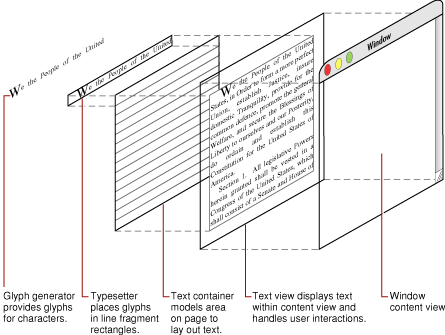
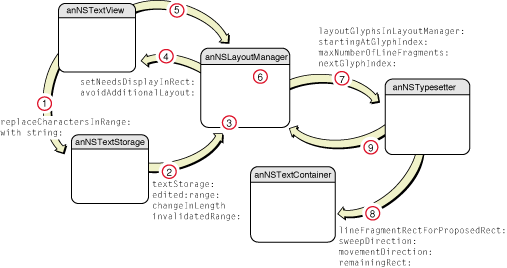
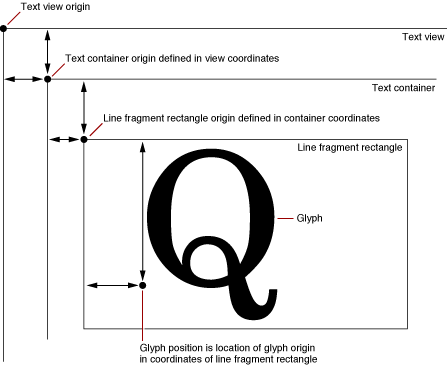

> 导航：[总目录](../../../README.md) · [documentation](../../../_indexes/documentation.md) · [Text Layout Programming Guide](Introduction%20to%20Text%20Layout%20Programming%20Guide.md)

[Next](Typesetters.md)[Previous](Introduction%20to%20Text%20Layout%20Programming%20Guide.md)

# The Layout Manager

The layout manager class, `NSLayoutManager`, provides the central controlling object for text display in the Cocoa text system.

An `NSLayoutManager` object performs the following actions:

- Controls text storage and text container objects
- Generates glyphs from characters
- Computes glyph locations and stores the information
- Manages ranges of glyphs and characters
- Draws glyphs in text views when requested by the view
- Manages rulers for paragraph style control
- Computes bounding box rectangles for lines of text
- Controls hyphenation
- Manipulates character and glyph attributes

In the model-view-controller paradigm, `NSLayoutManager` is the controller. `NSTextStorage`, a subclass of `NSMutableAttributedString`, provides part of the model, holding a string of text characters with attributes such as typeface, style, color, and size. `NSTextContainer` can also be considered part of the model because it models the geometric layout of the page on which the text is laid out. `NSTextView` (or another `NSView` object) provides the view in which the text is displayed. `NSLayoutManager` serves as the controller for the text system because it directs the glyph generator to translate characters in the text storage object into glyphs, directs the typesetter to lay them out in lines according to the dimensions of one or more text container objects, and coordinates the text display in one or more text view objects. Figure 1 illustrates the composition of the text display, which is coordinated by the layout manager.

__Figure 1__  Composition of text display

You can configure the text system to have more than one layout manager if you need the text in the same `NSTextStorage` object to be laid out in more than one way. For example, you might want the text to appear as a continuous galley in one view and to be segmented into pages in another view. For more information about different arrangements of text objects, refer to [Common Configurations](../../Cocoa%20Text%20Architecture%20Guide/Text%20System%20Organization.md#apple-f4xwc4dqnrsv64tfmyxwi33df52wszbpkridimbqga4tinjzfvbuqnznknlti).

Generally speaking, a given layout manager (and associated objects) should not be used on more than one thread at a time. Most layout managers are used on the main thread, since it is the main thread on which their text views are displayed, and since background layout occurs on the main thread. However, you can lay out and render text on secondary threads using [NSLayoutManager](https://developer.apple.com/documentation/appkit/nslayoutmanager) as long as the object graph is contained in a single thread.

If you must use a layout manager on a secondary thread, it's the application's responsibility to ensure that the objects are not accessed simultaneously from other threads. First, make sure that [NSTextView](https://developer.apple.com/documentation/appkit/nstextview) objects associated with that layout manager (if any) are not displayed while the layout manager is being used on the secondary thread by disabling background layout and auto-display. For example, you could send the text view [lockFocusIfCanDraw](https://developer.apple.com/documentation/appkit/nsview/1483285-lockfocusifcandraw) to block the main thread display (and send [unlockFocus](https://developer.apple.com/documentation/appkit/nsview/1483711-unlockfocus) when finished). Second, turn off background layout for that layout manager while it is being used on the secondary thread by sending [setBackgroundLayoutEnabled:](https://developer.apple.com/documentation/appkit/nslayoutmanager/1402952-backgroundlayoutenabled) with `NO`.

The layout manager performs text layout in two separate steps: glyph generation and glyph layout. The layout manager performs both layout steps lazily, that is, on an as-needed basis. Accordingly, some [NSLayoutManager](https://developer.apple.com/documentation/appkit/nslayoutmanager) methods cause glyph generation to happen, while others do not, and the same is true with glyph layout. After it generates glyphs and after it calculates their layout locations, the layout manager caches the information to improve performance of subsequent invocations.

The layout manager caches glyphs, attributes, and layout information. It keeps track of ranges of glyphs that have been invalidated by changes to the characters in the text storage. There are two ways in which a character range can be automatically invalidated: if it needs glyphs generated or if it needs glyphs laid out. If you wish, you can manually invalidate either glyph or layout information. When the layout manager receives a message requiring knowledge of glyphs or layout in an invalidated range, it generates the glyphs or recalculates the layout as necessary.

[NSLayoutManager](https://developer.apple.com/documentation/appkit/nslayoutmanager) uses an [NSTypesetter](https://developer.apple.com/documentation/appkit/nstypesetter) object to perform the actual glyph layout. See [Typesetters](Typesetters.md#apple-f4xwc4dqnrsv64tfmyxwi33df52wszbpgiydambrhaydmlkcijbumrkcjbaq) for more information. Figure 2 illustrates the interaction of objects involved in the layout process.

__Figure 2__  The text layout process

The following steps, numbered to correlate with the numbers in Figure 2, explain how the layout manager controls text layout:

1. 

   Text in the text storage changes, invalidating glyphs or their layout positions or both. Invalidation occurs, for example, because the user edits the text in a text view, and the text view causes the changes to the contents of the text storage. Or another object can change the text programmatically.
2. The text storage notifies its associated layout manager (or managers) of the invalidated character range by sending the message [textStorage:edited:range:changeInLength:invalidatedRange:](https://developer.apple.com/documentation/appkit/nslayoutmanager/1403142-textstorage). The message specifies whether the change affected characters, attributes, or both; the range of characters that changed; and the range affected after attribute fixing.
3. The layout manager updates its internal data structures to reflect the invalid range. Attribute changes may or may not affect glyph generation and layout. For example, changing the color of text does not affect how it gets laid out.
4. 

   To notify its associated text views that they need to redisplay the invalidated area, the layout manager sends the message [setNeedsDisplayInRect:avoidAdditionalLayout:](https://developer.apple.com/documentation/appkit/nstextview/1449279-setneedsdisplay). At this point any of several things could happen. If the invalidated portion of the text view is visible, the text view asks the layout manager for any needed glyphs and their positions. If the invalidated area is not currently visible, the view does not immediately call for layout. However, background (idle-time) layout may occur when the application has no events to process. Background layout is on by default, although you can turn it off for any individual layout manager.
5. When the text view asks the layout manager for glyphs and positions, the layout process begins. (Other messages can also invoke layout. The layout manager header file and reference documentation specify which methods cause glyph generation and layout to occur.)
6. 

   The layout manager generates a stream of glyphs from the newly edited character range and caches the glyphs. Glyph generation is a quick first-pass conversion of characters in a particular font to glyphs. (Without font information, glyphs cannot be generated.) Later stages of the layout process can make changes to the glyph stream.
7. 

   After the required glyphs have been generated, the layout manager calls its typesetter to lay out the glyphs into one or more line fragments, sending the [layoutGlyphsInLayoutManager:startingAtGlyphIndex:maxNumberOfLineFragments:nextGlyphIndex:](https://developer.apple.com/documentation/appkit/nstypesetter/1534233-layoutglyphsinlayoutmanager) message to the typesetter. During this process, the typesetter may perform glyph substitution; for example, it can substitute a ligature glyph in place of two or more single-character glyphs.
8. 

   The typesetter generates line fragment rectangles in communication with the text container and determines the placement of each glyph, as described in [Typesetters](Typesetters.md#apple-f4xwc4dqnrsv64tfmyxwi33df52wszbpgiydambrhaydmlkcijbumrkcjbaq) and [Line Fragment Generation](Line%20Fragment%20Generation.md#apple-f4xwc4dqnrsv64tfmyxwi33df52wszbpgiydambqha2dolkdjjbeeskbifda).
9. The typesetter sends the line fragment rectangles with their glyphs and positions to the layout manager, which commits the information in its internal data structures as valid layout.

In addition to generating glyphs and performing layout, the layout manager does the drawing of the glyphs in the text view. Drawing occurs when the text view asks the layout manager to figure out which glyphs lie within a given view rectangle and to display them. The layout manager has methods for drawing glyphs and their background. These methods do all the necessary drawing by calling into the Quartz graphic layer. They draw the background, set up the font and color, and draw the glyphs, underlines, and any temporary attributes.

Most [NSLayoutManager](https://developer.apple.com/documentation/appkit/nslayoutmanager) methods use container coordinates, rather than view coordinates. The text system expects view coordinates to be flipped, like those of [NSTextView](https://developer.apple.com/documentation/appkit/nstextview). If you have a point in view coordinates that you need to convert to container coordinates, subtract the text view’s [textContainerOrigin](https://developer.apple.com/documentation/appkit/nstextview/1449477-textcontainerorigin) value to get the container coordinates. Glyph locations are expressed relative to their line fragment bounding rectangle’s origin. Figure 3 shows the relationships among these coordinate systems.

__Figure 3__  View, container, and line fragment coordinates

Attributes are qualities the layout manager applies to characters during typesetting and layout, such as font, size, and color. The text storage preserves many attributes in a dictionary stored with the character string, but other attributes are temporary and maintained only by the layout manager during the layout process. Temporary attributes supersede attributes associated with the font or paragraph. The drawing methods also handle additional attributes associated with the text view—for example, a different background color—when the glyphs being drawn are selected in the text view. The drawing methods call some other public [NSLayoutManager](https://developer.apple.com/documentation/appkit/nslayoutmanager) methods, such as [drawUnderlineForGlyphRange:underlineType:baselineOffset:lineFragmentRect:lineFragmentGlyphRange:containerOrigin:](https://developer.apple.com/documentation/appkit/nslayoutmanager/1403079-drawunderlineforglyphrange), which you can override if you want to do things differently. See _[Text Attribute Programming Topics](../Text%20Attribute%20Programming%20Topics/Introduction%20to%20Text%20Attributes.md#apple-f4xwc4dqnrsv64tfmyxwi33df52wszbpgeydambqga4dq2i)_ for more information.

The layout manager also handles the representation of attachments during glyph drawing. The text system stores an attachment as an attribute of a special character. A typical attachment is a file, but it can also be in-memory data. A file attachment is usually handled by drawing an icon. However, an attachment can do much more than that if you implement different behavior. During layout the attachment cell ([NSTextAttachmentCell](https://developer.apple.com/documentation/appkit/nstextattachmentcell)) tells the layout manager what size it is, so it can be laid out like a glyph. Accordingly, the text’s line height and character placement are adjusted to accommodate the attachment cell. During drawing, the layout manager asks the attachment cell to draw itself. See _[Text Attachment Programming Topics](../Text%20Attachment%20Programming%20Topics/Introduction%20to%20Text%20Attachments.md#apple-f4xwc4dqnrsv64tfmyxwi33df52wszbpgeydambqga4ti2i)_ for more information.

The layout manager retains and reuses as much layout information as possible, to minimize recalculating glyph positions. For example, if the glyphs have already been generated for an invalidated character range that needs to be laid out, the layout manager tries to optimize the layout process. In the best case, such holes in the layout can be filled just by shifting line fragment locations within the text container.

`NSLayoutManager` provides a public API for getting glyphs from characters. The process is complex, however: You cannot simply convert a single character into a glyph because the relationship between characters and glyphs is many-to-many. That is, one character in the text storage can map to multiple glyphs and vice versa. Therefore, you use the [NSLayoutManager](https://developer.apple.com/documentation/appkit/nslayoutmanager) methods [glyphRangeForTextContainer:](https://developer.apple.com/documentation/uikit/nslayoutmanager/1403041-glyphrange) to get the glyphs for all the characters laid out in a text container or [glyphRangeForCharacterRange:actualCharacterRange:](https://developer.apple.com/documentation/appkit/nslayoutmanager/1402999-glyphrangeforcharacterrange) for a range of characters.

[Next](Typesetters.md)[Previous](Introduction%20to%20Text%20Layout%20Programming%20Guide.md)

