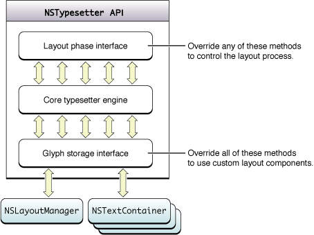

> 导航：[总目录](../../../README.md) · [documentation](../../../_indexes/documentation.md) · [Text Layout Programming Guide](Introduction%20to%20Text%20Layout%20Programming%20Guide.md)

[Next](Line%20Fragment%20Generation.md)[Previous](The%20Layout%20Manager.md)

# Typesetters

The layout manager uses a helper object called a typesetter to lay out glyphs in line fragments. Typesetter objects are instantiated from a concrete subclass of `NSTypesetter`.

Working with other objects in the Cocoa text system, the typesetter creates line fragment rectangles, places glyphs within the line fragments, determines line breaks by word wrapping and hyphenation, and handles tab positioning. The typesetter also determines interline spacing, paragraph spacing, and the right-to-left positioning of bidirectional glyphs.

The typesetter object generates line fragments by communicating with the text container, as described in [Line Fragment Generation](Line%20Fragment%20Generation.md#apple-f4xwc4dqnrsv64tfmyxwi33df52wszbpgiydambqha2dolkdjjbeeskbifda). The typesetter determines the suitable line fragment sizes and positions, which it returns in container coordinates.

After creating a line fragment rectangle, the typesetter determines the positions of glyphs within it, in response to the `layoutGlyphsInLayoutManager:startingAtGlyphIndex:maxNumberOfLineFragments:nextGlyphIndex:`message from the layout manager. The typesetter reports the glyph locations relative to the origin of their line fragment’s bounding rectangle. The typesetter fills the line fragment until it goes beyond the line fragment’s width. Then it creates a line break by wrapping text or hyphenating the last word. In this step, the typesetter performs glyph substitution, if necessary, and may add glyphs to the glyph stream. For example, the typesetter may substitute a ligature glyph for one or more single-character glyphs, or it may add a hyphen to the glyph stream.

`NSTypesetter` subclasses can control line breaking at word boundaries by overriding the [shouldBreakLineByWordBeforeCharacterAtIndex:](https://developer.apple.com/documentation/appkit/nstypesetter/1532732-shouldbreaklinebywordbeforechara) method. Similarly, subclasses can intervene in line breaking by hyphenation by overriding the [shouldBreakLineByHyphenatingBeforeCharacterAtIndex:](https://developer.apple.com/documentation/appkit/nstypesetter/1534525-shouldbreakline) method.

Whenever the width of the laid-out line, divided by the width of the line rectangle, exceeds a hyphenation threshold maintained by the layout manager, the typesetter calls an internal hyphenator object which attempts to find hyphenation points in the last word in the line. If the hyphenator finds a good point, the typesetter inserts a hyphen glyph at the end of the line fragment rectangle.

Hyphenation is controlled by a threshold called the hyphenation factor, which is maintained by the layout manager. You can set the threshold using the `NSLayoutManager` method `setHyphenationFactor:`. the hyphenation factor is a float that ranges between 0.0 and 1.0. By default, its value is 0.0, meaning hyphenation is off. Setting the hyphenation factor to 1.0 causes the typesetter to attempt hyphenation always.

The text system uses a shared, reentrant typesetter instance, made available by the `NSLayoutManager` method `typesetter`. The `NSLayoutManager` method [setTypesetterBehavior:](https://developer.apple.com/documentation/appkit/nslayoutmanager/1403199-typesetterbehavior) selects among the original default typesetter shipped with OS X prior to version 10.2, a typesetter encapsulating Apple Type Services (ATS) that shipped with OS X version 10.2, an enhanced version of the ATS-based typesetter that shipped with OS X version 10.3., and the typesetter behavior introduced in OS X version 10.4. The [NSTypesetterBehavior](https://developer.apple.com/documentation/appkit/nslayoutmanager/typesetterbehavior) enumeration defines the relevant constants.

The `NSTypesetter` subclass that implements the original typesetter behavior is `NSSimpleHorizontalTypesetter`, which is defined in the `NSTypesetter.h` header file. `NSSimpleHorizontalTypesetter` supports glyph layout with a left-to-right sweep and downward line movement only. `NSSimpleHorizontalTypesetter` is deprecated in OS X version 10.4 and later.

The typesetter behavior introduced in OS X version 10.2 is implemented by the `NSATSTypesetter` class, which is defined in the `NSATSTypesetter.h` header file. `NSATSTypesetter` provides enhanced line and character spacing accuracy and supports more languages, including bidirectional languages, than the original `NSSimpleHorizontalTypesetter`.

OS X version 10.3 introduced a new version of the `NSATSTypesetter` that declares public APIs for `NSATSTypesetter` and `NSGlyphGenerator`. These APIs open up the typesetter for use with a custom layout engine having a design different from the traditional Cocoa text system, as described in [Design of NSTypesetter](#apple-f4xwc4dqnrsv64tfmyxwi33df52wszbpgiydambrhaydmljvge4tmmi). In OS X version 10.4, these APIs moved to `NSTypesetter`.

Unless you require a specific behavior of an earlier typesetter version, you should use or subclass the latest version of `NSATSTypesetter`.

It is important to use the same typesetter behavior when both measuring and rendering text, to avoid differences in paragraph spacing, line spacing, and head indent handling. See [String Drawing and Typesetter Behaviors](Drawing%20Strings.md#apple-f4xwc4dqnrsv64tfmyxwi33df52wszbpgiydambrhaydqlktk4yq) for more information about typesetter behavior mismatches.

In the Cocoa text system, the layout manager owns the typesetter and glyph generator as private objects and maintains an array of text containers, as described in [The Layout Manager](The%20Layout%20Manager.md#apple-f4xwc4dqnrsv64tfmyxwi33df52wszbpgiydambrhaydklkcijbumrkcjbaq). The typesetter concept is tightly coupled with the layout manager and text container concepts. The typesetter’s responsibility is to fill the text containers in the array with glyphs supplied by the glyph generator. By default, `NSATSTypesetter` works in this way. However, `NSTypesetter` is designed to enable developers to decouple it from the other components of the Cocoa text system.

The design of `NSTypesetter` isolates the primitive, core typesetter from the rest of the Cocoa text system, as shown in Figure 1. `NSTypesetter` has a core typesetting engine, a layout phase interface, and a glyph storage interface layer that communicates with the text system and drives the layout engine. The core typesetting engine provides advanced typographic capabilities through a simplified API. The core typesetting engine lays out glyphs in an infinite horizontal line and knows nothing about text containers or text direction. The glyph storage interface layer calls out to the text system to generate line fragment rectangles and make sure they fit onto the page properly.

__Figure 1__  Design of NSTypesetter

The API design for `NSTypesetter` has two primary goals. The first is to break the tie between the two classes and `NSLayoutManager`, allowing developers to tap deeply into Cocoa’s typographic capabilities without using `NSLayoutManager`. The second goal is to provide override points to allow developers to extend various aspects of the typesetting process. In addition, direct access to these classes makes it easier to port Carbon, Windows, or UNIX applications with their own layout engines to Cocoa.

`NSTypesetter` categorizes its methods as follows:

- 

  The glyph storage interface (`NSGlyphStorageInterface`) declares all the primitive methods interfacing to the glyph storage facility, which is `NSLayoutManager` in Cocoa. By overriding all these methods, an application can implement an `NSTypesetter` subclass that interacts with a custom glyph storage facility and layout manager. The default implementations of these methods call `NSLayoutManager`.

  `NSTypesetter` copies the glyphs for the line fragment currently being processed from the layout manager and performs layout, substitution, insertion, and deletion on the copy. As a final step in the layout process, it moves the resulting glyphs to the glyph storage. The majority of `NSGlyphStorageInterface` methods including [insertGlyph:atGlyphIndex:characterIndex:](https://developer.apple.com/documentation/appkit/nslayoutmanager/1402927-insertglyph) are used for the final step of copying the result back to the glyph storage.

  Since the glyph index and character indexes are nominal during the layout process, you should wait until the final process before modifying `NSLayoutManager`.
- 

  The layout phase interface (`NSLayoutPhaseInterface`) declares control points called during text layout, if implemented. These method calls act as notifications of events occurring in the layout process. An `NSTypesetter` subclass can override any of these methods, if desired, to modify various aspects of the layout process. For example, the typesetter calls `willSetLineFragmentRect:forGlyphRange:usedRect:baselineOffset:` immediately before it calls `setLineFragmentRect:forGlyphRange:usedRect:baselineOffset:` to store the actual line fragment rectangle location in the layout manager.
- The remainder of the `NSTypesetter` methods are primitive typesetter methods that a custom layout manager can call to control the typesetter directly.

With its layered design, `NSTypesetter` can be instantiated and used in its standard configuration with the Cocoa text system or subclassed and adapted to work with another text system, even one that has entirely different concepts of how to perform page layout.

[Next](Line%20Fragment%20Generation.md)[Previous](The%20Layout%20Manager.md)

