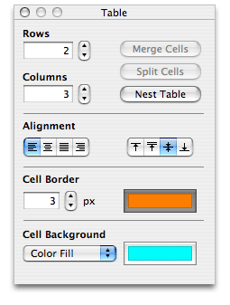
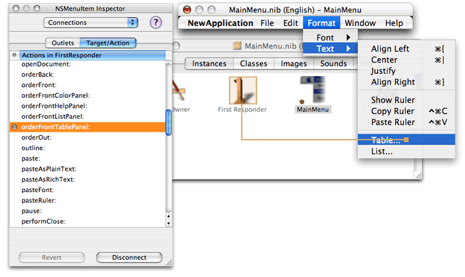
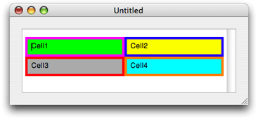

> 导航：[总目录](../../../README.md) · [documentation](../../../_indexes/documentation.md) · [Text Layout Programming Guide](Introduction%20to%20Text%20Layout%20Programming%20Guide.md)


[Next](Document%20Revision%20History.md)[Previous](Counting%20Lines%20of%20Text.md)

# Using Text Tables

 The Cocoa text system supports text tables  in OS X version 10.4 and later. The main classes involved are [NSTextTable](https://developer.apple.com/documentation/appkit/nstexttable), which represents a table, [NSTextTableBlock](https://developer.apple.com/documentation/appkit/nstexttableblock), which represents a block of text appearing as a cell in the table, and its superclass, [NSTextBlock](https://developer.apple.com/documentation/appkit/nstextblock). This article explains how to add table support to your application.

[NSTextView](https://developer.apple.com/documentation/appkit/nstextview) has built-in support for text tables, which provides the easiest way to add table support to your text view. This table support is in the form of the action method [orderFrontTablePanel:](https://developer.apple.com/documentation/appkit/nstextview/1449442-orderfronttablepanel). This method inserts a table into the text view and opens a modeless utility window that floats over the application windows. This table panel enables the user to manipulate attributes of a table while the cursor or selection is in the table. The table panel is shown in [Text table panel](#apple-f4xwc4dqnrsv64tfmyxwi33df52wszbpkridimbqgaytsmbqfvjvony).

__Figure 1__  Text table panel



The user can change other aspects of the table, such as cell size and contents, by direct manipulation with the cursor.

To make the text table panel available in your text view, use Interface Builder to add the [orderFrontTablePanel:](https://developer.apple.com/documentation/appkit/nstextview/1449442-orderfronttablepanel) action method to your first responder and connect it to a menu item, as shown in [Connecting the action method](#apple-f4xwc4dqnrsv64tfmyxwi33df52wszbpkridimbqgaytsmbqfvjvonq).

__Figure 2__  Connecting the action method



[NSTextView](https://developer.apple.com/documentation/appkit/nstextview) defines similar action methods for opening list, link, and paragraph spacing panels.

If you don’t want to use the text table panel, you can support tables programmatically by using [NSTextTable](https://developer.apple.com/documentation/appkit/nstexttable) and related classes directly. The basic class in this group is [NSTextBlock](https://developer.apple.com/documentation/appkit/nstextblock), which represents a block of text laid out in a subregion of a text container. When working with tables, you use its subclass, [NSTextTableBlock](https://developer.apple.com/documentation/appkit/nstexttableblock), which represents a text block that appears as a cell in a table. The table itself is represented by a separate class, [NSTextTable](https://developer.apple.com/documentation/appkit/nstexttable). All of the  `NSTextTableBlock` objects, representing the cells in the table, refer to the [NSTextTable](https://developer.apple.com/documentation/appkit/nstexttable) object, which controls their size and positioning.

Text blocks appear as attributes on paragraphs, as part of the paragraph style. An [NSParagraphStyle](https://developer.apple.com/documentation/uikit/nsparagraphstyle) object can have an array of text blocks representing the table cells that contain the paragraph. The paragraph style uses an array because table cells can be nested, and the text blocks are ordered in the array from outermost to innermost. For example, if block1 contains four paragraphs, and the middle two are also in inner block2, then the text blocks array for first and fourth paragraphs is (block1) which the array for the second and third paragraphs is (block1, block2).

You add text blocks to a paragraph style object using the [NSMutableParagraphStyle](https://developer.apple.com/documentation/uikit/nsmutableparagraphstyle) method [setTextBlocks:](https://developer.apple.com/documentation/appkit/nsmutableparagraphstyle/1535855-textblocks), and the [NSParagraphStyle](https://developer.apple.com/documentation/uikit/nsparagraphstyle) method [textBlocks](https://developer.apple.com/documentation/appkit/nsparagraphstyle/1528053-textblocks) returns the array.

To implement a text table programmatically, use the following sequence of steps:

1. Create an attributed string for the table.
2. Create the table object, setting the number of columns.
3. Create the text table block for the first cell of the row, referring to the table object.
4. Set the attributes for the text block.
5. Create a paragraph style object for the cell, setting the text block as an attribute (along with any other paragraph attributes, such as alignment).
6. Create an attributed string for the cell, adding the paragraph style as an attribute. The cell string must end with a paragraph marker, such as a newline character.
7. Append the cell string to the table string.
8. Repeat steps 3–7 for each cell in the table.

The methods shown in [Table creation method](#apple-f4xwc4dqnrsv64tfmyxwi33df52wszbpkridimbqgaytsmbqfvjvomy) and [Table cell creation method](#apple-f4xwc4dqnrsv64tfmyxwi33df52wszbpkridimbqgaytsmbqfvjvona) perform the steps from the preceding list. (All of the example methods in this article are defined in the [NSDocument](https://developer.apple.com/documentation/appkit/nsdocument) subclass of a document-based application, but they could as easily belong to another object, such as a text view.) [Table cell creation method](#apple-f4xwc4dqnrsv64tfmyxwi33df52wszbpkridimbqgaytsmbqfvjvona) performs steps 3–6 for each cell in the table, using fat borders and contrasting colors for illustrative purposes.

__Listing 1__  Table creation method

```objc
- (NSMutableAttributedString *) tableAttributedString
{
    // tableString is an ivar declared in the header file as NSMutableAttributedString *tableString;
    tableString = [[NSMutableAttributedString alloc] initWithString:@"\n\n"];
    NSTextTable *table = [[NSTextTable alloc] init];
    [table setNumberOfColumns:2];

    [tableString appendAttributedString:[self tableCellAttributedStringWithString:@"Cell1\n"
        table:table
        backgroundColor:[NSColor greenColor]
        borderColor:[NSColor magentaColor]
        row:0
        column:0]];

    [tableString appendAttributedString:[self tableCellAttributedStringWithString:@"Cell2\n"
        table:table
        backgroundColor:[NSColor yellowColor]
        borderColor:[NSColor blueColor]
        row:0
        column:1]];

    [tableString appendAttributedString:[self tableCellAttributedStringWithString:@"Cell3\n"
        table:table
        backgroundColor:[NSColor lightGrayColor]
        borderColor:[NSColor redColor]
        row:1
        column:0]];

    [tableString appendAttributedString:[self tableCellAttributedStringWithString:@"Cell4\n"
        table:table
        backgroundColor:[NSColor cyanColor]
        borderColor:[NSColor orangeColor]
        row:1
        column:1]];

    [table release];
    return [tableString autorelease];
}
```


__Listing 2__  Table cell creation method

```objc
- (NSMutableAttributedString *) tableCellAttributedStringWithString:(NSString *)string
        table:(NSTextTable *)table
        backgroundColor:(NSColor *)backgroundColor
        borderColor:(NSColor *)borderColor
        row:(int)row
        column:(int)column
{
    NSTextTableBlock *block = [[NSTextTableBlock alloc]
        initWithTable:table
        startingRow:row
        rowSpan:1
        startingColumn:column
        columnSpan:1];
    [block setBackgroundColor:backgroundColor];
    [block setBorderColor:borderColor];
    [block setWidth:4.0 type:NSTextBlockAbsoluteValueType forLayer:NSTextBlockBorder];
    [block setWidth:6.0 type:NSTextBlockAbsoluteValueType forLayer:NSTextBlockPadding];

    NSMutableParagraphStyle *paragraphStyle =
        [[NSParagraphStyle defaultParagraphStyle] mutableCopy];
    [paragraphStyle setTextBlocks:[NSArray arrayWithObjects:block, nil]];
    [block release];

    NSMutableAttributedString *cellString =
        [[NSMutableAttributedString alloc] initWithString:string];
    [cellString addAttribute:NSParagraphStyleAttributeName
        value:paragraphStyle
        range:NSMakeRange(0, [cellString length])];
    [paragraphStyle release];

    return [cellString autorelease];
}
```

The code in [Table creation method](#apple-f4xwc4dqnrsv64tfmyxwi33df52wszbpkridimbqgaytsmbqfvjvomy) and [Table cell creation method](#apple-f4xwc4dqnrsv64tfmyxwi33df52wszbpkridimbqgaytsmbqfvjvona) produces the table shown in [Table output](#apple-f4xwc4dqnrsv64tfmyxwi33df52wszbpkridimbqgaytsmbqfvjvoni).

__Figure 3__  Table output



To insert the table in text displayed in a text view, implement an action method such as the one shown in [Listing 3](#apple-f4xwc4dqnrsv64tfmyxwi33df52wszbpkridimbqgaytsmbqfvjvomq). This method inserts the table string constructed in [Table creation method](#apple-f4xwc4dqnrsv64tfmyxwi33df52wszbpkridimbqgaytsmbqfvjvomy) in the text view, replacing the current selection (or at the insertion point, if there's no selection), and ensures that the proper notifications and delegate messages are sent. 

__Listing 3__  Table insertion action method

```objc
- (void) insertMyTable:(id)sender
{
    NSRange charRange = [myTextView rangeForUserTextChange];
    NSTextStorage *myTextStorage = [myTextView textStorage];

    if ([myTextView isEditable] && charRange.location != NSNotFound)
        {
            NSMutableAttributedString *attrStringToInsert = [self tableAttributedString];
            if ([myTextView shouldChangeTextInRange:charRange replacementString:nil])
                {
                    [myTextStorage replaceCharactersInRange:charRange
                        withAttributedString:attrStringToInsert];
                    [myTextView setSelectedRange:NSMakeRange(charRange.location, 0)
                        affinity:NSSelectionAffinityUpstream stillSelecting:NO];
                    [myTextView didChangeText];
                }
        }
}
```

`NSAttributedString` has the following convenience methods you can use to determine the range in the string that is covered by a text block or table:

[rangeOfTextBlock:atIndex:](https://developer.apple.com/documentation/foundation/nsattributedstring/1534045-range)

[rangeOfTextTable:atIndex:](https://developer.apple.com/documentation/foundation/nsattributedstring/1534365-rangeoftexttable)

If the given location is not in the specified block or table, these methods return a range of `(NSNotFound, 0)` .

The Cocoa text table model is derived primarily from the table model defined by  HTML and  CSS, in which tables are built up from rows of cells. For a description of the CSS table model, refer to the following URL:

[http://www.w3.org/TR/CSS21/tables.html](http://www.w3.org/TR/CSS21/tables.html)

This affinity provides another way to create tables in text. You can define a table in HTML and use that data to initialize an attributed string. The attributes of that string then define the table for rendering by the Cocoa text system. You can use the following `NSAttributedString` initialization methods for this purpose:

[initWithHTML:documentAttributes:](https://developer.apple.com/documentation/foundation/nsattributedstring/1525953-initwithhtml)

[initWithHTML:options:documentAttributes:](https://developer.apple.com/documentation/foundation/nsattributedstring/1535412-initwithhtml)

[initWithHTML:baseURL:documentAttributes:](https://developer.apple.com/documentation/foundation/nsattributedstring/1524624-init)

[initWithData:options:documentAttributes:error:](https://developer.apple.com/documentation/foundation/nsattributedstring/1524613-initwithdata)

The position of a text block is determined by its text container or containing block. In the case of a text table block, which represents a cell in a table, size and position are controlled by the text table and the block’s relation to other blocks in the table. When you initialize an [NSTextTableBlock](https://developer.apple.com/documentation/appkit/nstexttableblock) object, you specify its row and column position as a cell within its table, and you also specify whether it spans multiple rows or columns. The [NSTextTableBlock](https://developer.apple.com/documentation/appkit/nstexttableblock) initialization method is:

[initWithTable:startingRow:rowSpan:startingColumn:columnSpan:](https://developer.apple.com/documentation/appkit/nstexttableblock/1532894-init)

[Table cell creation method](#apple-f4xwc4dqnrsv64tfmyxwi33df52wszbpkridimbqgaytsmbqfvjvona) shows this method in use.

In addition, you can specify the value of a number of dimensions for each block, either as an absolute value or as a percentage of the containing block. These dimensions include the following:

- Width
- Height
- Minimum width
- Minimum height
- Maximum width
- Maximum height
- Padding width for each of the four sides. Padding is space surrounding the content area of the block, extending to the border.
- Border width for each of the four sides. A border is space between the padding and the margin, typically colored to present a visible boundary.
- Margin width for each of the four sides. The margin is space surrounding the border.

The default value for each of these dimensions is `0` , indicating no padding, border, or margin, and the natural width and height. Natural width and height of a single text block extend to the width and height of its containing block (or text container); natural width and height of multiple blocks divide the space of their containing block evenly.

The following methods specify or return values associated with these dimensions:

[setValue:type:forDimension:](https://developer.apple.com/documentation/appkit/nstextblock/1533000-setvalue)

[valueForDimension:](https://developer.apple.com/documentation/appkit/nstextblock/1526445-valuefordimension)

[valueTypeForDimension:](https://developer.apple.com/documentation/appkit/nstextblock/1530561-valuetype)

[setWidth:type:forLayer:](https://developer.apple.com/documentation/appkit/nstextblock/1535325-setwidth)

[setWidth:type:forLayer:edge:](https://developer.apple.com/documentation/appkit/nstextblock/1533792-setwidth)

[widthForLayer:edge:](https://developer.apple.com/documentation/appkit/nstextblock/1533532-widthforlayer)

[widthValueTypeForLayer:edge:](https://developer.apple.com/documentation/appkit/nstextblock/1533551-widthvaluetype)

In these methods, the value type refers to absolute or percentage values. The dimension refers to minimum, maximum, and full width and height of the block. The layer refers to padding, border, and margin. These parameters are specified by constants described in [NSTextBlock](https://developer.apple.com/documentation/appkit/nstextblock)

[NSTextBlock](https://developer.apple.com/documentation/appkit/nstextblock) provides the following methods to specify and return the background and border color of the block:

[backgroundColor](https://developer.apple.com/documentation/appkit/nstextblock/1527300-backgroundcolor)

[setBackgroundColor:](https://developer.apple.com/documentation/appkit/nstextblock/1527300-backgroundcolor)

[borderColorForEdge:](https://developer.apple.com/documentation/appkit/nstextblock/1534711-bordercolorforedge)

[setBorderColor:forEdge:](https://developer.apple.com/documentation/appkit/nstextblock/1529881-setbordercolor)

[setBorderColor:](https://developer.apple.com/documentation/appkit/nstextblock/1531850-setbordercolor)

By default the color values are `nil` , meaning no color. Note that a border with no color is invisible.

During  text layout, the typesetter works with [NSTextBlock](https://developer.apple.com/documentation/appkit/nstextblock) to determine the layout rectangles for the text block. If the text block is an instance of [NSTextTableBlock](https://developer.apple.com/documentation/appkit/nstexttableblock), it calls its containing [NSTextTable](https://developer.apple.com/documentation/appkit/nstexttable) instance to perform the calculations. The typesetter stores the results of these calculations in its layout manager. There are methods in [NSTextBlock](https://developer.apple.com/documentation/appkit/nstextblock), [NSTextTable](https://developer.apple.com/documentation/appkit/nstexttable), and [NSLayoutManager](https://developer.apple.com/documentation/appkit/nslayoutmanager) specific to this layout process that you can use if you need to intervene in the process.

To begin the text block layout process, the typesetter proposes a large rectangle within which the text block should fit. For the outermost block, this is determined by the text container; for inner blocks, it is determined by the containing block. The block object then decides what area within the proposed rectangle it should actually occupy.

The text block actually determines two rectangles: first, the layout rectangle, within which the text in the block is to be laid out; second, the bounds rectangle, which contains additional space for padding, borders, border decoration, and margins. The text block calculates the layout rectangle immediately before the typesetter lays out the first glyph because it is needed for all subsequent layout of text in the block. The layout rectangle is often quite tall because, at this point, the height of the text to be laid out has not yet been determined. The text block calculates the bounds rectangle immediately after the last glyph in the block has been laid out, and it is based on the actual rectangle used for the text within the block. Under some circumstances, the bounds rectangle may be adjusted subsequently as additional blocks in the same table are laid out.

To find the layout and bounds rectangles, the typesetter calls the following [NSTextBlock](https://developer.apple.com/documentation/appkit/nstextblock) methods:

[rectForLayoutAtPoint:inRect:textContainer:characterRange:](https://developer.apple.com/documentation/appkit/nstextblock/1527965-rectforlayoutatpoint)

[boundsRectForContentRect:inRect:textContainer:characterRange:](https://developer.apple.com/documentation/appkit/nstextblock/1532041-boundsrectforcontentrect)

An [NSTextTableBlock](https://developer.apple.com/documentation/appkit/nstexttableblock) object, in turn, calls its [NSTextTable](https://developer.apple.com/documentation/appkit/nstexttable) object to perform these calculations, using the following methods:

[rectForBlock:layoutAtPoint:inRect:textContainer:characterRange:](https://developer.apple.com/documentation/appkit/nstexttable/1534161-rectforblock)

[boundsRectForBlock:contentRect:inRect:textContainer:characterRange:](https://developer.apple.com/documentation/appkit/nstexttable/1525956-boundsrect)

The typesetter stores the results of these methods in the layout manager using the following methods:

[setLayoutRect:forTextBlock:glyphRange:](https://developer.apple.com/documentation/appkit/nslayoutmanager/1402929-setlayoutrect)

[setBoundsRect:forTextBlock:glyphRange:](https://developer.apple.com/documentation/appkit/nslayoutmanager/1402991-setboundsrect)

The typesetter uses the following [NSLayoutManager](https://developer.apple.com/documentation/appkit/nslayoutmanager) methods when it needs to determine the space used by previously laid text blocks:

[layoutRectForTextBlock:glyphRange:](https://developer.apple.com/documentation/appkit/nslayoutmanager/1403201-layoutrectfortextblock)

[layoutRectForTextBlock:atIndex:effectiveRange:](https://developer.apple.com/documentation/appkit/nslayoutmanager/1403102-layoutrect)

[boundsRectForTextBlock:glyphRange:](https://developer.apple.com/documentation/appkit/nslayoutmanager/1403138-boundsrect)

[boundsRectForTextBlock:atIndex:effectiveRange:](https://developer.apple.com/documentation/appkit/nslayoutmanager/1402956-boundsrectfortextblock)

The preceding methods cause glyph generation but do not force layout. This avoids an infinite recursion when the methods are called during layout. For the same reason, the following variants of existing `NSLayoutManager` methods have an option to prevent them from causing layout:

[lineFragmentRectForGlyphAtIndex:effectiveRange:withoutAdditionalLayout:](https://developer.apple.com/documentation/uikit/nslayoutmanager/1403116-linefragmentrect)

[lineFragmentUsedRectForGlyphAtIndex:effectiveRange:withoutAdditionalLayout:](https://developer.apple.com/documentation/uikit/nslayoutmanager/1403035-linefragmentusedrect)

[textContainerForGlyphAtIndex:effectiveRange:withoutAdditionalLayout:](https://developer.apple.com/documentation/uikit/nslayoutmanager/1403055-textcontainerforglyphatindex)

If no rectangle has been set, the preceding methods return `NSZeroRect` .

At display time the text is drawn as usual, as described in “[The Layout Manager](The%20Layout%20Manager.md#apple-f4xwc4dqnrsv64tfmyxwi33df52wszbpgiydambrhaydklkcijbumrkcjbaq),” except that the text block draws background and border decoration while glyph backgrounds are being drawn, using the following method:

[drawBackgroundWithFrame:inView:characterRange:layoutManager:](https://developer.apple.com/documentation/appkit/nstextblock/1531424-drawbackground)

If the text block is an [NSTextTableBlock](https://developer.apple.com/documentation/appkit/nstexttableblock) object, it calls its text table for this purpose, using the following [NSTextTable](https://developer.apple.com/documentation/appkit/nstexttable) method: 

[drawBackgroundForBlock:withFrame:inView:characterRange:layoutManager:](https://developer.apple.com/documentation/appkit/nstexttable/1534234-drawbackground)

[Next](Document%20Revision%20History.md)[Previous](Counting%20Lines%20of%20Text.md)

