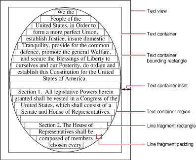

> 导航：[总目录](../../../README.md) · [documentation](../../../_indexes/documentation.md) · [Text System Storage Layer Overview](Introduction%20to%20Text%20System%20Storage%20Layer%20Overview.md)

[Next](Tracking%20the%20Size%20of%20a%20Text%20View.md)[Previous](Displaying%20a%20Text%20Container.md)

# Calculating Region, Bounding Rectangle, and Inset

An [NSTextContainer](https://developer.apple.com/documentation/appkit/nstextcontainer) object’s region is defined by a bounding rectangle whose coordinate system starts at (0,0) in the top-left corner. The size of this rectangle is returned by the [containerSize](https://developer.apple.com/documentation/appkit/nstextcontainer/1444551-containersize) method and set using [setContainerSize:](https://developer.apple.com/documentation/appkit/nstextcontainer/1444551-containersize). You can define a container’s region so that it’s always the same shape, such as a circle whose diameter is the narrower of the bounding rectangle’s dimensions, or you can define the region relative to the bounding rectangle, such as an oval region that fits inside the bounding rectangle (and that’s a circle when the bounding rectangle is square). Regardless of a text container’s shape, its [NSTextView](https://developer.apple.com/documentation/appkit/nstextview) always clips drawing to its bounding rectangle. Figure 1 illustrates these aspects of a text container.

__Figure 1__  Text container region, bounding rectangle, and inset

A subclass of `NSTextContainer` defines its region by overriding three methods. The first, [isSimpleRectangularTextContainer](https://developer.apple.com/documentation/uikit/nstextcontainer/1444525-issimplerectangulartextcontainer), indicates whether the region is currently a non-rotated rectangle, thus allowing the [NSLayoutManager](https://developer.apple.com/documentation/appkit/nslayoutmanager) to optimize layout of text (since custom text containers typically define more complex regions, your implementation of this method will probably return `NO`). The second method, [containsPoint:](https://developer.apple.com/documentation/appkit/nstextcontainer/1444567-contains), is used for testing mouse events and determines whether or not a given point lies in the region. The third method, [lineFragmentRectForProposedRect:sweepDirection:movementDirection:remainingRect:](https://developer.apple.com/documentation/appkit/nstextcontainer/1444571-linefragmentrect), is used for the actual layout of text, defining the region in terms of rectangles available to lay text in. This process is described in [Line Fragment Generation](https://developer.apple.com/library/archive/documentation/Cocoa/Conceptual/TextLayout/Concepts/CalcTextLayout.html#//apple_ref/doc/uid/20000847)

A text container usually covers its text view exactly, but it can be inset within the view frame with the [setTextContainerInset:](https://developer.apple.com/documentation/appkit/nstextview/1449168-textcontainerinset) method. The text container’s bounding rectangle from the inset position then establishes the limits of the text container’s region. The inset also helps determine the size of the bounding rectangle when the text container tracks the height or width of its text view, as described in [Tracking the Size of a Text View](Tracking%20the%20Size%20of%20a%20Text%20View.md#apple-f4xwc4dqnrsv64tfmyxwi33df52wszbpgiydambqhezdolkdjjbeeskbifda).

Note that the text container inset does not fully determine the position of the container in the text view. The text view calculates the position of the text container within it, and it tries to maintain the amount of space given by the text container inset, but depending on the relative sizes of the text view and text container, that may not be possible. It’s also possible that there’s more space to be distributed than that specified by the text container inset. If you want to determine the true location of the text container—for example, to convert between container and view coordinates—you should use the [textContainerOrigin](https://developer.apple.com/documentation/appkit/nstextview/1449477-textcontainerorigin) method, which is the actual value calculated by the text view.

[Next](Tracking%20the%20Size%20of%20a%20Text%20View.md)[Previous](Displaying%20a%20Text%20Container.md)

