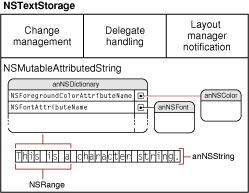

> 导航：[总目录](../../../README.md) · [documentation](../../../_indexes/documentation.md) · [Text System Storage Layer Overview](Introduction%20to%20Text%20System%20Storage%20Layer%20Overview.md)

[Next](Layout%20Geometry-%20The%20NSTextContainer%20Class.md)[Previous](Introduction%20to%20Text%20System%20Storage%20Layer%20Overview.md)

# The Storage Layer: The NSTextStorage Class

An [NSTextStorage](https://developer.apple.com/documentation/uikit/nstextstorage) object serves as the character data repository for the Cocoa text system. The format for this data is an attributed string, which is a sequence of characters (in Unicode encoding) and the attributes (such as font, color, and paragraph style) that apply to them. The classes that represent attributed strings are [NSAttributedString](https://developer.apple.com/library/archive/documentation/LegacyTechnologies/WebObjects/WebObjects_3.5/Reference/Frameworks/ObjC/Foundation/Classes/NSAttributedStrngClstr/Description.html#//apple_ref/occ/cl/NSAttributedString) and [NSMutableAttributedString](https://developer.apple.com/library/archive/documentation/LegacyTechnologies/WebObjects/WebObjects_3.5/Reference/Frameworks/ObjC/Foundation/Classes/NSAttributedStrngClstr/Description.html#//apple_ref/occ/cl/NSMutableAttributedString), of which `NSTextStorage` is a subclass. Conceptually, each character in a block of text has a dictionary of keys and values associated with it. A key names an attribute (such as [NSFontAttributeName](https://developer.apple.com/documentation/foundation/nsattributedstring/key/1528839-font)), and the associated value specifies the characteristics of that attribute (such as `Helvetica 12-point`). For more information about attributed strings, see _[Attributed String Programming Guide](../Attributed%20String%20Programming%20Guide/Introduction%20to%20Attributed%20String%20Programming%20Guide.md#apple-f4xwc4dqnrsv64tfmyxwi33df52wszbpgeydambqgaztm2i)_. Figure 1 illustrates the `NSTextStorage` class, showing its `NSMutableAttributedString` component and its additional capabilities.

__Figure 1__  Capabilities of NSTextStorage

The `NSTextStorage` methods let you operate programmatically on the attributes of the text displayed by the [NSTextView](https://developer.apple.com/documentation/appkit/nstextview) object; for example, your code can iterate through the text, tightening or loosening the kerning for all characters of a certain font and size. An `NSTextView` object enables users to affect character attributes through direct action; for example, the user selects some text and reduces the spacing between characters by choosing the Tighten menu command.

[Next](Layout%20Geometry-%20The%20NSTextContainer%20Class.md)[Previous](Introduction%20to%20Text%20System%20Storage%20Layer%20Overview.md)

