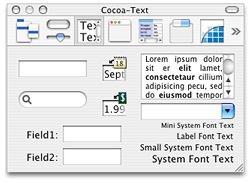
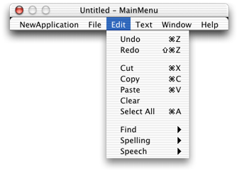
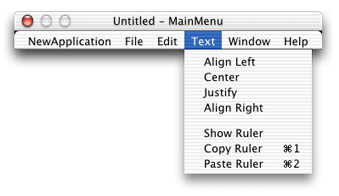
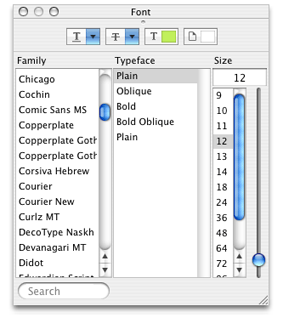

> 导航：[总目录](../../../README.md) · [documentation](../../../_indexes/documentation.md) · [Text System User Interface Layer Programming Guide](Introduction%20to%20Text%20System%20User%20Interface%20Layer.md)

[Next](Creating%20an%20NSTextView%20Object%20Programmatically.md)[Previous](The%20User-Interface%20Layer-%20NSTextView%20Class.md)

# Creating an NSTextView Object

The easiest way to use the text system is through Interface Builder. Interface Builder’s Cocoa-Text palette, shown in Figure 1, supplies a specially configured NSScrollView object that contains an NSTextView object as its document view. This NSTextView is configured to work with the NSScrollView and other user-interface controls such as a ruler, the Font menu, the Edit menu, and so on.

__Figure 1__  Cocoa-Text palette

Using Interface Builder’s Info window (also called the inspector) you can specify, among other things, whether the contained NSTextView allows multiple fonts and embedded graphics.

Much more of NSTextView’s functionality is accessible through menu commands. Interface Builder’s Cocoa-Menus palette offers the ready-made Edit menu that contains text-editing commands shown in Figure 2.

__Figure 2__  Edit menu

The Cocoa-Menus palette also has the Text menu, shown in Figure 3, which contains paragraph style controls and provides user access to the document’s ruler.

__Figure 3__  Text menu

The Cocoa-Menus palette also has the system Font panel (or Fonts window) shown in Figure 4.

__Figure 4__  Font panel

By default, most of the commands in these menus operate on the first responder, that is, the view within the key window that the user has selected for input. (See the reference documentation for NSResponder, NSView, and NSWindow for more information on the first responder.) In practice, the first responder is the object that’s displaying the selection, a drawing object in the case of a graphical selection or an NSTextView in the case of a textual selection. By adding these menus to your application, you can offer the user access to many powerful text-editing features.

NSTextViews cooperate with the Services facility through the Services menu, also available from the Cocoa-Menus palette. By simply adding the Services menu item to your application’s main menu, the NSTextViews in your application can access services provided by other applications. For example, if the user selects a word within an NSTextView and chooses the Mail > Send Selection service, the NSTextView passes its selected text to the Mail application which places the text in a new message.

Interface Builder offers these direct ways of accessing the features of the text system. You can also configure your own menu items or other controls within Interface Builder to send messages to an NSTextView object. For example, you can make an NSTextView output its text for printing or faxing by sending it a `print:` or `fax:` message. One way to do this is to drag a menu item from the Cocoa-Menus palette into your application’s File menu and hook it up to an NSTextView (either through the first responder or by direct connection). By specifying that the item send a `print:` message to its target, the NSTextView’s contents can be printed or faxed when the application is running.

Interface Builder also offers other objects—of the NSTextField and NSForm classes—that make use of NSTextView objects for their text-editing facilities. In fact, all NSTextField and NSForm objects within the same window share the same NSTextView object (known as the field editor), thus reducing the memory demands of an application. If your application requires standalone or grouped text fields that support editing (and all the other facilities provided by the NSTextView class), these are the classes to use.

Using the Info window (inspector), you can set many text-related attributes of these controls. For example, you can specify whether the text in a text field is selectable, editable, scrollable, and so on. The Info window also lets you set the text alignment and background and foreground colors.

[Next](Creating%20an%20NSTextView%20Object%20Programmatically.md)[Previous](The%20User-Interface%20Layer-%20NSTextView%20Class.md)

