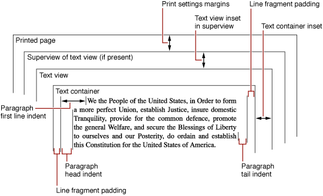

> 导航：[总目录](../../../README.md) · [documentation](../../../_indexes/documentation.md) · [Text System User Interface Layer Programming Guide](Introduction%20to%20Text%20System%20User%20Interface%20Layer.md)

[Next](Document%20Revision%20History.md)[Previous](Setting%20Text%20Attributes.md)

# Setting Text Margins

Many text system objects cooperate in the display of text, and several of them maintain inset values that affect the apparent margins of text on a printed page or display. This article describes those settings and their proper use. Figure 1 illustrates the various margins and insets you can place around text.

__Figure 1__  Text margins and insets

Paragraph style objects maintain head indent values for the first and subsequent lines and a tail indent value. These values describe space between the beginning and end of text lines and the edge of the text container. For left-to-right text, as shown in Figure 1, the head indents appear on the left side of the paragraph and the tail indent on the right side. You can find the indent values using the NSParagraphStyle methods `firstLineHeadIndent`, `headIndent`, and `tailIndent`. You set the values using the corresponding NSMutableParagraphStyle methods `setFirstLineHeadIndent:`, `setHeadIndent:`, and `setTailIndent:`.

By default, a text container covers its text view exactly. However, you can specify blank space between the edges of the text container and the edges of the text view with the NSTextView method `setTextContainerInset:`. This method specifies a width and height by which the text container’s top-left origin point is offset from the origin of the text view. The text container’s right and bottom edges are then inset by an equal amount. The container inset is respected even when the container is set to track the height and width of the text view. It’s possible to set the text container and text view sizes and resizing behavior so that the inset cannot be maintained exactly, but the text system maintains it whenever possible.

The text container inset refers to the bounding rectangle of the text container’s region. However, you can define the region to be a nonrectangular shape, in which case some lines of text can have additional space between the ends of the lines and the bounding rectangle. See [Calculating Region, Bounding Rectangle, and Inset](https://developer.apple.com/library/archive/documentation/Cocoa/Conceptual/TextStorageLayer/Tasks/Region.html#//apple_ref/doc/uid/20000925) for more information.

Another parameter that you can set to leave space at the ends of lines of type is called line fragment padding. You can set the padding value with the NSTextContainer method `setLineFragmentPadding:`. This adjustment is meant to specify a small amount of blank space on each end of the line fragment rectangles in which the typesetter sets lines of text. Line fragment padding keeps text from directly abutting any graphics or other elements positioned next to the text container.

Finally, the text view itself can optionally be inset in a superview, as in TextEdit’s multiple-page view, and views can be inset on a printed page using print settings.

[Next](Document%20Revision%20History.md)[Previous](Setting%20Text%20Attributes.md)

