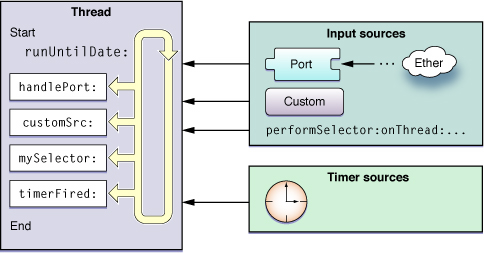
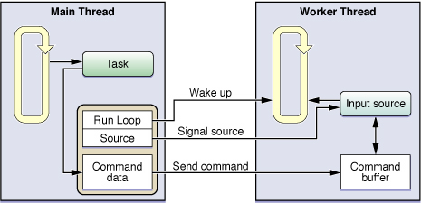

> 导航：[总目录](../../../README.md) · [文档](../../../_indexes/documentation.md) · [多线程编程指南](Introduction.md)


[下一页](Synchronization.md)[上一页](Thread%20Management.md)

# 运行循环

运行循环是与线程相关的基础设施的重要组成部分。_运行循环（run loop）_是一种事件处理循环，你可以用它来调度工作、协调接收到的事件。运行循环的目的是：有工作要做时让你的线程保持忙碌，没有工作时则让线程进入休眠。

运行循环的管理并不是完全自动的。你仍然需要设计线程的代码，在合适的时机启动运行循环并响应传入的事件。Cocoa 和 Core Foundation 都提供了 _运行循环对象_，帮助你配置和管理线程的运行循环。应用程序不需要显式地创建这些对象；每个线程（包括应用程序的主线程）都有一个与之关联的运行循环对象。不过，只有次线程需要显式地运行自己的运行循环。应用程序框架会在应用程序启动过程中自动为主线程建立并运行运行循环。

以下各节将详细介绍运行循环，以及如何为你的应用程序配置运行循环。关于运行循环对象的更多信息，请参阅 _[NSRunLoop Class Reference](https://developer.apple.com/documentation/foundation/nsrunloop)_ 和 _[CFRunLoop Reference](https://developer.apple.com/documentation/corefoundation/cfrunloop)_。

运行循环正如其名。它是一个由线程进入、用来响应传入事件并运行事件处理程序的循环。你的代码负责提供用来实现运行循环实际循环部分的控制语句——换句话说，是你的代码提供了驱动运行循环的 `while` 或 `for` 循环。在这个循环内部，你使用一个运行循环对象来"运行"事件处理代码，由它接收事件并调用已安装的处理程序。

运行循环从两种不同类型的源接收事件。_输入源（input source）_传递异步事件，通常是来自另一个线程或另一个应用程序的消息。_定时器源（timer source）_传递同步事件，这些事件在预定的时间点或以重复的时间间隔发生。两种源都使用特定于应用程序的处理例程来处理到达的事件。

图 3-1 展示了运行循环及多种源的概念结构。输入源将异步事件传递给相应的处理程序，并促使 [runUntilDate:](https://developer.apple.com/library/archive/documentation/LegacyTechnologies/WebObjects/WebObjects_3.5/Reference/Frameworks/ObjC/Foundation/Classes/NSRunLoop/Description.html#//apple_ref/occ/instm/NSRunLoop/runUntilDate:) 方法（在线程关联的 [NSRunLoop](https://developer.apple.com/library/archive/documentation/LegacyTechnologies/WebObjects/WebObjects_3.5/Reference/Frameworks/ObjC/Foundation/Classes/NSRunLoop/Description.html#//apple_ref/occ/cl/NSRunLoop) 对象上调用）退出。定时器源将事件传递给它们的处理例程，但不会使运行循环退出。

__图 3-1__  运行循环及其源的结构



除了处理输入源之外，运行循环还会针对自身的行为生成通知。已注册的 _运行循环观察者（run-loop observer）_可以接收这些通知，并利用它们在线程上执行额外的处理。你需要使用 Core Foundation 在线程上安装运行循环观察者。

以下各节将详细介绍运行循环的各个组成部分及其运行所处的模式，并介绍在事件处理的不同时刻所生成的通知。

_运行循环模式（run loop mode）_是一组需要被监视的输入源和定时器，以及一组需要被通知的运行循环观察者的集合。每次运行运行循环时，你都要（无论是显式还是隐式地）指定一个特定的"模式"来运行。在运行循环的那一次遍历中，只有与该模式关联的源会被监视并被允许传递它们的事件。（同样，也只有与该模式关联的观察者才会收到运行循环进展的通知。）与其他模式关联的源会持有任何新事件，直到运行循环以合适的模式再次遍历时才会处理它们。

在代码中，你通过名称来标识模式。Cocoa 和 Core Foundation 都定义了一个默认模式以及若干常用模式，并提供了用于在代码中指定这些模式的字符串。你可以通过简单地为模式名称指定一个自定义字符串来定义自定义模式。虽然你为自定义模式指定的名称是任意的，但这些模式的内容却不是任意的。你必须确保为你创建的任何模式添加一个或多个输入源、定时器或运行循环观察者，这些模式才有意义。

你可以利用模式，在运行循环的某次特定遍历中过滤掉来自不需要的源的事件。大多数情况下，你会希望在系统定义的"default"（默认）模式下运行运行循环。不过，模态面板可能会在"modal"（模态）模式下运行。在这种模式下，只有与该模态面板相关的源才会向线程传递事件。对于次线程，你可能会使用自定义模式，在时间要求严格的操作期间阻止低优先级的源传递事件。

表 3-1 列出了 Cocoa 和 Core Foundation 定义的标准模式，并描述了各模式的使用场景。Name（名称）列列出了你在代码中用来指定该模式的实际常量。

__表 3-1__  预定义的运行循环模式

| Mode | Name | Description |
| --- | --- | --- |
| Default | [NSDefaultRunLoopMode](https://developer.apple.com/library/archive/documentation/LegacyTechnologies/WebObjects/WebObjects_3.5/Reference/Frameworks/ObjC/Foundation/TypesAndConstants/FoundationTypesConstants/Description.html#//apple_ref/c/data/NSDefaultRunLoopMode) (Cocoa)  [kCFRunLoopDefaultMode](https://developer.apple.com/documentation/corefoundation/kcfrunloopdefaultmode) (Core Foundation) | 默认模式是用于大多数操作的模式。多数情况下，你应该使用这个模式来启动运行循环并配置输入源。 |
| Connection | [NSConnectionReplyMode](https://developer.apple.com/library/archive/documentation/LegacyTechnologies/WebObjects/WebObjects_3.5/Reference/Frameworks/ObjC/Foundation/TypesAndConstants/FoundationTypesConstants/Description.html#//apple_ref/c/data/NSConnectionReplyMode) (Cocoa) | Cocoa 结合 [NSConnection](https://developer.apple.com/library/archive/documentation/LegacyTechnologies/WebObjects/WebObjects_3.5/Reference/Frameworks/ObjC/Foundation/Classes/NSConnection/Description.html#//apple_ref/occ/cl/NSConnection) 对象使用这个模式来监视回复。你自己很少需要用到这个模式。 |
| Modal | [NSModalPanelRunLoopMode](https://developer.apple.com/documentation/appkit/nsmodalpanelrunloopmode) (Cocoa) | Cocoa 使用这个模式来标识面向模态面板的事件。 |
| Event tracking | [NSEventTrackingRunLoopMode](https://developer.apple.com/documentation/appkit/nseventtrackingrunloopmode) (Cocoa) | Cocoa 使用这个模式，在鼠标拖拽循环及其他各类用户界面跟踪循环期间限制传入的事件。 |
| Common modes | [NSRunLoopCommonModes](https://developer.apple.com/documentation/foundation/runloop/mode/1408609-common) (Cocoa)  [kCFRunLoopCommonModes](https://developer.apple.com/documentation/corefoundation/kcfrunloopcommonmodes) (Core Foundation) | 这是一组可配置的常用模式集合。将某个输入源关联到这个模式，也就相当于把它关联到该组中的每一个模式。对 Cocoa 应用程序而言，这个集合默认包括 default、modal 和 event tracking 模式。Core Foundation 最初只包含 default 模式。你可以使用 [CFRunLoopAddCommonMode](https://developer.apple.com/documentation/corefoundation/1542137-cfrunloopaddcommonmode) 函数向该集合添加自定义模式。 |

输入源以异步方式向线程传递事件。事件的来源取决于输入源的类型，通常分为两大类。基于端口的输入源监视应用程序的 Mach 端口。自定义输入源监视自定义的事件源。就运行循环而言，输入源究竟是基于端口的还是自定义的，本不应该有什么区别。系统通常已经实现了这两种类型的输入源，可以直接拿来使用。两者唯一的区别在于它们的触发方式。基于端口的源由内核自动触发，而自定义源必须由另一个线程手动触发。

创建输入源时，你要把它分配给运行循环的一个或多个模式。模式会影响在任意给定时刻监视哪些输入源。多数情况下，你会在默认模式下运行运行循环，不过你也可以指定自定义模式。如果某个输入源不在当前被监视的模式中，它产生的任何事件都会被保留，直到运行循环以正确的模式运行为止。

以下各节将介绍其中一些输入源。

Cocoa 和 Core Foundation 都内置支持使用与端口相关的对象和函数来创建基于端口的输入源。例如，在 Cocoa 中，你完全不需要直接创建输入源。你只需创建一个端口对象，并使用 [NSPort](https://developer.apple.com/documentation/foundation/nsport) 的方法把该端口添加到运行循环中即可。端口对象会替你完成所需输入源的创建和配置。

在 Core Foundation 中，你必须手动创建端口及其运行循环源。这两种情况下，你都要使用与该端口不透明类型（[CFMachPortRef](https://developer.apple.com/documentation/corefoundation/cfmachport)、[CFMessagePortRef](https://developer.apple.com/documentation/corefoundation/cfmessageport) 或 [CFSocketRef](https://developer.apple.com/documentation/corefoundation/cfsocketref)）相关联的函数来创建相应的对象。

关于如何搭建和配置自定义的基于端口的源的示例，请参阅[配置基于端口的输入源](#apple-f4xwc4dqnrsv64tfmyxwi33df52wszbpgeydambqga2to2jninedcnrngeztcmryge)。

要创建自定义输入源，你必须使用 Core Foundation 中与 [CFRunLoopSourceRef](https://developer.apple.com/documentation/corefoundation/cfrunloopsource) 不透明类型相关联的函数。你要用若干回调函数来配置自定义输入源。Core Foundation 会在不同的时刻调用这些函数，以配置源、处理任何传入的事件，以及在源从运行循环中移除时将其拆除。

除了定义事件到达时自定义源的行为之外，你还必须定义事件传递机制。源的这一部分运行在一个独立的线程上，负责向输入源提供数据，并在数据准备好可供处理时触发输入源。事件传递机制由你自行决定，但不必过于复杂。

关于如何创建自定义输入源的示例，请参阅[定义自定义输入源](#apple-f4xwc4dqnrsv64tfmyxwi33df52wszbpgeydambqga2to2jninedcnrnknltg)。关于自定义输入源的参考信息，另请参阅 _[CFRunLoopSource Reference](https://developer.apple.com/documentation/corefoundation/cfrunloopsource-rhr)_。

除了基于端口的源之外，Cocoa 还定义了一种自定义输入源，允许你在任意线程上执行一个选择器。与基于端口的源一样，执行选择器的请求会在目标线程上被串行化处理，从而缓解了在同一线程上运行多个方法可能出现的许多同步问题。与基于端口的源不同的是，执行选择器的源在执行完选择器后会自行从运行循环中移除。

在另一个线程上执行选择器时，目标线程必须有一个活跃的运行循环。对于你自己创建的线程，这意味着要等到你的代码显式启动运行循环之后才行。不过，由于主线程会启动自己的运行循环，所以只要应用程序调用了应用程序委托的 `applicationDidFinishLaunching:` 方法，你就可以开始在主线程上发起调用了。运行循环每次遍历时都会处理所有已排队的执行选择器调用，而不是每次循环迭代只处理一个。

表 3-2 列出了定义在 `NSObject` 上、可用于在其他线程上执行选择器的方法。由于这些方法声明在 `NSObject` 上，你可以在任何能够访问 Objective-C 对象的线程（包括 POSIX 线程）上使用它们。这些方法本身并不会创建新线程来执行选择器。

__表 3-2__  在其他线程上执行选择器

| Methods | Description |
| --- | --- |
| [performSelectorOnMainThread:withObject:waitUntilDone:](https://developer.apple.com/documentation/objectivec/nsobject/1414900-performselector)  [performSelectorOnMainThread:withObject:waitUntilDone:modes:](https://developer.apple.com/documentation/objectivec/nsobject/1411637-performselectoronmainthread) | 在应用程序主线程的下一次运行循环周期中，于该线程上执行指定的选择器。这些方法可以让你选择阻塞当前线程，直到选择器执行完毕。 |
| [performSelector:onThread:withObject:waitUntilDone:](https://developer.apple.com/documentation/objectivec/nsobject/1414476-performselector)  [performSelector:onThread:withObject:waitUntilDone:modes:](https://developer.apple.com/documentation/objectivec/nsobject/1417922-perform) | 在你拥有其 [NSThread](https://developer.apple.com/library/archive/documentation/LegacyTechnologies/WebObjects/WebObjects_3.5/Reference/Frameworks/ObjC/Foundation/Classes/NSThread/Description.html#//apple_ref/occ/cl/NSThread) 对象的任意线程上执行指定的选择器。这些方法可以让你选择阻塞当前线程，直到选择器执行完毕。 |
| [performSelector:withObject:afterDelay:](https://developer.apple.com/library/archive/documentation/LegacyTechnologies/WebObjects/WebObjects_3.5/Reference/Frameworks/ObjC/Foundation/Classes/NSObject/Description.html#//apple_ref/occ/instm/NSObject/performSelector:withObject:afterDelay:)  [performSelector:withObject:afterDelay:inModes:](https://developer.apple.com/library/archive/documentation/LegacyTechnologies/WebObjects/WebObjects_3.5/Reference/Frameworks/ObjC/Foundation/Classes/NSObject/Description.html#//apple_ref/occ/instm/NSObject/performSelector:withObject:afterDelay:inModes:) | 在当前线程的下一次运行循环周期中、经过一段可选的延迟之后执行指定的选择器。由于要等到下一次运行循环周期才执行该选择器，这些方法相对于当前正在执行的代码自动提供了一小段延迟。多个已排队的选择器会按排队顺序依次执行。 |
| [cancelPreviousPerformRequestsWithTarget:](https://developer.apple.com/documentation/objectivec/nsobject/1417611-cancelpreviousperformrequests)  [cancelPreviousPerformRequestsWithTarget:selector:object:](https://developer.apple.com/library/archive/documentation/LegacyTechnologies/WebObjects/WebObjects_3.5/Reference/Frameworks/ObjC/Foundation/Classes/NSObject/Description.html#//apple_ref/occ/clm/NSObject/cancelPreviousPerformRequestsWithTarget:selector:object:) | 让你可以取消一条使用 [performSelector:withObject:afterDelay:](https://developer.apple.com/library/archive/documentation/LegacyTechnologies/WebObjects/WebObjects_3.5/Reference/Frameworks/ObjC/Foundation/Classes/NSObject/Description.html#//apple_ref/occ/instm/NSObject/performSelector:withObject:afterDelay:) 或 [performSelector:withObject:afterDelay:inModes:](https://developer.apple.com/library/archive/documentation/LegacyTechnologies/WebObjects/WebObjects_3.5/Reference/Frameworks/ObjC/Foundation/Classes/NSObject/Description.html#//apple_ref/occ/instm/NSObject/performSelector:withObject:afterDelay:inModes:) 方法发送到当前线程的消息。 |

关于这些方法的详细信息，请参阅 _[NSObject Class Reference](https://developer.apple.com/documentation/objectivec/nsobject)_。

定时器源会在未来某个预设的时间点同步地向线程传递事件。定时器是线程用来通知自己去做某件事的一种方式。例如，搜索框可以使用定时器，在用户连续两次按键之间经过一定时间后自动发起搜索。使用这样的延迟时间，可以让用户有机会在开始搜索之前尽量输完想要的搜索字符串。

尽管定时器会生成基于时间的通知，但它并不是一种实时机制。与输入源一样，定时器也与运行循环的特定模式相关联。如果定时器所处的模式不是运行循环当前监视的模式，它就不会触发，直到运行循环以该定时器所支持的某个模式运行为止。同样，如果定时器在运行循环正在执行某个处理例程的过程中触发，该定时器会一直等到运行循环下一次遍历时才会调用它的处理例程。如果运行循环根本没有在运行，定时器就永远不会触发。

你可以将定时器配置为只生成一次事件，或者重复生成事件。重复定时器会根据预定的触发时间（而不是实际的触发时间）自动重新调度自己。例如，如果某个定时器被安排在某个特定时间触发，此后每隔 5 秒触发一次，那么即使实际触发时间被延迟，预定的触发时间也始终会落在最初的 5 秒时间间隔上。如果触发时间被延迟太久，以至于错过了一次或多次预定的触发时间，那么对于错过的这段时间，定时器只会触发一次。在为错过的这段时间触发之后，定时器会被重新调度到下一个预定的触发时间。

关于配置定时器源的更多信息，请参阅[配置定时器源](#apple-f4xwc4dqnrsv64tfmyxwi33df52wszbpgeydambqga2to2jninedcnrnknltm)。关于参考信息，请参阅 _[NSTimer Class Reference](https://developer.apple.com/documentation/foundation/timer)_ 或 _[CFRunLoopTimer Reference](https://developer.apple.com/documentation/corefoundation/cfrunlooptimer-rhk)_。

与在适当的异步或同步事件发生时才触发的源不同，运行循环观察者是在运行循环自身执行过程中的特定位置触发的。你可以使用运行循环观察者来让线程为处理某个特定事件做好准备，或者在线程进入休眠之前做好准备。你可以将运行循环观察者与运行循环中的以下事件关联起来：

- 进入运行循环。
- 运行循环即将处理某个定时器。
- 运行循环即将处理某个输入源。
- 运行循环即将进入休眠。
- 运行循环刚被唤醒，但尚未处理唤醒它的那个事件。
- 退出运行循环。

你可以使用 Core Foundation 为应用程序添加运行循环观察者。要创建运行循环观察者，你需要创建一个 [CFRunLoopObserverRef](https://developer.apple.com/documentation/corefoundation/cfrunloopobserver) 不透明类型的新实例。这个类型会记录你的自定义回调函数，以及它所关心的活动。

与定时器类似，运行循环观察者既可以只使用一次，也可以重复使用。一次性观察者在触发后会自行从运行循环中移除，而重复观察者则会一直保持附加状态。你需要在创建观察者时指定它是只运行一次还是重复运行。

关于如何创建运行循环观察者的示例，请参阅[配置运行循环](#apple-f4xwc4dqnrsv64tfmyxwi33df52wszbpgeydambqga2to2jninedcnrnknltcoa)。关于参考信息，请参阅 _[CFRunLoopObserver Reference](https://developer.apple.com/documentation/corefoundation/cfrunloopobserver)_。

每次运行时，线程的运行循环都会处理待处理的事件，并为任何已附加的观察者生成通知。运行循环执行这一过程的顺序是非常明确的，如下所示：

1. 通知观察者：已经进入运行循环。
2. 通知观察者：任何已就绪的定时器即将触发。
3. 通知观察者：任何非基于端口的输入源即将触发。
4. 触发任何已就绪的非基于端口的输入源。
5. 如果有一个基于端口的输入源已就绪并正等待触发，立即处理该事件。转到第 9 步。
6. 通知观察者：线程即将进入休眠。
7. 让线程进入休眠，直到发生以下事件之一：

   - 有事件到达某个基于端口的输入源。
   - 某个定时器触发。
   - 为运行循环设置的超时值到期。
   - 运行循环被显式唤醒。
8. 通知观察者：线程刚刚被唤醒。
9. 处理待处理的事件。

   - 如果触发的是用户定义的定时器，处理该定时器事件，然后重新开始循环。转到第 2 步。
   - 如果触发的是某个输入源，传递该事件。
   - 如果运行循环是被显式唤醒的，但尚未超时，重新开始循环。转到第 2 步。
10. 通知观察者：已经退出运行循环。

由于针对定时器和输入源的观察者通知是在这些事件实际发生之前传递的，所以通知发出的时刻与事件实际发生的时刻之间可能存在一段间隔。如果这些事件之间的时间关系很关键，你可以利用休眠通知和唤醒通知，帮助你把这些实际事件的时间关联起来。

由于定时器及其他周期性事件都是在你运行运行循环时才被传递的，绕开该循环就会打断这些事件的传递。这种行为的一个典型例子发生在你通过进入一个循环、反复向应用程序请求事件的方式来实现鼠标跟踪例程时。由于你的代码是直接抓取事件，而不是让应用程序按正常方式派发这些事件，活跃的定时器就无法触发，直到你的鼠标跟踪例程退出并将控制权交还给应用程序为止。

可以使用运行循环对象来显式唤醒运行循环。其他事件也可能导致运行循环被唤醒。例如，添加另一个非基于端口的输入源就会唤醒运行循环，以便该输入源可以被立即处理，而不必等到其他事件发生。

你唯一需要显式运行运行循环的场合，是在为应用程序创建次线程的时候。应用程序主线程的运行循环是一项至关重要的基础设施。因此，应用程序框架提供了运行主应用程序循环的代码，并会自动启动该循环。iOS 中 [UIApplication](https://developer.apple.com/documentation/uikit/uiapplication) 的 `run` 方法（或 OS X 中 [NSApplication](https://developer.apple.com/documentation/appkit/nsapplication) 的 `run` 方法）会作为正常启动流程的一部分启动应用程序的主循环。如果你使用 Xcode 模板工程来创建应用程序，就永远不需要显式调用这些例程。

对于次线程，你需要自己判断是否有必要使用运行循环，如果需要，就自行配置并启动它。并不是在所有情况下都需要启动线程的运行循环。例如，如果你用一个线程来执行某个耗时较长且预先确定的任务，通常就可以不必启动运行循环。运行循环适用于你想要与线程进行更多交互的场合。例如，如果你打算做以下任何一件事，就需要启动一个运行循环：

- 使用端口或自定义输入源与其他线程通信。
- 在该线程上使用定时器。
- 在 Cocoa 应用程序中使用任何 `performSelector`… 方法。
- 让线程保持存在以执行周期性任务。

如果你确实选择使用运行循环，配置和搭建的过程是很直观的。不过，与所有多线程编程一样，你应该规划好在适当情况下退出次线程的方式。让线程干净地退出，总比强行终止它要好。关于如何配置和退出运行循环的信息，见[使用运行循环对象](#apple-f4xwc4dqnrsv64tfmyxwi33df52wszbpgeydambqga2to2jninedcnrnknltk)。

运行循环对象提供了主要的接口，用于向运行循环添加输入源、定时器和运行循环观察者，然后运行运行循环。每个线程都关联着唯一一个运行循环对象。在 Cocoa 中，这个对象是 [NSRunLoop](https://developer.apple.com/library/archive/documentation/LegacyTechnologies/WebObjects/WebObjects_3.5/Reference/Frameworks/ObjC/Foundation/Classes/NSRunLoop/Description.html#//apple_ref/occ/cl/NSRunLoop) 类的一个实例。在低层次的应用程序中，它是一个指向 [CFRunLoopRef](https://developer.apple.com/documentation/corefoundation/cfrunloopref) 不透明类型的指针。

要获取当前线程的运行循环，可以使用以下方式之一：

- 在 Cocoa 应用程序中，使用 [NSRunLoop](https://developer.apple.com/library/archive/documentation/LegacyTechnologies/WebObjects/WebObjects_3.5/Reference/Frameworks/ObjC/Foundation/Classes/NSRunLoop/Description.html#//apple_ref/occ/cl/NSRunLoop) 的 [currentRunLoop](https://developer.apple.com/library/archive/documentation/LegacyTechnologies/WebObjects/WebObjects_3.5/Reference/Frameworks/ObjC/Foundation/Classes/NSRunLoop/Description.html#//apple_ref/occ/clm/NSRunLoop/currentRunLoop) 类方法来获取一个 `NSRunLoop` 对象。
- 使用 [CFRunLoopGetCurrent](https://developer.apple.com/documentation/corefoundation/1542428-cfrunloopgetcurrent) 函数。

虽然它们不是免费桥接（toll-free bridged）类型，但在需要时你仍然可以从一个 `NSRunLoop` 对象获取 `CFRunLoopRef` 不透明类型。`NSRunLoop` 类定义了一个 [getCFRunLoop](https://developer.apple.com/documentation/foundation/nsrunloop/1410140-getcfrunloop) 方法，返回一个可以传递给 Core Foundation 例程的 `CFRunLoopRef` 类型。由于这两个对象指的是同一个运行循环，你可以根据需要交替调用 `NSRunLoop` 对象和 `CFRunLoopRef` 不透明类型。

在次线程上运行运行循环之前，你必须先为它添加至少一个输入源或定时器。如果运行循环没有任何要监视的源，那么当你尝试运行它时，它会立即退出。关于如何向运行循环添加源的示例，请参阅[配置运行循环源](#apple-f4xwc4dqnrsv64tfmyxwi33df52wszbpgeydambqga2to2jninedcnrnknlto)。

除了安装源之外，你还可以安装运行循环观察者，用它们来检测运行循环执行过程中的不同阶段。要安装运行循环观察者，你需要创建一个 [CFRunLoopObserverRef](https://developer.apple.com/documentation/corefoundation/cfrunloopobserver) 不透明类型，并使用 [CFRunLoopAddObserver](https://developer.apple.com/documentation/corefoundation/1542504-cfrunloopaddobserver) 函数将其添加到运行循环中。即使是 Cocoa 应用程序，运行循环观察者也必须使用 Core Foundation 来创建。

清单 3-1 展示了一个线程的主例程，它将一个运行循环观察者附加到自己的运行循环上。这个示例的目的是向你展示如何创建运行循环观察者，因此代码只是简单地设置了一个运行循环观察者来监视所有的运行循环活动。基本的处理例程（未展示）只是在处理定时器请求时记录运行循环的活动。

__清单 3-1__  创建一个运行循环观察者

```objc
- (void)threadMain
{
    // 应用程序使用垃圾回收，因此不需要自动释放池。
    NSRunLoop* myRunLoop = [NSRunLoop currentRunLoop];

    // 创建一个运行循环观察者并将其附加到运行循环上。
    CFRunLoopObserverContext  context = {0, self, NULL, NULL, NULL};
    CFRunLoopObserverRef    observer = CFRunLoopObserverCreate(kCFAllocatorDefault,
            kCFRunLoopAllActivities, YES, 0, &myRunLoopObserver, &context);

    if (observer)
    {
        CFRunLoopRef    cfLoop = [myRunLoop getCFRunLoop];
        CFRunLoopAddObserver(cfLoop, observer, kCFRunLoopDefaultMode);
    }

    // 创建并调度定时器。
    [NSTimer scheduledTimerWithTimeInterval:0.1 target:self
                selector:@selector(doFireTimer:) userInfo:nil repeats:YES];

    NSInteger    loopCount = 10;
    do
    {
        // 运行运行循环 10 次，让定时器触发。
        [myRunLoop runUntilDate:[NSDate dateWithTimeIntervalSinceNow:1]];
        loopCount--;
    }
    while (loopCount);
}
```

在为长期存在的线程配置运行循环时，最好至少添加一个用于接收消息的输入源。虽然你可以只附加一个定时器就进入运行循环，但定时器一旦触发，通常就会失效，从而导致运行循环退出。附加一个重复定时器可以让运行循环运行更长的时间，但这需要定期触发定时器来唤醒你的线程，这实际上是另一种形式的轮询。相比之下，输入源会等待某个事件发生，在事件发生之前一直让你的线程保持休眠。

启动运行循环仅对应用程序中的次线程是必要的。运行循环必须至少有一个要监视的输入源或定时器。如果没有附加任何一个，运行循环就会立即退出。

有几种方式可以启动运行循环，包括以下几种：

- 无条件地启动
- 设置一个时间限制
- 以特定模式启动

无条件地进入运行循环是最简单的选项，但也是最不可取的。无条件地运行运行循环会让线程进入一个永久循环，这样你对运行循环本身的控制权就非常有限。你可以添加和移除输入源与定时器，但停止运行循环的唯一方法就是将其杀死。而且也没有办法以自定义模式来运行运行循环。

相比无条件地运行运行循环，更好的做法是使用一个超时值来运行运行循环。使用超时值时，运行循环会一直运行，直到有事件到达或所分配的时间到期为止。如果有事件到达，该事件会被派发给处理程序进行处理，然后运行循环退出。你的代码随后可以重新启动运行循环来处理下一个事件。如果所分配的时间到期了，你可以直接重新启动运行循环，或者利用这段时间做一些必要的清理工作。

除了超时值之外，你还可以使用特定模式来运行运行循环。模式和超时值并不互斥，在启动运行循环时可以同时使用两者。模式限制了向运行循环传递事件的源的类型，详见[运行循环模式](#apple-f4xwc4dqnrsv64tfmyxwi33df52wszbpgeydambqga2to2jninedcnrnknltcmq)。

清单 3-2 展示了一个线程主入口例程的骨架版本。这个示例的关键部分展示了运行循环的基本结构。本质上，你先把输入源和定时器添加到运行循环中，然后反复调用某个例程来启动运行循环。每次运行循环例程返回时，你都要检查是否出现了任何可能需要退出该线程的条件。这个示例使用 Core Foundation 的运行循环例程，以便能够检查返回结果，判断运行循环退出的原因。如果你使用的是 Cocoa，并且不需要检查返回值，也可以用类似的方式使用 [NSRunLoop](https://developer.apple.com/library/archive/documentation/LegacyTechnologies/WebObjects/WebObjects_3.5/Reference/Frameworks/ObjC/Foundation/Classes/NSRunLoop/Description.html#//apple_ref/occ/cl/NSRunLoop) 类的方法来运行运行循环。（关于调用 `NSRunLoop` 类方法的运行循环示例，请参阅[清单 3-14](#apple-f4xwc4dqnrsv64tfmyxwi33df52wszbpgeydambqga2to2jninedcnrnknlts)。）

__清单 3-2__  运行一个运行循环

```objc
- (void)skeletonThreadMain
{
    // 如果不使用垃圾回收，在这里建立一个自动释放池。
    BOOL done = NO;

    // 把你的源或定时器添加到运行循环中，并完成其他所需的设置。

    do
    {
        // 启动运行循环，但每处理完一个源就返回一次。
        SInt32    result = CFRunLoopRunInMode(kCFRunLoopDefaultMode, 10, YES);

        // 如果某个源显式地停止了运行循环，或者没有任何
        // 源或定时器，那就退出。
        if ((result == kCFRunLoopRunStopped) || (result == kCFRunLoopRunFinished))
            done = YES;

        // 在这里检查是否有其他退出条件，并按需
        // 设置 done 变量。
    }
    while (!done);

    // 在这里做清理工作。务必释放任何已分配的自动释放池。
}
```

运行循环是可以递归运行的。换句话说，你可以在某个输入源或定时器的处理例程内部调用 [CFRunLoopRun](https://developer.apple.com/documentation/corefoundation/1542011-cfrunlooprun)、[CFRunLoopRunInMode](https://developer.apple.com/documentation/corefoundation/1541988-cfrunloopruninmode)，或者任何一个用于启动运行循环的 `NSRunLoop` 方法。这样做时，你可以使用任意想要的模式来运行这个嵌套的运行循环，包括外层运行循环正在使用的模式。

有两种方法可以让运行循环在处理某个事件之前就退出：

- 将运行循环配置为以超时值运行。
- 告诉运行循环停止。

如果条件允许，使用超时值肯定是更好的做法。指定超时值可以让运行循环在退出之前完成它所有的正常处理，包括向运行循环观察者传递通知。

使用 [CFRunLoopStop](https://developer.apple.com/documentation/corefoundation/1541796-cfrunloopstop) 函数显式停止运行循环，产生的结果与超时类似。运行循环会发出所有剩余的运行循环通知，然后退出。区别在于，这种方式可以用在你无条件启动的运行循环上。

虽然移除运行循环的输入源和定时器也可能导致运行循环退出，但这并不是停止运行循环的可靠方法。有些系统例程会向运行循环添加输入源来处理所需的事件。由于你的代码可能并不知道这些输入源的存在，也就无法移除它们，这会导致运行循环无法退出。

线程安全性因你用来操作运行循环的 API 不同而异。Core Foundation 中的函数通常是线程安全的，可以从任何线程调用。不过，如果你要执行改变运行循环配置的操作，最好尽可能在拥有该运行循环的线程上执行。

Cocoa 的 [NSRunLoop](https://developer.apple.com/library/archive/documentation/LegacyTechnologies/WebObjects/WebObjects_3.5/Reference/Frameworks/ObjC/Foundation/Classes/NSRunLoop/Description.html#//apple_ref/occ/cl/NSRunLoop) 类本身的线程安全性不如它对应的 Core Foundation 类型。如果你使用 `NSRunLoop` 类来修改运行循环，就应该只在拥有该运行循环的那个线程上进行。向属于另一个线程的运行循环添加输入源或定时器，可能导致你的代码崩溃或出现意外行为。

以下各节展示了如何在 Cocoa 和 Core Foundation 中搭建不同类型输入源的示例。

创建自定义输入源涉及定义以下内容：

- 你希望输入源处理的信息。
- 一个调度例程，让感兴趣的客户端知道如何联系你的输入源。
- 一个处理例程，用于执行任何客户端发来的请求。
- 一个取消例程，用于使你的输入源失效。

由于你是为了处理自定义信息才创建自定义输入源的，实际的配置被设计得十分灵活。调度、处理和取消例程是你几乎总是需要为自定义输入源提供的关键例程。不过，输入源行为中的大部分实际上发生在这些处理例程之外。例如，如何定义把数据传递给输入源的机制，以及如何把输入源的存在告知其他线程，这些都由你自己决定。

图 3-2 展示了自定义输入源的一个示例配置。在这个示例中，应用程序的主线程维护着对该输入源、该输入源专用的自定义命令缓冲区，以及安装该输入源所在运行循环的引用。当主线程有一个任务想要交给工作线程时，它会把一条命令连同工作线程启动该任务所需的任何信息一起，投递到命令缓冲区中。（由于主线程和工作线程的输入源都可以访问该命令缓冲区，因此对它的访问必须同步。）命令投递完成后，主线程会触发该输入源，并唤醒工作线程的运行循环。运行循环收到唤醒命令后，会调用该输入源的处理程序，处理命令缓冲区中的命令。

__图 3-2__  操作一个自定义输入源



以下各节将解释上图中自定义输入源的实现方式，并展示你需要实现的关键代码。

定义自定义输入源需要使用 Core Foundation 的例程来配置运行循环源，并将其附加到运行循环上。虽然基本的处理程序都是基于 C 的函数，但这并不妨碍你为这些函数编写包装器，并使用 Objective-C 或 C++ 来实现代码的主体部分。

[图 3-2](#apple-f4xwc4dqnrsv64tfmyxwi33df52wszbpgeydambqga2to2jninedcnrnknltgmi) 中介绍的输入源使用一个 Objective-C 对象来管理命令缓冲区，并与运行循环进行协调。清单 3-3 展示了这个对象的定义。`RunLoopSource` 对象管理一个命令缓冲区，并用它来接收来自其他线程的消息。这份清单还展示了 `RunLoopContext` 对象的定义，它实际上只是一个容器对象，用来把一个 `RunLoopSource` 对象和一个运行循环引用传递给应用程序的主线程。

__清单 3-3__  自定义输入源对象的定义

```objc
@interface RunLoopSource : NSObject
{
    CFRunLoopSourceRef runLoopSource;
    NSMutableArray* commands;
}

- (id)init;
- (void)addToCurrentRunLoop;
- (void)invalidate;

// 处理方法
- (void)sourceFired;

// 供客户端用来注册待处理命令的接口
- (void)addCommand:(NSInteger)command withData:(id)data;
- (void)fireAllCommandsOnRunLoop:(CFRunLoopRef)runloop;

@end

// 这些是 CFRunLoopSourceRef 的回调函数。
void RunLoopSourceScheduleRoutine (void *info, CFRunLoopRef rl, CFStringRef mode);
void RunLoopSourcePerformRoutine (void *info);
void RunLoopSourceCancelRoutine (void *info, CFRunLoopRef rl, CFStringRef mode);

// RunLoopContext 是一个容器对象，在注册输入源期间使用。
@interface RunLoopContext : NSObject
{
    CFRunLoopRef        runLoop;
    RunLoopSource*        source;
}
@property (readonly) CFRunLoopRef runLoop;
@property (readonly) RunLoopSource* source;

- (id)initWithSource:(RunLoopSource*)src andLoop:(CFRunLoopRef)loop;
@end
```

虽然自定义数据的管理是由 Objective-C 代码完成的，但要把输入源附加到运行循环上，需要用到基于 C 的回调函数。这些函数中的第一个会在你实际把运行循环源附加到运行循环时被调用，如清单 3-4 所示。由于这个输入源只有一个客户端（主线程），它使用调度函数向该线程上的应用程序委托发送一条消息，将自己注册进去。当委托想要与该输入源通信时，会使用 `RunLoopContext` 对象中的信息来实现。

__清单 3-4__  调度一个运行循环源

```objc
void RunLoopSourceScheduleRoutine (void *info, CFRunLoopRef rl, CFStringRef mode)
{
    RunLoopSource* obj = (RunLoopSource*)info;
    AppDelegate*   del = [AppDelegate sharedAppDelegate];
    RunLoopContext* theContext = [[RunLoopContext alloc] initWithSource:obj andLoop:rl];

    [del performSelectorOnMainThread:@selector(registerSource:)
                                withObject:theContext waitUntilDone:NO];
}
```

最重要的回调例程之一，是在输入源被触发时用于处理自定义数据的那个例程。清单 3-5 展示了与 `RunLoopSource` 对象关联的执行回调例程。这个函数只是把执行工作的请求转发给 `sourceFired` 方法，该方法随后处理命令缓冲区中存在的任何命令。

__清单 3-5__  在输入源中执行工作

```objc
void RunLoopSourcePerformRoutine (void *info)
{
    RunLoopSource*  obj = (RunLoopSource*)info;
    [obj sourceFired];
}
```

如果你使用 [CFRunLoopSourceInvalidate](https://developer.apple.com/documentation/corefoundation/1543336-cfrunloopsourceinvalidate) 函数把输入源从其运行循环中移除，系统就会调用你输入源的取消例程。你可以用这个例程通知客户端，你的输入源已不再有效，它们应该移除对它的任何引用。清单 3-6 展示了向 `RunLoopSource` 对象注册的取消回调例程。这个函数会向应用程序委托发送另一个 `RunLoopContext` 对象，但这次是要求委托移除对该运行循环源的引用。

__清单 3-6__  使输入源失效

```objc
void RunLoopSourceCancelRoutine (void *info, CFRunLoopRef rl, CFStringRef mode)
{
    RunLoopSource* obj = (RunLoopSource*)info;
    AppDelegate* del = [AppDelegate sharedAppDelegate];
    RunLoopContext* theContext = [[RunLoopContext alloc] initWithSource:obj andLoop:rl];

    [del performSelectorOnMainThread:@selector(removeSource:)
                                withObject:theContext waitUntilDone:YES];
}
```


清单 3-7 展示了 `RunLoopSource` 类的 `init` 方法和 `addToCurrentRunLoop` 方法。`init` 方法创建了真正需要附加到运行循环上的 [CFRunLoopSourceRef](https://developer.apple.com/documentation/corefoundation/cfrunloopsource) 不透明类型。它把 `RunLoopSource` 对象自身作为上下文信息传递进去，这样回调例程就有了指向该对象的指针。输入源的安装不会立即发生，而是要等到工作线程调用 `addToCurrentRunLoop` 方法时才会进行，此时 `RunLoopSourceScheduleRoutine` 回调函数会被调用。一旦输入源被添加到运行循环中，线程就可以运行它的运行循环来等待该输入源。

__清单 3-7__  安装运行循环源

```objc
- (id)init
{
    CFRunLoopSourceContext    context = {0, self, NULL, NULL, NULL, NULL, NULL,
                                        &RunLoopSourceScheduleRoutine,
                                        RunLoopSourceCancelRoutine,
                                        RunLoopSourcePerformRoutine};

    runLoopSource = CFRunLoopSourceCreate(NULL, 0, &context);
    commands = [[NSMutableArray alloc] init];

    return self;
}

- (void)addToCurrentRunLoop
{
    CFRunLoopRef runLoop = CFRunLoopGetCurrent();
    CFRunLoopAddSource(runLoop, runLoopSource, kCFRunLoopDefaultMode);
}
```


要让你的输入源发挥作用，你需要从另一个线程操作它并触发它。输入源的整个意义就在于让与之关联的线程休眠，直到有事情要做为止。这一点决定了应用程序中的其他线程必须知道该输入源的存在，并且要有办法与它通信。

一种通知客户端某个输入源存在的方式，是在该输入源首次被安装到运行循环上时发出注册请求。你可以将输入源注册给任意数量的客户端，也可以只把它注册给某个中心机构，再由该机构把这个输入源分发给感兴趣的客户端。清单 3-8 展示了应用程序委托定义的注册方法，该方法会在 `RunLoopSource` 对象的调度函数被调用时被触发。这个方法接收由 `RunLoopSource` 对象提供的 `RunLoopContext` 对象，并将其添加到自己的源列表中。这份清单还展示了当输入源从运行循环中移除时，用于取消注册该输入源的例程。

__清单 3-8__  向应用程序委托注册和移除输入源

```objc
- (void)registerSource:(RunLoopContext*)sourceInfo;
{
    [sourcesToPing addObject:sourceInfo];
}

- (void)removeSource:(RunLoopContext*)sourceInfo
{
    id    objToRemove = nil;

    for (RunLoopContext* context in sourcesToPing)
    {
        if ([context isEqual:sourceInfo])
        {
            objToRemove = context;
            break;
        }
    }

    if (objToRemove)
        [sourcesToPing removeObject:objToRemove];
}
```


客户端把数据交给输入源之后，必须触发该源并唤醒它的运行循环。触发该源可以让运行循环知道这个源已经准备好被处理了。而且，由于触发发生时线程可能正处于休眠状态，你应该总是显式地唤醒运行循环。如果不这样做，可能会导致输入源的处理被延迟。

清单 3-9 展示了 `RunLoopSource` 对象的 `fireCommandsOnRunLoop` 方法。客户端在准备好让该源处理它们添加到缓冲区中的命令时，会调用这个方法。

__清单 3-9__  唤醒运行循环

```objc
- (void)fireCommandsOnRunLoop:(CFRunLoopRef)runloop
{
    CFRunLoopSourceSignal(runLoopSource);
    CFRunLoopWakeUp(runloop);
}
```


要创建一个定时器源，你只需要创建一个定时器对象，并把它调度到你的运行循环上。在 Cocoa 中，你使用 [NSTimer](https://developer.apple.com/library/archive/documentation/LegacyTechnologies/WebObjects/WebObjects_3.5/Reference/Frameworks/ObjC/Foundation/Classes/NSTimer/Description.html#//apple_ref/occ/cl/NSTimer) 类来创建新的定时器对象，而在 Core Foundation 中，你使用 [CFRunLoopTimerRef](https://developer.apple.com/documentation/corefoundation/cfrunlooptimerref) 不透明类型。在内部，`NSTimer` 类只是 Core Foundation 的一层扩展，提供了一些便利特性，比如可以用同一个方法创建并调度定时器。

在 Cocoa 中，你可以使用以下任一类方法一次性创建并调度一个定时器：

- [scheduledTimerWithTimeInterval:target:selector:userInfo:repeats:](https://developer.apple.com/library/archive/documentation/LegacyTechnologies/WebObjects/WebObjects_3.5/Reference/Frameworks/ObjC/Foundation/Classes/NSTimer/Description.html#//apple_ref/occ/clm/NSTimer/scheduledTimerWithTimeInterval:target:selector:userInfo:repeats:)
- [scheduledTimerWithTimeInterval:invocation:repeats:](https://developer.apple.com/library/archive/documentation/LegacyTechnologies/WebObjects/WebObjects_3.5/Reference/Frameworks/ObjC/Foundation/Classes/NSTimer/Description.html#//apple_ref/occ/clm/NSTimer/scheduledTimerWithTimeInterval:invocation:repeats:)

这些方法会创建定时器，并以默认模式（[NSDefaultRunLoopMode](https://developer.apple.com/library/archive/documentation/LegacyTechnologies/WebObjects/WebObjects_3.5/Reference/Frameworks/ObjC/Foundation/TypesAndConstants/FoundationTypesConstants/Description.html#//apple_ref/c/data/NSDefaultRunLoopMode)）把它添加到当前线程的运行循环中。如果你愿意，也可以手动调度定时器：先创建你的 [NSTimer](https://developer.apple.com/library/archive/documentation/LegacyTechnologies/WebObjects/WebObjects_3.5/Reference/Frameworks/ObjC/Foundation/Classes/NSTimer/Description.html#//apple_ref/occ/cl/NSTimer) 对象，然后使用 [NSRunLoop](https://developer.apple.com/library/archive/documentation/LegacyTechnologies/WebObjects/WebObjects_3.5/Reference/Frameworks/ObjC/Foundation/Classes/NSRunLoop/Description.html#//apple_ref/occ/cl/NSRunLoop) 的 [addTimer:forMode:](https://developer.apple.com/library/archive/documentation/LegacyTechnologies/WebObjects/WebObjects_3.5/Reference/Frameworks/ObjC/Foundation/Classes/NSRunLoop/Description.html#//apple_ref/occ/instm/NSRunLoop/addTimer:forMode:) 方法把它添加到运行循环中。这两种技术做的基本上是同一件事，但对定时器配置的控制程度不同。例如，如果你自己创建定时器并手动将它添加到运行循环中，就可以使用默认模式之外的其他模式。清单 3-10 展示了如何用这两种技术来创建定时器。第一个定时器最初延迟 1 秒，此后每隔 0.1 秒有规律地触发一次。第二个定时器在最初延迟 0.2 秒后开始触发，此后每隔 0.2 秒触发一次。

__清单 3-10__  使用 NSTimer 创建并调度定时器

```objc
NSRunLoop* myRunLoop = [NSRunLoop currentRunLoop];

// 创建并调度第一个定时器。
NSDate* futureDate = [NSDate dateWithTimeIntervalSinceNow:1.0];
NSTimer* myTimer = [[NSTimer alloc] initWithFireDate:futureDate
                        interval:0.1
                        target:self
                        selector:@selector(myDoFireTimer1:)
                        userInfo:nil
                        repeats:YES];
[myRunLoop addTimer:myTimer forMode:NSDefaultRunLoopMode];

// 创建并调度第二个定时器。
[NSTimer scheduledTimerWithTimeInterval:0.2
                        target:self
                        selector:@selector(myDoFireTimer2:)
                        userInfo:nil
                        repeats:YES];
```

清单 3-11 展示了使用 Core Foundation 函数配置定时器所需的代码。虽然这个示例没有在上下文结构体中传递任何用户自定义的信息，但你可以用这个结构体来传递定时器所需的任何自定义数据。关于这个结构体内容的更多信息，请参阅 _[CFRunLoopTimer Reference](https://developer.apple.com/documentation/corefoundation/cfrunlooptimer-rhk)_ 中的说明。

__清单 3-11__  使用 Core Foundation 创建并调度定时器

```c
CFRunLoopRef runLoop = CFRunLoopGetCurrent();
CFRunLoopTimerContext context = {0, NULL, NULL, NULL, NULL};
CFRunLoopTimerRef timer = CFRunLoopTimerCreate(kCFAllocatorDefault, 0.1, 0.3, 0, 0,
                                        &myCFTimerCallback, &context);

CFRunLoopAddTimer(runLoop, timer, kCFRunLoopCommonModes);
```


Cocoa 和 Core Foundation 都提供了基于端口的对象，用于线程之间或进程之间的通信。以下各节将展示如何使用几种不同类型的端口来搭建端口通信。

要建立与 [NSMachPort](https://developer.apple.com/documentation/foundation/nsmachport) 对象的本地连接，你需要创建该端口对象，并把它添加到主线程的运行循环上。在启动次线程时，你把同一个对象传递给该线程的入口点函数。次线程可以使用同一个对象把消息发回主线程。

清单 3-12 展示了用于启动一个次要工作线程的主线程代码。由于 Cocoa 框架替你完成了配置端口和运行循环的许多中间步骤，`launchThread` 方法比它对应的 Core Foundation 版本（[清单 3-17](#apple-f4xwc4dqnrsv64tfmyxwi33df52wszbpgeydambqga2to2jninedcnrngeztsnzsgywueqkkijduqscc)）明显要短；不过两者的行为几乎完全相同。一个区别是，这个方法直接把 `NSPort` 对象发送给工作线程，而不是发送本地端口的名称。

__清单 3-12__  主线程的启动方法

```objc
- (void)launchThread
{
    NSPort* myPort = [NSMachPort port];
    if (myPort)
    {
        // 这个类处理传入的端口消息。
        [myPort setDelegate:self];

        // 把端口作为输入源安装到当前运行循环上。
        [[NSRunLoop currentRunLoop] addPort:myPort forMode:NSDefaultRunLoopMode];

        // 分离线程。让工作线程负责释放端口。
        [NSThread detachNewThreadSelector:@selector(LaunchThreadWithPort:)
               toTarget:[MyWorkerClass class] withObject:myPort];
    }
}
```

为了在线程之间建立一个双向通信通道，你可能希望让工作线程通过一条签到消息，把自己的本地端口发送给主线程。收到签到消息可以让主线程知道第二个线程已成功启动，同时也让你有办法向该线程发送后续消息。

清单 3-13 展示了主线程的 [handlePortMessage:](https://developer.apple.com/documentation/foundation/nsportdelegate/1399513-handleportmessage) 方法。当数据到达该线程自己的本地端口时，这个方法就会被调用。当一条签到消息到达时，该方法直接从端口消息中获取次线程的端口，并保存下来供以后使用。

__清单 3-13__  处理 Mach 端口消息

```objc
#define kCheckinMessage 100

// 处理来自工作线程的响应。
- (void)handlePortMessage:(NSPortMessage *)portMessage
{
    unsigned int message = [portMessage msgid];
    NSPort* distantPort = nil;

    if (message == kCheckinMessage)
    {
        // 获取工作线程的通信端口。
        distantPort = [portMessage sendPort];

        // 保留并保存工作线程的端口，供以后使用。
        [self storeDistantPort:distantPort];
    }
    else
    {
        // 处理其他消息。
    }
}
```


对于次要的工作线程，你必须配置该线程，并使用指定的端口把信息传回主线程。

清单 3-14 展示了搭建工作线程所需的代码。为该线程创建自动释放池之后，这个方法会创建一个工作对象来驱动线程的执行。工作对象的 `sendCheckinMessage:` 方法（如[清单 3-15](#apple-f4xwc4dqnrsv64tfmyxwi33df52wszbpgeydambqga2to2jninedcnrnknltcma) 所示）为工作线程创建一个本地端口，并把签到消息发回主线程。

__清单 3-14__  使用 Mach 端口启动工作线程

```objc
+(void)LaunchThreadWithPort:(id)inData
{
    NSAutoreleasePool*  pool = [[NSAutoreleasePool alloc] init];

    // 建立该线程与主线程之间的连接。
    NSPort* distantPort = (NSPort*)inData;

    MyWorkerClass*  workerObj = [[self alloc] init];
    [workerObj sendCheckinMessage:distantPort];
    [distantPort release];

    // 让运行循环处理各种事情。
    do
    {
        [[NSRunLoop currentRunLoop] runMode:NSDefaultRunLoopMode
                            beforeDate:[NSDate distantFuture]];
    }
    while (![workerObj shouldExit]);

    [workerObj release];
    [pool release];
}
```

使用 `NSMachPort` 时，本地线程和远程线程可以使用同一个端口对象来实现线程之间的单向通信。换句话说，一个线程创建的本地端口对象，对另一个线程而言就是远程端口对象。

清单 3-15 展示了次线程的签到例程。这个方法为将来的通信建立自己的本地端口，然后把签到消息发回主线程。该方法把 `LaunchThreadWithPort:` 方法中收到的端口对象作为消息的目标。

__清单 3-15__  使用 Mach 端口发送签到消息

```objc
// 工作线程的签到方法
- (void)sendCheckinMessage:(NSPort*)outPort
{
    // 保留并保存远程端口，供以后使用。
    [self setRemotePort:outPort];

    // 创建并配置工作线程的端口。
    NSPort* myPort = [NSMachPort port];
    [myPort setDelegate:self];
    [[NSRunLoop currentRunLoop] addPort:myPort forMode:NSDefaultRunLoopMode];

    // 创建签到消息。
    NSPortMessage* messageObj = [[NSPortMessage alloc] initWithSendPort:outPort
                                         receivePort:myPort components:nil];

    if (messageObj)
    {
        // 完成消息的配置并立即发送。
        [messageObj setMsgId:setMsgid:kCheckinMessage];
        [messageObj sendBeforeDate:[NSDate date]];
    }
}
```


要建立与 [NSMessagePort](https://developer.apple.com/documentation/foundation/nsmessageport) 对象的本地连接，你不能简单地在线程之间传递端口对象。远程消息端口必须通过名称来获取。要在 Cocoa 中实现这一点，需要用一个特定的名称来注册你的本地端口，然后把这个名称传递给远程线程，以便它获取相应的端口对象来进行通信。清单 3-16 展示了在需要使用消息端口的情况下，端口的创建和注册过程。

__清单 3-16__  注册一个消息端口

```objc
NSPort* localPort = [[NSMessagePort alloc] init];

// 配置该对象，并把它添加到当前运行循环上。
[localPort setDelegate:self];
[[NSRunLoop currentRunLoop] addPort:localPort forMode:NSDefaultRunLoopMode];

// 用一个特定的名称注册该端口。这个名称必须唯一。
NSString* localPortName = [NSString stringWithFormat:@"MyPortName"];
[[NSMessagePortNameServer sharedInstance] registerPort:localPort
                     name:localPortName];
```


本节将展示如何使用 Core Foundation，在应用程序的主线程和一个工作线程之间搭建双向通信通道。

清单 3-17 展示了应用程序主线程用来启动工作线程所调用的代码。这段代码要做的第一件事，是建立一个 [CFMessagePortRef](https://developer.apple.com/documentation/corefoundation/cfmessageport) 不透明类型，用来监听来自工作线程的消息。工作线程需要该端口的名称才能建立连接，因此这个字符串值会被传递给工作线程的入口点函数。端口名称通常应该在当前用户上下文中保持唯一；否则你可能会遇到冲突。

__清单 3-17__  把一个 Core Foundation 消息端口附加到一个新线程上

```c
#define kThreadStackSize        (8 *4096)

OSStatus MySpawnThread()
{
    // 创建一个用于接收响应的本地端口。
    CFStringRef myPortName;
    CFMessagePortRef myPort;
    CFRunLoopSourceRef rlSource;
    CFMessagePortContext context = {0, NULL, NULL, NULL, NULL};
    Boolean shouldFreeInfo;

    // 创建一个包含端口名称的字符串。
    myPortName = CFStringCreateWithFormat(NULL, NULL, CFSTR("com.myapp.MainThread"));

    // 创建端口。
    myPort = CFMessagePortCreateLocal(NULL,
                myPortName,
                &MainThreadResponseHandler,
                &context,
                &shouldFreeInfo);

    if (myPort != NULL)
    {
        // 端口创建成功。
        // 现在为它创建一个运行循环源。
        rlSource = CFMessagePortCreateRunLoopSource(NULL, myPort, 0);

        if (rlSource)
        {
            // 把该源添加到当前运行循环上。
            CFRunLoopAddSource(CFRunLoopGetCurrent(), rlSource, kCFRunLoopDefaultMode);

            // 安装完成后，这些对象就可以释放了。
            CFRelease(myPort);
            CFRelease(rlSource);
        }
    }

    // 创建线程并继续处理。
    MPTaskID        taskID;
    return(MPCreateTask(&ServerThreadEntryPoint,
                    (void*)myPortName,
                    kThreadStackSize,
                    NULL,
                    NULL,
                    NULL,
                    0,
                    &taskID));
}
```

端口安装完毕、线程启动之后，主线程可以继续正常执行，同时等待该线程签到。当签到消息到达时，会被派发给主线程的 `MainThreadResponseHandler` 函数，如清单 3-18 所示。这个函数提取工作线程的端口名称，并为将来的通信建立一条管道。

__清单 3-18__  接收签到消息

```c
#define kCheckinMessage 100

// 主线程的端口消息处理程序
CFDataRef MainThreadResponseHandler(CFMessagePortRef local,
                    SInt32 msgid,
                    CFDataRef data,
                    void* info)
{
    if (msgid == kCheckinMessage)
    {
        CFMessagePortRef messagePort;
        CFStringRef threadPortName;
        CFIndex bufferLength = CFDataGetLength(data);
        UInt8* buffer = CFAllocatorAllocate(NULL, bufferLength, 0);

        CFDataGetBytes(data, CFRangeMake(0, bufferLength), buffer);
        threadPortName = CFStringCreateWithBytes (NULL, buffer, bufferLength, kCFStringEncodingASCII, FALSE);

        // 你必须通过名称获取一个远程消息端口。
        messagePort = CFMessagePortCreateRemote(NULL, (CFStringRef)threadPortName);

        if (messagePort)
        {
            // 保留并保存该线程的通信端口，供以后引用。
            AddPortToListOfActiveThreads(messagePort);

            // 由于该端口已被前一个函数保留，
            // 这里将其释放。
            CFRelease(messagePort);
        }

        // 清理。
        CFRelease(threadPortName);
        CFAllocatorDeallocate(NULL, buffer);
    }
    else
    {
        // 处理其他消息。
    }

    return NULL;
}
```

主线程配置完成后，剩下的就是让新创建的工作线程创建自己的端口并签到了。清单 3-19 展示了工作线程的入口点函数。这个函数提取主线程的端口名称，并用它来创建一条回连主线程的远程连接。然后该函数为自身创建一个本地端口，把该端口安装到线程的运行循环上，并向主线程发送一条包含本地端口名称的签到消息。

__清单 3-19__  搭建线程数据结构

```c
OSStatus ServerThreadEntryPoint(void* param)
{
    // 创建通往主线程的远程端口。
    CFMessagePortRef mainThreadPort;
    CFStringRef portName = (CFStringRef)param;

    mainThreadPort = CFMessagePortCreateRemote(NULL, portName);

    // 释放通过 param 传入的字符串。
    CFRelease(portName);

    // 为工作线程创建一个端口。
    CFStringRef myPortName = CFStringCreateWithFormat(NULL, NULL, CFSTR("com.MyApp.Thread-%d"), MPCurrentTaskID());

    // 把该端口存入这个线程的上下文信息中，供以后引用。
    CFMessagePortContext context = {0, mainThreadPort, NULL, NULL, NULL};
    Boolean shouldFreeInfo;
    Boolean shouldAbort = TRUE;

    CFMessagePortRef myPort = CFMessagePortCreateLocal(NULL,
                myPortName,
                &ProcessClientRequest,
                &context,
                &shouldFreeInfo);

    if (shouldFreeInfo)
    {
        // 无法创建本地端口，因此终止该线程。
        MPExit(0);
    }

    CFRunLoopSourceRef rlSource = CFMessagePortCreateRunLoopSource(NULL, myPort, 0);
    if (!rlSource)
    {
        // 无法创建本地端口，因此终止该线程。
        MPExit(0);
    }

    // 把该源添加到当前运行循环上。
    CFRunLoopAddSource(CFRunLoopGetCurrent(), rlSource, kCFRunLoopDefaultMode);

    // 安装完成后，这些对象就可以释放了。
    CFRelease(myPort);
    CFRelease(rlSource);

    // 打包端口名称，并发送签到消息。
    CFDataRef returnData = nil;
    CFDataRef outData;
    CFIndex stringLength = CFStringGetLength(myPortName);
    UInt8* buffer = CFAllocatorAllocate(NULL, stringLength, 0);

    CFStringGetBytes(myPortName,
                CFRangeMake(0,stringLength),
                kCFStringEncodingASCII,
                0,
                FALSE,
                buffer,
                stringLength,
                NULL);

    outData = CFDataCreate(NULL, buffer, stringLength);

    CFMessagePortSendRequest(mainThreadPort, kCheckinMessage, outData, 0.1, 0.0, NULL, NULL);

    // 清理线程的数据结构。
    CFRelease(outData);
    CFAllocatorDeallocate(NULL, buffer);

    // 进入运行循环。
    CFRunLoopRun();
}
```

一旦进入自己的运行循环，此后发送到该线程端口的所有事件都由 `ProcessClientRequest` 函数处理。该函数的实现取决于线程所执行工作的类型，这里不再展示。

[下一页](Synchronization.md)[上一页](Thread%20Management.md)

