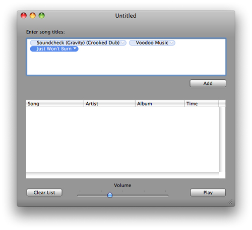
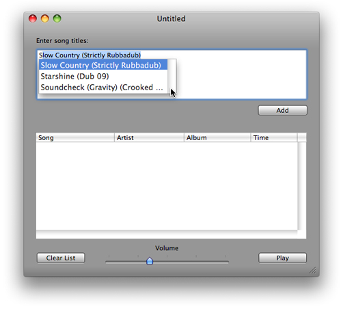
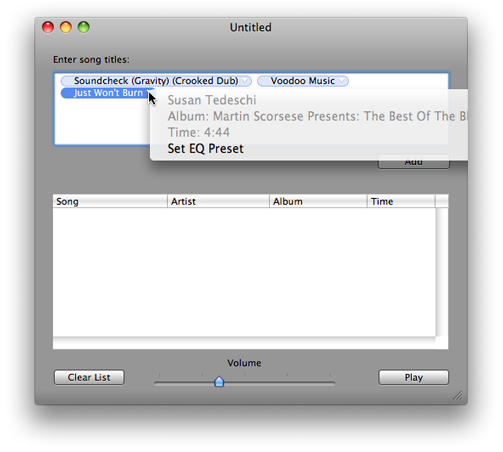

> 导航：[总目录](../../../README.md) · [documentation](../../../_indexes/documentation.md) · [Token Field Programming Guide](Introduction%20to%20Token%20Field%20Programming%20Guide%20for%20Cocoa.md)

[Next](How%20Token%20Fields%20Work.md)[Previous](Introduction%20to%20Token%20Field%20Programming%20Guide%20for%20Cocoa.md)

# About Token Fields

A token field is a text field with tokens as its content. A token represents a string or other object, A token’s distinctive form makes it easy for users to recognize and manipulate it. Sometimes users select the string to be tokenized from a list of possible entries presented to them, such as the list of email addresses in one’s Address Book application. The following sections describe the look and behavior of tokens in token fields and offer guidelines for the proper use of this control.

The basic purpose of a token field is to present entered strings as tokens when the user presses a tokenizing character, such as a comma. The tokens in the field are easier to recognize and manipulate than, say, a comma-separated list of strings. Manipulation of a token includes the ability to cut-and-paste them and to drag them between fields. Through delegation, [NSTokenField](https://developer.apple.com/documentation/appkit/nstokenfield) extends this basic behavior.

Before the user types in a token field, it looks exactly like a text field. The user types some text and then types a character from _tokenizing character set_; default, the tokenizing characters are a comma or the newline character (entered by pressing Return), which also may cause the action message to be sent. (Note that the newline character is always implied and is not actually specified in the character set.) Upon receiving a tokenizing character, the token field converts the entered string into a token (see Figure 1-1 for examples). Usually a token takes the form of a blue rounded rectangle with the string as title. But there is also a plain-text token style and possibly future styles.

__Figure 1-1__  Tokens in a token field

If an application implements the appropriate delegation method, after the entry of the first one or two (or more) characters, the token field displays a _completion list_. When the list appears is determined by a _completion delay_, a period that you can configure. Figure 1-2 shows what a typical completion list looks like.

__Figure 1-2__  A token field’s completion list

As users continue typing, the token field narrows the completion list to the matching strings. Users can either type the entire desired string, or they can use the mouse to select the desired string from the list by clicking it. After selection, users type a tokenizing character to convert the string into a token.

Through delegation, tokens may have _represented objects_ associated with them; for example, a token with a title of “blue” could have an [NSColor](https://developer.apple.com/documentation/appkit/nscolor) object associated with it. Tokens can also have menus attached to them, as illustrated in Figure 1-3. These menus can present additional information about the token and can present items that trigger actions on the object represented by the token.

__Figure 1-3__  A menu attached to a token

For additional guidance on using token fields, see the section on text controls in “UI Element Guidelines: Controls" in _OS X Human Interface Guidelines_.

You use token fields for several reasons. The primary reason is to make what the user enters in the field easy to recognize and convenient to move around, select, and otherwise manipulate.

But you may also want to restrict what users enter in a token field to something from a finite list of possible entries. And you may want to associate underlying represented objects with these string entries. These could be objects representing things such as email addresses, songs from an iTunes playlist, employee records, and so on. To have these features, you must implement the appropriate delegation methods.

To further extend the usefulness of a token, you can give it a menu whose items send messages to the represented object or return it upon request to a target object. When you copy-paste or drag the token between user-interface elements of the same or different applications—assuming you implement the required delegation methods—you are also moving the represented object.

You can also use token fields when all you are interested in is the string value of a token. For example, you might opt for the plain-text token style when you use a token field to enforce the correct spelling of a textual item. Note that there can be only one token per token field that is configured for the plain-text token style.

[Next](How%20Token%20Fields%20Work.md)[Previous](Introduction%20to%20Token%20Field%20Programming%20Guide%20for%20Cocoa.md)

