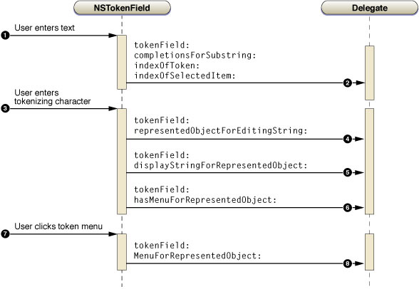

> 导航：[总目录](../../../README.md) · [documentation](../../../_indexes/documentation.md) · [Token Field Programming Guide](Introduction%20to%20Token%20Field%20Programming%20Guide%20for%20Cocoa.md)

[Next](Configuring%20Token%20Fields.md)[Previous](About%20Token%20Fields.md)

# How Token Fields Work

A token field works on the premise of a finite collection of objects as potential content. These objects can be [NSString](https://developer.apple.com/library/archive/documentation/LegacyTechnologies/WebObjects/WebObjects_3.5/Reference/Frameworks/ObjC/Foundation/Classes/NSStringClassCluster/Description.html#//apple_ref/occ/cl/NSString) objects or objects of any other type. Objects that are not strings require a display string.

In a sense a token is a labeled represented object even if that object is simply the string used for the label. A represented object is an object that is arbitrarily associated with a cell or a menu item. A token field—more precisely, the [NSTokenFieldCell](https://developer.apple.com/documentation/appkit/nstokenfieldcell) component of a token field—inherits the feature of represented objects from [NSCell](https://developer.apple.com/documentation/appkit/nscell). But the implementation extends the notion of represented object to make it apply to all tokens in the field.

As an example, consider a token field in which users enter the names of people in their Address Book. The token field is implemented so that each token field has a represented object of type [ABPerson](https://developer.apple.com/documentation/addressbook/abperson) (a class in the Address Book framework).

You are not required to assign a represented object to each token in the token field. In this case, the represented object of a token is the string it displays.

For further information on represented objects, see “[Represented Objects](https://developer.apple.com/library/archive/documentation/Cocoa/Conceptual/ControlCell/Concepts/RepresentedObjects.html#//apple_ref/doc/uid/20000067)" in _[Control and Cell Programming Topics](../Control%20and%20Cell%20Programming%20Topics/Introduction%20to%20Control%20and%20Cell%20Programming%20Topics%20for%20Cocoa.md#apple-f4xwc4dqnrsv64tfmyxwi33df52wszbpgeydambqgaytk2i)_.

When you want to retrieve the contents of a token field, you send it an [objectValue](https://developer.apple.com/documentation/appkit/nscontrol/1428849-objectvalue) message. This message returns an array of the field’s represented objects, whether those objects are strings or something else. Conversely, you can set the contents of a token field by sending it a [setObjectValue:](https://developer.apple.com/documentation/appkit/nscontrol/1428849-objectvalue) message, passing in an array of the represented objects you wish the field to have. If these objects are not strings, the token field queries its delegate for the strings to display for the represented objects.

Because a token field is a direct descendent of [NSTextField](https://developer.apple.com/documentation/appkit/nstextfield), it is a control that sends an action message to its target when the user presses the Return key (or if the insertion point leaves the field, if the action is configured as “Send on End Editing”). Pressing the Return key either tokenizes the most recently entered string or causes the action message to be sent. Your implementation of the action method is an ideal place to ask the token field (`sender`) for its object value.

To acquire the capabilities of completion lists, represented objects, and token menus for token fields, you must implement a number of delegation methods. A token field sends a series of messages to its delegate as illustrated in Figure 2-1.

__Figure 2-1__  Messages to the token field delegate

1. The user enters text in the token field.
2. The delegate receives the [tokenField:completionsForSubstring:indexOfToken:indexOfSelectedItem:](https://developer.apple.com/documentation/appkit/nstokenfielddelegate/1532474-tokenfield) message and returns a list of possible completions for the passed-in substring.

   The delegate continues to receive this message as the user continues typing in the token field; each time it returns a progressively narrowed list of possible completions.
3. The user selects a string from the completion list and types the tokenizing character.

   The user could enter a string that is not in the list of possible completions and that is also tokenized.
4. The delegate receives the [tokenField:representedObjectForEditingString:](https://developer.apple.com/documentation/appkit/nstokenfielddelegate/1527909-tokenfield) message and returns a represented object that corresponds to the passed-in editing string.

   If the delegate doesn’t implement this message or returns `nil`, the entered string is the represented object.
5. If the delegate implements the [tokenField:representedObjectForEditingString:](https://developer.apple.com/documentation/appkit/nstokenfielddelegate/1527909-tokenfield) method to return a represented object for a entered string, it next receives the [tokenField:displayStringForRepresentedObject:](https://developer.apple.com/documentation/appkit/nstokenfielddelegate/1526020-tokenfield) message. The delegate implements this method to return a display string for the given represented object. (This display string may be different from the string entered from the completion list.)
6. The token queries the delegate with [tokenField:hasMenuForRepresentedObject:](https://developer.apple.com/documentation/appkit/nstokenfielddelegate/1533494-tokenfield) to find out if the token has a menu. If there is a menu, it adds a triangular discovery button when it draws the token.
7. The user clicks a token’s menu-discovery button.
8. The delegate receives the [tokenField:menuForRepresentedObject:](https://developer.apple.com/documentation/appkit/nstokenfielddelegate/1528750-tokenfield) message and returns an [NSMenu](https://developer.apple.com/documentation/appkit/nsmenu) object (containing the desired menu items) to the token field, which displays the menu.

There are several other methods that a token field sends to its delegate, including [tokenField:styleForRepresentedObject:](https://developer.apple.com/documentation/appkit/nstokenfielddelegate/1530203-tokenfield), which allows the substitution of plain-text tokens for the encapsulating kind.

[Next](Configuring%20Token%20Fields.md)[Previous](About%20Token%20Fields.md)

