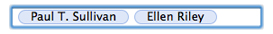

> 导航：[总目录](../../../README.md) · [documentation](../../../_indexes/documentation.md)

[Next](About%20Token%20Fields.md)

# Introduction to Token Field Programming Guide for Cocoa

This document discusses the role of token fields in a user interface, explains how they work, describes how to configure them, and shows how to integrate them into your application.

A token field is a text field with tokens as content. A token represents a string or other object.

- __Construction__: Single-cell control
- __Classes and inheritance__:

  - Control: [NSTokenField](https://developer.apple.com/documentation/appkit/nstokenfield) : [NSTextField](https://developer.apple.com/documentation/appkit/nstextfield) : [NSControl](https://developer.apple.com/documentation/appkit/nscontrol) : [NSView](https://developer.apple.com/documentation/appkit/nsview) : [NSResponder](https://developer.apple.com/documentation/appkit/nsresponder) : [NSObject](https://developer.apple.com/library/archive/documentation/LegacyTechnologies/WebObjects/WebObjects_3.5/Reference/Frameworks/ObjC/Foundation/Classes/NSObject/Description.html#//apple_ref/occ/cl/NSObject)
  - Cell: [NSTokenFieldCell](https://developer.apple.com/documentation/appkit/nstokenfieldcell) : [NSTextFieldCell](https://developer.apple.com/documentation/appkit/nstextfieldcell) : [NSActionCell](https://developer.apple.com/documentation/appkit/nsactioncell) : [NSCell](https://developer.apple.com/documentation/appkit/nscell) : [NSObject](https://developer.apple.com/library/archive/documentation/LegacyTechnologies/WebObjects/WebObjects_3.5/Reference/Frameworks/ObjC/Foundation/Classes/NSObject/Description.html#//apple_ref/occ/cl/NSObject)
- __Design patterns__: Target-action, delegation, key-value observing
- __Object attributes__: Tokenizing character set, completion delay, token style
- __Important methods__: [objectValue](https://developer.apple.com/documentation/appkit/nscontrol/1428849-objectvalue) (NSControl), [tokenField:completionsForSubstring:indexOfToken:indexOfSelectedItem:](https://developer.apple.com/documentation/appkit/nstokenfielddelegate/1532474-tokenfield) (delegate), [tokenField:representedObjectForEditingString:](https://developer.apple.com/documentation/appkit/nstokenfielddelegate/1527909-tokenfield) (delegate), [tokenField:displayStringForRepresentedObject:](https://developer.apple.com/documentation/appkit/nstokenfielddelegate/1526020-tokenfield)d (delegate), [tokenField:menuForRepresentedObject:](https://developer.apple.com/documentation/appkit/nstokenfielddelegate/1528750-tokenfield) (delegate)
- __Important bindings__: value
- __Usage guidelines__: Under “Text Controls” in “UI Element Guidelines: Controls" (_Apple Human Interface Guidelines_)

This document consists of the following chapters:

- [About Token Fields](About%20Token%20Fields.md#apple-f4xwc4dqnrsv64tfmyxwi33df52wszbpkridimbqga3dknjvfvbuqmznknlti) describes what token fields are designed to do in a user interface and offers some guidelines for their usage.
- [How Token Fields Work](How%20Token%20Fields%20Work.md#apple-f4xwc4dqnrsv64tfmyxwi33df52wszbpkridimbqga3dknjvfvbuqnbnknlte) discusses the central concepts and mechanisms of token fields.
- [Configuring Token Fields](Configuring%20Token%20Fields.md#apple-f4xwc4dqnrsv64tfmyxwi33df52wszbpkridimbqga3dknjvfvbuqnjnknltc) explains how to configure token fields and connect them to other objects in an application.
- [Displaying the Completion List](Displaying%20the%20Completion%20List.md#apple-f4xwc4dqnrsv64tfmyxwi33df52wszbpkridimbqga3dknjvfvbuqnznknlte) describes how to display a list of possible completions for the currently entered substring.
- [Returning Represented Objects](Returning%20Represented%20Objects.md#apple-f4xwc4dqnrsv64tfmyxwi33df52wszbpkridimbqga3dknjvfvbuqobnknltg) shows how to return an array of represented objects for the tokens in a token field.
- [Getting and Setting Token-Field Values](Getting%20and%20Setting%20Token-Field%20Values.md#apple-f4xwc4dqnrsv64tfmyxwi33df52wszbpkridimbqga3dknjvfvbuqojnknlte) shows how to extract and set the contents of a token field.
- [Implementing Menus for Tokens](Implementing%20Menus%20for%20Tokens.md#apple-f4xwc4dqnrsv64tfmyxwi33df52wszbpkridimbqga3dknjvfvbuqmjqfvjvomq) discusses how to associate menus with tokens in a token field.

[Next](About%20Token%20Fields.md)

