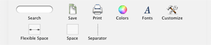

> 导航：[总目录](../../../README.md) · [documentation](../../../_indexes/documentation.md) · [Toolbar Programming Topics for Cocoa](Introduction%20to%20Toolbars.md)


[Next](Creating%20a%20Toolbar%20in%20Interface%20Builder.md)[Previous](Toolbar%20Management%20Checklist.md)

# Adding and Removing Toolbar Items

The delegate of an NSToolbar instance is responsible for providing the identifiers specifying the toolbar items that are allowed in a toolbar, as well as the default items visible in a new toolbar.

The required delegate method `toolbarAllowedItemIdentifiers:` returns an array of identifiers specifying the toolbar items that can be displayed by the specified NSToolbar instance. By default, a new toolbar instance does not assume any items are allowed, not even the separator item.

The example implementation shown in Listing 1 configures the toolbar to allow a selection of the standard Cocoa toolbar items as well as two application specific toolbar items. The resulting toolbar is shown in Figure 1.

__Listing 1__  Example toolbarAllowedItemIdentifiers: method implementation

```objc
- (NSArray *) toolbarAllowedItemIdentifiers: (NSToolbar *) toolbar {
    return [NSArray arrayWithObjects: SaveDocToolbarItemIdentifier,
        NSToolbarPrintItemIdentifier,
        NSToolbarShowColorsItemIdentifier,
        NSToolbarShowFontsItemIdentifier,
        NSToolbarCustomizeToolbarItemIdentifier,
        NSToolbarFlexibleSpaceItemIdentifier,
        NSToolbarSpaceItemIdentifier,
        NSToolbarSeparatorItemIdentifier, nil];
}
```


__Figure 1__  Example toolbar item configuration



The default set of toolbar items is returned by implementing the required method `toolbarDefaultItemIdentifiers:`. The implementation is expected to return an array of identifiers containing the specified toolbar's default items. If during the toolbar's initialization no overriding values are found in the user defaults (by having called `setAutosavesConfiguration:` with `YES` as the argument) these items are used as the default set for the toolbar. In addition, if the user chooses to revert to the default toolbar items the set returned by `toolbarDefaultItemIdentifiers:` will be used.

The example code in Listing 2 causes the default items to be configured as shown in Figure 2.

__Listing 2__  Example toolbarDefaultItemIdentifiers: method implementation

```objc
- (NSArray *) toolbarDefaultItemIdentifiers: (NSToolbar *) toolbar {
    return [NSArray arrayWithObjects: SaveDocToolbarItemIdentifier,
        NSToolbarPrintItemIdentifier,
        NSToolbarSeparatorItemIdentifier,
        NSToolbarShowColorsItemIdentifier,
        NSToolbarShowFontsItemIdentifier,
        NSToolbarFlexibleSpaceItemIdentifier,
        NSToolbarSpaceItemIdentifier,
        SearchDocToolbarItemIdentifier, nil];
}
```


__Figure 2__  Example toolbar items configuration


An implementation of the required method `toolbar:itemForItemIdentifier:willBeInsertedIntoToolbar:` returns an NSToolbarItem instance as specified by the toolbar item identifier. The item may not be immediately added to the toolbar, as this method is also called when the customization sheet is created.

The example code in Listing 3 creates a simple NSToolbarItem instance for the application's custom toolbar item, `SaveDocToolbarItemIdentifier`. This item appears as an icon in the toolbar using the default NSToolbarItem rendering.

__Listing 3__  A `toolbar:itemForItemIdentifier:willBeInsertedIntoToolbar:` method implementation to create a simple NSToolbarItem instance

```objc
- (NSToolbarItem *) toolbar:(NSToolbar *)toolbar
      itemForItemIdentifier:(NSString *)itemIdentifier
  willBeInsertedIntoToolbar:(BOOL)flag
{
    NSToolbarItem *toolbarItem = [[[NSToolbarItem alloc] initWithItemIdentifier: itemIdentifier] autorelease];

    if ([itemIdentifier isEqual: SaveDocToolbarItemIdentifier]) {
    // Set the text label to be displayed in the
    // toolbar and customization palette
    [toolbarItem setLabel:@"Save"];
    [toolbarItem setPaletteLabel:@"Save"];

    // Set up a reasonable tooltip, and image
    // you will likely want to localize many of the item's properties
    [toolbarItem setToolTip:@"Save Your Document"];
    [toolbarItem setImage:[NSImage imageNamed:@"SaveDocumentItemImage"]];

    // Tell the item what message to send when it is clicked
    [toolbarItem setTarget:self];
    [toolbarItem setAction:@selector(saveDocument:)];
    } else  {
    // itemIdentifier referred to a toolbar item that is not
    // provided or supported by us or Cocoa
    // Returning nil will inform the toolbar
    // that this kind of item is not supported
    toolbarItem = nil;
    }
    return toolbarItem;
}
```

Returning a toolbar item that creates a custom view is somewhat more complicated. In addition to specifying the information required for a simple toolbar item, the application must also explicitly set the view that should be used to draw the item, the minimum size that the view requires to display properly, and the maximum size that the custom toolbar item can be resized.

One side effect of using a custom view for a toolbar item that must be considered is the case when the toolbar is being displayed as text-only. The default behavior is to display the item's label as disabled text, effectively disabling the toolbar item entirely. A toolbar item can instead specify an NSMenu instance that will be used when the toolbar is displayed in the text-only mode. This menu is also used when a toolbar item that uses a custom view is displayed in a toolbar's overflow menu.

The example code in Listing 4 implements the search toolbar item as shown in [Figure 1](#apple-f4xwc4dqnrsv64tfmyxwi33df52wszbpgiydambqg42tkljrga2dqnrqgywueqsdireeuqkh).

__Listing 4__  A `toolbar:itemForItemIdentifier:willBeInsertedIntoToolbar`: method implementation to create an view- based NSToolbarItem instance

```objc
- (NSToolbarItem *) toolbar:(NSToolbar *)toolbar
      itemForItemIdentifier:(NSString *)itemIdentifier
  willBeInsertedIntoToolbar:(BOOL)flag
{
    NSToolbarItem *toolbarItem = [[[NSToolbarItem alloc] initWithItemIdentifier:itemIdentifier] autorelease];

    if ([itemIdentifier isEqual: SearchDocToolbarItemIdentifier]) {
    // Set up the standard properties
    [toolbarItem setLabel:@"Search"];
    [toolbarItem setPaletteLabel:@"Search"];
    [toolbarItem setToolTip:@"Search Your Document"];

    // Use a custom view, a rounded text field,
    // attached to searchFieldOutlet in InterfaceBuilder as
    // the custom view
    [toolbarItem setView:searchFieldOutlet];
    [toolbarItem setMinSize:NSMakeSize(100,NSHeight([searchFieldOutlet frame]))];
    [toolbarItem setMaxSize:NSMakeSize(400,NSHeight([searchFieldOutlet frame]))];

    // Create the custom menu
    NSMenu *submenu=[[[NSMenu alloc] init] autorelease];
    NSMenuItem *submenuItem=[[[NSMenuItem alloc] initWithTitle: @"Search Panel"
            action:@selector(searchUsingSearchPanel:)
            keyEquivalent: @""] autorelease];
    NSMenuItem *menuFormRep=[[[NSMenuItem alloc] init] autorelease];

    [submenu addItem: submenuItem];
    [submenuItem setTarget:self];
    [menuFormRep setSubmenu:submenu];
    [menuFormRep setTitle:[toolbarItem label]];
    [toolbarItem setMenuFormRepresentation:menuFormRep];
    } else {
    // itemIdentifier referred to a toolbar item that is not
    // not provided or supported by us or cocoa
    // Returning nil will inform the toolbar
    // this kind of item is not supported
    toolbarItem = nil;
    }
    return toolbarItem;
}
```


While under most circumstances the user will add and remove items from a toolbar using the customization sheet or the context menu, it is possible to insert and remove items programmatically.

The method [insertItemWithItemIdentifier:atIndex:](https://developer.apple.com/documentation/appkit/nstoolbar/1516941-insertitemwithitemidentifier) inserts the item specified by the item identifier at the specified index.

The method [removeItemAtIndex:](https://developer.apple.com/documentation/appkit/nstoolbar/1516980-removeitem) removes the toolbar item at the specified index.

An [NSToolbar](https://developer.apple.com/documentation/appkit/nstoolbar) delegate can optionally be notified when toolbar items have been added or removed from the toolbar.

The optional delegate method [toolbarWillAddItem:](https://developer.apple.com/documentation/appkit/nstoolbardelegate/1516964-toolbarwilladditem) provides notification that a toolbar item is about to be added to the toolbar. The identifier for the toolbar item is contained in the notification's userInfo dictionary under the key `@"item"`. The typical use for this method is to set the target for a standard toolbar item, such as Print, and perhaps to alter other attributes of the item, such as its tool tip.

The example code in Listing 5 sets the target and action for the standard toolbar Print item when the delegate is notified that the item will be added to the toolbar.

__Listing 5__  An implementation of the toolbarWillAddItem: method to configure an NSToolbarItem before it is added to the toolbar

```objc
- (void) toolbarWillAddItem:(NSNotification *)notification {
    NSToolbarItem *addedItem = [[notification userInfo] objectForKey: @"item"];
    if ([[addedItem itemIdentifier] isEqual: NSToolbarPrintItemIdentifier]) {
    [addedItem setToolTip:@"Print Your Document"];
    [addedItem setTarget:self];
    [addedItem setAction:@selector(myCustomPrintAction:)];
    }
}
```

The optional delegate method [toolbarDidRemoveItem:](https://developer.apple.com/documentation/appkit/nstoolbardelegate/1516970-toolbardidremoveitem) provides notification that the toolbar has removed a toolbar item from the toolbar. The identifier for the toolbar item is contained in the notification's userInfo dictionary under the key `@"item"`. You could use this opportunity to inform the window controller that the data associated with this item is no longer valid.

The example in Listing 6 invalidates the application's search string when the search item is removed from the toolbar.

__Listing 6__  An implementation of the `toolbarDidRemoveItem:` method that invalidates a value when a toolbar item is removed from the toolbar.

```objc
- (void)toolbarDidRemoveItem:(NSNotification *)notification {
    NSToolbarItem *removedItem = [[notification userInfo] objectForKey: @"item"];
    if ([removedItem itemIdentifier] isEqual:SearchDocToolbarItemIdentifier) {
    [self invalidateSearchString];
    }
}
```

Objects other than the toolbar's delegate can track the adding and removing toolbar items by registering for [NSToolbarWillAddItemNotification](https://developer.apple.com/documentation/appkit/nstoolbar/1516933-willadditemnotification) and [NSToolbarDidRemoveItemNotification](https://developer.apple.com/documentation/appkit/nstoolbar/1517001-didremoveitemnotification) notifications explicitly.

[Next](Creating%20a%20Toolbar%20in%20Interface%20Builder.md)[Previous](Toolbar%20Management%20Checklist.md)

