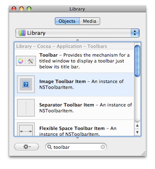
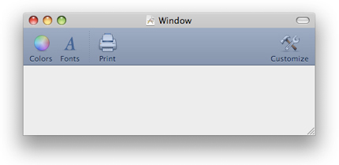
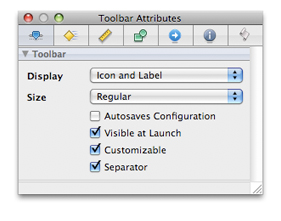
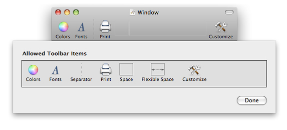
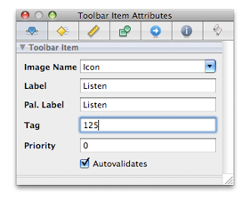
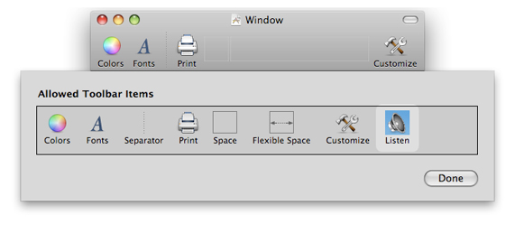

> 导航：[总目录](../../../README.md) · [documentation](../../../_indexes/documentation.md) · [Toolbar Programming Topics for Cocoa](Introduction%20to%20Toolbars.md)

[Next](Setting%20a%20Toolbar%20Item%E2%80%99s%20Representation.md)[Previous](Adding%20and%20Removing%20Toolbar%20Items.md)

# Creating a Toolbar in Interface Builder

Beginning with OS X v10.5 (Leopard), you can create a toolbar in Interface Builder. You can do almost anything with toolbars in Interface Builder that you can do programmatically. At runtime, you may combine toolbars and toolbar items that are unarchived from a nib file and those that are programmatically created.

Open your application’s nib file and search the Interface Builder library for “toolbar”. A toolbar object and a number of toolbar items are listed in the library.

Drag the toolbar object onto a window. Interface Builder automatically positions it below the window bar and above the window’s content view. It displays the "default” default set of toolbar items.

Select the toolbar (if it isn’t already selected) and display the Attributes pane for the toolbar in the inspector (Command-1). Set the desired attributes of the toolbar; make sure Customizable is selected if you want users to add items from the allowed set.

Note that the Attributes pane for toolbars does not include a field for the toolbar identifier. Remember that the purpose of the identifier is to differentiate toolbars assigned to different kind of windows, for example, between the toolbars for document windows and the toolbar for a utility window. Because you would store these different toolbars in different nib files, there is little need for toolbar identifiers.

Next you add and possibly remove toolbar items to both the allowed set of items and the default set. A toolbar item can be one of the standard ones (for example, Colors) or can be a custom toolbar item. Start by clicking the toolbar if it is already selected or double-clicking it if it is not selected. This displays a view containing the allowed toolbar items.

To add a toolbar item, drag it from the library onto the row of allowed toolbar items. If you want the same item to be in the default set, drag it from the allowed toolbar items onto the toolbar. Position it where you want it to appear. To remove an item, drag it away from the window and release the mouse button; this applies to toolbar items in both the default set and the allowed set.

Custom toolbars are of two sorts: custom image and custom view. To add a custom image toolbar item, drag the Image toolbar item from the library and drop it on the row of allowed items. Complete the following steps to configure the custom toolbar item:

1. Add the image you want to use for the toolbar item to the project (Project > Add to Project).
2. Select the custom toolbar item and display the attributes for it (Command-1).
3. Enter the name of the image file (minus extension) in the Image Name field.
4. Enter labels and a tag number for the toolbar item and select the Autovalidates option.

   You can use a toolbar item’s tag as a way to access it programmatically from its toolbar.

For the Priority option, see the description of the [setVisibilityPriority:](https://developer.apple.com/documentation/appkit/nstoolbaritem/1527947-visibilitypriority) method.

You custom toolbar item will look similar to the one in this example.

If you want this toolbar item in the default set, drag it to the toolbar.

The procedure for adding a custom view item is very similar to that for a custom image item. (“Custom” in this context means any object from the Interface Builder library as well as instances of a custom `NSView` subclass.) Just drag any view object from the library onto the Allowed Toolbar Items area. Click the item once and press Command-1 to display the Attributes pane for the object as a toolbar item; click again to edit the attributes of the item as itself. You should modify the size of the custom view item in the Size pane of the inspector, not directly. If you drag a Custom View object into the allowed-items set, click it twice and set the name of the custom `NSView` class in the Identity pane of the inspector (Command-6).

After you complete the default and allowed sets of toolbar items, make sure the appropriate ones are set up to invoke a target method in a target object. For example, for a custom toolbar item you would complete the following steps:

1. Declare an action method (return type `IBAction`) in the header file of the class whose instance is the target.
2. Select the object representing this class in the Interface Builder document window (it’s often File’s Owner).
3. Right-click (or Control-click) to display the connections window; locate the action method under Received Actions.
4. Drag a connection line from the circle after the action name to the toolbar item in the allowed set.
5. Implement the action method.

Finally, make a connection between the `delegate` property of the toolbar and the object (if any) that responds to the delegation messages sent by the toolbar.

[Next](Setting%20a%20Toolbar%20Item%E2%80%99s%20Representation.md)[Previous](Adding%20and%20Removing%20Toolbar%20Items.md)

