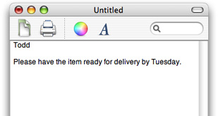

> 导航：[总目录](../../../README.md) · [documentation](../../../_indexes/documentation.md) · [Toolbar Programming Topics for Cocoa](Introduction%20to%20Toolbars.md)

[Next](Toolbar%20Management%20Checklist.md)[Previous](Introduction%20to%20Toolbars.md)

# How Toolbars Work

[NSToolbar](https://developer.apple.com/documentation/appkit/nstoolbar) and [NSToolbarItem](https://developer.apple.com/documentation/appkit/nstoolbaritem) classes provide you with a standard way to display a toolbar for a titled window below its title bar. These classes also provide users with a standard way to customize toolbars and save those customizations. This is what a toolbar looks like:

__Figure 1__  Example toolbar

To create a toolbar, you must create a delegate that provides important information:

- A list of default toolbar identifiers. This list is used when reverting to default, and constructing the initial toolbar.

  The default set of toolbar items can also be specified using toolbar items found in the Interface Builder library.
- A list of allowed item identifiers. The allowed item list is used to construct the customization palette, if the toolbar is customizable.
- The toolbar item for a given item identifier.

When you create an NSToolbar, you give it an identifier. NSToolbar assumes all toolbars with the same identifier are the same, and automatically synchronizes changes. For instance, take a mail application. Your application’s compose windows’ toolbars would have the same identifier string. So, when you re-order items in one toolbar, the changes automatically propagate to any other compose windows currently open.

Most toolbars will contain simple clickable items that act like buttons. The simplest toolbar item is defined by its icon, label, palette label (used in the customize sheet), target, action, and tooltip. Most toolbars can be represented using these simple items. If you need something more complex in your toolbar, call `setView:` on a toolbar item to provide a custom view. For example, you could create a toolbar item that contains a pop-up menu or a text field and button.

There are a couple of standard toolbar item identifiers that NSToolbar knows about. `NSToolbarSeparatorItemIdentifier` is the standard vertical line separator. `NSToolbarSpaceItemIdentifier` is a fixed width space. `NSToolbarFlexibleSpaceItemIdentifier` is a variable width space. Additionally, there are `NSToolbarShowColorsItemIdentifier`, `NSToolbarShowFontsItemIdentifier`, `NSToolbarPrintItemIdentifier`, and `NSToolbarCustomizeToolbarItemIdentifier`. These items are accessible only by identifier.

If you need to change the action sent by a standard item, write a `toolbarWillAddItem:` notification method.

When a user customizes the toolbar of an application’s window, that customization is saved as a user preference. The customized toolbar is used thereafter when the application launches in place of the default set of toolbar items specified by the developer.

There are kinds of toolbars, and there are individual toolbar objects. A kind of toolbar is represented by string called the toolbar identifier. When you create an NSToolbar you supply a toolbar identifier so your toolbar delegate will know that the new instance is to be of that kind. For example, consider a Mail application that has two kinds of windows, Message and Mailbox. Each needs its own kind of toolbar: one appropriate for viewing a message and one appropriate for listing the messages in a mailbox. To implement this user interface, the application has two toolbar identifiers, `"Message"`, and `"Mailbox"`. Each message window has its own distinct toolbar object, but all message window toolbar objects have the same identifier: `"Message"`. When you modify the toolbar in a window (either through the user interface or programmatically) you change the toolbar configuration of that _kind_ of toolbar, not just of that instance. So, when you customize the toolbar in one message window, the new configuration automatically propagates to the toolbars in all other message windows currently open. If the toolbar is hidden in any message window, it will stay hidden, but when it is shown again, it looks like the others of its kind.

The toolbar’s identifier is fixed at object creation, but you can change other attributes of it with `setAllowsUserCustomization:`, `setAutosavesConfiguration:`, and `setDisplayMode:`.

Each item in an NSToolbar is an instance of NSToolbarItem. The visible parts of a toolbar item are its content, its text label, and its menu form representation.

The toolbar item’s content is either an NSImage or an NSView. An item whose content is an NSImage is called an image item. An item whose content is an NSView is called a view item. The search field shown in Figure 1 is a view item, the others are image items.

Print is a standard item provided by NSToolbar. The other items are custom items, supplied by this application. Blue text is a custom image item. Font Style and Font Size are custom view items.

The menu representation is used at two different times: when the toolbar is displayed using labels only and when the window is too small to show the complete toolbar and some items are displayed in an overflow menu.

NSWindow has a number of methods to support NSToolbar: The methods `toolbar` and `setToolbar:` are for attaching a toolbar to the window; the `toggleToolbarShown:` method is the action for the Hide Toolbar / Show Toolbar menu item; `runToolbarCustomizationPalette:` is the action method for the Customize Toolbar menu item.

Interface Builder predefines an application’s View menu with Show Toolbar and Customize Toolbar menu items and connects these items to [toggleToolbarShown:](https://developer.apple.com/documentation/appkit/nswindow/1419554-toggletoolbarshown) and [runToolbarCustomizationPalette:](https://developer.apple.com/documentation/appkit/nswindow/1419284-runtoolbarcustomizationpalette) through the First Responder. NSWindow validates both toolbar menu items and toggles the title of the former menu item between “Show Toolbar” and “Hide Toolbar” to correspond with the actual state of the toolbar.

[Next](Toolbar%20Management%20Checklist.md)[Previous](Introduction%20to%20Toolbars.md)

