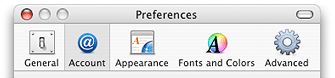

> 导航：[总目录](../../../README.md) · [documentation](../../../_indexes/documentation.md) · [Toolbar Programming Topics for Cocoa](Introduction%20to%20Toolbars.md)


[Next](Subclassing%20NSToolbarItem.md)[Previous](Setting%20a%20Toolbar%20Item%E2%80%99s%20Size.md)

# Selectable Toolbar Items

[NSToolbar](https://developer.apple.com/documentation/appkit/nstoolbar) allows you to specify that certain items in the toolbar can indicate a selected state. This is often used in conjunction with an [NSTabView](https://developer.apple.com/documentation/appkit/nstabview) that is configured to have no visible tabs. Figure 1 contains an example implementation similar to that of Safari and the Finder.

__Figure 1__  Selectable NSToolbar items used as preferences navigation



Toolbars that need to indicate item selection must specify the items that can be selected by implementing the delegate method [toolbarSelectableItemIdentifiers:](https://developer.apple.com/documentation/appkit/nstoolbardelegate/1516981-toolbarselectableitemidentifiers). This method returns an array containing the identifiers of the items that can be selected. The example Listing 1in returns all the identifiers for the preferences implementation.

__Listing 1__  Example implementation of toolbarSelectableItemIdentifiers:

```objc
- (NSArray *)toolbarSelectableItemIdentifiers: (NSToolbar *)toolbar;
{
    // Optional delegate method: Returns the identifiers of the subset of
    // toolbar items that are selectable. In our case, all of them
    return [NSArray arrayWithObjects:GeneralPreferences,
                                    AccountPreferences,
                                    AppearancePreferences,
                                    FontsAndColorsPreferences,
                                    AdvancedPreferences, nil];
}
```

Your application can specify the currently selected toolbar item using the method `setSelectedItemIdentifier:` passing the identifier for the desired toolbar item. The currently selected toolbar item is returned by the method [selectedItemIdentifier](https://developer.apple.com/documentation/appkit/nstoolbar/1516999-selecteditemidentifier). If there is no currently selected, `nil` is returned.

[Next](Subclassing%20NSToolbarItem.md)[Previous](Setting%20a%20Toolbar%20Item%E2%80%99s%20Size.md)

