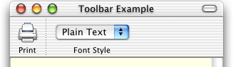
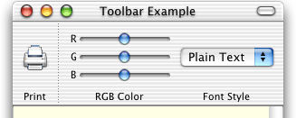

> 导航：[总目录](../../../README.md) · [documentation](../../../_indexes/documentation.md) · [Toolbar Programming Topics for Cocoa](Introduction%20to%20Toolbars.md)

[Next](Selectable%20Toolbar%20Items.md)[Previous](Validating%20Toolbar%20Items.md)

# Setting a Toolbar Item’s Size

When we speak of toolbar item size or toolbar height in this section, we’re referring to the image area or view area when the toolbar is displaying in Icon & Text or Icon Only Mode.

The displayed resolution of an image item is dependent on the sizeMode of the toolbar. You should provide image representations specific to the default, regular and small size modes in a single image that supports multiple image representations such as icns or tiff. The appropriate image representation is automatically displayed for the toolbar's current sizeMode. If an appropriate representation is not available, the toolbar scales the a representation to the appropriate size for the current mode, at a cost in performance and appearance. Images that are not square are scaled to fit. An image item’s image is also scaled down and used in the image item’s overflow menu item. For more information, see the section on toolbar icons in “Icons” in _Aqua Human Interface Guidelines_.

The `minSize` and `maxSize` toolbar item properties are for use only by view items. They must not be left unset (or the view will not display), and unless you are implementing intelligent stretching behavior in a view item, both the `minSize` and `maxSize` properties should equal the size of the item’s `view`. The toolbar takes care of providing space between toolbar items, so a view should be just big enough to enclose the frames of its content objects. It’s OK for a view item’s `minSize` height to be less than the usual 32 pixels (to work optimally with possible future toolbar enhancements).

The height of the toolbar is the height of the greatest `minSize` height of any item visible in the toolbar at the time. If a view item’s `maxSize` height is less than the height of the toolbar, then the toolbar centers the item’s view within the available vertical space. If a view item’s `view` does something intelligent when it is stretched, then you will set its `maxSize` greater than its `minSize` in height, width, or both. Horizontally-stretchable view items, including the Flexible Space standard item, compete equally for available horizontal space. An example of a view item that stretches horizontally is the “Search Mailbox” item in the Apple Mail application.

An example of a view item that stretches vertically is the Separator standard toolbar item. When we insert a tall RGB Color custom item into the toolbar, the Separator item adds more dots to itself, but the image item and the non-stretchable view item don’t change (the toolbar merely centers them vertically):

__Figure 1__  Vertically stretched toolbar item

[Next](Selectable%20Toolbar%20Items.md)[Previous](Validating%20Toolbar%20Items.md)

