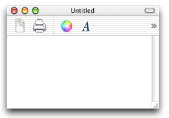

> 导航：[总目录](../../../README.md) · [documentation](../../../_indexes/documentation.md) · [Toolbar Programming Topics for Cocoa](Introduction%20to%20Toolbars.md)


[Next](Document%20Revision%20History.md)[Previous](Subclassing%20NSToolbarItem.md)

# Techniques for Toolbar Management

You can determine the height of a toolbar and whether it has overflow items by following the procedures described below.

If a toolbar is unable to display all the user's currently configured toolbar items, it pushes the additional items into the overflow menu and displays the overflow menu icon as shown in Figure 1.

__Figure 1__  A toolbar indicating items in the overflow menu



An application can determine if a toolbar has overflow items by comparing the number of items returned by the method `items` with the number of items returned by the `visibleItems` method as shown in Listing 1. If these values differ, then the toolbar has items in the overflow menu.

__Listing 1__  Example code to test if a toolbar has overflow items

```
int numberOfItems=[[theToolbar items] count];
int numberOfVisibleItems=[[theToolbar visibleItems] count];

if (numberOfItems != numberOfVisibleItems) {
    // toolbar has overflow items
}
```


Although NSToolbar does not currently provide a method for returning a toolbar’s height, it is easy to compute that value. You subtract the height of the window’s content view from the window’s height.

The Objective-C function in Listing 2 calculates the height of the toolbar in a window, returning 0 if the toolbar is hidden.

__Listing 2__  Objective-C function to calculate toolbar height

```
float ToolbarHeightForWindow(NSWindow *window)
{
    NSToolbar *toolbar;
    float toolbarHeight = 0.0;
    NSRect windowFrame;

    toolbar = [window toolbar];

    if(toolbar && [toolbar isVisible])
    {
        windowFrame = [NSWindow contentRectForFrameRect:[window frame]
                                styleMask:[window styleMask]];
        toolbarHeight = NSHeight(windowFrame)
                        - NSHeight([[window contentView] frame]);
    }

    return toolbarHeight;
}
```

[Next](Document%20Revision%20History.md)[Previous](Subclassing%20NSToolbarItem.md)

