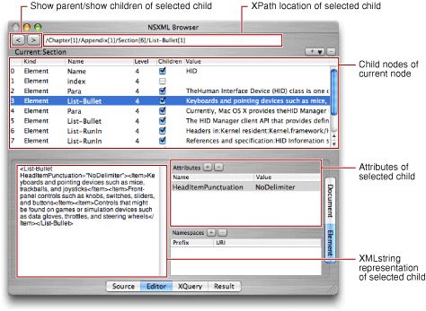
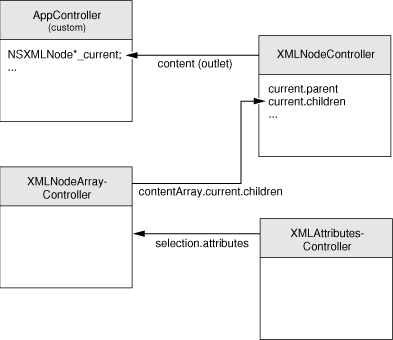
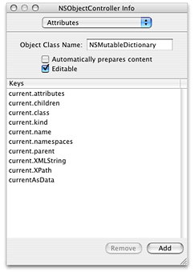
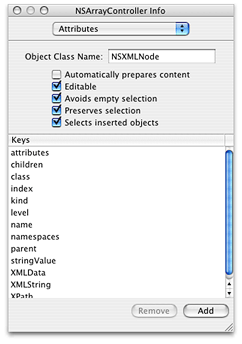
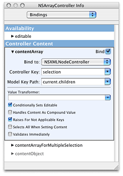
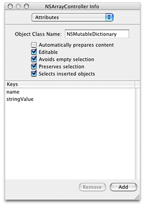
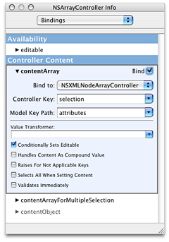
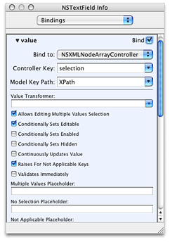

> 导航：[总目录](../../../README.md) · [documentation](../../../_indexes/documentation.md) · [Tree-Based XML Programming Guide](Introduction%20to%20Tree-Based%20XML%20Programming%20Guide%20for%20Cocoa.md)

[Next](Using%20Tree%20Controllers%20With%20NSXML%20Objects.md)[Previous](Creating%20and%20Modifying%20Document%20Type%20Definitions.md)

# Binding NSXML Objects to a User Interface

Instances of all NSXML classes are model objects that conform to the key-value coding protocol and that notify observers conforming to the key-value observing protocol of any change in their attributes. Consequently, you can establish bindings between NSXML objects and objects on a user interface using the Cocoa bindings technology. With bindings, a change in an attribute value of a NSXML object is propagated automatically to a user-interface property (such as the string value of a text field), and vice versa. Instead of a custom controller containing reams of “glue code” for mediating between the model and view objects of your application, you can, in Interface Builder, bind model attributes to user-interface properties via ready-made controllers.

This article explores how you can effectively establish bindings between NSXML objects and a user interface by looking at the _[XMLBrowser](../../../samplecode/XMLBrowser/XMLBrowser.md#apple-f4xwc4dqnrsv64tfmyxwi33df52wszbpirkfgnbqgaydqobxgu)_ sample project. It is not a tutorial on bindings; instead, it is a case study of how you can factor in the hierarchical data model of NSXML when designing the bindings connecting the objects of your application.

To simplify matters, let’s look at just one part of the user interface for the XMLBrowser application. Figure 1 shows the pane made visible when the Editor tab is clicked; it also shows the Elements sub pane of that pane.

__Figure 1__  The Editor pane of the XMLBrowser application (Element sub pane)

The current node, whose name is shown just above the largest table view, is the ultimate reference point for everything else on the window. At first, the current node is the NSXMLDocument object representing the entire document. Any children of the current node are displayed in the large table view; initially, this is the root element. When you select a child node in the table view, the text field at the top of the window displays its XPath-notated location in the tree and the text view in the lower-left quadrant of the window displays its XML string representation. If the selected child is an element node with attributes or namespaces, the application displays them in the Attributes and Namespaces table views.

When you click the “>” button while a child node is selected, the selected node becomes the current node and the rest of the window is updated to reflect this. The children of the new current node are displayed in the large table view, with the first child automatically selected. The XPath text field and the XML-string text view change contents accordingly, and any attributes or namespaces of the new child appear in their respective table views. To go back up the hierarchy, thereby resetting the current node to its parent, you click the “<“ button.

The object model for the bindings used in the window shown in [Figure 1](#apple-f4xwc4dqnrsv64tfmyxwi33df52wszbpkridimbqgaytenrrfu4tombqgmwueqsdirfeercg)) is fairly simple:

- There is an NSXMLNode object designated the “current” node. When the application resets the instance variable holding this object, it uses the NSXMLNode methods `parent` and `childAtIndex:` to navigate the tree hierarchy (where the index is supplied by the master table view’s current selection).
- There is a to-many relationship between the current node and its children (accessed via its `children` property).
- In the array holding the children of the current node, one of the children is selected (the NSArrayController `selection` property).
- There is a to-many relationship between the selected child node and its attributes and namespaces.

The configuration of the NSXML objects and the controller objects in the application reflect this object model. Four off-the-shelf controller objects are added to the nib file of NSXMLBrowser for this window:

- A NSObjectController instance for managing bindings with the current node (named “XMLNodeController”)
- A NSArrayController instance for managing bindings with the children of the current node (named “XMLNodeArrayController”)
- Two NSArrayController instances for managing bindings with, respectively, the attributes and the namespaces of any selected child element (named “XMLAttributesController” and “XMLNamespacesController”)

Figure 2 depicts the connections among these controller instances and the custom application controller, which is named AppController. (The XMLNamespacesController is omitted because its configuration is nearly identical to that of XMLAttributesController.)

__Figure 2__  How the controller objects are configured

Specifically, configuration of the bindings between the controllers and the NSXML model objects consist of the following steps:

1. Connect the content outlet of the XMLNodeController instance to the application controller (AppController).
2. Set the keys of the XMLNodeController as shown:

   

   The first part of each key path identifies the `current` attribute of the AppController and the second part identifies an attribute of the current NSXMLNode object.
3. Set the keys of the XMLNodeArrayController to be the attributes of the NSXMLNode class:

   

   Note that the object class in this case is specified as NSXMLNode.
4. Establish a binding between the `contentArray` property of the XMLNodeArrayController and the `current.children` attribute accessed by the XMLNodeController through its `selection` key.

   
5. In the Attributes pane for XMLAttributesController, set the `name` and `stringValue` keys for the XML attributes.

   
6. In the Bindings pane for XMLAttributesController, establish a binding between the `contentArray` property of the controller and the `attributes` attribute accessed by the XMLNodeArrayController through its `selection` key.

   
7. Repeat the last two steps for the XMLNamespacesController, substituting `namespaces` for `attributes` for the model key path.

Once you have established the associations between the model NSXMLNode objects and the controllers of the XMLBrowser application, you can establish bindings between objects on the user interface and their controllers, consequently extending the bindings to the associated model objects. To do this, select a user interface object and find the required binding property in the Bindings pane of the Info window. For user-interface objects showing single values, such as text fields and table columns, this property is usually named `value` or `data`. For objects showing arrays of data, such as table views, the properties are named (in this case) `contentArray` and `selectionIndexes`. For user-interface objects, the binding keys appear in the “Value” category of the bindings while for controllers their data appears in the “Controller Content” category.

Expand the view for the content-related binding property of the user-interface object. Then specify the controller to establish a binding to, the key of the controller to use for the binding, and the key path to the model attribute. For example, the bindings for the XPath field in the Editor pane of XMLBrowser appear as in Figure 3.

__Figure 3__  Bindings for the text field displaying the selected child’s XPath location

Table 1 lists the bindings for most user-interface objects in this part of the XMLBrowser application.

__Table 1__  User-interface bindings in Editor pane (Element sub pane)

| UI object | Binding | Controller | Controller Key | Model Key Path |
| XPath text field | value | XMLNodeArrayController | selection | XPath |
| Current node (“Current:”) | value | XMLNodeController | selection | current.name |
| Child nodes table view | content | XMLNodeArrayController | arrangedObjects |  |
| Child nodes table view | selectionIndexes | XMLNodeArrayController | selectionIndexs |  |
| Index column | value | XMLNodeArrayController | arrangedObjects | index |
| Kind column | value | XMLNodeArrayController | arrangedObjects (see note) | kind |
| Name column | value | XMLNodeArrayController | arrangedObjects | name |
| Level column | value | XMLNodeArrayController | arrangedObjects | level |
| Children column | value | XMLNodeArrayController | arrangedObjects (see note) | children |
| Value column | value | XMLNodeArrayController | arrangedObjects | stringValue |
| XML text view | data | XMLNodeArrayController | selection | XMLData |
| Attributes table view | content | XMLAttributesController |  |  |
| Attributes table view | selectionIndexes | NSXMLAttributesController |  |  |
| Attribute name column | value | NSXMLAttributesController | arrangedObjects | name |
| Attribute name value | value | XMLAttributesController | arrangedObjects | stringValue |

The “content” binding on table views is optional and is created automatically when you bind a table column.

[Next](Using%20Tree%20Controllers%20With%20NSXML%20Objects.md)[Previous](Creating%20and%20Modifying%20Document%20Type%20Definitions.md)

