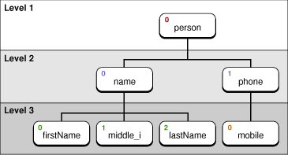
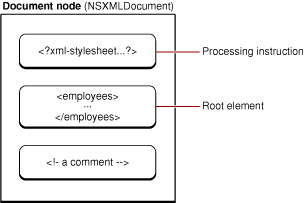
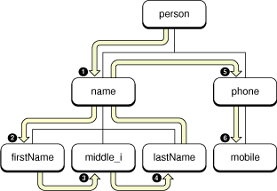

> 导航：[总目录](../../../README.md) · [documentation](../../../_indexes/documentation.md) · [Tree-Based XML Programming Guide](Introduction%20to%20Tree-Based%20XML%20Programming%20Guide%20for%20Cocoa.md)


[Next](Creating%20an%20XML%20Document%20Object.md)[Previous](NSXML%20and%20XML%20Processing.md)

# The Data Model of NSXML

An XML document is similar to an outline. Items in the outline are in a certain sequence and have certain hierarchical relationships with surrounding items. Similarly, order and hierarchy are the structural determinants of an XML document. Because of the hierarchical nature of XML markup, a tree structure is a natural abstraction for representing it. Yet even with the static tree representation, there is an order among the nodes in the tree that corresponds to their order in the markup text.

NSXML represents an XML document as an ordered, labeled tree in which each node has a unique identity and may have a value, attributes, and namespaces associated with it. Conceptually, NSXML is based on an enhanced data model of XQuery 1.0/XPath 2.0, which themselves have affinities with the DOM Core standard. As does XQuery, NSXML operates on the abstract, logical structure of an XML document—the data model—rather than its surface syntax. In XQuery, each input or output to or from a query is an instance of the data model. This model consists of two general kinds of items: nodes and atomic values.

The NSXML data model represents an XML document as a tree of nodes. The tree can have various kinds of nodes, each of which corresponds to a type of XML construct:

- Element
- Attribute
- Text
- Comment
- Processing instruction
- Namespace

An XML tree also has the notion of a document, an entity that represents the entire tree.

NSXML objects have an attribute that specifies their kind. A node’s kind is permanently set at its creation; it cannot be changed into another kind of node.

One thing you might notice about the above list is that it does not contain all possible kinds of XML-markup constructs. The most notable omissions are CDATA sections and character and entity references. When NSXML processes an existing document, it resolves any character or entity references into standard text nodes—unless the appropriate fidelity options are set. Even when CDATA and character and entity references are preserved, NSXML treats them as no more than special-cased text nodes.

Each node in a tree has a unique identity. Most nodes have a name—document, comment, and text nodes do not—and many nodes have some string or other type of value associated with them. Thus a comment node, which doesn’t have a name, almost always has a value. If there is another comment node in the tree with the same value, it is considered to be different because it occurs in a different part of the tree. Even if two nodes are of the same kind and have the same name and content, NSXML treats them as distinct nodes because they have different locations within the tree.

NSXML uses two node attributes to determine node location: index and level. The index is a zero-based number indicating a node’s relative position to its sibling nodes (all children of the same parent node). The level is a number indicating a node’s nesting level in the document hierarchy; the root-element node always has a level of 1 (and is the only node with this level number).

To see how these numbering schemes might play out, consider this simple XML document:

```
<person>
   <name>
      <firstName>John</firstName>
      <middle_i>J</middle_i>
      <lastName>Doe</lastName>
   </name>
   <phone>
      <mobile>(408) 362-4593</mobile>
   </phone>
</person>
```

After processing this document, NSXML represents it as a tree structure. Figure 1 shows the index and level of each node in this small tree (ignoring text nodes).

__Figure 1__  Node level and index



NSXML changes a node’s level and index as the node changes location in a tree. For example, you could detach a node from one parent and attach it to another, and its level and index would change.

An NSXML tree representation of an XML document has one, and only one, document node. The document node is always first in any tree representation, and it is more than the first node in the tree. The document node encompasses the entire document. It represents the document itself.

The document node contains only one element, but that element is the root element, the element at the top of the tree. The root element is the only element in the document that has no parent element. All other elements “descend” from it. If you intend to process an internalized XML document by walking the tree, you would start from the root element.

However, a document node can contain nodes other than the root element. It can have child nodes representing processing instructions and comments (see Figure 2). A document node can also have document metadata associated with it, such as a URI or MIME type, a DTD, or the encoding or version specified in the XML declaration for the document. NSXML also allows you to specify the kind of output for a document, that is, whether a document writes out XML, XHTML, or HTML markup, or just plain text.

__Figure 2__  The document node



Element nodes are the most important nodes in a tree. Elements are the main structural ingredient for the information expressed by an XML document. Except for document nodes (see [The Document Node](#apple-f4xwc4dqnrsv64tfmyxwi33df52wszbpkridimbqgaytenjufuytgnbrgezq)) and DTD nodes, only element nodes can have children. The kinds of nodes that may be children of an element node are text nodes, processing-instruction nodes, comment nodes, and other element nodes. Text nodes are a nameless, generic type of node that carry the text between the start and end tags of an element. For example, consider the following element:

```
<title>War and Peace</title>
```

The `title` element in this case has a single child, a text node with the content (string value) of “War and Peace.” If an element has mixed content—that is, text intermixed with elements—each span of text is considered a child as is each element.

Take as an example the following XML:

```
<para>The Novel <title>War and Peace</title> is huge.</para>
```

The first child is a text node with value @"The novel", the second is a <title> element (with a single child), and the third is a text node with value @" is huge."

Normalization coalesces adjacent text nodes. It would have no effect on the example above, but if you were to construct an element programmatically with adjacent text nodes, normalization would combine them into one.

Document order is, simply put, the order of XML mark-up constructs as they appear in a document. When you send the NSXMLNode messages `nextNode` (or `previousNode`) to each successive node object encountered in an NSXML tree, you are traversing the tree forward (or backward) in document order.

With a programmatic view of a tree, the order of traversal is determined by a “child first, sibling next” (or “depth first”) logic. In other words, NSXML progresses through a tree by descending to the first child of the current parent (if any). If that node has its own children, the next node visited is the first child of that parent. Once NSXML reaches a leaf node (a node with no children), it proceeds to any sibling node—that is, a node with the same parent. If there are no (or no more) sibling nodes, NSXML returns one level and goes to the next child node of the previous parent (if any). Traversal of nodes continues in this way until the final leaf node the tree (or section of the tree) has been visited. Figure 3 depicts this traversal in document order.

__Figure 3__  Document order



The memory management of node objects in NSXML is similar to that performed by collection objects. A parent node manages the retained state of its “contained” objects—that is, its children. This management can be summarized as follows:

- When you add or insert a node, the parent retains it.
- When you remove a node, the parent releases it.
- When you detach a node, the node is retained and then autoreleased.

When NSXML parses a source of XML and builds a tree, the nodes in the tree are retained by their parents. Each of these nodes has a retain count of one.

The implications of this behavior for object ownership are clear. If you want to hold onto a node object that is removed or detached from a tree, you must ensure that it has the proper retain count. For the complete details of object ownership policy and management of object life spans, see _[Advanced Memory Management Programming Guide](../Advanced%20Memory%20Management%20Programming%20Guide/About%20Memory%20Management.md#apple-f4xwc4dqnrsv64tfmyxwi33df52wszbpgeydambqgaytc2i)_.

For memory-management and performance purposes, you should retain node objects rather than copy them. Nodes only need to be copied if they are part of a tree (that is, they have a parent) and you want to clone the node to a new location in the current tree or in a different tree.

In addition to nodes, the XQuery data model also allows atomic values.Atomic values are values having simple types as defined in the XML Schema standard: string, decimal, integer, float, double, Boolean, date, URI, array, and binary data. In NSXML, Foundation objects that are equivalent to these atomic values—for example, NSString, NSNumber, and NSCalendarDate objects—form the content, or object value, of nodes.

Atomic values can also be part of the input and output of XQuery queries. XQuery treats every value in a query as part of a sequence. A sequence is a collection of items, each of which can be a node or an atomic value. If a query in XQuery returns only one item, it will be returned in a sequence (or array) of one. The notion of sequences is why the XQuery and XPath methods of NSXMLNode—`objectsForXQuery:error:` and `nodesForXPath:error:`—return an NSArray object.

[Next](Creating%20an%20XML%20Document%20Object.md)[Previous](NSXML%20and%20XML%20Processing.md)

