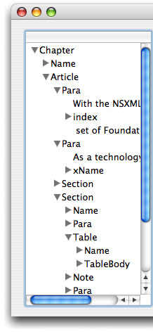
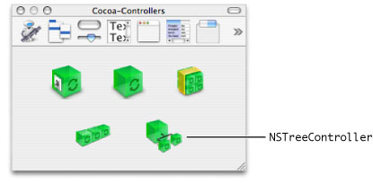
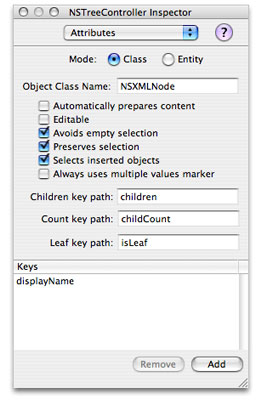
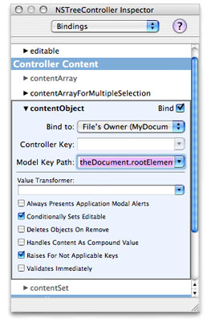
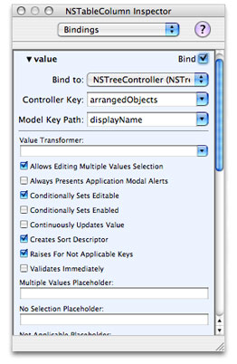

> 导航：[总目录](../../../README.md) · [documentation](../../../_indexes/documentation.md) · [Tree-Based XML Programming Guide](Introduction%20to%20Tree-Based%20XML%20Programming%20Guide%20for%20Cocoa.md)


[Next](XML%20Glossary.md)[Previous](Binding%20NSXML%20Objects%20to%20a%20User%20Interface.md)

# Using Tree Controllers With NSXML Objects

An [NSXMLDocument](https://developer.apple.com/documentation/foundation/xmldocument) object represents a hierarchical tree structure composed of [NSXMLNode](https://developer.apple.com/documentation/foundation/nsxmlnode) objects. In the Model-View-Controller design pattern, an `NSXMLDocument` is a model object because it represents application data in XML format. It makes sense then that an `NSXMLDocument` object would be ideally matched with a view object and a controller object that are designed to handle data arranged in tree structures. For this purpose, Cocoa provides the [NSTreeController](https://developer.apple.com/documentation/appkit/nstreecontroller) class for the controller layer; for hierarchy-displaying views, there are the [NSOutlineView](https://developer.apple.com/documentation/appkit/nsoutlineview) and [NSBrowser](https://developer.apple.com/documentation/appkit/nsbrowser) classes.

The following sections walk you through the steps for using an `NSTreeController` object paired with an `NSOutlineView` object in an NSXML application. For communication of data between view, controller, and model objects, the example uses bindings, and does not rely on any data-source, delegation, or action methods.

The project example is an application that displays the structure of an XML file in an outline view; when the user selects a node in the outline view, the application shows the textual content of that node (and its children) in a text view. Figure 1 shows the outline-view part of the application at runtime.

__Figure 1__  Outline view displaying XML data



For this example, the application is document-based—a likely scenario for an application whose document data is XML markup. An important requirement for Cocoa bindings is that each instance of the [NSDocument](https://developer.apple.com/documentation/appkit/nsdocument) subclass holds a reference (as an instance variable) to the [NSXMLDocument](https://developer.apple.com/documentation/foundation/xmldocument) object representing an XML file or other source. (In the object modeling terminology of bindings, the `NSXMLDocument` object is a _property_ of the document instance.) The instance of the `NSDocument` subclass is the File's Owner for the document's nib file, which contains the `NSOutlineView` object and the `NSTreeController` used for establishing bindings.

Listing 1 shows the germane part of the `NSDocument` subclass implementation. In [readFromData:ofType:error:](https://developer.apple.com/documentation/appkit/nsdocument/1515198-readfromdata), the application creates an `NSXMLDocument` instance from the XML file selected by the user and calls the accessor method `setTheDocument:` to assign and retain the instance variable. This "setter" method and its complementary "getter" method not only ensure proper memory management of the instance variable, but help to make the document subclass compliant with the requirements of key-value coding.

__Listing 1__  Setting the NSXMLDocument object as a property of File's Owner

```objc
- (BOOL)readFromData:(NSData *)data ofType:(NSString *)typeName error:(NSError **)outError
{
    NSXMLDocument *newDocument = [[NSXMLDocument alloc] initWithData:data
        options:NSXMLNodeOptionsNone error:nil];
    [self setTheDocument:newDocument];
    [newDocument release];
    return YES;
}

- (NSXMLDocument *)theDocument
{
    return [[theDocument retain] autorelease];
}

- (void)setTheDocument:(NSXMLDocument *)newTheDocument
{
    if (theDocument != newTheDocument)
    {
        [newTheDocument retain];
        [theDocument release];
        theDocument = newTheDocument;
    }
}
```


Categories are a powerful feature of Objective-C. The let you add methods to a class without having to make a subclass. To make the NSXML objects in our sample application work together with the `NSTreeController` object, it is necessary to add a couple methods to the [NSXMLNode](https://developer.apple.com/documentation/foundation/nsxmlnode) class through a category. Listing 2 shows the implementation of the methods in the category.

In its configuration, the `NSTreeController` object requires some way to know whether any given node in a tree structure is a leaf node—that is, a node with no children. The category's `isLeaf` method serves this purpose by returning `YES` if the node is a text node. In addition, each node in the outline view must have some text to represent it. For elements ([NSXMLElement](https://developer.apple.com/documentation/foundation/nsxmlelement) objects), that text could be the element name. However, other XML nodes objects, such as text nodes, don't have names but do have string values. Thus a method is needed to unify the textual representation returned for a given node; the category method `displayName` does this.

__Listing 2__  Adding a category to NSXMLNode

```objc
@implementation NSXMLNode (NSXMLNodeAdditions)

- (NSString *)displayName {

    NSString *displayName = [self name];
    if (!displayName) {
        displayName = [self stringValue];
    }
    return displayName;
}

- (BOOL)isLeaf {

    return [self kind] == NSXMLTextKind ? YES : NO;
}

@end
```


To complete this application in Interface Builder, you must create the user interface and establish bindings between the tree controller and the `NSXMLDocument` object and the outline view and the tree controller. Drag the outline view object from the Cocoa-Data palette and place it in the document window; make it a single column, size it, and set any other attributes needed to configure it. Next, drag the tree-controller object on the Cocoa-Controllers palette into the nib file window. Figure 2 identifies this controller object.

__Figure 2__  The Cocoa-Controllers palette



With the tree controller selected, open the Attributes pane of the inspector window (Command-1). First, set the value of the Object Class Name field to `NSXMLNode`. This is the underlying class type of the objects that compose the tree structure.

The Attributes pane has several "key path" attributes that are specific to the `NSTreeController` object. Enter key paths in the first and third of these text fields:

- Children key path: Enter the name of the `NSXMLNode` method that returns the children of a node ([children](https://developer.apple.com/documentation/foundation/nsxmlnode/1409828-children)).
- Count key path: Enter the name of the `NSXMLNode` method that returns the number of children for a given node (`childCount`). This method is more efficient than calling `count` on the children array.
- Leaf key path: Enter `isLeaf`, the name of the category method you implemented in [Adding Methods to NSXMLNode](#apple-f4xwc4dqnrsv64tfmyxwi33df52wszbpkridimbqgaztknrvfvjvonq).

Finally, add to this pane's Keys table the name of the other method in the category on `NSXMLNode`: `displayName`. When you are finished, the Attributes pane for the tree controller should look like the one in Figure 3.

__Figure 3__  Setting the model keys



Once the tree controller is configured with the relevant key paths of the model object, you can establish a binding between the tree controller and the `NSXMLDocument` instance held as a property of the document object. With the `NSTreeController` object still selected, open the Bindings pane of the inspector (Command-4). Expose the _contentObject_ property and set the values of the Bind To pop-up menu and Model Key Path text field as shown in Figure 4. This step makes the `NSXMLDocument` object the source of content for the tree controller.

__Figure 4__  Setting the tree controller's content object



Here the Bind To value is set to File's Owner, which is the instance of the `NSDocument` subclass that holds the `NSXMLDocument` object as a property. Also note that the key path entered in the Model Key Path field includes not only the `theDocument` property of the document but the `rootElement` property, which corresponds to the [rootElement](https://developer.apple.com/documentation/foundation/nsxmldocument/1411693-rootelement) method of `NSXMLDocument`. The content object of the tree controller must be the object at the root of the tree hierarchy, which for an XML document is its root element.

The final part of the procedure requires you to establish bindings between the outline view and the tree controller. Open the Bindings pane of the inspector and repeatedly click the top of the outline view until the inspector shows Table Column. Then expose the value property in the Bindings pane of the inspector and establish a binding through the tree controller's `arrangedObjects` property to the `displayName` attribute of each node in the model object (the `NSXMLDocument` instance). The bindings setting should look like the example in Figure 5.

__Figure 5__  Setting the displayed value for items in the outline view



Compile the project, run it, and observe how the outline view now reflects the structure of the XML document.

[Next](XML%20Glossary.md)[Previous](Binding%20NSXML%20Objects%20to%20a%20User%20Interface.md)

