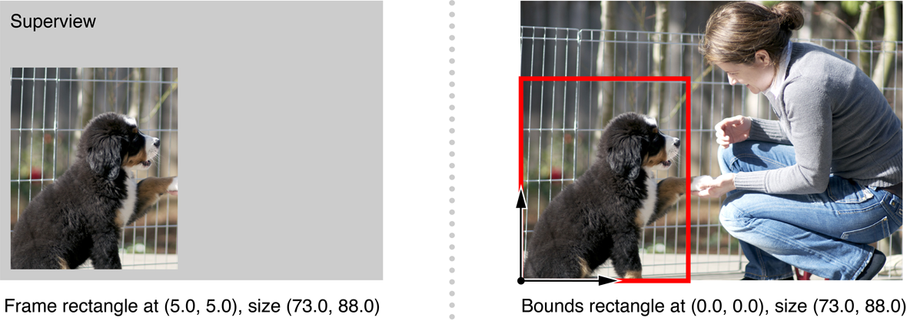
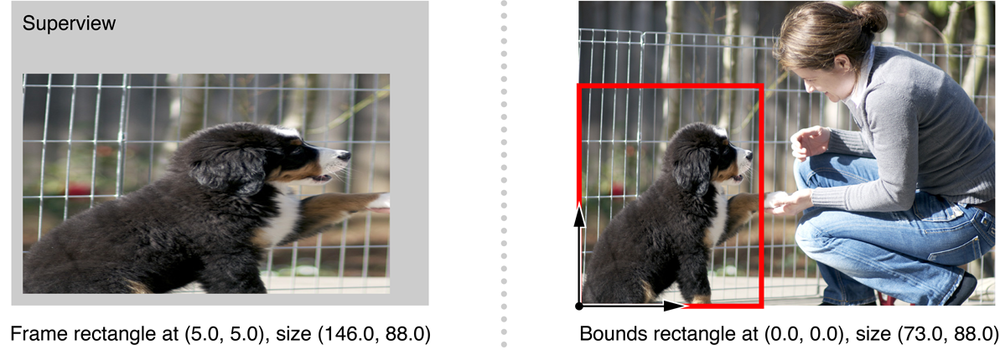
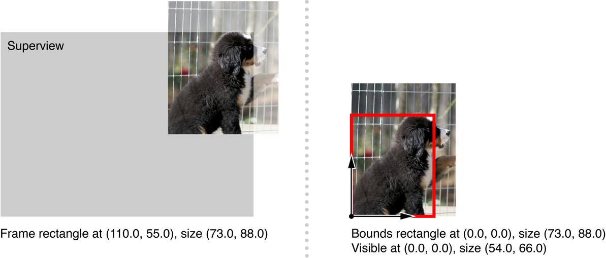
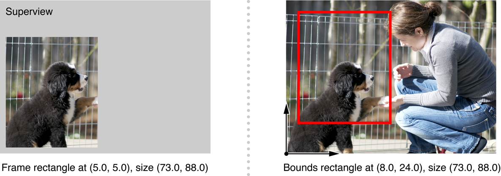
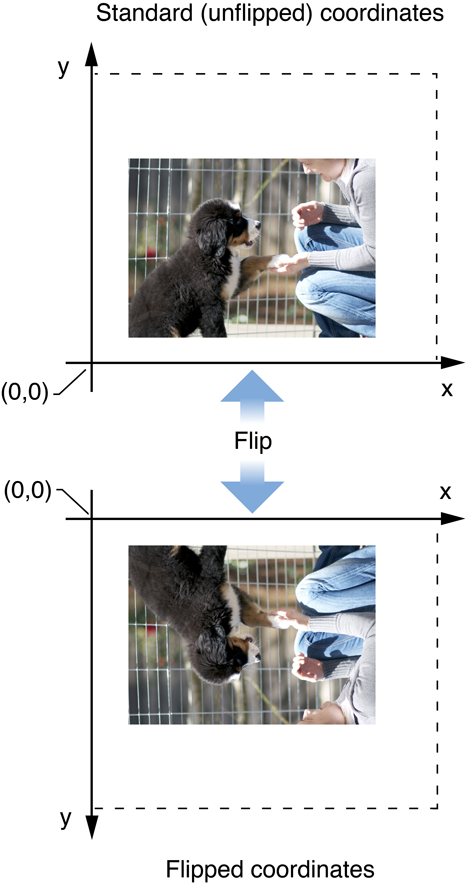
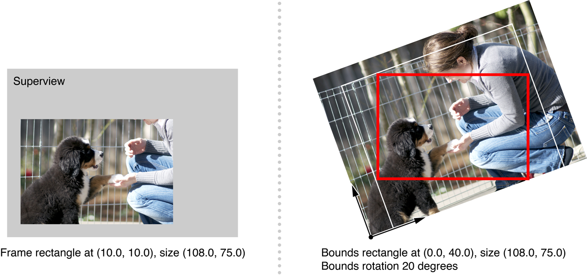

> 导航：[总目录](../../../README.md) · [documentation](../../../_indexes/documentation.md) · [View Programming Guide](Introduction%20to%20View%20Programming%20Guide%20for%20Cocoa.md)

[Next](Working%20with%20the%20View%20Hierarchy.md)[Previous](What%20Are%20Views.md)

# View Geometry

A view is responsible for the drawing and event handling in a rectangular area of a window. In order to specify that rectangle of responsibility, you define its location as an origin point and size using a coordinate system. This chapter describes the coordinate system used by views, how a view's location and size is specified, and how the size of a view interacts with its content.

From its inception, the Quartz graphics environment was designed to be resolution independent across output devices. That is, 1 unit square does not necessarily correspond directly to 1 pixel. When it comes to support for resolution independence, Quartz in combination with `NSView` provides much of the support you need automatically. When a view draws its content, the resolution independence scaling factors are managed automatically.

A view's location is expressed using the same coordinate system that the Quartz graphics environment uses. By default, the graphics environment origin (0.0,0.0) is located in the lower left, and values are specified as floating-point numbers that increase up and to the right in coordinate system units. The coordinate system units, the unit square, is the size of a 1.0 by 1.0 rectangle.

Every view instance defines and maintains its own coordinate system, and all drawing is done relative to this coordinate system. Mouse events are provided in the enclosing window's coordinate system but are easily converted to the view's. A view's coordinate system should be considered the base coordinate system for all the content of the view, including its subviews.

Graphically, a view can be regarded as a framed canvas. The frame locates the view in its superview, defines its size, and clips drawing to its edges, while the canvas hosts the actual drawing. The frame can be moved, resized, and rotated in the superview and the view's content moves with it. Similarly, the canvas can be shifted, stretched, and rotated, and the view contents move within the frame.

A view tracks its size and location using two rectangles: a frame rectangle and a bounds rectangle. The frame rectangle defines the view's location and size in the superview using the superview’s coordinate system. The bounds rectangle defines the interior coordinate system that is used when drawing the contents of the view, including the origin and scaling. Figure 2-1 shows the relationship between the frame rectangle, on the left, and the bounds rectangle, on the right.

__Figure 2-1__  Relationship between a view's frame rectangle and bounds rectangle

The frame of a view is specified when a view instance is created programmatically using the `initWithFrame:` method. The frame rectangle is passed as the parameter. The `NSView` method `frame` returns the receiver's frame rectangle. When a view is initialized, the bounds rectangle is set to originate at (0.0, 0.0) and the bounds size is set to the same size as the view's frame. If an application changes a view's bounds rectangle, it typically does so immediately after initialization. A view's bounds rectangle is returned by the method `bounds`.

If the size of the bounds rectangle differs from the frame rectangle, the content is stretched or compressed so that all the contents within the bounds are displayed in the view. Figure 2-2 shows the display results when the frame rectangle is twice the width of the bounds rectangle. The view's content is stretched horizontally to fill the width of the frame rectangle.

__Figure 2-2__  View's bounds content stretched to fit the frame rectangle

Although the bounds rectangle indicates the portion of the view content that is shown in the view's frame, there are situations where only a subsection of the view contents are displayed–for example, if the frame runs outside of the superview's frame. When this occurs, the contents are clipped as shown on the left in Figure 2-3.

__Figure 2-3__  View's content clipped to its superview

A view's visible rectangle reflects the portion of the contents that are actually displayed, in terms of the view's bounds coordinate system (the rectangle on the right in Figure 2-3). It isn’t often important to know what the visible rectangle is, since the display mechanism automatically limits drawing to visible portions of a view. If a subclass must perform expensive pre calculation to build its image, it can use the `visibleRect` method to limit its work to what’s actually needed.

By default, a view's coordinate system is based at (0.0, 0.0) in the lower-left corner of its bounds rectangle, its unit square (the size of a 1.0 by 1.0 rectangle) is the same size as those of its superview, and its axes are parallel to that of its frame rectangle. The coordinate system of a view can be changed in four distinct ways: It can be translated, scaled, flipped, or rotated.

To translate or scale the coordinate system, you alter the view's bounds rectangle. Changing the bounds rectangle sets up the basic coordinate system with which all drawing performed by the view begins. Concrete subclasses of `NSView` typically alter the bounds rectangle immediately as needed in their `initWithFrame:` methods or upon loading a nib file that contains the view.

The method for changing the bounds rectangle is `setBounds:`, which both positions and scales the canvas. The origin of the rectangle provided to `setBounds:` becomes the lower-left corner of the bounds rectangle, and the size of the rectangle is made to fit in the frame rectangle, effectively scaling the view's drawn image. In Figure 2-4, the bounds rectangle from Figure 2-1 is moved and doubled in size; the result appears on the right.

__Figure 2-4__  Altering a view's bounds

You can also set the components of the bounds rectangle independently, using `setBoundsOrigin:` and `setBoundsSize:`.

Another set of methods translate and scale the coordinate system in relative terms; if you invoke them repeatedly, their effects accumulate. These methods are `translateOriginToPoint:` and `scaleUnitSquareToSize:`.

Translating the bounds rectangle of a view shifts all subviews along with the drawing of the view's content. Scaling also affects the drawing of the subviews, as their coordinate systems inherit and build on these alterations.

A view can also specify that its coordinate system is flipped. A flipped coordinate system is based on the origin (0.0,0.0) being in the upper-left corner of its bounds rectangle, as shown in Figure 2-5.

__Figure 2-5__  Flipped view coordinates

A flipped coordinate system is useful when the contents of a view naturally originate at the top of a view, and flow downwards. For example, a view that scrolls text up and off the screen as new text appears would be best implemented using a flipped coordinate system.

Specifying that a view subclass uses a flipped coordinate system is done by overriding the `isFlipped` method. The default implementation of `NSView` returns `NO`, which means that the origin of the coordinate system lies at the lower-left corner of the default bounds rectangle, and the y-axis runs from bottom to top. When a subclass overrides this method to return `YES`, the view machinery automatically adjusts itself to assume that the upper-left corner is the origin.

A flipped coordinate system affects all drawing in the flipped view itself as well as the placement of the frame rectangles of all immediate subviews. It doesn’t affect the coordinate systems of those subviews or the drawing performed by them.

It is also possible to rotate the coordinate system around its origin within the bounds rectangle (not the origin of the bounds rectangle itself). The `setBoundsRotation:` method sets the rotation of the coordinate system to the angle, in degrees, passed as the parameter. The `rotateByAngle:` method allows you to specify the rotation angle relative to the current rotation of the coordinate system.

Rotating a view's coordinate system also enlarges the visible rectangle to account for the rotation, so that it’s expressed in the rotated coordinates yet completely covers the visible portion of the frame rectangle. This adds regions that must be drawn, yet will never be displayed (the triangular areas shown in Figure 2-6).

__Figure 2-6__  Visible rectangle of a rotated view

A view instance can provide notification to interested objects when its frame or bounds rectangles are altered. See [Notifications](Working%20with%20the%20View%20Hierarchy.md#apple-f4xwc4dqnrsv64tfmyxwi33df52wszbpkridimbqgazdsnzyfvbuqnbnknltcmi) in [Working with the View Hierarchy](Working%20with%20the%20View%20Hierarchy.md#apple-f4xwc4dqnrsv64tfmyxwi33df52wszbpkridimbqgazdsnzyfvbuqnbnknltc) for more information.

[Next](Working%20with%20the%20View%20Hierarchy.md)[Previous](What%20Are%20Views.md)

