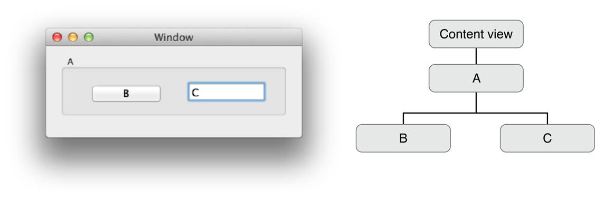
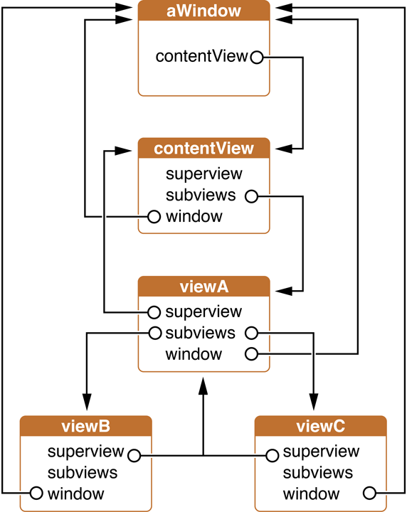
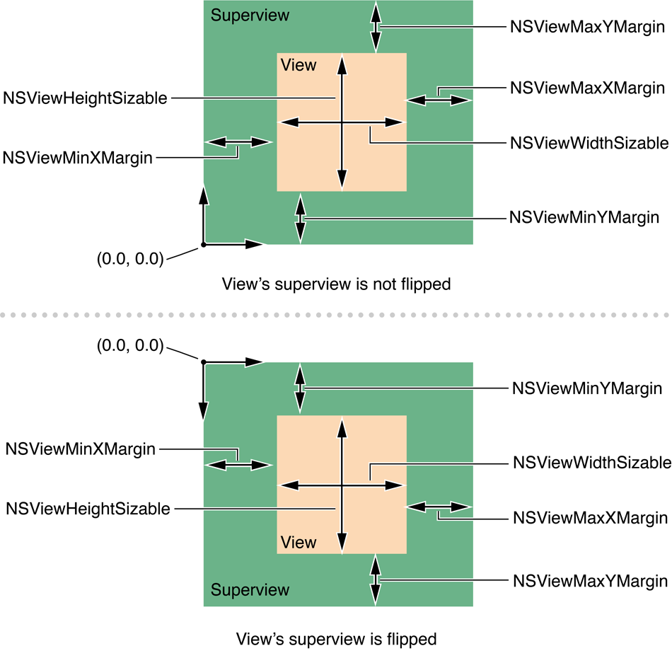
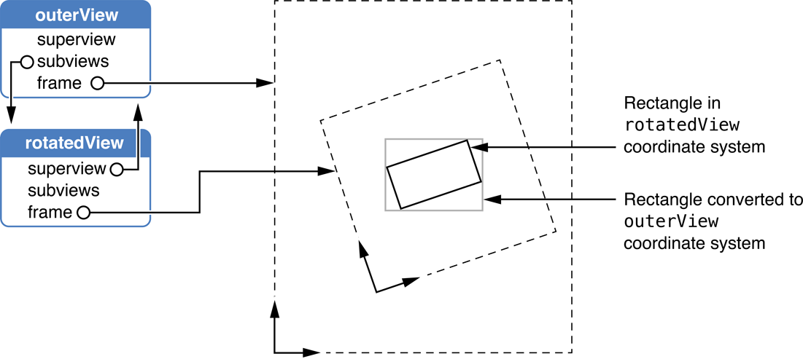

> 导航：[总目录](../../../README.md) · [documentation](../../../_indexes/documentation.md) · [View Programming Guide](Introduction%20to%20View%20Programming%20Guide%20for%20Cocoa.md)


[Next](Creating%20a%20Custom%20View.md)[Previous](View%20Geometry.md)

# Working with the View Hierarchy

Along with their own direct responsibilities for drawing and event handling, views also act as containers for other views, creating a view hierarchy. This chapter describes the view hierarchy, its benefits, and how you work with views within a hierarchy.

In addition to being responsible for drawing and handling user events, a view instance can act as a container, enclosing other view instances. Those views are linked together creating a _view hierarchy_. Unlike a class hierarchy, which defines the lineage of a class, the view hierarchy defines the layout of views relative to other views.

The window instance maintains a reference to a single top-level view instance, call the _content view_. The content view acts as the root of the visible view hierarchy in a window. The view instances enclosed within a view are called _subviews_. The parent view that encloses a view is referred to as its _superview_. While a view instance can have multiple subviews, it can have only one superview. In order for a view and its subviews to be visible to the user, the view must be inserted into a window's view hierarchy.

Figure 3-1 shows a sample application window and its view hierarchy.

__Figure 3-1__  View hierarchy



This window's view hierarchy has these parts.

- The window is represented by an `NSWindow` instance.
- The content view serves as the root of the window's view hierarchy.
- The content view contains a single subview, an instance of a custom class (that looks remarkably like an `NSBox`, but is not.).
- The custom view instance that, in turn has two subviews, an `NSButton` instance, and an `NSTextField` instance.
- The superview for both the button and text field is the `NSBox` object. The custom view container actually encloses the button and text field views.

Managing views as a hierarchy benefits application design in several ways:

- Complex view functionality can be assembled by using simpler `NSView` subclasses, avoiding monolithic and complex view classes. For example, a graphical keypad might be an `NSView` subclass that utilizes `NSButton` subviews for each key.
- Each subview's coordinate system is positioned relative to its superview's coordinate system. `NSView` instances are positioned within their superviews, so that when an `NSView` instance is moved or its coordinate system is transformed, all its subviews are moved and transformed with it. Similarly, scaling an `NSView` instance causes all of the subviews to scale their drawing relative to the superview. Since each view draws within its own coordinate system, its drawing instructions remain constant no matter where it or its superview moves on the screen or how it is scaled.
- A view hierarchy provides a clear definition of responsibility for event handling. When a view receives an event that it doesn't respond to, the event is forwarded up the view hierarchy through the superview for processing. The key window's view hierarchy takes part in an application's responder chain.
- A view hierarchy also provides a defined structure for managing the redrawing of the window's content. When an `NSView` instance receives a display request, it draws itself, and then passes drawing responsibility to each of its subviews in turn. Each branch of the view hierarchy completes drawing before the next branch begins.
- A view hierarchy is dynamic. It can be reconfigured as an application runs. View instances can be moved from window to window and installed as a subview first of one superview, then of another.

A rich selection of methods allows applications to access a view's hierarchy. The `superview` method returns the view that contains the receiver, while the `subviews` method returns an array containing the view's immediate descendants. If a view is the root of a view hierarchy, it returns `nil` when asked for its superview. Sending a view the `window` message returns the window the view resides in, or `nil` if the view is not currently in a window's view hierarchy. Figure 3-2 illustrates the relationships of the objects in the view hierarchy shown in Figure 3-1.

__Figure 3-2__  Relationships among objects in a hierarchy



Other methods allow you to inspect relationships among views: `isDescendantOf:` confirms the containment of the receiver; `ancestorSharedWithView:` finds the common container containing the receiver and the view instance specified as the parameter. For example, assuming a view hierarchy as shown in Figure 3-2, sending `viewC` a `isDescendentOf:` message with `contentView` as the parameter returns `YES`. Sending `viewB` the `ancestorSharedWithView:` message, passing `viewC` as the parameter, returns `viewA`.

The `opaqueAncestor` method returns the closest parent view that’s guaranteed to draw every pixel in the receiver’s frame (possibly the receiver itself).

Creating a view subclass using the `initWithFrame:` method establishes an `NSView` object's frame rectangle, but doesn’t insert it into a window's view hierarchy. You do this by sending an `addSubview:` message to the intended superview, passing the view to insert as the parameter. The frame rectangle is then interpreted in terms of the superview, properly locating the new view by both its place in the view hierarchy and its location in the superview’s window. An existing view in the view hierarchy can be replaced by sending the superview a `replaceSubview:with:` message, passing the view to replace and the replacement view as parameters. An additional method, `addSubview:positioned:relativeTo:`, allows you to specify the ordering of views.

You remove a view from the view hierarchy by sending it a `removeFromSuperview` message. The `removeFromSuperviewWithoutNeedingDisplay` method is similar, removing the receiver from its superview, but it does not cause the superview to redraw.

When an `NSView` object is added as a subview of another view, it automatically invokes the `viewWillMoveToSuperview:` and `viewWillMoveToWindow:` methods. You can override these methods to allow an instance to query its new superview or window about relevant state and update itself accordingly.

Repositioning or resizing a view is a potentially complex operation. When a view moves or resizes it can expose portions of its superview that weren’t previously visible, requiring the superview to redisplay. Resizing can also affect the layout of the view’s subviews. Changes to a view's layout in either case may be of interest to other objects, which might need to be notified of the change. The following sections explore each of these areas.

After a view instance has been created, you can move it programmatically using any of the frame-setting methods: `setFrame:`, `setFrameOrigin:`, and `setFrameSize:`. If the bounds rectangle of the view has not been explicitly set using one of the `setBounds...` methods, the view's bounds rectangle is automatically updated to match the new frame size.

When you change the frame rectangle, the position and size of subviews' frame rectangles often need to be altered as well. If the repositioned view returns `YES` for `autoresizesSubviews`, its subviews are automatically resized as described in [Autoresizing of Subviews](#apple-f4xwc4dqnrsv64tfmyxwi33df52wszbpkridimbqgazdsnzyfvbuqnbnknltcmq). Otherwise, it is the application's responsibility to reposition and resize the subviews manually.

`NSView` provides a mechanism for automatically moving and resizing subviews in response to their superview being moved or resized. In many cases simply configuring the autoresizing mask for a view provides the appropriate behavior for an application. Autoresizing is on by default for views created programmatically, but you can turn it off using the `setAutoresizesSubviews:` method.

Interface Builder allows you to set a view's autoresizing mask graphically with its Size inspector, and in test mode you can immediately examine the effects of autoresizing. The autoresizing mask can also be set programmatically.

A view's autoresizing mask is specified by combining the autoresizing mask constants using the bitwise OR operator and sending the view a `setAutoresizingMask:` message, passing the mask as the parameter. Table 3-1 shows each mask constant and how it effects the view's resizing behavior.

__Table 3-1__  Autoresizing mask constants

| Autoresizing Mask | Description |
| `NSViewHeightSizable` | If set, the view's height changes proportionally to the change in the superview's height. Otherwise, the view's height does not change relative to the superview's height. |
| `NSViewWidthSizable` | If set, the view's width changes proportionally to the change in the superview's width. Otherwise, the view's width does not change relative to the superview's width. |
| `NSViewMinXMargin` | If set, the view's left edge is repositioned proportionally to the change in the superview's width. Otherwise, the view's left edge remains in the same position relative to the superview's left edge. |
| `NSViewMaxXMargin` | If set, the view's right edge is repositioned proportionally to the change in the superview's width. Otherwise, the view's right edge remains in the same position relative to the superview. |
| `NSViewMinYMargin` | If set and the superview is not flipped, the view's top edge is repositioned proportionally to the change in the superview's height. Otherwise, the view's top edge remains in the same position relative to the superview.  If set and the superview is flipped, the view's bottom edge is repositioned proportionally to the change in the superview's height. Otherwise, the view's bottom edge remains in the same position relative to the superview. |
| `NSViewMaxYMargin` | If set and the superview is not flipped, the view's bottom edge is repositioned proportional to the change in the superview's height. Otherwise, the view's bottom edge remains in the same position relative to the superview.  If set and the superview is flipped, the view's top edge is repositioned proportional to the change in the superview's height. Otherwise, the view's top edge remains in the same position relative to the superview. |

For example, to keep a view in the lower-left corner of its superview, you specify `NSViewMaxXMargin` | `NSViewMaxYMargin`. When more than one aspect along an axis is made flexible, the resize amount is distributed evenly among them. Figure 3-3 provides a graphical representation of the position of the constant values in both normal and flipped superviews.

__Figure 3-3__  View autoresizing mask constants



When one of these constants is omitted, the view's layout is fixed in that aspect; when a constant is included in the mask the view's layout is flexible in that aspect. Including a constant in the mask is the same as configuring that autoresizing aspect with a spring in Interface Builder.

When you turn off a view's autoresizing, all of its descendants are likewise shielded from changes in the superview. Changes to subviews, however, can still percolate downward. Similarly, if a subview has no autoresize mask, it won’t change in size, and therefore none of its subviews autoresize.

A subclass can override `resizeSubviewsWithOldSize:` or `resizeWithOldSuperviewSize:` to customize the autoresizing behavior for a view. A view's `resizeSubviewsWithOldSize:` method is invoked automatically by a view whenever its frame size changes. This method then simply sends a `resizeWithOldSuperviewSize:` message to each subview. Each subview compares the old frame size to the new size and adjusts its position and size according to its autoresize mask.

Beyond resizing its subviews, by default an `NSView` instance broadcasts notifications to interested observers any time its bounds or frame rectangles change. The notification names are `NSViewFrameDidChangeNotification` and `NSViewBoundsDidChangeNotification`, respectively.

An `NSView` instance that bases its own display on the layout of its subviews should register itself as an observer for those subviews and update itself any time they’re moved or resized. Both `NSScrollView` and `NSClipView` instances cooperate in this manner to adjust the scroll view's scrollers.

By default both frame and bounds rectangle changes are sent for a view instance. You can prevent an `NSView` instance from providing the notifications using `setPostsFrameChangedNotifications:` and `setPostsBoundsChangedNotifications:` and passing `NO` as the parameter. If your application does complicated view layout, turning change notifications off before layout and then restoring them upon completion may provide a performance improvement. As with all performance tuning, it is best to first sample your application to determine if the change notifications are having a negative impact on performance.

You hide and “unhide” (that is, show) the views of a Cocoa application using the `NSView` method `setHidden:`. This method takes a Boolean parameter: `YES` (hide the receiving view) or `NO` (show the receiver).

When you hide a view using the `setHidden:` method it remains in its view hierarchy, even though it disappears from its window and does not receive input events. A hidden view remains in its superview’s list of subviews and participates in autoresizing. If a view marked as hidden has subviews, they and their view descendants are hidden as well. When you hide a view, the Application Kit also disables any cursor rectangle, tool-tip rectangle, or tracking rectangle associated with the view.

Hiding the view that is the window’s current first responder causes the view’s next valid key view (`nextValidKeyView`) to become the new first responder. A hidden view remains in the `nextKeyView` chain of views it was previously part of but is ignored during keyboard navigation.

You can query the hidden state of a view by sending it either `isHidden` or `isHiddenOrHasHiddenAncestor` (both defined by `NSView`). The former method returns `YES` when the view has been explicitly marked as hidden with a `setHidden:` message. The latter returns `YES` both when the view has been explicitly marked as hidden and when it is hidden because an ancestor view has been marked as hidden.

At various times, particularly when handling events, an application needs to convert rectangles or points from the coordinate system of one `NSView` instance to another (typically the superview or subview) in the same window. The `NSView` class defines six methods that convert rectangles, points, and sizes in either direction:

__Table 3-2__  Coordinate Conversion Methods

| Convert to the receiver from the specified view | Convert from the receiver to the specified view |
| `convertPoint:fromView:` | `convertPoint:toView:` |
| `convertRect:fromView:` | `convertRect:toView:` |
| `convertSize:fromView:` | `convertSize:toView:` |

The `convert...:fromView:` methods convert the values to the receiver's coordinate system, from the coordinate system of the view passed as the second parameter. If `nil` is passed as the view, the values are assumed to be in the window's base (the coordinate space of the window) coordinate system and are converted to the receiver's coordinate system. The `convertPoint:fromView:` method is commonly used to convert mouse-event coordinates, which are provided by `NSEvent` as relative to the window, to the receiving view as shown in [Listing 3-1](#apple-f4xwc4dqnrsv64tfmyxwi33df52wszbpkridimbqgazdsnzyfvbuqnbnknltcma).

__Listing 3-1__  Converting event locations using `convertPoint:fromView:`

```objc

-(void)mouseDown:(NSEvent *)event
{
    NSPoint clickLocation;

    // convert the click location into the view coords
    clickLocation = [self convertPoint:[event locationInWindow]
                              fromView:nil];
    // do something with the click location
}
```

The `convert..:toView:` methods do the inverse, converting values in the receiver's coordinate system to the coordinate system of the view passed as a parameter. If the view parameter is `nil`, the values are converted to the base coordinate system of the receiver's window.

For converting to and from the screen coordinate system, `NSWindow` defines the `convertBaseToScreen:` and `convertScreenToBase:` methods. Using the `NSView` conversion methods along with these methods allows you to convert a geometric structure between a view's coordinate system and the screen’s with only two messages, as shown in Listing 3-2.

__Listing 3-2__  Converting a view location to the screen location

```
NSPoint pointInWindowCoordinates;
NSPoint pointInScreenCoords;

pointInWindowCoordinates=[self convertPoint:viewLocation toView:nil];
pointInScreenCoords=[[self window] convertBaseToScreen:pointInWindowCoordinates];
```

Conversion is straightforward when neither view is rotated or when dealing only with points. When converting rectangles or sizes between views with different rotations, the geometric structure must be altered in a reasonable way. In converting a rectangle, the `NSView` class makes the assumption that you want to guarantee coverage of the original screen area. To this end, the converted rectangle is enlarged so that when located in the appropriate view, it completely covers the original rectangle. Figure 3-4 shows the conversion of a rectangle in the `rotatedView` object's coordinate system to that of its superview, `outerView`.

__Figure 3-4__  Converting values in a rotated view



In converting a size, `NSView` simply treats it as an delta offset from (0.0, 0.0) that you need to convert from one view to another. Though the offset distance remains the same, the balance along the two axes shifts according to the rotation. It's useful to note that in converting sizes Cocoa will always return sizes that consist of positive numbers.

In Leopard, `NSView` provides a new set of methods that should be used when performing pixel-alignment of view content. They provide the means to transform geometry to and from a "base" coordinate space that is pixel-aligned with the backing store into which the view is being drawn:

```objc
- (NSRect)convertRectToBase:(NSRect)aRect;
- (NSPoint)convertPointToBase:(NSPoint)aPoint;
- (NSSize)convertSizeToBase:(NSSize)aSize;
- (NSRect)convertRectFromBase:(NSRect)aRect;
- (NSPoint)convertPointFromBase:(NSPoint)aPoint;
- (NSSize)convertSizeFromBase:(NSSize)aSize;
```

For conventional view rendering, in which a view hierarchy is drawn flattened into a window backing store, this "base" space is the same as the coordinate system of the window, and the results of using these new methods are the same as converting geometry to and from view `nil` using the existing conversion methods discussed in [Table 3-2](#apple-f4xwc4dqnrsv64tfmyxwi33df52wszbpkridimbqgazdsnzyfvbuqnbnknltena).

Views that are rendered into Core Animation layers, however, have their own individual backing stores, which may be aligned such that window space is not necessarily the appropriate coordinate system in which to perform pixel alignment calculations.

These new coordinate transform methods provide a way to abstract view content drawing code from the details of particular backing store configurations, and always achieve correct pixel alignment without having to special-case for layer-backed vs. conventional view rendering mode. Regardless of the underlying details of how view content is being buffered, converting to base space puts one in the native device coordinate system, in which integralizing coordinates produces pixel alignment of geometry.

When using layer-backed views at a user interface scale factor other than 1.0, note that the dimensions of a view and the dimensions of its corresponding backing layer will vary according to the scale factor, since [CALayer](https://developer.apple.com/documentation/quartzcore/calayer) bounds are always expressed in pixels, while `NSView` dimensions remain expressed in points. Most clients of layer-backed views will not have a need to perform operations directly in layer space, but for those that do it's important to use the preceding methods to convert geometric quantities between view space and layer ("base") space when appropriate.

The `NSView` class defines methods that allow you to tag individual view objects with integer tags and to search the view hierarchy based on those tags. The receiver's subviews are searched depth-first, starting at the first subview returned by the receiver's `subviews` method.

The `NSView` method `tag` always returns `–1`. Subclasses can override this method to return a different value. It is common for a subclass to implement a `setTag:` method that stores the tag value in an instance variable, allowing the tag to be set on an individual view basis. Several Application Kit classes, including the `NSControl` subclasses, do just this. The `viewWithTag:` method proceeds through all of the receiver’s descendants (including itself) using a depth-first search, from back to front in the receiver's view hierarchy, looking for a subview with the given tag and returning it if it’s found.

[Next](Creating%20a%20Custom%20View.md)[Previous](View%20Geometry.md)

