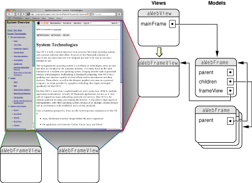
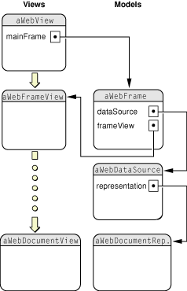
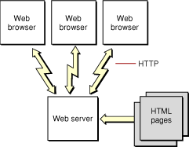

> 导航：[总目录](../../../README.md) · [documentation](../../../_indexes/documentation.md) · [WebKit Objective-C Programming Guide](Introduction%20to%20WebKit%20Objective-C%20Programming%20Guide.md)

[Next](Simple%20Browsing.md)[Previous](Why%20Use%20WebKit.md)

# Core WebKit Classes

Understanding the object-oriented design of the core WebKit classes is fundamental to understanding how WebKit works. You can display web content in a single window by following a few simple steps. Normally, to embed web content in your application you simply create a WebView object, place it in a window, and send a load request message. However, if you want to do something more complex—for example, customize the user interface, use multiple windows, or implement any other browser-like features, such as back and forward buttons—you will want to understand better how WebKit classes work together to load and display web content.

WebKit loosely follows a model-view-controller paradigm—some objects represent view-controllers that display web content, and other objects represent models that encapsulate web content.

[WebView Class Reference](https://developer.apple.com/documentation/webkit/webview) is the core view class in WebKit. WebView objects manage interactions between [WebFrameView Class Reference](https://developer.apple.com/documentation/webkit/webframeview) objects and [WebFrame Class Reference](https://developer.apple.com/documentation/webkit/webframe) objects. To embed web content in your application, you create a WebView object, attach it to a window, and ask its main frame to load a URL. The most common example of web content is a single frame containing multiple MIME types. WebKit also fully supports HTML files containing compound frames.

For example, suppose a webpage contains a frame with two children frames, as illustrated in [Figure 1](#apple-f4xwc4dqnrsv64tfmyxwi33df52wszbpgiydambsgazdilkdjjbeuq2gjfcq). To load this page, you send a request to the main frame of `aWebView`, an instance of WebView. The main frame initiates a client request. While it receives the server response (that is, loads the page content), the main frame creates WebFrame objects to encapsulate the content contained in each frame element. A hierarchy of WebFrame objects is used to model an entire webpage, where the root is called the _main frame_.

__Figure 1__  WebView and WebFrameView objects

As the content for each WebFrame object is loaded, a corresponding WebFrameView object is created to display that content. These WebFrameView objects are attached to the WebView’s view hierarchy. Therefore, there is a parallel hierarchy of WebFrameView objects used to render an entire page. In this hierarchy, the WebView object is not only a controller object but also the root view. The details of the view hierarchy are not shown because they are private to the implementation of WebKit and may change in the future.

Fortunately, you do not need to create these model and view objects directly. WebKit creates these objects automatically whenever pages are loaded, either programmatically or when the user clicks a link.

Once the frame hierarchies are created, the actual content for each frame needs to be loaded and displayed. Since webpages can contain different MIME types, WebKit implements different models and views to display them. WebKit automatically loads and displays most of the common document types (for example, HTML, XML, plain text, images, and QuickTime movies). WebKit selects the appropriate data model and view object based on the document’s MIME type. In fact, WebKit design is extensible, allowing you to create your own data models and views for specific MIME types.

[Figure 2](#apple-f4xwc4dqnrsv64tfmyxwi33df52wszbpgiydambsgazdilkdjjbesqsejbdq) illustrates the relationship between WebFrame, [WebDataSource Class Reference](https://developer.apple.com/documentation/webkit/webdatasource), document representation, and document view objects. For each WebFrame object, there’s one WebDataSource object that loads the content for that frame. For each WebDataSource object, there’s one document representation object, conforming to the [WebDocumentRepresentation Protocol Reference](https://developer.apple.com/documentation/webkit/webdocumentrepresentation) protocol, that encapsulates the data for a specific MIME type. For each documentation representation object, there’s a document view object, conforming to the [WebDocumentView Protocol Reference](https://developer.apple.com/documentation/webkit/webdocumentview) protocol, that handles the display of that data. The document view object is contained in the corresponding WebFrameView object (for example, the document view of a scroll view contained in a WebFrameView object). Again, the details of the view hierarchy are not shown because they are private to the implementation of WebKit.

__Figure 2__  WebFrame and WebDataSource objects

Because document representation and view objects are separate, you can have multiple models and views of a MIME type, and extend WebKit by defining your own. Once a data source is committed (the first byte of data has arrived), WebKit selects an appropriate document representation and document view object based on the MIME type of the data source. WebKit already supplies the model and view objects for most of the common MIME types. If a MIME type is not supported, you can supply your own model and view objects to handle that type, and register them with the WebView class. You can even replace the default model and view objects, although that’s not recommended.

Again, you do not have to create any of these objects directly—they are automatically created when a page is loaded.

When you send a request to load a webpage, you receive an asynchronous response because the request is being sent to another process on another machine over the network. Because of this, WebKit needs to handle the state of its objects between the time a request is initiated and the first byte of data arrives. When using WebKit you should be aware of the transitional state of WebKit data source objects.

In addition to requests being asynchronous, many errors can result from requesting web content over the network. For example, there can be network failures, bad URL strings, corrupted content, and no available plug-ins. Or, you may initiate a load request but find the response slow, or delayed (the content trickles in).

For example, a typical static website looks something like the one in [Figure 3](#apple-f4xwc4dqnrsv64tfmyxwi33df52wszbpgiydambsgazdilkdjjbeerscizda). Client requests, conforming to the HTTP protocol, originate at the user’s web browser. These requests are sent over the network to the web server, which analyzes the request and selects the appropriate webpage to return to the client browser. This webpage is simply a text file that contains HTML markup. Using the HTML commands embedded within the file received from the web server, the browser renders the page.

__Figure 3__  Typical website

In WebKit, client load requests are asynchronous. To handle the state of objects during the time a request is initiated and content arrives, WebKit creates what is called a _provisional_ data source. The data source is provisional because it isn’t known yet whether the page will load successfully. Any existing data source for a page remains valid until the provisional data source is validated. The first time a WebFrame object is loaded there’s no existing data source and a blank page is displayed.

A data source becomes _committed_ as soon as the first byte of data arrives. If the provisional data source becomes invalid due to some error, it never transitions to a committed data source. When a data source is committed, an appropriated document representation and document view is created for the WebFrame object.

Note that the default WebKit behavior does nothing if a load request fails. Therefore, you need to implement WebView delegates to handle load errors (for example, to display or log a message).

You customize the behavior of WebKit by implementing WebView delegates that intercept request and response messages, and make policy and user interface decisions. WebView uses a multiple delegate model because there are so many aspects of WebKit behavior that you can customize. And for large applications, it makes sense for different objects to handle the different sets of delegate messages. Of course, you can always implement just one delegate to handle all these areas. WebView objects have four delegates:

- Frame load delegate—intercepts frame-level request and response messages to track the progress and errors that might result in loading a webpage (see the WebFrameLoadDelegate Protocol Reference informal protocol).
- Resource load delegate—intercepts resource-level request and response messages to track the progress and errors that might result in loading a resource (see the [WebResourceLoadDelegate Protocol Reference](https://developer.apple.com/documentation/webkit/webresourceloaddelegate) informal protocol).
- User interface delegate—controls the opening of new windows, augments the default menu items displayed when the user clicks on elements, and makes other window and control user interface decisions (see the [WebUIDelegate Protocol Reference](https://developer.apple.com/documentation/webkit/webuidelegate) informal protocol).
- Policy delegate—modifies the policy decisions that are made when handling URLs or the data they represent (see the WebPolicyDelegate Protocol Reference informal protocol).

Because all the delegates use informal protocols, you can set the delegates and implement the delegate methods you want. If you don’t implement a delegate method, WebKit uses a default implementation. For example, by default, error messages are not reported, and new windows are not opened when a link is clicked that results in a new window request. If WebKit cannot reach a URL, your application window displays the old content, which may be a blank page. You typically implement a frame load delegate to handle these types of errors.

[Next](Simple%20Browsing.md)[Previous](Why%20Use%20WebKit.md)

