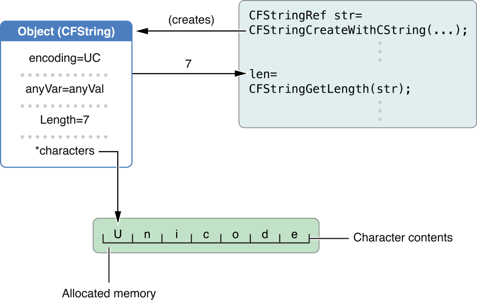

> 导航：[总目录](../../../README.md) · [documentation](../../../_indexes/documentation.md) · [Core Foundation Design Concepts](Introduction%20to%20Core%20Foundation%20Design%20Concepts.md)

[Next](Object%20References.md)[Previous](Introduction%20to%20Core%20Foundation%20Design%20Concepts.md)

# Opaque Types

The Core Foundation’s object model that supports encapsulation and polymorphic functions is based on opaque types.

The individual fields of an object based on an opaque type are hidden from clients, but the type’s functions offer access to most values of these fields. [Figure 1](#apple-f4xwc4dqnrsv64tfmyxwi33df52wszbpgiydambrgeydmljrgazdqmjzfvbuuqkfiffeery) depicts an opaque type in the data it “hides” and in the interface it presents to clients.

Core Foundation has many opaque types, and the names of these types reflect their intended uses. For example, CFString is an opaque type that “represents” and operates on Unicode character arrays. (“CF” is, of course, a prefix for Core Foundation.) CFArray is an opaque type for indexed-based collection functionality. The functions, constants, and other secondary data types in support of an opaque type are generally defined in a header file having the name of the type; `CFArray.h`, for example, contains the symbol definitions for the CFArray type.

__Figure 1__  An opaque type

To some, an opaque type might seem to impose an unnecessary limitation by discouraging direct access of the structure’s contents. There also might seem to be overhead associated with opaque types that could affect program performance. But the benefits of opaque types outweigh these seeming limitations.

Opaque types provide better abstraction and more flexibility for how the underlying functionality is implemented. By hiding details such as the fields of structures, Core Foundation reduces the chance for errors that might occur in client code when those details change. Moreover, opaque types permit optimizations that might be confusing if exposed. For example, CFString “officially” represents an array of 16-bit characters of the type `UniChar`. However, a CFString might choose to store a range of characters in the ASCII range as 8-bit values. Copying an immutable object might (and usually does) result in a shared reference to the object instead of two separate objects in memory (see _[Memory Management Programming Guide for Core Foundation](../Memory%20Management%20Programming%20Guide%20for%20Core%20Foundation/Introduction.md#apple-f4xwc4dqnrsv64tfmyxwi33df52wszbpgeydambqgezdo2i)_).

Continuing with the example of CFString, it might seem heavyweight to use an opaque type to store characters. As it turns out, however, the CPU cost of such storage is not much higher than using a simple C array of characters and the memory cost is often less. In addition, opacity does not necessarily mean that an opaque type can never provide mechanisms for accessing content directly. CFString, for instance, provides the `CFStringGetCStringPtr` function for this purpose.

Finally, you can customize some opaque types to some degree. For example, the collection types allow you to define callbacks for invoking a function on every member of a collection.

[Next](Object%20References.md)[Previous](Introduction%20to%20Core%20Foundation%20Design%20Concepts.md)

