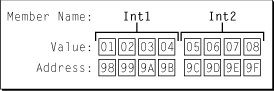
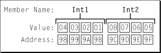

> 导航：[总目录](../../../README.md) · [documentation](../../../_indexes/documentation.md) · [Memory Management Programming Guide for Core Foundation](Introduction.md)


[Next](Using%20Allocators%20in%20Creation%20Functions.md)[Previous](Copy%20Functions.md)

# Byte Ordering

Microprocessor architectures commonly use two different methods to store the individual bytes of multibyte numerical data in memory. This difference is referred to as “byte ordering” or “endian nature.” Most of the time the endian format of your computer can be safely ignored, but in certain circumstances it becomes critically important. OS X provides a variety of functions to turn data of one endianness into another.

Intel x86 processors store a two-byte integer with the least significant byte first, followed by the most significant byte. This is called little-endian byte ordering. Other CPUs, such as the PowerPC CPU, store a two-byte integer with its most significant byte first, followed by its least significant byte. This is called big-endian byte ordering. Most of the time the endian format of your computer can be safely ignored, but in certain circumstances it becomes critically important. For example, if you try to read data from files that were created on a computer that is of a different endian nature than yours, the difference in byte ordering can produce incorrect results. The same problem can occur when reading data from a network.

To give a concrete example around which to discuss endian format issues, consider the case of a simple C structure which defines two four byte integers as shown in [Listing 1](#apple-f4xwc4dqnrsv64tfmyxwi33df52wszbpgiydambrge2taljrgazdomrwfvbegskeivfeosq).

__Listing 1__  Example data structure

```
struct {
    UInt32 int1;
    UInt32  int2;
} aStruct;
```

Suppose that the code shown in [Listing 2](#apple-f4xwc4dqnrsv64tfmyxwi33df52wszbpgiydambrge2taljrgazdonzsfvbegskdi5cekqq) is used to initialize the structure shown in [Listing 1](#apple-f4xwc4dqnrsv64tfmyxwi33df52wszbpgiydambrge2taljrgazdomrwfvbegskeivfeosq).

__Listing 2__  Initializing the example structure

```
ExampleStruct   aStruct;

aStruct.int1 = 0x01020304;
aStruct.int2 = 0x05060708;
```

Consider the diagram in [Figure 1](#apple-f4xwc4dqnrsv64tfmyxwi33df52wszbpgiydambrge2taljrgazdqmjufvbegskgjbfekqy), which shows how a big-endian processor or memory system would organize the example data. In a big-endian system, physical memory is organized with the address of each byte increasing from most significant to least significant.

__Figure 1__  Example data in big-endian format



Notice that the fields are stored with the more significant bytes to the left and less significant bytes to the right. This means that the address of the most significant byte of the address field `Int1` is `0x98`, while the address `0x9B` corresponds to the least significant byte of `Int1`.

The diagram in [Figure 2](#apple-f4xwc4dqnrsv64tfmyxwi33df52wszbpgiydambrge2taljrgazdqnjxfvbegskkizeuqra) shows how a little-endian system would organize the data.

__Figure 2__  Example data in little-endian format



Notice that the lowest address of each field now corresponds to the least significant byte instead of the most significant byte. If you were to print out the value of `Int1` on a little-endian system you would see that despite being stored in a different byte order, it is still interpreted correctly as the decimal value `16909060`.

Now suppose the example data values initialized by the code shown in [Listing 2](#apple-f4xwc4dqnrsv64tfmyxwi33df52wszbpgiydambrge2taljrgazdonzsfvbegskdi5cekqq) are generated on a little-endian system and saved to disk. Assume that the data is written to disk in byte-address order. When read from disk by a big-endian system, the data would again be laid out in memory as illustrated in [Figure 2](#apple-f4xwc4dqnrsv64tfmyxwi33df52wszbpgiydambrge2taljrgazdqnjxfvbegskkizeuqra). The problem is that the data is still in little-endian byte order even though it is being interpreted on a big-endian system. This difference causes the values to be evaluated incorrectly. In this example, the decimal value of the field `Int1` should be `16909060`, but because of the incorrect byte ordering it is evaluated as `67305985`. This phenomenon is called byte swapping and occurs when data in one endian format is read by a system that uses the other endian format.

Unfortunately, this is a problem that can’t be solved in the general case. The reason is that the manner in which you swap depends on the format of your data. Character strings typically don’t get swapped at all, longwords get swapped four bytes end-for-end, words get swapped two bytes end-for-end. Any program that needs to swap data around therefore has to know the data type, the source data endian order, and the host endian order.

The functions in `CFByteOrder.h` allow you to perform byte swapping on two-byte and four-byte integers as well as floating point values. Appropriate use of these functions help you ensure that the data your program manipulates is in the correct endian order. See section [Byte Swapping](Byte%20Swapping.md#apple-f4xwc4dqnrsv64tfmyxwi33df52wszbpgiydambrge2tklkdjjbekscbifdq) for details on using these functions. Note that Core Foundation’s byte swapping functions are available on OS X only.

[Next](Using%20Allocators%20in%20Creation%20Functions.md)[Previous](Copy%20Functions.md)

