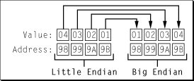

> 导航：[总目录](../../../README.md) · [documentation](../../../_indexes/documentation.md) · [Memory Management Programming Guide for Core Foundation](Introduction.md)


[Next](Document%20Revision%20History.md)[Previous](Creating%20Custom%20Allocators.md)

# Byte Swapping

If you need to find out the host byte order you can use the function `CFByteOrderGetCurrent`. The possible return values are `CFByteOrderUnknown`, `CFByteOrderLittleEndian`, and `CFByteOrderBigEndian`.

Core Foundation provides three optimized primitive functions for byte swapping— `CFSwapInt16`, `CFSwapInt32`, and `CFSwapInt64`. All of the other swapping functions use these primitives to accomplish their work. In general you will not need to use these primitives directly.

Although the primitive swapping functions swap unconditionally, the higher level swapping functions are defined in such a way that they do nothing when a byte swap is not required—in other words, when the source and host byte orders are the same. For the integer types, these functions take the forms `CFSwapXXXBigToHost` and `CFSwapXXXLittleToHost`, `CFSwapXXXHostToBig`, and `CFSwapXXXHostToLittle` where `XXX` is a data type such as `Int32`. For example, if you were on a little-endian machine reading a 16-bit integer value from a network whose data is in network byte order (big-endian), you would use the function `CFSwapInt16BigToHost`. [Listing 1](#apple-f4xwc4dqnrsv64tfmyxwi33df52wszbpgiydambrge2tkljrgaytamrsfvbuuqsdifdeura) demonstrates this process.

__Listing 1__  Swapping a 16 bit Integer

```
SInt16  bigEndian16;
SInt16  swapped16;

// Swap a 16 bit value read from network.
swapped16 = CFSwapInt16BigToHost(bigEndian16);
```

The section [Byte Ordering](Byte%20Ordering.md#apple-f4xwc4dqnrsv64tfmyxwi33df52wszbpgiydambrge2talkdjjbeksscjbea) introduced the example of a simple C structure that was created and saved to disk on a little endian machine and then read from disk on a big-endian machine. In order to correct the situation, you must swap the bytes in each field. The code in [Listing 2](#apple-f4xwc4dqnrsv64tfmyxwi33df52wszbpgiydambrge2tkljrgaytanztfvbegskjizdukry) demonstrates how you would use Core Foundation byte-swapping functions to accomplish this.

__Listing 2__  Byte swapping fields in a C structure

```
// Byte swap the values if necessary.
aStruct.int1 = CFSwapInt32LittleToHost(aStruct.int1)
aStruct.int2 = CFSwapInt32LittleToHost(aStruct.int2)
```

Assuming a big-endian architecture, the functions used in [Listing 2](#apple-f4xwc4dqnrsv64tfmyxwi33df52wszbpgiydambrge2tkljrgaytanztfvbegskjizdukry) would swap the bytes in each field. [Figure 1](#apple-f4xwc4dqnrsv64tfmyxwi33df52wszbpgiydambrge2tkljrgaytcmjyfvbeeq2hi5cugsa) shows the effect of byte swapping on the field `aStruct.int1`. Note that the byte-swapping code would do nothing when run on a little-endian machine. The compiler should optimize out the code and leave the data untouched.

__Figure 1__  Four-byte little-endian to big-endian swap



Even on a single platform there can be many different representations for floating-point values. Unless you are very careful, attempting to pass floating-point values across platform boundaries causes no end of headaches. To help you work with floating-point numbers, Core Foundation defines a set of functions and two special data types in addition to the integer-swapping functions. These functions allow you to encode 32-and 64-bit floating-point values in such a way that they can later be decoded and byte swapped if necessary. [Listing 3](#apple-f4xwc4dqnrsv64tfmyxwi33df52wszbpgiydambrge2tkljrgaytcnjtfvbuuqsdi5bumqq) shows you how to encode a 64-bit floating-point number and [Listing 4](#apple-f4xwc4dqnrsv64tfmyxwi33df52wszbpgiydambrge2tkljrgaytcojrfvbuuqsdineumri) shows how to decode it.

__Listing 3__  Encoding a Floating Point Value

```
Float64             myFloat64;
CFSwappedFloat64    swappedFloat;

// Encode the floating-point value.
swappedFloat = CFConvertFloat64HostToSwapped(myFloat64);
```


__Listing 4__  Decoding a floating-point value

```
Float64             myFloat64;
CFSwappedFloat64    swappedFloat;

// Decode the floating-point value.
myFloat64 = CFConvertFloat64SwappedToHost(swappedFloat);
```

The data types `CFSwappedFloat32` and `CFSwappedFloat64` contain floating point values in a canonical representation. A CFSwappedFloat is _not_ itself a float, and should not be directly used as one. You can however send one to another process, save it to disk, or send it over a network. Because the format is converted to and from the canonical format by the conversion functions, there is no need for explicit swapping API. Byte swapping is taken care of for you during the format conversion if necessary.

[Next](Document%20Revision%20History.md)[Previous](Creating%20Custom%20Allocators.md)

