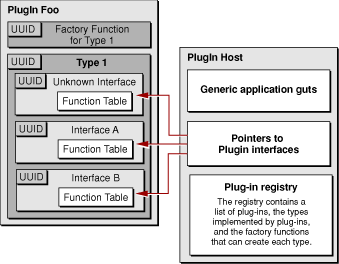

> 导航：[总目录](../../../README.md) · [documentation](../../../_indexes/documentation.md) · [Plug-in Programming Topics](Introduction%20to%20Plug-ins.md)

[Next](Plug-in%20Registration.md)[Previous](Anatomy%20of%20a%20Plug-in.md)

# Conceptual Building Blocks

In the plug-in model, the host application defines one or more types that each consist of one or more interfaces. A plug-in implements all of the functions in all of the interfaces for each type the plug-in supports. A plug-in also provides creation functions called factories for each type it wants to implement. When the host application loads a plug-in, a factory function is registered with the host for each of the plug-in’s types. The host can then use a type’s factory function to instantiate the type and obtain a pointer to its IUnknown interface. The host uses IUnknown to query the type for its interface function tables. The function tables give the host access to the plug-in’s interface implementations. [Figure 1](#apple-f4xwc4dqnrsv64tfmyxwi33df52wszbpgiydambrge3daljrgazdomjwfvbegskii5dukri) illustrates the relationships between these various components.

__Figure 1__  Building blocks of the Core Foundation plug-in model.

The following sections describe each aspect of the plug-in model in detail. In addition, the tasks in this topic provide a complete example of how to build a simple plug-in host and plug-in.

UUIDs are used by plug-ins to uniquely identify types, interfaces, and factories. When creating a new type, host developers must generate UUIDs to identify the type as well as its interfaces and factories.

UUIDs (Universally Unique Identifiers), also known as GUIDs (Globally Unique Identifiers) or IIDs (Interface Identifiers), are 128-bit values guaranteed to be unique. A UUID is made unique over both space and time by combining a value unique to the computer on which it was generated—usually the Ethernet hardware address—and a value representing the number of 100-nanosecond intervals since October 15, 1582 at 00:00:00.

To create a UUID for a plug-in you typically use the command line utility `uuidgen`. If you need to generate UUIDs programmatically you can do so using the functions defined in `CFUUID.h` (see [Generating a UUID Programmatically](Generating%20a%20UUID%20Programmatically.md#apple-f4xwc4dqnrsv64tfmyxwi33df52wszbpgiydambrge3dmlkdjjbekscbifdq)). The standard format for UUIDs represented in ASCII is a string punctuated by hyphens, for example `68753A44-4D6F-1226-9C60-0050E4C00067`. The hex representation looks, as you might expect, like a list of numerical values preceded by `0x`. For example, `0xD7, 0x36, 0x95, 0x0A, 0x4D, 0x6E, 0x12, 0x26, 0x80, 0x3A, 0x00, 0x50, 0xE4, 0xC0, 0x00, 0x67`. In order to use a UUID, you simply create it and then copy the resulting strings into your header and C language source files. Note that Core Foundation’s UUID API is available only on OS X.

An interface is the fundamental abstraction a host uses to define an area of functionality to be implemented by plug-in developers. All interactions between a host and plug-in occur through an interface. In programming terms, an interface represents a function table where each function has a specific semantic meaning.

An interface constitutes a contract between the host and plug-in. This contract includes

- the order of the functions in the interface
- the interface functions’ parameter types and return types
- the expected behavior of each function

A group of functions cannot rightly be considered an interface unless there is a specific definition of exactly what each function is supposed to do.

For example, consider an interface with one function that takes a single integer and returns an integer. Without a definition of behavior, any function that takes and returns an integer might be considered an implementation of that interface. To address this ambiguity, the expected behavior of each function in the interface is also “part” of that interface. A plug-in host developer must provide a header file and documentation to potential plug-in developers describing the functions that make up the interface, and exactly how the functions are expected to behave. It is critical that the plug-in developer know exactly what is required to correctly implement the interface.

Interfaces in the plug-in model are identical to the interfaces defined by Microsoft’s COM architecture. When implemented in C++, all plug-in interfaces inherit the IUnknown interface, and in C, all plug-in interface function tables must include the IUnknown functions. At runtime, the host uses the IUnknown interface to find and obtain access to other interfaces implemented by the plug-in. See [Defining Types and Interfaces](Defining%20Types%20and%20Interfaces.md#apple-f4xwc4dqnrsv64tfmyxwi33df52wszbpgiydambrge3dglkdjjbekscbifdq) for more information about IUnknown and implementing a plug-in interface.

A type represents an aggregation of interfaces. Like interfaces, types are also defined by the host and implemented by the plug-in. A type is an entirely abstract entity that groups related interfaces together, providing a conceptual umbrella for the different APIs represented by the type’s constituent interfaces. Types allow for a high-level representation of a feature to be implemented or problem to be solved. Interfaces express the way you intend to factor the problem represented by the type. You can think of interfaces as the implementation of a type.

For example, say you’re developing an application called ImageViewer and you want to allow third parties to add file format support for different types of images using plug-ins. You might define the type `ImageAdaptorType`, which would consist of two interfaces, `ImageIOInterface` and `ImageSnifferInterface`. `ImageIOInterface` might consist of two functions. The first function would take a parameter of type `CFURLRef` and return a special `ImageViewerImage` type defined by ImageViewer to represent an image. The second function would take parameters of type `CFURLRef` and `ImageViewerImage` and write the image to the location described by the URL. `ImageSnifferInterface` might define a function that would take a `CFURLRef` parameter and return a `Boolean` value indicating whether the file pointed to could be read.

Because an interface cannot ever change once it has been published, types must support multiple interfaces. Instead of changing a type’s interface, you simply add a new interface to the type with the changed or additional functionality. In this way, a single plug-in might support different versions of a host application by implementing a different interface for each version. The type would remain the same; it would be up to the host application to locate and use the appropriate interface.

It is also possible to define optional interfaces for a type. For example, a host application might define a type with an optional interface specific to a piece of add-on hardware. The host application could test for the presence of that hardware at runtime and, if it exists, the host could request the hardware-specific plug-in interface. If a plug-in implementor doesn’t want to support the hardware specific functionality, they need not implement that interface.

A factory represents a function that can create an instance of one or more types. Calling a type’s factory function is analogous to the calling operator `new` on a class in Java or C++. When called by the plug-in host, the factory function allocates memory for an instance of the type being requested, sets up the function tables for its interfaces, and returns a pointer to the type’s IUnknown interface. The plug-in host can then use the IUnknown interface to search for other interfaces supported by the type.

When a CFPlugin is created, the system registers all types the plug-in supports along with their associated factory functions. When the plug-in host wants to create an instance of a given type, it uses the type’s UUID to search for any registered factory functions. It can then use a factory function to create an instance of the type.

Note that it is possible for a plug-in to have multiple factory functions for the same type. It is up to the developer to define appropriate usage for the different functions.

Because the Core Foundation 1.3 and later plug-in APIs use the COM model, `CFPlugInInstanceRefs` are no longer necessary. In the post-1.2 API an instance is not a Core Foundation data type that can be directly manipulated, it is rather a generic term referring to the resources used by a plug-in to implement a type.

[Next](Plug-in%20Registration.md)[Previous](Anatomy%20of%20a%20Plug-in.md)

