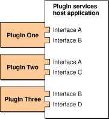

> 导航：[总目录](../../../README.md) · [documentation](../../../_indexes/documentation.md) · [Plug-in Programming Topics](Introduction%20to%20Plug-ins.md)

[Next](Plug-ins%20and%20Microsoft%E2%80%99s%20COM.md)[Previous](About%20Plug-ins.md)

# Plug-in Architecture

All plug-in models require two basic entities—the plug-in host and the plug-in itself. The host could be an application, operating system, or even another plug-in. The plug-in host’s code is structured such that certain well-defined areas of functionality can be provided by an external module of code—a plug-in. Plug-ins are written and compiled entirely separately from the host, typically by another developer. When the host code is executed, it uses whatever mechanism is provided by the plug-in architecture to locate compatible plug-ins and load them, thus adding capabilities to the host that were not previously available.

__Figure 1__  A CFPlugIn host with three plug-ins.

The plug-in model is flexible enough to be used in at least two fundamentally different ways. The first approach is to use plug-ins to support “variations on a theme” features wherein each plug-in implements very similar functionality and uses an identical interface. This methodology is frequently employed to add special processing support to image-editing and audio-editing applications.

An audio-editing application, for instance, might ship with only a few simple processing options like equalization and normalization. If this application has a plug-in architecture, a third party could add support for additional processing functions—perhaps reverberation or flanging—without access to the application’s source code. This is possible because the host application’s developer has provided a clearly defined interface that all of its audio processing plug-ins must use. By requiring the host and plug-in to communicate only through this well-specified interface, the plug-in architecture allows the audio application to remain entirely ignorant of the details of processing.

Using this approach, the host application developer designs a plug-in interface with one function for processing data. To identify the interface, the host developer gives it a unique ID. The interface also contains a place to put a string describing the type of processing so that the host application can distinguish between plug-ins implementing the interface.

When the host application is launched, it searches for all plug-ins with the appropriate identifier. For each plug-in found, the host uses the plug-in architecture to obtain the processing description string and a pointer to the processing function. The host can then construct a menu of available audio processing techniques and present them to the user. When a user chooses a processing type from the menu, the host calls the associated function to do the work. The host knows nothing about the details of the plug-in’s implementation, and the plug-in knows nothing about the application’s implementation. Either one might be completely rewritten, but as long as the interface is honored by both parties, everything will continue to work.

The plug-in model can also be used as a component architecture wherein each component (a plug-in) implements very different functionality. In this approach, you would structure your application as a plug-in “shell” and a set of plug-ins, each of which takes care of a major area of application function—user interface, file system interaction, network communications, and so on.

This model offers benefits similar to those of the more literal plug-in approach outlined above. Because a component’s implementation details are hidden from other components, they can be modified at will so long as the component interfaces continue to behave as specified. An added benefit of this approach is that components can be easily shared among different applications. Note that you can use both approaches in a single application.

[Next](Plug-ins%20and%20Microsoft%E2%80%99s%20COM.md)[Previous](About%20Plug-ins.md)

