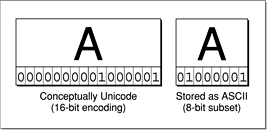
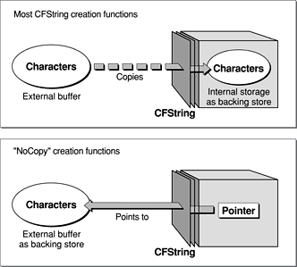

> 导航：[总目录](../../../README.md) · [documentation](../../../_indexes/documentation.md) · [String Programming Guide for Core Foundation](Introduction%20to%20Strings%20Programming%20Guide%20for%20Core%20Foundation.md)

[Next](Creating%20and%20Copying%20Strings.md)[Previous](The%20Unicode%20Basis%20of%20CFString%20Objects.md)

# String Storage

Although _conceptually_ CFString objects store strings as arrays of Unicode characters, in practice they often store them more efficiently. The memory a CFString object requires to represent a string could often be less than that required by a simple `UniChar` array.

For immutable strings, this efficiency is possible because some standard 8-bit encodings of a character value—namely ASCII and related encodings such as ISO Latin-1—are subsets of the 16-bit Unicode representation of the same value. With ASCII character values in the Unicode scheme, for example, the left most eight bits are zeros; the right most eight bits are identical to those in the 8-bit encoding. String objects only attempts this compressed type of storage if the encoding allows fast (O(1)) conversion to Unicode characters.

__Figure 1__  Storage of an immutable CFString derived from ASCII encoding

Mutable CFString objects perform a similar type of optimization. For example, a mutable string might have 8-bit backing store until a character above the ASCII range is inserted.

CFString objects perform other “tricks” to conserve memory, such as incrementing the reference count when a CFString is copied. For larger strings, they might lazily load them from files or resources and store them internally in B-tree structures.

There is some memory overhead associated with CFString objects. It typically ranges from 4 to 12 bytes, depending on the mutability characteristic and the platform. But the memory-saving strategies employed by string objects more than compensate for this overhead.

In addition to its internal storage mechanisms, some of the programming interfaces of string objects grant you ownership of the string’s backing store or give you quick access to it. Some functions of string objects fetch all stored characters into a local buffer or, for large strings, allow you to process characters efficiently in an in-line buffer.

Most CFString creation functions copy the string in the user-supplied buffer to the backing store of the created object. In some advance usage scenarios, you might find it useful to provide the backing store yourself. The creation functions containing `NoCopy` make the user’s buffer the backing store and allow the created CFString object to point to it. (See [Figure 2](#apple-f4xwc4dqnrsv64tfmyxwi33df52wszbpgiydambrge3tsljrgazdoobqfvkfawcsivddcmjy) for an illustration of this.) The `NoCopy` qualifier, however, is just a “hint”; in some cases the CFString object might copy the buffer’s contents to its internal storage.

You can get further control over the backing store of a string with the `CFStringCreateMutableWithExternalCharactersNoCopy` function. This function creates a reference to a mutable CFString object but allows you to retain full ownership of the Unicode buffer holding the object’s characters; the object itself points to the buffer as its backing store. When you change the contents of the buffer you just need to notify the object. See [Mutable Strings With Client-Owned Buffers](Creating%20and%20Copying%20Strings.md#apple-f4xwc4dqnrsv64tfmyxwi33df52wszbpgiydambrge4dgljrgaytmobu) for more on this subject.

__Figure 2__  CFString objects and their backing stores

[Next](Creating%20and%20Copying%20Strings.md)[Previous](The%20Unicode%20Basis%20of%20CFString%20Objects.md)

