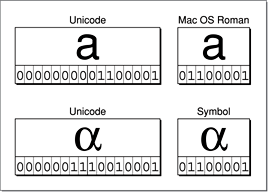

> 导航：[总目录](../../../README.md) · [documentation](../../../_indexes/documentation.md) · [String Programming Guide for Core Foundation](Introduction%20to%20Strings%20Programming%20Guide%20for%20Core%20Foundation.md)

[Next](String%20Storage.md)[Previous](About%20Strings.md)

# The Unicode Basis of CFString Objects

Conceptually, a CFString object represents an array of 16-bit Unicode characters (`UniChar`) along with a count of the number of characters. Unicode-based strings in Core Foundation provide a solid basis for internationalizing the software you develop. Unicode makes it possible to develop and localize a single version of an application for users who speak most of the world’s written languages, including Russian (Cyrillic), Arabic, Chinese, and Japanese.

The Unicode standard is published by the Unicode Consortium ([http://www.unicode.org](http://www.unicode.org/)), an international standards organization. The standard defines three encoding forms (UTF-8, UTF-16, UTF-32) that use a common repertoire of characters and allow for encoding as many as a million characters. This is sufficient for all known character encoding requirements. A “character” in this scheme is the smallest useful element of text in a language; thus it can be a character as understood in most European languages, an ideogram (Chinese Han), a syllable (Japanese hiragana), or some other linguistic unit. Encoded characters also include mathematical, technical, and other symbols as well as diacritics and computer control characters. Each Unicode character is represented by a “code point” having a glyph, a name, and a unique numeric value.

With UTF-16 (16-bit) encoding, Unicode makes over 65,000 code points possible. This capacity is in marked contrast to standard 8-bit encodings, which permit only 256 characters and thus necessitate elaborate ancillary schemes, such as shift or escape bits, to express characters other than those found in the common Indo-European scripts. All the heavily used characters fit into a single 16-bit code unit, while all other characters are accessible via pairs of 16-bit code units called surrogate pairs. A surrogate pair is a sequence of two UTF-16 units, taken from specific reserved ranges, that together represent a single Unicode code point. CFString has functions for converting between surrogate pairs and the UTF-32 representation of the corresponding Unicode code point.

__Figure 1__  Unicode versus other encodings of the same characters

In addition to its encoding scheme, the Unicode standard specifies mappings from the Unicode scheme to repertoires of international, national, and industry character sets. [Figure 1](#apple-f4xwc4dqnrsv64tfmyxwi33df52wszbpgiydambrge3tqljrgazdomzqfvbuqrcdinbekra) illustrates two of these mappings. String objects make frequent use of the encoding mappings. The underlying representation (and in many cases the underlying storage) of strings is Unicode-based. However, the encodings required by the programming interfaces and output devices that actually display the strings in the user interface are commonly 8-bit. Thus there is a need for efficient and accurate conversion between Unicode and other encodings. String objects have functions that purpose, as described in [Converting Between String Encodings](Converting%20Between%20String%20Encodings.md#apple-f4xwc4dqnrsv64tfmyxwi33df52wszbpgiydambrge4dolkdjjbekscbifdq).

For more information on the Unicode standard, see the [consortium’s website](http://www.unicode.org/). The consortium also publishes charts of Unicode code points and glyphs at [www.unicode.org/charts/](http://www.unicode.org/charts/).

[Next](String%20Storage.md)[Previous](About%20Strings.md)

