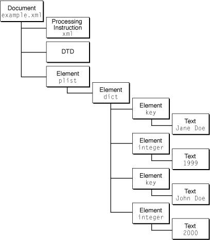

> 导航：[总目录](../../../README.md) · [documentation](../../../_indexes/documentation.md) · [XML Programming Topics for Core Foundation](Introduction%20to%20XML%20Programming%20Topics%20for%20Core%20Foundation.md)


[Next](Document%20Revision%20History.md)[Previous](Core%20Foundation%20XML%20Parser.md)

# Parsing XML Documents

The document shown in Listing 1 contains the XML representation of a very simple Core Foundation property list created using `CFPropertyList`. Note that a property list was chosen purely for the purposes of illustrating XML parser usage in a Core Foundation context. `CFPropertyList` has convenience functions for converting property lists to and from XML format, so in most cases your application would not need to parse an XML property list using the XML parser directly (see _[Property List Programming Topics for Core Foundation](../Property%20List%20Programming%20Topics%20for%20Core%20Foundation/Introduction%20to%20Property%20List%20Programming%20Topics%20for%20Core%20Foundation.md#apple-f4xwc4dqnrsv64tfmyxwi33df52wszbpgeydambqgezta2i)_ for more information).

__Listing 1__  A Core Foundation property list in XML format

```xml
<?xml version="1.0" encoding="UTF-8"?>
<!DOCTYPE plist SYSTEM "file://localhost/System/Library/DTDs/PropertyList.dtd">
<plist version="0.9">
<dict>
    <key>Jane Doe</key>
    <integer>1999</integer>
    <key>John Doe</key>
    <integer>2000</integer>
</dict>
</plist>
```

In this example XML document, the data consists of two names and associated birth years. The `<plist>` tag declares that the enclosed data is a property list that corresponds to the Core Foundation data type `CFPropertyList`. The `<dict>` tag declares that its enclosed data corresponds to a CFDictionary. Finally, the name and birth year data are listed in the key/value pair format required for a `CFDictionary` object.

Listing 2 shows how you would use the high level XML API to convert the sample XML data in [Listing 1](#apple-f4xwc4dqnrsv64tfmyxwi33df52wszbpgiydambrgizteljrgaydsnzrfvbecssiirbuura) into a `CFXMLTree` object. This example assumes that `sourceURL` is a valid `CFURL` object and refers to the XML document.

__Listing 2__  Using the tree-based parser API

```
CFXMLTreeRef    cfXMLTree;
CFDataRef       xmlData;

// Load the XML data using its URL.
CFURLCreateDataAndPropertiesFromResource(kCFAllocatorDefault,
                sourceURL, &xmlData, NULL, NULL, NULL)

// Parse the XML and get the CFXMLTree.
cfXMLTree = CFXMLTreeCreateFromData(kCFAllocatorDefault,
                    xmlData,
                    sourceURL,
                    kCFXMLParserSkipWhitespace,
                    kCFXMLNodeCurrentVersion);
```

Figure 1 illustrates the structure of the `CFXMLTree` object produced by the code in [Listing 2](#apple-f4xwc4dqnrsv64tfmyxwi33df52wszbpgiydambrgizteljrgaytcmbsfvbegskeiveuuri). As you would expect, it exactly reflects the structure of the original XML document. The diagram displays the data type code and data string from each `CFXMLNode` object.

__Figure 1__  The structure of a CFXMLTree



The example in Listing 3 shows how to use some of the XML convenience functions to examine the top level of a `CFXMLTree` object and print out each node’s data string contents.

__Listing 3__  Obtaining information from a CFXMLTree

```
CFXMLTreeRef    xmlTreeNode;
CFXMLNodeRef    xmlNode;
int             childCount;
int             index;

// Get a count of the top level node’s children.
childCount = CFTreeGetChildCount(cfXMLTree);

// Print the data string for each top-level node.
for (index = 0; index < childCount; index++) {
    xmlTreeNode = CFTreeGetChildAtIndex(cfXMLTree, index);
    xmlNode = CFXMLTreeGetNode(xmlTreeNode);
    CFShow(CFXMLNodeGetString(xmlNode));
}
```


The event-driven parser API gives you complete flexibility to do whatever you wish with the data in an XML document. To use the event-driven parser API, you define a set of callback functions that the parser invokes as it encounters specific structures in the XML document. The code in this section shows how to use the event-driven parser to print the data in an XML document. A sample implementation for each callback function is shown, and then the code to create and run the parser.

The code in Listing 4 implements the first—and by far the longest—callback function, `CFXMLParserCreateXMLStructureCallBack`. This example implementation prints the contents of each new XML structure’s additional information data as it is encountered.

__Listing 4__  Implementing the CFXMLParserCreateXMLStructureCallBack function

```swift
void *createStructure(CFXMLParserRef parser,
            CFXMLNodeRef node, void *info) {

    CFStringRef myTypeStr;
    CFStringRef myDataStr;
    CFXMLDocumentInfo *docInfoPtr;

    // Use the dataTypeID to determine what to print.
    switch (CFXMLNodeGetTypeCode(node)) {
        case kCFXMLNodeTypeDocument:
            myTypeStr = CFSTR("Data Type ID: kCFXMLNodeTypeDocument\n");
            docInfoPtr = CFXMLNodeGetInfoPtr(node);
            myDataStr = CFStringCreateWithFormat(NULL,
                        NULL,
                        CFSTR("Document URL: %@\n"),
                        CFURLGetString(docInfoPtr->sourceURL));
            break;
        case kCFXMLNodeTypeElement:
            myTypeStr = CFSTR("Data Type ID: kCFXMLNodeTypeElement\n");
            myDataStr = CFStringCreateWithFormat(NULL, NULL,
                    CFSTR("Element: %@\n"), CFXMLNodeGetString(node));
            break;
        case kCFXMLNodeTypeProcessingInstruction:
            myTypeStr = CFSTR("Data Type ID:
                    kCFXMLNodeTypeProcessingInstruction\n");
            myDataStr = CFStringCreateWithFormat(NULL, NULL,
                    CFSTR("PI: %@\n"), CFXMLNodeGetString(node));
            break;
        case kCFXMLNodeTypeComment:
            myTypeStr = CFSTR("Data Type ID: kCFXMLNodeTypeComment\n");
            myDataStr = CFStringCreateWithFormat(NULL, NULL,
                    CFSTR("Comment: %@\n"), CFXMLNodeGetString(node));
            break;
        case kCFXMLNodeTypeText:
            myTypeStr = CFSTR("Data Type ID: kCFXMLNodeTypeText\n");
            myDataStr = CFStringCreateWithFormat(NULL, NULL,
                    CFSTR("Text:%@\n"), CFXMLNodeGetString(node));
            break;
        case kCFXMLNodeTypeCDATASection:
            myTypeStr = CFSTR("Data Type ID: k
                    CFXMLDataTypeCDATASection\n");
            myDataStr = CFStringCreateWithFormat(NULL, NULL,
                    CFSTR("CDATA: %@\n"), CFXMLNodeGetString(node));
            break;
        case kCFXMLNodeTypeEntityReference:
            myTypeStr = CFSTR("Data Type ID:
                    kCFXMLNodeTypeEntityReference\n");
            myDataStr = CFStringCreateWithFormat(NULL, NULL,
                    CFSTR("Entity reference: %@\n"),
                    CFXMLNodeGetString(node));
            break;
        case kCFXMLNodeTypeDocumentType:
            myTypeStr = CFSTR("Data Type ID: kCFXMLNodeTypeDocumentType\n");
            myDataStr = CFStringCreateWithFormat(NULL, NULL,
                    CFSTR("DTD: %@\n"), CFXMLNodeGetString(node));
            break;
        case kCFXMLNodeTypeWhitespace:
            myTypeStr = CFSTR("Data Type ID: kCFXMLNodeTypeWhitespace\n");
            myDataStr = CFStringCreateWithFormat(NULL, NULL,
                    CFSTR("Whitespace: %@\n"), CFXMLNodeGetString(node));
            break;
        default:
            myTypeStr = CFSTR("Data Type ID: UNKNOWN\n");
            myDataStr = CFSTR("Unknown type.\n");
        }

    // Print the contents.
    printf("---Create Structure Called--- \n");
    CFShow(myTypeStr);
    CFShow(myDataStr);

    // Return the data string for use by the addChild and
    // endStructure callbacks.
    return myDataStr;
}
```

Notice that the `CFXMLParserCreateXMLStructureCallBack` function returns the data string created using the `dataString` field of the newly encountered structure. This return value can actually be anything, but is kept by the parser and passed back to you by both the `CFXMLParserAddChildCallBack` and `CFXMLParserEndXMLStructureCallBack` functions described below. Note that if your `CFXMLParserCreateXMLStructureCallBack` function returns `NULL`, `CFXMLParserAddChildCallBack` and `CFXMLParserEndXMLStructureCallBack` will _not_ be called. The only exception is `CFNodeTypeDocument`; `CFXMLParserEndXMLStructureCallBack` will be called for it even if you return `NULL` from `CFXMLParserCreateXMLStructureCallBack`.

The parser invokes the `CFXMLParserAddChildCallBack` when it encounters a child of the most recently parsed structure. In this example, the `CFXMLParserAddChildCallBack` callback shown in Listing 5 simply prints out both of the strings to make clear the parent–child relationships of the XML structures being parsed.

__Listing 5__  Implementing the CFXMLParserAddChildCallBack function

```
void addChild(CFXMLParserRef parser, void *parent, void *child, void *info) {
    printf("---Add Child Called--- \n");
    printf("Parent being added to: "); CFShow((CFStringRef)parent);
    printf("Child being added: "); CFShow((CFStringRef)child);
}
```

The parser calls the `CFXMLParserEndXMLStructureCallBack` function, implemented in Listing 6, when it moves beyond a given structure. The `xmlType` parameter is a pointer to whatever data the `CFXMLParserCreateXMLStructureCallBack` function returned when the structure’s open tag was first encountered. In this example implementation, the callback prints out a string indicating which structure has ended.

__Listing 6__  Implementing the endStructure callback

```
void endStructure(CFXMLParserRef parser, void *xmlType, void *info) {
    // Leave evidence that we were called.
    printf("---End Structure Called for \n"); CFShow((CFStringRef)xmlType);

    // Now that the structure and all of its children have been parsed,
    // we can release the string.
    CFRelease(xmlType);
}
```

The parser calls the `CFXMLParserResolveExternalEntityCallBack` function when it encounters an external entity reference. The example XML data in this section contains no entity references so this callback is not invoked. Listing 7 shows a minimal implementation.

__Listing 7__  Implementing the CFXMLParserResolveExternalEntityCallBack function

```
CFDataRef resolveEntity(CFXMLParserRef parser, CFStringRef publicID,
        CFURLRef systemID, void *info) {
    printf("---resolveEntity Called---\n");
    return NULL;
}
```

The parser calls the `CFXMLParserHandleErrorCallBack` callback when it encounters an error condition. As shown in Listing 8, you can use the XML API to get both the error string and error location information from the parser. If you return `false` from this callback, the parser aborts. If you return `true` and the error is nonfatal, the parser continues processing.

__Listing 8__  Implementing the handleError CFXMLParserHandleErrorCallBack function

```
Boolean handleError(CFXMLParserRef parser, SInt32 error, void *info) {
    char buf[512], *s;

    // Get the error description string from the Parser.
    CFStringRef description = CFXMLParserCopyErrorDescription(parser);
    s = (char *)CFStringGetCStringPtr(description,
                    CFStringGetSystemEncoding());

    // If the string pointer is unavailable, do some extra work.
    if (!s) {
        CFStringGetCString(description, buf, 512,
                    CFStringGetSystemEncoding());
    }

    CFRelease(description);

    // Report the exact location of the error.
    fprintf(stderr, "Parse error (%d) %s on line %d, character %d\n",
                    (int)error,
                    s,
                    (int)CFXMLParserGetLineNumber(parser),
                    (int)CFXMLParserGetLocation(parser));

    return false;
}
```

Listing 9 demonstrates how to create and invoke the parser.

__Listing 9__  Creating and invoking the XML parser

```
// First, set up the parser callbacks.
CFXMLParserCallBacks callbacks = {0, createStructure, addChild, endStructure, resolveEntity, handleError};

// Create the parser with the option to skip whitespace.
parser = CFXMLParserCreate(kCFAllocatorDefault, xmlData, urlOut, kCFXMLParserSkipWhitespace, kCFXMLNodeCurrentVersion, &callbacks, NULL);

// Invoke the parser.
if (!CFXMLParserParse(parser)) {
    printf("parse failed\n");
}
```

As you can see, once the callbacks have been implemented, the code to create and call the parser is quite simple. `“Parser output”` shows the output generated by the code in `[“Creating and invoking the XML parser”](#apple-f4xwc4dqnrsv64tfmyxwi33df52wszbpgiydambrgizteljrgazdcnzsfvbegskei5cucsa)`.

__Listing 10__  Parser output

```
---Create Structure Called---
    Data Type ID: kCFXMLNodeTypeDocument, Document: file://localhost/myPlist.xml
---Create Structure Called---
    Data Type ID: kCFXMLNodeTypeProcessingInstruction, PI: xml
---Add Child Called---
    Parent being added to: Document: file://localhost/myPlist.xml
    Child being added: PI: xml
---End Structure Called for PI: xml
---Create Structure Called---
    Data Type ID: kCFXMLNodeTypeDocumentType, DTD
---Add Child Called---
    Parent being added to: Document: file://localhost/myPlist.xml
    Child being added: DTD
---End Structure Called for DTD
---Create Structure Called---
    Data Type ID: kCFXMLNodeTypeElement, Element: plist
---Add Child Called---
    Parent being added to: Document: file://localhost/myPlist.xml
    Child being added: Element: plist
---Create Structure Called---
    Data Type ID: kCFXMLNodeTypeElement, Element: dict
---Add Child Called---
    Parent being added to: Element: plist
    Child being added: Element: dict
---Create Structure Called---
    Data Type ID: kCFXMLNodeTypeElement, Element: key
---Add Child Called---
    Parent being added to: Element: dict
    Child being added: Element: key
---Create Structure Called---
    Data Type ID: kCFXMLNodeTypeText, Text: Jane Doe
---Add Child Called---
    Parent being added to: Element: key
    Child being added: Text: Jane Doe
---End Structure Called for Text: Jane Doe
---End Structure Called for Element: key
---Create Structure Called---
    Data Type ID: kCFXMLNodeTypeElement, Element: integer
---Add Child Called---
    Parent being added to: Element: dict
    Child being added: Element: integer
---Create Structure Called---
    Data Type ID: kCFXMLNodeTypeText, Text: 1999
---Add Child Called---
    Parent being added to: Element: integer
    Child being added: Text: 1999
---End Structure Called for Text: 1999
---End Structure Called for Element: integer
---Create Structure Called---
    Data Type ID: kCFXMLNodeTypeElement, Element: key
---Add Child Called---
    Parent being added to: Element: dict
    Child being added: Element: key
---Create Structure Called---
    Data Type ID: kCFXMLNodeTypeText, Text: John Doe
---Add Child Called---
    Parent being added to: Element: key
    Child being added: Text: John Doe
---End Structure Called Text: John Doe
---End Structure Called for Element: key
---Create Structure Called---
    Data Type ID: kCFXMLNodeTypeElement, Element: integer
---Add Child Called---
    Parent being added to: Element: dict
    Child being added: Element: integer
---Create Structure Called---
    Data Type ID: kCFXMLNodeTypeText, Text: 2000
---Add Child Called---
    Parent being added to: Element: integer
    Child being added: Text: 2000
---End Structure Called for Text: 2000
---End Structure Called for Element: integer
---End Structure Called for Element: dict
---End Structure Called for Element: plist
```

[Next](Document%20Revision%20History.md)[Previous](Core%20Foundation%20XML%20Parser.md)

