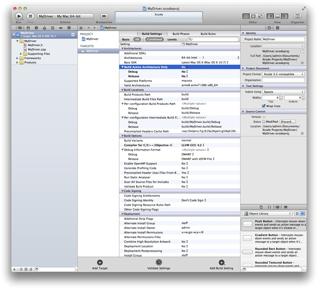

> 导航：[总目录](../../../README.md) · [documentation](../../../_indexes/documentation.md) · [Kernel Extension Programming Topics](Introduction.md)


[Next](Debugging%20a%20Kernel%20Extension%20with%20GDB.md)[Previous](Creating%20a%20Generic%20Kernel%20Extension%20with%20Xcode.md)

# Creating a Device Driver with Xcode

In this tutorial, you learn how to create an I/O Kit device driver for OS X. You create a simple driver that prints text messages, but doesn’t actually control a device. This tutorial does not cover the process for loading or debugging your driver—see [Debugging a Kernel Extension with GDB](Debugging%20a%20Kernel%20Extension%20with%20GDB.md#apple-f4xwc4dqnrsv64tfmyxwi33df52wszbpgiydambsgm3dolkdjbcesscgireq) after you have completed this tutorial for information on loading and debugging.

If you are unfamiliar with Xcode, first read _[A Tour of Xcode](../../Developer%20Tools/A%20Tour%20of%20Xcode/Introduction.md#apple-f4xwc4dqnrsv64tfmyxwi33df52wszbpkridgmbqgaydqojq)_.

Here are the major steps you will follow:

1. [Familiarize Yourself with the I/O Kit Architecture](#apple-f4xwc4dqnrsv64tfmyxwi33df52wszbpgiydambsgm3dmlktk4yta)
2. [Create a New Project](#apple-f4xwc4dqnrsv64tfmyxwi33df52wszbpgiydambsgm3dmljzhaydcmy)
3. [Edit the Information Property List](#apple-f4xwc4dqnrsv64tfmyxwi33df52wszbpgiydambsgm3dmljzhaztema)
4. [Fill in the Header File](#apple-f4xwc4dqnrsv64tfmyxwi33df52wszbpgiydambsgm3dmljrgaydcmrq)
5. [Implement the Driver’s Entry Points](#apple-f4xwc4dqnrsv64tfmyxwi33df52wszbpgiydambsgm3dmljrgaydkobs)
6. [Add Library Declarations](#apple-f4xwc4dqnrsv64tfmyxwi33df52wszbpgiydambsgm3dmlktk4yq)
7. [Prepare the Driver for Loading](#apple-f4xwc4dqnrsv64tfmyxwi33df52wszbpgiydambsgm3dmlktk43a)

This tutorial assumes that you are logged in as an administrator of your machine, which is necessary for using the `sudo` command.

Every I/O Kit driver is based on an I/O Kit __family__, a collection of C++ classes that implement functionality that is common to all devices of a particular type. Examples of I/O Kit families include storage devices (disks), networking devices, and human-interface devices (such as keyboards).

An I/O Kit driver communicates with the device it controls through a __provider object__, which typically represents the bus connection for the device. Provider objects that do so are referred to as __nubs__.

An I/O Kit driver is loaded into the kernel automatically when it __matches__ against a device that is represented by a nub. A driver matches against a device by defining one or more __personalities__, descriptions of the types of device the driver can control.

After an I/O Kit driver matches against a device and loads into the kernel, it routes I/O for the device, as well as vending __services__ related to the device, such as providing a firmware update mechanism.

Before you begin creating your own driver, you should make sure you understand the architecture of the I/O Kit by reading [Architectural Overview](https://developer.apple.com/library/archive/documentation/DeviceDrivers/Conceptual/IOKitFundamentals/ArchitectOverview/ArchitectOverview.html#//apple_ref/doc/uid/TP0000013) in _[IOKit Fundamentals](../../Device%20Drivers/IOKit%20Fundamentals/Introduction%20to%20I-O%20Kit%20Fundamentals.md#apple-f4xwc4dqnrsv64tfmyxwi33df52wszbpkridambqgaydcmi)_.

Creating an I/O Kit driver project in Xcode is as simple as selecting the appropriate project template and providing a name.

1. Launch Xcode.
2. Choose File > New > New Project. The New Project panel appears.
3. In the New Project panel, select System Plug-in from the list of project categories on the left. Select IOKit Driver from the list of templates on the right. Click Next.
4. In the screen that appears, enter `MyDriver` for the product name, enter a company identifier, and click Next.
5. Choose a location for the project, and click Create.

   Xcode creates a new project and displays its project window. You should see something like this:

   

   The new project contains several files, including a source file, `MyDriver.cpp`, which contains no code.
6. Make sure the kext is building for the correct architectures.

   (If you don’t see the screen above, select MyDriver under Targets. Select the Build Settings tab. Click the disclosure triangle next to Architectures.)

   Next to Build Active Architecture Only make sure to select No—this is especially important if you are running a 32-bit kernel on a 64-bit machine.

Like all bundles, a device driver contains an information property list, which describes the driver. The default `Info.plist` file created by Xcode contains template values that you must edit to describe your driver.

A device driver’s `Info.plist` file is in XML format. Whenever possible, you should view and edit the file from within Xcode or within the Property List Editor application. In this way, you help ensure that you don’t add elements (such as comments) that cannot be parsed by the kernel during early boot.

1. Click Info.plist in the Xcode project window.

   Xcode displays the `Info.plist` file in the editor pane. You should see the elements of the property list file, as shown in Figure 1.

   __Figure 1__  MyDriver `Info.plist`

   !

   By default, Xcode’s property list editor masks the actual keys and values of a property list. To see the actual keys and values, Control-click anywhere in the property list editor and choose Show Raw Keys/Values from the contextual menu.
2. Change the value of the `CFBundleIdentifier` property to use your unique namespace prefix.

   On the line for `CFBundleIdentifier`, double-click in the Value column to edit it. Select `com.yourcompany` and change it to `com.MyCompany` (or your company’s DNS domain in reverse). The value should now be `com.MyCompany.driver.${PRODUCT_NAME:rfc1034identifier}`.

   Bundles in OS X typically use a reverse-DNS naming convention to avoid namespace collisions. This convention is particularly important for kexts, because all loaded kexts share a single namespace for bundle identifiers.

   The last portion of the default bundle identifier, `${PRODUCT_NAME:rfc1034identifier}`, is replaced with the Product Name build setting for the driver target when you build your project.
3. Add a personality to your driver’s `IOKitPersonalities` dictionary.

   Click the `IOKitPersonalities` property to select it, then click its disclosure triangle so that it points down.

   Click the New Child symbol on the right side of the selected line. A property titled `New item` appears as a child of the `IOKitPersonalities` property. Change the name of `New item` to `MyDriver`.

   Make the `MyDriver` item a dictionary. Control-click it and choose Value Type > Dictionary from the contextual menu.

   Your device driver requires one or more entries in the `IOKitPersonalities` dictionary of its information property list. This dictionary defines properties used for matching your driver to a device and loading it.
4. Fill in the personality dictionary.

   Create a child entry for the `MyDriver` dictionary. Rename the child from `New item` to `CFBundleIdentifier`. Copy and paste the value from the property list’s top-level `CFBundleIdentifier` value (`com.MyCompany.driver.${PRODUCT_NAME:rfc1034identifier}`) as the value.

   Create a second child for the `MyDriver` dictionary. Rename the child to `IOClass`. Enter `com_MyCompany_driver_MyDriver` as the value. Note that this is the same value as for the `CFBundleIdentifier`, except it separates its elements with underbars instead of dots. This value is used as the class name for your device driver.

   Create a third child for the `MyDriver` dictionary. Rename the child to `IOKitDebug`. Enter `65535` as the value and change the value type from String to Number. If you specify a nonzero value for this property, your driver provides useful debugging information when it matches and loads. When you build your driver for public release, you should specify `0` as the value for this property or remove it entirely.

   Create two more children for the `MyDriver` dictionary. Assign their names and values according to Table 1.

   __Table 1__  `MyDriver` personality dictionary values

   | Name | Value |
   | `IOProviderClass` | `IOResources` |
   | `IOMatchCategory` | `com_MyCompany_driver_MyDriver` |

   These elements together define a successful match for your driver, so that it can be loaded. They serve the following purposes:

   - `IOProviderClass` indicates the class of the provider objects that your driver can match on. Normally a device driver matches on the nub that controls the port that your device is connected to. For example, if your driver connects to a PCI bus, you should specify `IOPCIDevice` as your driver's provider class. In this tutorial, you are creating a virtual driver with no device, so it matches on `IOResources`.
   - `IOMatchCategory` allows other drivers to match on the same device as your driver, as long as the drivers’ values for this property differ. This tutorial’s driver matches on `IOResources`, a special provider class that provides system-wide resources, so it needs to include this property to allow other drivers to match on `IOResources` as well. When you develop your driver, you should not include this property unless your driver matches on a device that another driver may match on, such as a serial port with multiple devices attached to it.

   When you have finished adding property list elements, the list should look like the example shown in Figure 2.

   __Figure 2__  `Info.plist` entries after additions

   !!
5. Choose File > Save to save your changes.

Open `MyDriver.h` in your project’s `Source` folder. The default header file contains no code. Figure 3 shows where to find the `MyDriver.h` file in the project window.

__Figure 3__  Viewing source code in Xcode

!

Edit the contents of `MyDriver.h` to match the code in Listing 1.

__Listing 1__  `MyDriver.h` file contents

```c

#include <IOKit/IOService.h>
class com_MyCompany_driver_MyDriver : public IOService
{
OSDeclareDefaultStructors(com_MyCompany_driver_MyDriver)
public:
    virtual bool init(OSDictionary *dictionary = 0);
    virtual void free(void);
    virtual IOService *probe(IOService *provider, SInt32 *score);
    virtual bool start(IOService *provider);
    virtual void stop(IOService *provider);
};
```

Notice that the first line of `MyDriver.h` includes the header file `IOService.h`. This header file defines many of the methods and services that device drivers use. The header file is located in the `IOKit` folder of `Kernel.framework`. When you develop your own driver, be sure to include only header files from `Kernel.framework` (in addition to header files you create), because only these files have meaning in the kernel environment. If you include other header files, your driver might compile, but it fails to load because the functions and services defined in those header files are not available in the kernel.

Note that when you are developing your own driver, you should replace instances of `com_MyCompany_driver_MyDriver` with the name of your driver’s class.

In the header file of every driver class, the `OSDeclareDefaultStructors` macro must be the first line in the class’s declaration. The macro takes one argument: the class’s name. It declares the class’s constructors and destructors for you, in the manner that I/O Kit expects.

1. Open `MyDriver.cpp` in your project’s `Source` folder. The default file contains no code.
2. Edit `MyDriver.cpp` to match the code in Listing 2.

   __Listing 2__  `MyDriver.cpp` file contents

```c

#include <IOKit/IOLib.h>
#include "MyDriver.h"

// This required macro defines the class's constructors, destructors,
// and several other methods I/O Kit requires.
OSDefineMetaClassAndStructors(com_MyCompany_driver_MyDriver, IOService)

// Define the driver's superclass.
#define super IOService

bool com_MyCompany_driver_MyDriver::init(OSDictionary *dict)
{
    bool result = super::init(dict);
    IOLog("Initializing\n");
    return result;
}

void com_MyCompany_driver_MyDriver::free(void)
{
    IOLog("Freeing\n");
    super::free();
}

IOService *com_MyCompany_driver_MyDriver::probe(IOService *provider,
    SInt32 *score)
{
    IOService *result = super::probe(provider, score);
    IOLog("Probing\n");
    return result;
}

bool com_MyCompany_driver_MyDriver::start(IOService *provider)
{
    bool result = super::start(provider);
    IOLog("Starting\n");
    return result;
}

void com_MyCompany_driver_MyDriver::stop(IOService *provider)
{
    IOLog("Stopping\n");
    super::stop(provider);
}
```

   The `OSDefineMetaClassAndStructors` macro must appear before you define any of your class’s methods. This macro takes two arguments: your class’s name and the name of your class’s superclass. The macro defines the class’s constructors, destructors, and several other methods required by the I/O Kit.

   This listing includes the entry point methods that the I/O Kit uses to access your driver. These entry points serve the following purposes:

   - The `init` method is the first instance method called on each instance of your driver class. It is called only once on each instance. The `free` method is the last method called on any object. Any outstanding resources allocated by the driver should be disposed of in `free`. Note that the `init` method operates on objects generically; it should be used only to prepare objects to receive calls. Actual driver functionality should be set up in the `start` method.
   - The `probe` method is called if your driver needs to communicate with hardware to determine whether there is a match. This method must leave the hardware in a good state when it returns, because other drivers may probe the hardware as well.
   - The `start` method tells the driver to start driving hardware. After `start` is called, the driver can begin routing I/O, publishing nubs, and vending services. The `stop` method is the first method to be called before your driver is unloaded. When `stop` is called, your driver should clean up any state it created in its `start` method. The `start` and `stop` methods talk to the hardware through your driver’s provider class.

   The `IOLog` function is the kernel equivalent of `printf` for an I/O Kit driver.
3. Save your changes by choosing File > Save.
4. Build your project by choosing Build > Build. Fix any compiler errors before continuing.

Because kexts are linked at load time, a kext must list its libraries in its information property list with the `OSBundleLibraries` property. At this stage of creating your driver, you need to find out what those libraries are. The best way to do so is to run the `kextlibs` tool on your built kext and copy its output into your kext’s `Info.plist` file.

`kextlibs` is a command-line program that you run with the Terminal application. Its purpose is to identify libraries that your kext needs to link against.

1. Start the Terminal application, located in `/Applications/Utilities`.
2. In the Terminal window, move to the directory that contains your driver.

   Xcode stores your driver in the `Debug` folder of the `build` folder of your project (unless you’ve chosen a different build configuration or set a different location for build products using the Xcode Preferences dialog):

```
$ cd MyDriver/build/Debug
```

   This directory contains your driver. It should have the name `MyDriver.kext`. This name is formed from the Product Name, as set in your target’s build settings, and a suffix, in this case `.kext`.
3. Run `kextlibs` on your driver with the `-xml` command-line flag.

   This command looks for all unresolved symbols in your kernel extension’s executable among the installed library extensions (in `/System/Library/Extensions/`) and prints an XML fragment suitable for pasting into an `Info.plist` file. For example:

```
$ kextlibs -xml MyDriver.kext
        <key>OSBundleLibraries</key>
        <dict>
                <key>com.apple.kpi.iokit</key>
                <string>10.2</string>
                <key>com.apple.kpi.libkern</key>
                <string>10.2</string>
        </dict>
```
4. Make sure `kextlibs` exited with a successful status by checking the shell variable `$?`.

```
$ echo $?
0
```

   If `kextlibs` prints any errors or exits with a nonzero status, it may have been unable to locate some symbols. For this tutorial, the libraries are known, but in general usage you should use the `kextfind` tool to find libraries for any symbols that `kextlibs` cannot locate. See [Locate Kexts](Command-Line%20Tools%20for%20Analyzing%20Kernel%20Extensions.md#apple-f4xwc4dqnrsv64tfmyxwi33df52wszbpkridimbqga4tinjvfvjvomq).
5. Select the XML output of `kextlibs` and choose Edit > Copy.

Earlier you edited the information property list with the Xcode graphical property list editor. For this operation, however, you need to edit the information property list as text.

1. Control-click Info.plist in the Xcode project window, then choose Open As > Source Code File from the contextual menu.

   Xcode displays the `Info.plist` file in the editor pane. You should see the XML contents of the property list file, as shown in Figure 3. Note that dictionary keys and values are listed sequentially.

   __Figure 4__  MyKext `Info.plist` file as text

   !
2. Select all the lines defining the empty OSBundleLibraries dictionary.

```
        <key>OSBundleLibraries</key>
        <dict/>
```
3. Paste text into the info dictionary.

   If `kextlibs` ran successfully, choose Edit > Paste to paste the text you copied from Terminal.

   If `kextlibs` didn’t run successfully, type or paste this text into the info dictionary:

```
        <key>OSBundleLibraries</key>
        <dict>
                <key>com.apple.kpi.iokit</key>
                <string>10.2</string>
                <key>com.apple.kpi.libkern</key>
                <string>10.2</string>
        </dict>
```
4. Save your changes by choosing File > Save.
5. Rebuild your driver (choose Build > Build) with the new information property list. Fix any compiler errors before continuing.

Now you are ready to prepare your driver for loading. You do this with the `kextutil` tool, which can examine a kext and determine whether it is able to be loaded. `kextutil` can also load a kext for development purposes, but that functionality is not covered in this tutorial.

Kexts have strict permissions requirements (see [Kernel Extensions Have Strict Security Requirements](The%20Anatomy%20of%20a%20Kernel%20Extension.md#apple-f4xwc4dqnrsv64tfmyxwi33df52wszbpgiydambsgm3dilktk4yq) for details). The easiest way to set these permissions is to create a copy of your driver as the `root` user. Type the following into Terminal from the proper directory and provide your password when prompted:

```
$ sudo cp -R MyDriver.kext /tmp
```

Now that the permissions of the driver’s temporary copy are correct, you are ready to run `kextutil`.

Type the following into Terminal:

```
$ kextutil -n -t /tmp/MyDriver.kext
```

The `-n` (or `-no-load`) option tells `kextutil` not to load the driver, and the `-t` (or `-print-diagnostics`) option tells `kextutil` to print the results of its analysis to Terminal. If you have followed the previous steps in this tutorial correctly, `kextutil` indicates that the kext is loadable and properly linked.

```
No kernel file specified; using running kernel for linking.
Notice: /tmp/MyDriver.kext has debug properties set.
MyDriver.kext appears to be loadable (including linkage for on-disk libraries).
```

The debug property notice is due to the nonzero value of the `IOKitDebug` property in the information property list. Make sure you set this property to `0` or remove it when you build your driver for release.

Congratulations! You have now written, built, and prepared your own driver for loading. In the next tutorial in this series, [Debugging a Kernel Extension with GDB](Debugging%20a%20Kernel%20Extension%20with%20GDB.md#apple-f4xwc4dqnrsv64tfmyxwi33df52wszbpgiydambsgm3dolkdjbcesscgireq), you’ll learn how to load your kext, debug it, and unload it with a two-machine setup.

[Next](Debugging%20a%20Kernel%20Extension%20with%20GDB.md)[Previous](Creating%20a%20Generic%20Kernel%20Extension%20with%20Xcode.md)

