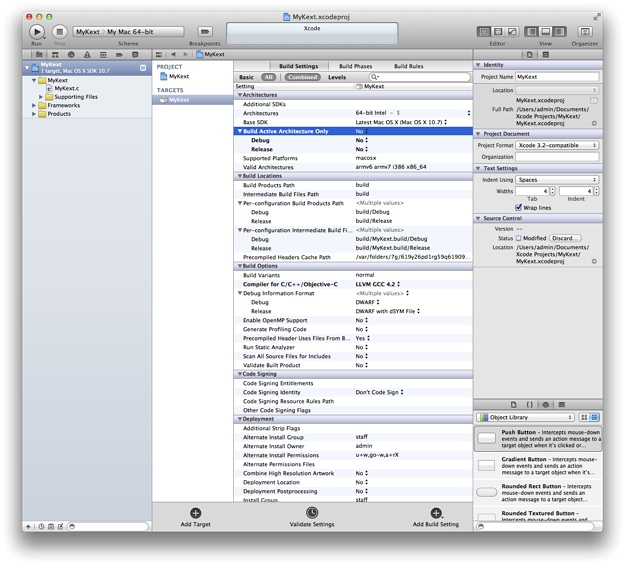

> 导航：[总目录](../../../README.md) · [documentation](../../../_indexes/documentation.md) · [Kernel Extension Programming Topics](Introduction.md)


[Next](Creating%20a%20Device%20Driver%20with%20Xcode.md)[Previous](The%20Anatomy%20of%20a%20Kernel%20Extension.md)

# Creating a Generic Kernel Extension with Xcode

In this tutorial, you learn how to create a generic kernel extension (kext) for OS X. You create a simple kext that prints messages when loading and unloading. This tutorial does not cover the process for loading or debugging your kext—see [Debugging a Kernel Extension with GDB](Debugging%20a%20Kernel%20Extension%20with%20GDB.md#apple-f4xwc4dqnrsv64tfmyxwi33df52wszbpgiydambsgm3dolkdjbcesscgireq) after you have completed this tutorial for information on loading and debugging.

If you are unfamiliar with Xcode, first read _[A Tour of Xcode](../../Developer%20Tools/A%20Tour%20of%20Xcode/Introduction.md#apple-f4xwc4dqnrsv64tfmyxwi33df52wszbpkridgmbqgaydqojq)_.

These are the four major steps you follow:

1. [Create a New Project](#apple-f4xwc4dqnrsv64tfmyxwi33df52wszbpgiydambsgm3dkljyheydmmi)
2. [Implement the Start and Stop Functions](#apple-f4xwc4dqnrsv64tfmyxwi33df52wszbpgiydambsgm3dklktk44q)
3. [Add Library Declarations](#apple-f4xwc4dqnrsv64tfmyxwi33df52wszbpgiydambsgm3dklktk4yq)
4. [Prepare the Kernel Extension for Loading](#apple-f4xwc4dqnrsv64tfmyxwi33df52wszbpgiydambsgm3dkljzgazdqny)

This tutorial assumes that you are logged in as an administrator of your machine, which is necessary for using the `sudo` command.

Creating a kext project in Xcode is as simple as selecting the appropriate project template and providing a name.

1. Launch Xcode.
2. Choose File > New > New Project. The New Project panel appears.
3. In the New Project panel, select System Plug-in from the list of project categories on the left. Select Generic Kernel Extension from the list of templates on the right. Click Next.
4. In the screen that appears, enter `MyKext` for the product name, enter a company identifier, and click Next.
5. Choose a location for the project, and click Create.

   Xcode creates a new project and displays its project window. You should see something like this:

   

   The new project contains several files, including a source file, `MyKext.c`, that contains templates for the kext’s start and stop functions.
6. Make sure the kext is building for the correct architectures.

   (If you don’t see the screen above, select MyKext under Targets. Select the Build Settings tab. Click the disclosure triangle next to Architectures.)

   Next to Build Active Architecture Only make sure to select No—this is especially important if you are running a 32-bit kernel on a 64-bit machine.

Now that you’ve created the project, it’s time to make your kext do something when it gets loaded and unloaded. You’ll do so by adding code to your kext’s start and stop functions, which are called when your kext is loaded and unloaded.

1. Open `MyKext.c` to edit the start and stop functions.

   Figure 1 shows the unedited file.

   __Figure 1__  Viewing source code in Xcode

   !

   The default start and stop functions do nothing but return a successful status. A real kext’s start and stop functions typically register and unregister callbacks with kernel runtime systems, but for this tutorial, your kext simply prints messages so that you can confirm when your kext has been started and stopped.
2. Edit `MyKext.c` to match the code in Listing 1.

   __Listing 1__  `MyKext.c` file contents

```c
#include <sys/systm.h>
#include <mach/mach_types.h>

kern_return_t MyKext_start (kmod_info_t * ki, void * d)
{
    printf("MyKext has started.\n");
    return KERN_SUCCESS;
}

kern_return_t MyKext_stop (kmod_info_t * ki, void * d)
{
    printf("MyKext has stopped.\n");
    return KERN_SUCCESS;
}
```

   Notice that `MyKext.c` includes two header files, `<sys/systm.h>` and `<mach/mach_types.h>`. Both header files reside in `Kernel.framework`. When you develop your own kext, be sure to include only header files from `Kernel.framework` (in addition to any header files you create), because only these files have meaning in the kernel environment. If you include headers from outside `Kernel.framework`, your kernel extension might compile, but it will probably fail to load or run because the functions and services those headers define are not available in the kernel.
3. Save your changes by choosing File > Save.

Like all bundles, a kext contains an information property list, which describes the kext. The default `Info.plist` file created by Xcode contains template values that you must edit to describe your kext.

A kext’s `Info.plist` file is in XML format. Whenever possible, you should view and edit the file from within Xcode or within the Property List Editor application. In this way, you help ensure that you don’t add elements (such as comments) that cannot be parsed by the kernel during early boot.

1. Click Info.plist in the Xcode project window.

   Xcode displays the `Info.plist` file in the editor pane. You should see the elements of the property list file, as shown in Figure 2.

   __Figure 2__  MyKext `Info.plist`

   !

   By default, Xcode’s property list editor masks the actual keys and values of a property list. To see the actual keys and values, Control-click anywhere in the property list editor and choose Show Raw Keys/Values from the contextual menu.
2. Change the value of the `CFBundleIdentifier` property to use your unique namespace prefix.

   On the line for `CFBundleIdentifier`, double-click in the Value column to edit it. Select `com.yourcompany` and change it to `com.MyCompany` (or your company’s DNS domain in reverse). The value should now be `com.MyCompany.kext.${PRODUCT_NAME:rfc1034identifier}`.

   Bundles in OS X typically use a reverse-DNS naming convention to avoid namespace collisions. This is particularly important for kexts because all loaded kexts share a single namespace for bundle identifiers.

   The last portion of the default bundle identifier, `${PRODUCT_NAME:rfc1034identifier}`, is replaced with the Product Name build setting for the kext target when you build your project.
3. Save your changes by choosing File > Save.

Now you’re ready to configure your build settings and build your kext to make sure the source code compiles. First, configure your build settings to build the kext for every architecture, to make sure your kext will load regardless of the architecture of the kernel.

1. Click the disclosure triangle next to Targets in the Groups and Files pane.
2. Select the MyKext target.
3. Choose File > Get Info. The Target “MyKext” Info window opens.
4. In the list of settings, find Build Active Architecture Only and make sure the checkbox is unchecked.
5. Close the Target MyKext Info window.

Now that your kext is building against every architecture, choose Build > Build to build your project. If the build fails, correct all indicated errors and rebuild before proceeding.

Because kexts are linked at load time, a kext must list its libraries in its information property list with the `OSBundleLibraries` property. At this stage of creating your kext, you need to find out what those libraries are. The best way to do so is to run the `kextlibs` tool on your built kext and copy its output into your kext’s `Info.plist` file.

`kextlibs` is a command-line program that you run with the Terminal application. Its purpose is to identify libraries that your kext needs to link against.

1. Start the Terminal application, located in `/Applications/Utilities`.
2. In the Terminal window, move to the directory that contains your kext.

   Xcode stores your kext in the `Debug` folder of the `build` folder of your project (unless you’ve chosen a different build configuration or set a different location for build products using Xcode’s Preferences dialog).

```
$ cd MyKext/build/Debug
```

   This directory contains your kext. It should have the name `MyKext.kext`. This name is formed from the Product Name as set in your target’s build settings, and a suffix, in this case `.kext`.
3. Run `kextlibs` on your kernel extension with the `-xml` command-line flag.

   This command looks for all unresolved symbols in your kernel extension’s executable among the installed library extensions (in `/System/Library/Extensions/`) and prints an XML fragment suitable for pasting into an `Info.plist` file. For example:

```
$ kextlibs -xml MyKext.kext
        <key>OSBundleLibraries</key>
        <dict>
                <key>com.apple.kpi.libkern</key>
                <string>10.2</string>
        </dict>
```
4. Make sure `kextlibs` exited with a successful status by checking the shell variable `$?`.

```
$ echo $?
0
```

   If `kextlibs` prints any errors or exits with a nonzero status, it may have been unable to locate some symbols. For this tutorial, the libraries are known, but in general usage you should use the `kextfind` tool to find libraries for any symbols that `kextlibs` cannot locate. See [Locate Kexts](Command-Line%20Tools%20for%20Analyzing%20Kernel%20Extensions.md#apple-f4xwc4dqnrsv64tfmyxwi33df52wszbpkridimbqga4tinjvfvjvomq) for information on `kextfind`.
5. Select the XML output of `kextlibs` and choose Edit > Copy.

Earlier, you edited the information property list with Xcode’s graphical property list editor. For this operation, however, you need to edit the information property list as text.

1. Control-click Info.plist in the Xcode project window, then choose Open As > Source Code File from the contextual menu.

   Xcode displays the Info.plist file in the editor pane. You should see the XML contents of the property list file, as shown in Figure 3. Note that dictionary keys and values are listed sequentially.

   __Figure 3__  MyKext `Info.plist` as text

   !
2. Select all the lines defining the empty OSBundleLibraries dictionary:

```
        <key>OSBundleLibraries</key>
        <dict/>
```
3. Paste text into the info dictionary.

   - If `kextlibs` ran successfully, choose Edit > Paste to paste the text you copied from Terminal.
   - If `kextlibs` didn’t run successfully, type or paste this text into the info dictionary:

```
        <key>OSBundleLibraries</key>
        <dict>
                <key>com.apple.kpi.libkern</key>
                <string>10.0</string>
        </dict>
```
4. Save your changes by choosing File > Save.
5. Choose Build > Build a final time to rebuild your kext with the new information property list.

Now you are ready to prepare your kext for loading. You do this with the `kextutil` tool, which can examine a kext and determine whether it is able to be loaded. `kextutil` can also load a kext for development purposes, but that functionality is not covered in this tutorial.

Kexts have strict permissions requirements (see [Kernel Extensions Have Strict Security Requirements](The%20Anatomy%20of%20a%20Kernel%20Extension.md#apple-f4xwc4dqnrsv64tfmyxwi33df52wszbpgiydambsgm3dilktk4yq) for details). The easiest way to set these permissions is to create a copy of your kext as the `root` user. Type the following into Terminal from the proper directory and provide your password when prompted:

```
$ sudo cp -R MyKext.kext /tmp
```

Now that the permissions of the kext’s temporary copy are correct, you are ready to run `kextutil`.

Type the following into Terminal:

```
$ kextutil -n -print-diagnostics /tmp/MyKext.kext
```

The `-n` (or `-no-load`) option tells `kextutil` not to load the driver, and the `-t` (or `-print-diagnostics`) option tells `kextutil` to print the results of its analysis to Terminal. If you have followed the previous steps in this tutorial correctly, `kextutil` indicates that the kext is loadable and properly linked.

```
No kernel file specified; using running kernel for linking.
MyKext.kext appears to be loadable (including linkage for on-disk libraries).
```


Congratulations! You have now written, built, and prepared your own kext for loading. In the next tutorial in this series, [Creating a Device Driver with Xcode](Creating%20a%20Device%20Driver%20with%20Xcode.md#apple-f4xwc4dqnrsv64tfmyxwi33df52wszbpgiydambsgm3dmlkdjfeekq2ijbcq), you’ll learn how to create an I/O Kit driver, a kext that allows the kernel to interact with devices. If you are not creating an I/O Kit Driver, you can go directly to [Debugging a Kernel Extension with GDB](Debugging%20a%20Kernel%20Extension%20with%20GDB.md#apple-f4xwc4dqnrsv64tfmyxwi33df52wszbpgiydambsgm3dolkdjbcesscgireq), in which you learn how to load a kext, debug it, and unload it with a two-machine setup.

[Next](Creating%20a%20Device%20Driver%20with%20Xcode.md)[Previous](The%20Anatomy%20of%20a%20Kernel%20Extension.md)

