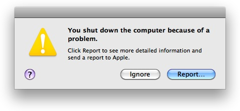

> 导航：[总目录](../../../README.md) · [documentation](../../../_indexes/documentation.md) · [Kernel Extension Programming Topics](Introduction.md)


[Next](Command-Line%20Tools%20for%20Analyzing%20Kernel%20Extensions.md)[Previous](Creating%20a%20Device%20Driver%20with%20Xcode.md)

# Debugging a Kernel Extension with GDB

In this tutorial, you learn how to debug a kext. You set up a two-machine debugging environment and use GDB to perform remote debugging. If you have not yet created a kext, complete [Creating a Generic Kernel Extension with Xcode](Creating%20a%20Generic%20Kernel%20Extension%20with%20Xcode.md#apple-f4xwc4dqnrsv64tfmyxwi33df52wszbpgiydambsgm3dklkcifbeuscdjjaq) or [Creating a Device Driver with Xcode](Creating%20a%20Device%20Driver%20with%20Xcode.md#apple-f4xwc4dqnrsv64tfmyxwi33df52wszbpgiydambsgm3dmlkdjfeekq2ijbcq) before completing this tutorial. If you are unfamiliar with GDB, see _[Debugging with GDB](https://developer.apple.com/library/archive/documentation/DeveloperTools/gdb/gdb/gdb_toc.html#//apple_ref/doc/uid/TP40000996)_.

Although this tutorial is written with a device driver as the example, the steps for debugging are similar for debugging any type of kext.

You need two machines for remote debugging: a __target machine__ and a __development machine__. You load and run the kext on the target machine and debug the kext on the development machine. It is important to keep the two machines clear in your mind as you work through this tutorial, because you will be moving back and forth between them many times. It may help if you take a piece of paper, tear it in half, and write “Development” on one piece and “Target” on the other. Then place the pieces of paper next to the two machines.

These are the major steps you will follow:

1. [Preliminary Setup](#apple-f4xwc4dqnrsv64tfmyxwi33df52wszbpgiydambsgm3dolktk43q)
2. [Start GDB and Connect the Two Machines](#apple-f4xwc4dqnrsv64tfmyxwi33df52wszbpgiydambsgm3dolktk44a)
3. [Debug the Kernel Extension](#apple-f4xwc4dqnrsv64tfmyxwi33df52wszbpgiydambsgm3dolktk44q)

Prepare the two machines by doing the following:

1. Ensure that the machines are running the same version of OS X.
2. Ensure that the machines are connected to the same network with their built-in Ethernet ports.
3. Ensure that you are logged in as an administrator on both machines, which is necessary for using the `sudo` command.
4. Mount the Kernel Debug Kit disk image on the development machine. Download the Kernel Debug Kit from the [Apple Developer website](http://connect.apple.com/) under the OS X download category. Make sure the Kernel Debug Kit you download matches the version of OS X installed on your target machine.

   For more information on the Kernel Debug Kit, see the Read Me file included in the disk image.
5. If your target machine is running OS X Server, disable the OS X Server watchdog timer.

   `$ sudo killall -TERM watchdogtimerd`

   For more information, see the manual page for `watchdogtimerd`.

To better simulate a real-world kext debugging scenario, you need your kext to produce a kernel panic. The easiest way to do this is to dereference a null pointer.

1. In Xcode, add the following code to your driver’s `start` method (if you are debugging a generic kext, add it to the kext’s `MyKext_start` function):

```
char *kernel_panic = NULL;
char message = *kernel_panic;
```
2. Rebuild your kext. In the Terminal application, create a copy of the kext as root:

```
$ sudo cp -R MyDriver.kext /tmp
```
3. Copy your kext’s `dSYM` file (in the Xcode project’s build folder with your kext) to the same location you copy your kext.
4. Transfer the copy of your kext from the development machine to the target machine.

   If the transferred copy of your kext has an incorrect owner or group, correct it with the following command:

```
$ sudo chown -R root:wheel MyDriver.kext
```


Before you can debug your kext, you must first enable kernel debugging. On the target machine, do the following:

1. Start the Terminal application.
2. Set the kernel debug flags.

   To enable kernel debugging, you must set an NVRAM (nonvolatile random access memory) variable:

```
$ sudo nvram boot-args="debug=0x144 -v"
Password:
```

   For more information on debugging flags, see [Building and Debugging Kernels](https://developer.apple.com/library/archive/documentation/Darwin/Conceptual/KernelProgramming/build/build.html#//apple_ref/doc/uid/TP30000905-CH221) in _[Kernel Programming Guide](../Kernel%20Programming%20Guide/About%20This%20Document.md#apple-f4xwc4dqnrsv64tfmyxwi33df52wszbpkridgmbqgaydsmbv)_.
3. Restart the computer for the debugging flags to take effect.

To connect to the target machine from the development machine, you need the target machine’s IP address. If you don’t already know it, you can find it in the Network pane of the System Preferences application.

1. Start GDB with the following command, indicating the target machine’s architecture and the location of your debug kernel:

```
$ gdb -arch i386 /Volumes/KernelDebugKit/mach_kernel
```
2. Add kernel-specific macros from the Kernel Debug Kit to your GDB session.

```
(gdb) source /Volumes/KernelDebugKit/kgmacros
```
3. Inform GDB that you are going to be debugging a kext remotely.

```
(gdb) target remote-kdp
```


You are ready to load your kext and cause a kernel panic. Do so with the following command:

```
$ sudo kextutil MyDriver.kext
```

The kernel panic should occur immediately. Interactivity ceases and debugging text appears on the screen, including the text `Awaiting debugger connection`.

Now you can tell GDB to attach to the target machine. On the development machine, do the following:

1. Attach to the target machine. At the GDB prompt, use the `kdp-reattach` macro with the target machine’s name or IP address:

```
(gdb) kdp-reattach target.apple.com
```

   The target machine prints:

```
Connected to remote debugger.
```


You need your kext’s load address in order to generate a symbol file for it. Enter the following at the GDB prompt:

```
(gdb) showallkmods
```

A list appears displaying information about every kext running on the target machine. Find your kext in the list and write down the value in the address column. Note that the values in the kmod and size columns look similar to the address value, so make sure you have the correct value.

You can create a symbol file for your kext on the development machine with the `kextutil` command. Once again, make sure that the version of the Kernel Debug Kit you provide matches the version of OS X on the target machine.

1. Open a second Terminal window.
2. Create the symbol file.

   Adjust the path to the Kernel Debug Kit, the path to your kext, and the architecture of the kernel as appropriate. The path after the `-s` option specifies the output directory where the symbol file is written. This should be the directory you copied your kext and `dSYM` file to. The `-n` option prevents the command from loading the kext into the kernel.

```
sudo kextutil -s /tmp -n -arch i386 -k /Volumes/KernelDebugKit/mach_kernel -e -r /Volumes/KernelDebugKit /tmp/MyDriver.kext
```

   The `kextutil` tool prompts you for the load address of your kext. Provide the load address you obtained in the previous step.

   When you finish, the symbol file is in the output directory you specified. The filename is the bundle identifier of the kext with the `.sym` extension.
3. At the GDB prompt, specify the location of the symbol file.

   Again, make sure the symbol file is in the same folder as the copy of your kext and `dSYM` file.

```
(gdb) set kext-symbol-file-path /tmp
```
4. At the GDB prompt, add your kext to the debug environment with the following macro:

```
(gdb) add-kext /tmp/MyDriver.kext
```

   GDB asks you if you want to add the kext’s symbol file. When you confirm, it loads the symbols.

Now you are ready to begin debugging! Request a backtrace from GDB to locate the source of the panic:

```
(gdb) bt
```

A list of stack frames appears. Your kext’s stack frame that caused the panic should be easily identifiable as about the fifth frame from the top. When you are debugging your own kernel panics and don’t know the cause, you can now enter the offending stack frame and figure out what exactly caused the panic.

When you've finished debugging, stop the debugger by quitting GDB.

```
(gdb) quit
```

The debugging session ends. Because the target machine is still panicked, you need to reboot it. When you log back into the target machine, it displays the following message:



Click Ignore.

Congratulations! You've learned how to set up a two-machine debugging environment to debug a kext with GDB. To learn how to package your kext for installation by your customers, read [Packaging a Kernel Extension for Distribution and Installation](Packaging%20a%20Kernel%20Extension%20for%20Distribution%20and%20Installation.md#apple-f4xwc4dqnrsv64tfmyxwi33df52wszbpgiydambsgm3dqlkdjbcegqsdjjaq).

[Next](Command-Line%20Tools%20for%20Analyzing%20Kernel%20Extensions.md)[Previous](Creating%20a%20Device%20Driver%20with%20Xcode.md)

