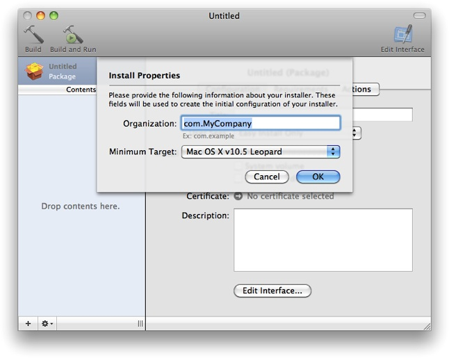
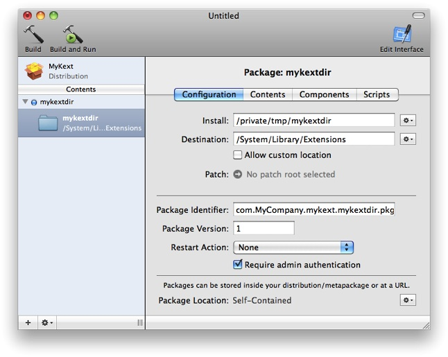

> 导航：[总目录](../../../README.md) · [documentation](../../../_indexes/documentation.md) · [Kernel Extension Programming Topics](Introduction.md)


[Next](Info.plist%20Properties%20for%20Kernel%20Extensions.md)[Previous](Command-Line%20Tools%20for%20Analyzing%20Kernel%20Extensions.md)

# Packaging a Kernel Extension for Distribution and Installation

Before you distribute a kext for installation, you should prepare it by creating a __package__. A packaged kext provides users with the information they expect when they install software, such as licensing restrictions and a default installation location. If you have not yet created a kext, complete [Creating a Generic Kernel Extension with Xcode](Creating%20a%20Generic%20Kernel%20Extension%20with%20Xcode.md#apple-f4xwc4dqnrsv64tfmyxwi33df52wszbpgiydambsgm3dklkcifbeuscdjjaq) or [Creating a Device Driver with Xcode](Creating%20a%20Device%20Driver%20with%20Xcode.md#apple-f4xwc4dqnrsv64tfmyxwi33df52wszbpgiydambsgm3dmlkdjfeekq2ijbcq) before completing this tutorial.

Here are the major steps you will follow:

1. [Set Permissions for your Kext](#apple-f4xwc4dqnrsv64tfmyxwi33df52wszbpgiydambsgm3dqljzhaytana)
2. [Create Custom Installer Information](#apple-f4xwc4dqnrsv64tfmyxwi33df52wszbpgiydambsgm3dqljzha3tgnq)
3. [Create a Package with PackageMaker](#apple-f4xwc4dqnrsv64tfmyxwi33df52wszbpgiydambsgm3dqljzheztknq)
4. [Build the Package and Test Installation](#apple-f4xwc4dqnrsv64tfmyxwi33df52wszbpgiydambsgm3dqljrgaydgnzr)

This tutorial assumes that you are logged in as an administrator of your machine, which is necessary for using the `sudo` command.

Before you package your kext, you need to make sure it has the proper permissions and that it resides in a directory with root permissions when it is packaged.

1. Create a directory for a copy of your kext in the `/tmp` directory as the root user.

```shell
% cd /tmp
% sudo mkdir mykextdir
Password:
```
2. Create a copy of your kext as the root user and place it in the folder you created.

```shell
% cd /KEXT_PROJECT_PATH/build/Release
% sudo cp -R MyKext.kext /tmp/mykextdir/
```

   Do not change the permissions of the original kext in your Xcode project’s build folder, or else you will encounter errors when you attempt to rebuild.

You can include custom installation information in your package to improve the installation process for your users. You will create a welcome message file, a Read Me file, and a software license agreement file for your package with the TextEdit application. These supplementary resources should not be placed in the directory you created in the previous step; instead, put them in your kext’s Xcode project folder.

The welcome message is the first thing your customers read when they open your kext’s package. It should be a brief introduction to the software your customer is installing.

1. Create a new file in TextEdit.
2. Enter the text of your welcome message.
3. Save your welcome message as `Welcome.rtf` in your kext’s project folder.
4. Close the file.

The Read Me describes the contents of your package, version information, and any additional information your customer needs to know before installing.

1. Create a new file in TextEdit.
2. Enter the text of your Read Me.
3. Save your welcome message as `ReadMe.rtf` in your kext’s project folder.
4. Close the file.

The software license agreement describes the terms of use for your package, legal disclaimers, and any prerelease software warnings.

1. Create a new file in TextEdit.
2. Enter the text of your software license agreement.
3. Save your software license agreement as `License.rtf` in your kexts project folder.
4. Close the file.

After you have created all three files, make sure to add them to your Xcode project by choosing Project > Add to Project; this ensures that they are included in your project’s SCM.

Now you can use the PackageMaker application to build an installable package for your kext.

1. Open the PackageMaker application, located in `/Developer/Applications/Utilities`.

   The main window appears with an Install Properties sheet.
2. Enter `com.MyCompany` in the Organization field, and select OS X v10.5 Leopard as the minimum target. Click OK.

   
3. Fill in the fields of the configuration tab of the main window as follows:

|  |  |
| --- | --- |
| Title | `MyKext` |
| User Sees | Easy Install Only |
| Install Destination | System Volume (make sure all other install destinations are unchecked) |

   The Certificate and Description fields are not needed for this tutorial, but you need to specify a certificate for your package if you want it to be signed.
4. Locate the copy of your kext you created in [Set Permissions for your Kext](#apple-f4xwc4dqnrsv64tfmyxwi33df52wszbpgiydambsgm3dqljzhaytana) by opening a Finder window. Choose Go > Go to Folder. Enter `/tmp` as the folder.
5. Drag the `mykextdir` folder from the Finder window and drop it into the Contents pane of the main PackageMaker window. The main view changes to show information about the `mykextdir` package.
6. Enter `/System/Library/Extensions` in the Destination field of the Configuration tab.

   

   Now that the package has everything it needs for Installer to install your kext, you can customize the installation experience for your customers.
7. Click the Edit Interface button in the upper-right corner of the window and view the Interface Editor window that opens.

   - The first page of the Interface Editor allows you to provide a custom background image for your installation. You have not created one for this tutorial, so click Continue.
   - The second page allows you to provide custom welcome text. Choose the File radio button on the right side of the editor and provide the path for your welcome message file by clicking the gear menu next to the text box and choosing Choose.
   - The third page allows you to provide a Read Me. Repeat the same process you used for the welcome message, instead providing the path for your Read Me.
   - The fourth page allows you to provide a software license agreement. Repeat the same process you used for the welcome message, instead providing the path for your software license agreement.
   - The fifth page allows you to provide a custom conclusion message. You have not created one for this tutorial, so close the Interface Editor window.
8. Save your progress by choosing File > Save. Specify a location of your choice and enter `MyKextPackage.pmdoc` as the filename.

You can further configure your kext’s installation by specifying actions that run before and/or after your kext is installed. This tutorial doesn’t require any such actions, so continue to the next step unless your kext has specific preinstall or postinstall requirements.

If your kext needs to load during early boot, or if your install actions require a restart, set the Restart Action option in the Configuration tab to Require Restart. Installer will prompt the user for a restart after executing any postinstall actions.

You can make sure certain actions are taken before and after your kext is installed. In the case of a kext, these actions most often involve loading or unloading other kexts.

1. Click the MyKext package in the upper left above the Contents view.
2. Click the Actions tab.
3. Click the Edit button for either Preinstall Actions or Postinstall Actions, depending on which you want to add. A sheet appears.
4. Drag the actions you want to add from the list on the left to the view on the right. Fill in any fields the actions require.
5. Order the actions in the view by dragging and dropping, such that the first action you want to perform appears at the top of the view.

Save your progress.

You are ready to build and test your package.

1. Choose Project > Build.

   Specify a location of your choice and enter `MyKext.pkg` as the filename.
2. Double-click your package to run the Installer application.

   As you proceed through the installation process, the custom messages you included appear.
3. Check that the package was properly installed.

   Navigate to `/System/Library/Extensions`. You should see your kext.

[Next](Info.plist%20Properties%20for%20Kernel%20Extensions.md)[Previous](Command-Line%20Tools%20for%20Analyzing%20Kernel%20Extensions.md)

