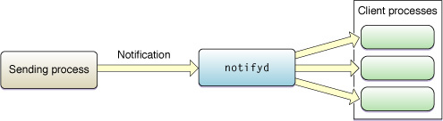

> 导航：[总目录](../../../README.md) · [documentation](../../../_indexes/documentation.md) · [Mac Notification Overview](Introduction%20to%20OS%20X%20Notification%20Overview.md)


[Next](Alternatives%20to%20Notification.md)[Previous](Choosing%20a%20Notification%20Technology.md)

# Darwin Notification Concepts

This chapter describes how to send and receive Darwin notifications. The Darwin notification system is relatively straightforward for developers familiar with programming in other UNIX/Linux operating systems. It ties into commonly used systems such as file descriptors and signals to provide delivery of messages to the client process.

Darwin notifications are supported by the `notifyd(8)` daemon, a process that listens for incoming notifications and redelivers those notifications to interested processes in a variety of ways.



When writing a tool that uses Darwin notifications, the following headers are commonly used:

```c
#include <unistd.h>       // good idea in general
#include <stdlib.h>       // good idea in general

#include <strings.h>      // for bcopy, used by FD_COPY macro
                          // (file descriptor delivery)
#include <sys/select.h>   // for select (file descriptors delivery)
#include <stdio.h>        // for read (file descriptor delivery)

#include <signal.h>       // for signal names (signal delivery)

#include <mach/message.h> // For mach message functions and types
                          // (mach message delivery)

#include <notify.h>       // for all notifications
```


Sending a Darwin notification is very simple. Just call the function `[notify_post](../../../Reference/usr_APIs/notify/CompositePage.md#apple-f4xwc4dqnrsv64tfmyxwgl3govxggl3on52gsztzl5yg643u)`. The function takes a single argument that contains the name of the notification. (See [How Should Notifications Be Named?](Notification%20Basics.md#apple-f4xwc4dqnrsv64tfmyxwi33df52wszbpkridimbqga2tsnbxfvbuqmznknlte) for information about notification naming.)

For example, if you integrate notifications into the Apache web server and want to notify it that its configuration file has changed, you might send the notification with a call like the following:

```
if (notify_post("org.apache.httpd.configFileChanged")) {
    printf("Notification failed.\n"); exit(-1);
}
```

The function `notify_post` returns zero on success or an error code on failure. The possible error codes are described in [Status Codes](../Miscellaneous%20User%20Space%20API%20Reference/CompositePage-94.md#apple-f4xwc4dqnrsv64tfmyxwi33df52gs5dmmu5g2yldojxs6u3umf2hk42dn5sgk4y) in _[Darwin Notification API Reference](https://developer.apple.com/documentation/darwinnotify/darwin_notification_api)_.

Darwin notifications provide five mechanisms for receiving notifications: Core Foundation, file descriptors, signals, Mach messages, and manual polling. This section describes these delivery mechanisms and explains when you should choose each one.

When adding notification support to existing applications, you should choose whichever mechanism is easiest to integrate into the application or tool. If your application already uses signal handling, you should use signals. If your application already uses sockets or file descriptors, you should use file descriptors. And so on.

If you are writing a new application from scratch, Core Foundation notifications are recommended if your application is based on Core Foundation. For non-Core Foundation applications, file descriptors are the preferred notification transport because they are more robust against message loss than signals and are easier to use than Mach messages. Again, you should choose the mechanism that most closely fits the architecture of the tool you are writing.

As a general rule, you should avoid using the polling interface (described in [Receiving Notifications Manually](#apple-f4xwc4dqnrsv64tfmyxwi33df52wszbpkridimbqga2tsnbxfvbuqnjnknltg)). You should use polling _only_ if you need to check for a status change infrequently.

To register for Darwin notifications using Core Foundation, first create a notification center by calling [CFNotificationCenterGetDarwinNotifyCenter](https://developer.apple.com/documentation/corefoundation/1542572-cfnotificationcentergetdarwinnot). This creates an object that interacts with the notification daemon on your behalf.

Next, call [CFNotificationCenterAddObserver](https://developer.apple.com/documentation/corefoundation/1543316-cfnotificationcenteraddobserver). This function instructs the notification center to register for notifications with the notification daemon.

The following snippet shows how to register for the notification described in [Sending Notifications](#apple-f4xwc4dqnrsv64tfmyxwi33df52wszbpkridimbqga2tsnbxfvbuqnjnknlte):

```
/* This function is called when a notification is received. */
void MyNotificationCenterCallBack(CFNotificationCenterRef center,
        void *observer,
        CFStringRef name,
        const void *object,
        CFDictionaryRef userInfo)
{
    printf("Notification center handler called\n");
}

...

/* Create a notification center */
CFNotificationCenterRef center = CFNotificationCenterGetDarwinNotifyCenter();

/* Tell notifyd to alert us when this notification
   is received. */
if (center) {
    CFNotificationCenterAddObserver(center,
        NULL,
        MyNotificationCenterCallBack,
        CFSTR("org.apache.httpd.configFileChanged"),
        NULL,
        CFNotificationSuspensionBehaviorDeliverImmediately);
    ...
}
```


Receiving notifications with file descriptors is relatively straightforward. First, you must call [notify_register_file_descriptor](https://developer.apple.com/documentation/darwinnotify/1433470-notify_register_file_descriptor) to register for notifications. For example, the following snippet shows how to register for the notification sent in [Sending Notifications](#apple-f4xwc4dqnrsv64tfmyxwi33df52wszbpkridimbqga2tsnbxfvbuqnjnknlte):

```
int fd; /* file descriptor---one per process if
           NOTIFY_REUSE is set, else one per name */
int notification_token; /* notification token---one per name */

...

if (notify_register_file_descriptor("org.apache.httpd.configFileChanged",
                                    &fd,
                                    0,
                                    &notification_token)) {
        /* Something went wrong.  Bail. */
        printf("Registration failed.\n"); exit(-1);


}
```

The function `notify_register_file_descriptor` returns zero on success or an error code on failure. The possible error codes are described in [Status Codes](../Miscellaneous%20User%20Space%20API%20Reference/CompositePage-94.md#apple-f4xwc4dqnrsv64tfmyxwi33df52gs5dmmu5g2yldojxs6u3umf2hk42dn5sgk4y) in _[Darwin Notification API Reference](https://developer.apple.com/documentation/darwinnotify/darwin_notification_api)_.

After you register for notification, you will begin receiving data through the returned file descriptor. You can detect the arrival of new data using [select(2)](https://developer.apple.com/library/archive/documentation/System/Conceptual/ManPages_iPhoneOS/man2/select.2.html#//apple_ref/doc/man/2/select) or [poll(2)](https://developer.apple.com/library/archive/documentation/System/Conceptual/ManPages_iPhoneOS/man2/poll.2.html#//apple_ref/doc/man/2/poll), as shown in the following snippet:

```
fd_set receive_descriptors, receive_descriptors_copy;

FD_SET(fd, /* from call to notify_register_file_descriptor */
       &receive_descriptors);
FD_COPY(&receive_descriptors, &receive_descriptors_copy);
while (select(fd + 1, &receive_descriptors_copy,
       NULL, NULL, NULL) >= 0) {
    /* Data was received. */
    if (FD_ISSET(fd, &receive_descriptors_copy)) {
        /* Data was received on the right descriptor.
           Do something. */
        int token;

        /*! Read four bytes from the file descriptor. */
        if (read(fd, &token, sizeof(token)) != sizeof(token)) {
            /* An error occurred.  Panic. */
            printf("Read error on descriptor.  Exiting.\n");
            exit(-1);
        }

        /* At this point, the value in token should match one of the
           registration tokens returned through the fourth parameter
           of a previous call to notify_register_file_descriptor. */
    }

    FD_COPY(&receive_descriptors, &receive_descriptors_copy);
}
```

For more information about the `select` system call, see the manual page for [select(2)](https://developer.apple.com/library/archive/documentation/System/Conceptual/ManPages_iPhoneOS/man2/select.2.html#//apple_ref/doc/man/2/select).

To receive a signal when a new notification is posted, call the function `[notify_register_signal](../../../Reference/usr_APIs/notify/CompositePage.md#apple-f4xwc4dqnrsv64tfmyxwgl3govxggl3on52gsztzl5zgkz3jon2gk4s7onuwo3tbnq)`. This function tells the notification daemon to send a signal to your process whenever it posts new messages.

The following snippet shows how to register for the notification described in [Sending Notifications](#apple-f4xwc4dqnrsv64tfmyxwi33df52wszbpkridimbqga2tsnbxfvbuqnjnknlte):

```

int notification_token;

...

/* Set up a signal handler for SIGHUP */
signal(SIGHUP, &my_sighup_handler);

/* Tell notifyd to send SIGHUP when this notification
   is received. */

if (notify_register_signal(
    "org.apache.httpd.configFileChanged", SIGHUP,
    &notification_token)) {
        printf("Registration failed.\n"); exit(-1);
}
```

The function `notify_register_signal` returns zero on success or an error code on failure. The possible error codes are described in [Status Codes](../Miscellaneous%20User%20Space%20API%20Reference/CompositePage-94.md#apple-f4xwc4dqnrsv64tfmyxwi33df52gs5dmmu5g2yldojxs6u3umf2hk42dn5sgk4y) in _[Darwin Notification API Reference](https://developer.apple.com/documentation/darwinnotify/darwin_notification_api)_.

The value of `notification_token` is set to an integer value specific to the name for this notification. It is your responsibility to keep track of these notification token values so that you can find out which notification was posted (unless you are registering only for a single notification and don’t care about false positives caused by signals not generated by `notifyd`).

After you register to receive a signals, you must then call `[notify_check](../../../Reference/usr_APIs/notify/CompositePage.md#apple-f4xwc4dqnrsv64tfmyxwgl3govxggl3on52gsztzl5rwqzldnm)` to determine which (if any) notification triggered the signal, as shown in the next snippet:

```
int was_posted;

if (notify_check(notification_token, &was_posted)) {
    printf("Call to notify_check failed.\n"); exit(-1);
}
if (was_posted) {
    /* The notification org.apache.httpd.configFileChanged
       was posted. */

}
```

The function `notify_check` returns zero on success or an error code on failure. The possible error codes are described in [Status Codes](../Miscellaneous%20User%20Space%20API%20Reference/CompositePage-94.md#apple-f4xwc4dqnrsv64tfmyxwi33df52gs5dmmu5g2yldojxs6u3umf2hk42dn5sgk4y) in _[Darwin Notification API Reference](https://developer.apple.com/documentation/darwinnotify/darwin_notification_api)_. The function returns a value through the second parameter to indicate whether the notification has been posted since the last time you called `notify_check`.

If your tool or application uses Mach messages for communication, you may find it convenient to use Mach messages for receiving notification. Communication based on Mach messaging is not recommended for use in new designs because it is relatively easy to corrupt your application's memory if used incorrectly.

You can register for Mach message–based notification on a Mach port by calling `[notify_register_mach_port](../../../Reference/usr_APIs/notify/CompositePage.md#apple-f4xwc4dqnrsv64tfmyxwgl3govxggl3on52gsztzl5zgkz3jon2gk4s7nvqwg2c7obxxe5a)`, as shown in the snippet below:

```
mach_port_name_t port; /* mach port---one per process if
           NOTIFY_REUSE is set, else one per name */
int notification_token; /* notification token---one per name */

/* Allocate a mach port.  If you already have receive rights on a
   port and would prefer to use that, you can do so, of course. */
if (mach_port_allocate (mach_task_self(),
                        MACH_PORT_RIGHT_RECEIVE, &port) != KERN_SUCCESS) {
        printf("Could not allocate mach port.\n"); exit(-1);
}

if (notify_register_mach_port("org.apache.httpd.configFileChanged",
    &port,
    NOTIFY_REUSE,
    &notification_token)) {
        /* Something went wrong.  Bail. */
        printf("Registration failed.\n"); exit(-1);
}
```

The function `notify_register_mach_port` returns zero on success or an error code on failure. The possible error codes are described in [Status Codes](../Miscellaneous%20User%20Space%20API%20Reference/CompositePage-94.md#apple-f4xwc4dqnrsv64tfmyxwi33df52gs5dmmu5g2yldojxs6u3umf2hk42dn5sgk4y) in _[Darwin Notification API Reference](https://developer.apple.com/documentation/darwinnotify/darwin_notification_api)_.

If desired, you can let Mach allocate the port for you by skipping the call to [mach_port_allocate](https://developer.apple.com/documentation/kernel/1578704-mach_port_allocate) and passing in `0` instead of `[NOTIFY_REUSE](../../../Reference/usr_APIs/notify/CompositePage.md#apple-f4xwc4dqnrsv64tfmyxwgl3nmfrxe3zpjzhviskglfpverkvkncq)`.

After you have registered for notification, you can receive messages on the port with the [mach_msg_overwrite](https://developer.apple.com/documentation/kernel/1528967-mach_msg_overwrite) call, as shown in the following snippet:

```
    struct {
        mach_msg_header_t hdr;
        int token;
    } mydatastructure;

    while (1) {
        mach_msg_overwrite(NULL, MACH_RCV_MSG,
                0, sizeof(mydatastructure), port, MACH_MSG_TIMEOUT_NONE,
                MACH_PORT_NULL, (mach_msg_header_t *)&mydatastructure,
                sizeof(mydatastructure.token));
        printf("Data received : %d (compare to %d).\n", mydatastructure.token, notification_token);
    }
```


Although it is not common to do so, you may sometimes find it useful to poll to see (on an occasional basis) whether a particular notification has occurred. To do this, you must request a token corresponding to the notification name by calling `[notify_register_check](../../../Reference/usr_APIs/notify/CompositePage.md#apple-f4xwc4dqnrsv64tfmyxwgl3govxggl3on52gsztzl5zgkz3jon2gk4s7mnugky3l)`, as shown in the following snippet:

```
if (notify_register_check(
    "org.apache.httpd.configFileChanged", &notification_token)) {
        printf("Registration failed.\n"); exit(-1);
}
```

You can then check for notifications using `[notify_check](../../../Reference/usr_APIs/notify/CompositePage.md#apple-f4xwc4dqnrsv64tfmyxwgl3govxggl3on52gsztzl5rwqzldnm)` (just as you would for signal delivery), as shown in the following snippet:

```
int was_posted;
while (1) {
    sleep(1);

    if (notify_check(notification_token, &was_posted)) {
        printf("Call to notify_check failed.\n"); exit(-1);
    }
    if (was_posted) {
        /* The notification org.apache.httpd.configFileChanged
           was posted. */
        printf("Notification %d was posted.\n", notification_token);
    }
}
```

The function `notify_check` returns zero on success or an error code on failure. The possible error codes are described in [Status Codes](../Miscellaneous%20User%20Space%20API%20Reference/CompositePage-94.md#apple-f4xwc4dqnrsv64tfmyxwi33df52gs5dmmu5g2yldojxs6u3umf2hk42dn5sgk4y) in _[Darwin Notification API Reference](https://developer.apple.com/documentation/darwinnotify/darwin_notification_api)_. The function returns a value through the second parameter to indicate whether the notification has been posted since the last time you called `notify_check`.

[Next](Alternatives%20to%20Notification.md)[Previous](Choosing%20a%20Notification%20Technology.md)

