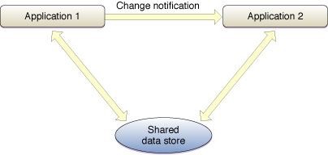

> 导航：[总目录](../../../README.md) · [documentation](../../../_indexes/documentation.md) · [Mac Notification Overview](Introduction%20to%20OS%20X%20Notification%20Overview.md)

[Next](Choosing%20a%20Notification%20Technology.md)[Previous](Introduction%20to%20OS%20X%20Notification%20Overview.md)

# Notification Basics

In modern computing, developers often need to find out when external information (such as configuration files, the current time zone or time of day, and so on) changes.

There are many ways to solve this problem, of which notifications are just one. The main ways are:

- __Notifications__—the subject of this document. Notifications are a combination of shared memory and message passing.
- __Polling__—pulling the needed information from another application or from a file on a regular basis. This technique is wasteful of CPU resources and is thus strongly discouraged for general use. However, when combined with shared memory, polling is useful in certain specialized environments.
- __Shared memory__—providing a common repository for shared information that can be accessed through pointers in multiple processes. This technique is used as part of notification mechanisms. However, by itself, it is not a sufficient solution because of poor responsiveness. It is generally combined with either message passing or polling.
- __Message passing__—a “push” method in which the sending application tells the receiving application that the information has changed. By itself, this is a good technique in terms of responsiveness, but it can be problematic in terms of robustness because when a message is lost, the receiving application cannot obtain the new value.

Although notification mechanisms differ greatly in the details of their implementation, they share a common design goal: allowing the recipient of the notification to monitor a piece of information in such a way that minimizes overhead while enabling designs that are robust even if a notification gets lost.

At a high level, a notification is a message indicating that something has changed. Notification schemes typically combine a shared data store with a message-passing mechanism.

__Figure 1-1__  Notification with a shared data store

It is this combination that makes notification schemes powerful. With message passing by itself, you face a tradeoff between performance and robustness. The UDP networking protocol, for example, is relatively efficient but does not provide delivery guarantees. By contrast, TCP provides delivery guarantees, but the extra overhead involved in doing so reduces performance.

Similarly, with shared storage by itself, you face a tradeoff between responsiveness and overall system performance. If you check the shared storage frequently, the application would appear responsive to changes in the shared state, but it would also hog CPU resources. By contrast, if you check less frequently, the CPU load would be lessened, but the application would be less responsive.

By separating the data from the message, you can get robustness, responsiveness, and performance. Because the message is sent to the receiving application, the receiving application does not have to constantly check for a state change. This results in responsiveness without the performance penalties associated with polling.

Similarly, because the data store is shared, the receiving application can request the current information and act on it at any time. Thus, that application could occasionally check the shared store to make certain the data has not changed behind its back. Alternatively, it could do such a check before performing any particularly critical operations to ensure correctness.

Thus, a notification can be compared to a bulletin board. If you are the keeper of the board, you can post information on the board. You can tell other people that new information has been posted. Others can then look at the board whenever it is convenient for them to do so. However, if someone fails to get such a message, he or she can still look at the bulletin board before making a critical decision. If desired, people can even wander by and look at the board without signing up to receive notices.

The word coalesce means “to unite”. In the context of notifications, if two notifications have identical content, this means two things:

- Identical messages can be reduced to a single message. You only need to receive one notification that “variable X has changed” for correctness.
- Nonidentical messages with small payloads can be sent to the receiving process as a group.

Coalescing notifications can have a significant effect on performance when a large number of notifications are sent in a short period of time. By combining notifications, the extra context switching required to send those additional notifications to the receiving application is eliminated. For this reason, you should try to maximize coalescing as much as possible.

To maximize coalescing of messages, you should minimize the payload as much as possible. Darwin notifications, for example, which carry no payload other than the name of the notification, can be coalesced very easily.

The shared data store used for a notification can be a file, POSIX or System V shared memory, a database record, or something else entirely, at the discretion of the developer who creates the notification scheme. The only hard and fast requirement for a shared store is that it must be accessible to both the sending and the receiving application—that is, that it must actually be a shared store.

For notifications generated by OS X components, the storage is usually a file on disk or a commpage location (date and time changes, for example). However, the location need not be a single physical location at all. Instead, it could be an application that gathers the information from throughout the file system or an API for obtaining the data from lower levels of the operating system. For example, in response to a network change notification, your application might ask the operating system for updated network interface information through any number of APIs.

Applications often implement the shared store as part of one of the applications using POSIX or System V shared memory. This has the advantage of not creating unnecessary files on disk, but it may make state recovery after an application crash impossible. This may or may not be an issue, depending on the application and the nature of the shared data.

Another common form of shared storage is a memory-mapped file. To memory map a file, you must first create the file (of an appropriate length), then call [mmap(2)](https://developer.apple.com/library/archive/documentation/System/Conceptual/ManPages_iPhoneOS/man2/mmap.2.html#//apple_ref/doc/man/2/mmap) on that file. When you are through with the file, you delete it as you would any other temporary file. Memory mapping has the advantage of making state recovery possible in the event of a crash. However, it has the disadvantage of polluting the buffer cache. If your application depends on rapid disk I/O (such as an audio application) for correctness, you should probably use shared memory instead.

Notifications can be passed using any number of mechanisms, from Apple Events to UDP (and everything in between). Most notifications, however, are sent with Darwin notifications (described in [Darwin Notification Concepts](Darwin%20Notification%20Concepts.md#apple-f4xwc4dqnrsv64tfmyxwi33df52wszbpkridimbqga2tsnbxfvbuqnjnknltc)) or a technology built on top of Darwin notifications, such as Core Foundation notifications (described in _[CFNotificationCenter Reference](https://developer.apple.com/documentation/corefoundation/cfnotificationcenter)_) or Cocoa notifications (described in _[NSNotificationCenter Class Reference](https://developer.apple.com/documentation/foundation/nsnotificationcenter)_).

Notifications should be named using a reverse-DNS-style naming. For example, if the MkLinux team released a daemon called `kernel_daemon` that provided a notification called `kernel_loaded`, that notification would be named `org.mklinux.kernel_daemon.kernel_loaded`.

The reason for this naming convention is to avoid collisions; the notification namespace is shared across all applications in the system, both at the Darwin notification level and at higher levels with Core Foundation or Cocoa notifications.

[Next](Choosing%20a%20Notification%20Technology.md)[Previous](Introduction%20to%20OS%20X%20Notification%20Overview.md)

