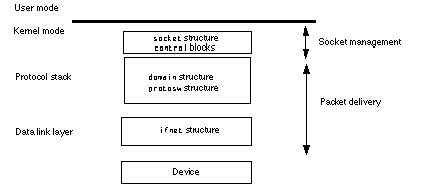
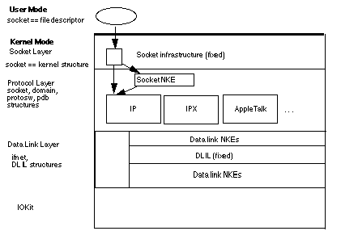
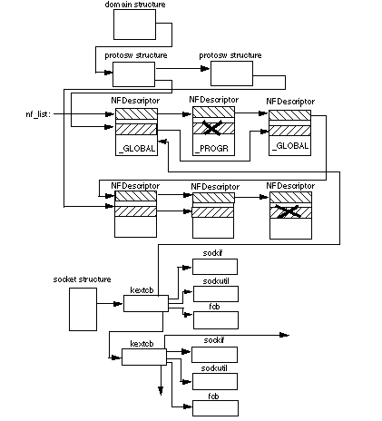
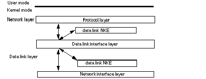
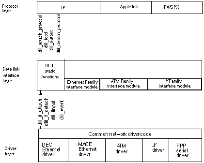
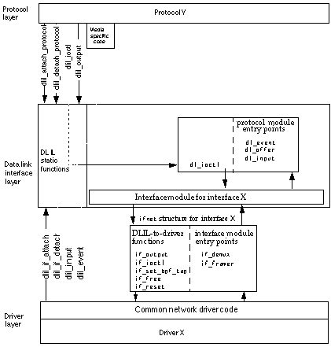
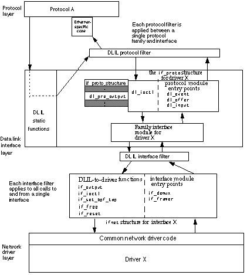
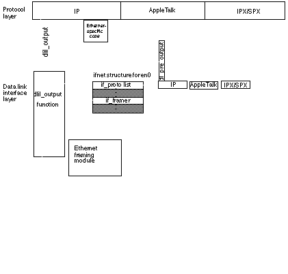
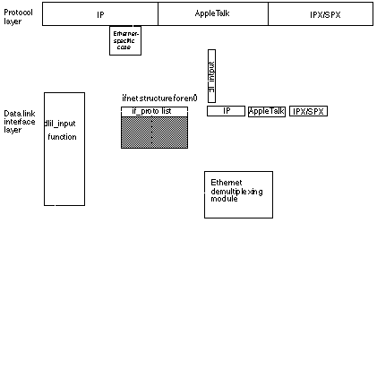

> 导航：[总目录](../../../README.md) · [documentation](../../../_indexes/documentation.md)


[Next](Using%20Network%20Kernel%20Extensions.md)

An important change has long been noted in the `<sys/mbuf.h>` header file since the release of Mac OS X 10.2. Note that the header file is bracketed by the `__APPLE_API_UNSTABLE` define. The mbuf structure is a key to the processing of packets in an NKE. As part of the formalizing the NKE APIs, it is expected that the mbuf structure will be changed. Details will be provided in the future. Changes to the existing NKE API are not expected be applied to System Updates to Mac OS X 10.3.x, however, bug fixes or features for future systems may require some interim changes.

For all shipping releases of Mac OS X prior to 10.4, the Network Kernel Extensions (NKE) APIs have not been officially supported. The legacy NKE architecture was implemented as an interim solution. The legacy API was never designed to be officially supported. Other aspects of the OS X networking implementation have received a higher priority, and so the interim solution has remained in effect to OS X 10.3.x.

The NKE mechanism for Mac OS X version 10.4 and later is described in the document _[Network Kernel Extensions Programming Guide](../Network%20Kernel%20Extensions%20Programming%20Guide/Introduction%20to%20Network%20Kernel%20Extensions%20Programming%20Guide.md#apple-f4xwc4dqnrsv64tfmyxwi33df52wszbpkridimbqgaytqnjy)_.

# About Network Kernel Extensions

Network kernel extensions (NKEs) provide a way to extend and modify the networking infrastructure of Mac OS X while the kernel is running and therefore without requiring the kernel to be recompiled, relinked, or rebooted.

NKEs allow you to

- create protocol stacks that can be loaded and unloaded dynamically and configured automatically.
- create modules that can be loaded and unloaded dynamically at specific positions in the network hierarchy. These modules can monitor network traffic, modify network traffic, and receive notification of asynchronous events at the data link and network layers from the driver layer, such as power management events and interface status changes.

An NKE is a specific case of a Mac OS X kernel extension. It is a separately compiled module (produced, for example, by XCode using the Kernel Extension project type).

An installed and enabled NKE is invoked automatically, depending on its position in the sequence of protocol components, to process an incoming or an outgoing packet. Loading (installing) a kernel extension is handled by the `kextload`(8) command line utility, which adds the NKE to the running Mac OS X kernel as part of the kernel's address space. Eventually, the system will provide automatic mechanisms for loading extensions. Currently, automatic loading is only possible for IOKit extensions and other extensions that IOKit extensions depend on.

As a kernel extension, an NKE provides initialization and termination routines that the Kernel Extension Manager invokes when it loads or unloads an NKE. The initialization routine handles any operations needed to complete the incorporation of the NKE into the kernel, such as updating `protosw` and `domain` structures. Similarly, the termination routine must remove references to the NKE from these structures in order to unload itself successfully. NKEs must provide a mechanism, such as a reference count, to ensure that the NKE can terminate without leaving dangling pointers.

Mac OS X is based on the 4.4BSD UNIX operating system. The following structures control the 4.4BSD network architecture:

- `socket` structure, which the kernel uses to keep track of sockets. The `socket` structure is referenced by file descriptors from user mode.
- `domain` structure, which describes protocol families.
- `protosw` structure, which describes protocol handlers. (A protocol handler is the implementation of a particular protocol in a protocol family.)
- `ifnet` structure, which describes a network device and contains pointers to interface device driver routines.

None of these structures is used uniformly throughout the 4.4BSD networking infrastructure. Instead, each structure is used at a specific level, as shown in [Figure 1-1](#apple-f4xwc4dqnrsv64tfmyxwi33df52wszbpkridimbqgaytaobzfvbuqmrsguwueqkcizeeorcc).

__Figure 1-1__  4.4BSD network architecture



The `socket` structure is used to manage the socket while the `domain`, `protosw`, and `ifnet` structures are used to manage packet delivery to and from the network device.

Making the 4.4BSD network architecture dynamically extensible requires several NKE types that are used at specific locations within the kernel.

- socket NKEs, which reside between the network layer and protocol handlers and are invoked through a `protosw` structure. Socket NKEs use a new set of override dispatch vectors that intercept specific socket and socket buffer utility functions.
- protocol family NKEs, which are collections of protocols that share a common addressing structure. Internally, a `domain` structure and a chain of `protosw` structures describe each protocol.
- protocol handler NKEs, which process packets for a particular protocol within the context of a protocol family. A `protosw` structure describes a protocol handler and provides the mechanism by which the handler is invoked to process incoming and outgoing packets and for invoking various control functions.
- data link NKEs, which are inserted below the protocol layer and above the network interface layer. This type of NKE can passively observe traffic as it flows in and out of the system (for example, a sniffer) or can modify the traffic (for example, encrypting or performing address translation). Data link NKEs can provide media support functions (performing demultiplexing, framing, and pre-output functions, such as ARP) and can act as "filters" that are inserted between a protocol stack and a device or above a device.)

[Figure 1-2](#apple-f4xwc4dqnrsv64tfmyxwi33df52wszbpkridimbqgaytaobzfvbuqmrsguwueqkciveuusce) summarizes the NKE architecture.

__Figure 1-2__  NKE architecture



Socket NKEs can operate in one of two modes: programmatic or global.

A global NKE is an NKE that is automatically enabled for sockets of the type specified for the NKE.

A programmatic NKE is a socket NKE that is enabled only under program control, using socket options, for a specfic socket.

Data link `filters' are essentially global in that they can't be accessed by specific sockets.

To support the dynamic addition and removal of NKEs in Mac OS X, the kernel keeps track of the use of NKEs by other parts of the system.

Use of protocol family NKEs is tracked by the `dom_refs` member of the `domain` structure, which has been added to support NKEs in Mac OS X. The kernel's `socreate` function increments `dom_refs` each time `socreate` is called to create a socket in an NKE domain. The `socreate` function is called when user-mode applications call `socket` or when `sonewconn` successfully connects to a local listening socket. The `dom_refs` member is decremented each time `soclose` is called to close a socket connection.

Use of protocol handler NKEs is tracked by the `pr_refs` member of the `protosw` structure, which has been added to support NKEs in Mac OS X. Like the `dom_refs` member of the `domain` structure, the `pr_refs` member of the `protosw` structure tracks the use of the protocol between calls to `socreate` and `sonewconn` to create a socket and `soclose` to close a socket.

The most important aspect of removing an NKE is ensuring that all references to NKE resources are eliminated and that all system resources allocated by the NKE are returned to the system. The NKE must track its use of resources, such as socket structures and protocol control blocks, so that the NKE's termination routine can eliminate references and return system resources.

To support NKEs in Mac OS X, the 4.4BSD `domain` and `protosw` structures were modified as follows:

- The `protosw` array referenced by the `domain` structure is now a linked list, thereby removing the array's upper bound. The `new dom_maxprotohdr` member defines the maximum protocol header size for the domain. The new `dom_refs` member is a reference count that is incremented when a new socket for this address family is created and is decremented when a socket for this address family is closed.
- The `protosw` structure is no longer an array. The `pr_next` member has been added to link the structures together. This change has implications for `protox` usage for `AF_INET` and `AF_ISO` input packet processing. The `pr_flags` member is an unsigned integer instead of a short. NKE hooks have been added to link NKE descriptors together (`pr_sfilter`).

Mac OS X defines a new domain -- the `PF_SYSTEM` domain-- whose purpose is to provide a way for applications to configure and control NKEs. The `PF_SYSTEM`  domain has two protocols, of which only one is of interest for communications with the NKE:

- The `SYSPROTO_CONTROL` protocol is used for configuring and controlling all NKEs.

Internally, the PF_SYSTEM domain’s initialization function is called when the PF_SYSTEM domain is initially added to the system. The initialization function adds the SYSPROTO_CONTROL protocol to the domain’s protosw list and performs other initialization tasks.

In the NKE's start method, register a Kernel Controller structure using the ctl_register function. The ctl_register function is defined in <sys/kern_control.h>. The ctl_register call is prototyped as follows.

```
int ctl_register(struct kern_ctl_reg *userctl,
            void *userdata,
            kern_ctl_ref *ctlref);
```

The fields of the kern_ctl_reg structure are defined as follows.

`ctl_id` - unique 4 byte id for the controller. Enter a registered Creator ID. Go to the Apple Developer Creator ID web page to register a unique ID. See [http://developer.apple.com/dev/cftype/](https://developer.apple.com/dev/cftype/) for more information.

`ctl_unit` - the unit number for the controlller. A controller can be registered multiple times with the same ctl_id, but for each instance and different unit number must be used.

`ctl_flags` - set to `CTL_FLAG_PRIVILEGED` which requires that the user must have admin privileges to contact the controller.

`ctl_sendsize` - size of buffer reserved for sending messages. 0 = default value.

`ctl_recvsize` - size of buffer reserved for receiving messages. 0 = default value.

ctl_connect - called when the client process calls connect on the socket with the id/unit number of the registered controller.

clt_disconnect - called when the user client process closes the control socket.

ctl_write - called when the user client process writes data to the socket.

ctl_set - called when the user client process setsockopt to set the controller configuration.

ctl_get - called when the user client process calls getsockopt on the socket.

The following is a code example of this process.

__Listing 1-1__  Dispatch example

```
struct kern_ctl_reg     ep_ctl;
// Initialize controller
bzero(&ep_ctl, sizeof(ep_ctl));  // sets ctl_unit to 0
ep_ctl.ctl_id = kEPCommID; // should be unique -
                                   // use a registered Creator ID here
ep_ctl.ctl_flags = CTL_FLAG_PRIVILEGED;
ep_ctl.ctl_write = EPHandleWrite;
ep_ctl.ctl_get = EPHandleGet;
ep_ctl.ctl_set = EPHandleSet;
ep_ctl.ctl_connect = EPHandleConnect;
ep_ctl.ctl_disconnect = EPHandleDisconnect;
error = ctl_register(&ep_ctl, &gEPState, &gEPState.ctlHandle);


int EPHandleSet( kern_ctl_ref ctlref, void *userdata, int opt, void *data, size_t len )
{
    int    error = EINVAL;
#if DO_LOG
    log(LOG_ERR, "EPHandleSet opt is %d\n", opt);
#endif

    switch ( opt )
    {
        case kEPCommand1:               // program defined symbol
            error = Do_First_Thing();
            break;

        case kEPCommand2:               // program defined symbol
            error = Do_Command2();
            break;
    }
    return error;
}

int EPHandleGet( kern_ctl_ref ctlref, void *userdata, int opt, void *data, size_t *len )
{
    int    error = EINVAL;
#if DO_LOG
    log(LOG_ERR, "EPHandleGet opt is %d *****************\n", opt);
#endif
    return error;
}

int
EPHandleConnect(kern_ctl_ref ctlref, void *userdata)
{
#if DO_LOG
    log(LOG_ERR, "EPHandleConnect called\n");
#endif
    return (0);
}

void
EPHandleDisconnect(kern_ctl_ref ctlref, void *userdata)
{
#if DO_LOG
    log(LOG_ERR, "EPHandleDisconnect called\n");
#endif
    return;
}

int EPHandleWrite(kern_ctl_ref ctlref, void *userdata, struct mbuf *m)
{
#if DO_LOG
    log(LOG_ERR, "EPHandleWrite called\n");
#endif
    return (0);
}
```


After the NKE registers a Kernel Controller structure the application level process opens a PF_SYSTEM socket. The application level process sets up the sockaddr_ctl structure with the required parametrs to communicate with the NKE's Kernel Controller.

To communicate with the NKE, the client process opens a `PF_SYSTEM` socket using the socket call.

```
fd = socket(PF_SYSTEM, SOCK_DGRAM, SYSPROTO_CONTROL);
```

The client process uses the connect call with the file descriptor returned from the socket call to establish a connection with the NKE. In making the connect call, fill in the sockaddr_ctl structure as follows.

```
sc_len = sizeof(struct sockaddr_ctl);
sc_family = AF_SYSTEM;
ss_sysaddr = AF_SYS_CONTROL;
sc_id = set to value of ctl_id registered by the NKE in the ctl_reguster call described above.
sc_unit = set to the unit number registered by the NKE in the ctl_register call described above.
```

The client process uses the setsockopt call to send commands to the NKE. Note that the option names are user defined. The NKE defines what option names it will respond to, and the client process must pass only supported option names to the NKE in the setsockopt call.

The client process uses the getsockopt call to get status information from the NKE. Note that the option names are user defined. The NKE defines what option names it will respond to, and the client process must pass only supported option names to the NKE in the setsockopt call.

The following is a code example for opening a PF_SYSTEM socket to communicate with an NKE

__Listing 1-2__  Opening a `PF_SYSTEM` socket

```
      struct sockaddr_ctl       addr;
      int                       ret = 1;

      bzero(&addr, sizeof(addr)); // sets the sc_unit field to 0
      addr.sc_len = sizeof(addr);
      addr.sc_family = AF_SYSTEM;
      addr.ss_sysaddr = AF_SYS_CONTROL;
      addr.sc_id = kEPCommID;  // should be unique - use a registered Creator ID here

      fd = socket(PF_SYSTEM, SOCK_DGRAM, SYSPROTO_CONTROL);
      if (fd)
      {
        result = connect(fd, (struct sockaddr *)&addr, sizeof(addr));
        if (result)
           fprintf(stderr, "connect failed %d\n", result);
      }
      else
        fprintf(stderr, "failed to open socket\n");

        if (!result)
        {
        result = setsockopt( fd, SYSPROTO_CONTROL, kEPCommand1, NULL, 0);
        if (result)
          fprintf(stderr, "setsockopt failed on kEPCommand1 call - result was %d\n", result);
       etc.
```


The question arises as to how an NKE can open a "preference file" in the start method. Under the existing architecture, the NKE cannot reliably access a Preference File. When the system starts the NKE, there are no APIs, which the NKE can use to open a file and read preference information. While the NKE could access its info.plist, there is the assumption that the info.plist will not be changed across startups as this information is cached by the system in order to expedite startups.

The proper way to dynamically configure an NKE is with a startup daemon or other application level process. The daemon finds the NKE using the communication method described above, and passes in configuration information that the NKE may require.

Adding and removing protocol family NKEs is accomplished by calling `net_add_domain` and `net_del_domain`, respectively. These calls are described in [Protocol Family NKE Functions](Network%20Kernel%20Extensions%20Reference.md#apple-f4xwc4dqnrsv64tfmyxwi33df52wszbpkridimbqgaytaobzfvbuqmrsg4wueqsbjbdemr2j). For detailed information about implementing protocol families, see `The Design and Implementation of the 4.4 BSD Operating System` by M. K. McKusick. et al. and `TCP/IP Illustrated` by Richard W. Stevens.

Adding and removing protocol handler NKEs is accomplished by calling `net_add_proto` and `net_del_proto`, respectively. These calls are described in [Protocol Handler NKE Functions](Network%20Kernel%20Extensions%20Reference.md#apple-f4xwc4dqnrsv64tfmyxwi33df52wszbpkridimbqgaytaobzfvbuqmrsg4wueqsbincusrkg). For detailed information about implementing protocol families, see `The Design and Implementation of the 4.4 BSD Operating System` by M. K. McKusick. et al. and `TCP/IP Illustrated` by Richard W. Stevens.

Socket NKEs are installed in the kernel by calling `register_sockfilter` typically from the NKE's initialization routine. Each socket NKE provides a descriptor structure that is linked into a global list (`nf_list`). A second chain runs through the filter descriptor to link it to a `protosw` for global NKEs. [Figure 1-3](#apple-f4xwc4dqnrsv64tfmyxwi33df52wszbpkridimbqgaytaobzfvbuqmrsguwueqkciveeur2e) shows the interconnections for these data structures.

__Figure 1-3__  Domain structure and protosw interconnections



When you call `socreate` to create a socket, any global NKEs associated with the corresponding `protosw` structure are attached to the socket structure using the `so_ext` field to link together `ketcb` structures that are allocated when the socket is created. (See [Figure 1-3](#apple-f4xwc4dqnrsv64tfmyxwi33df52wszbpkridimbqgaytaobzfvbuqmrsguwueqkciveeur2e).) These `ketcb` structures are initialized to point to the extension descriptor and two dispatch vectors of intercept functions (one for socket operations and one for socket buffer utilities).

The filter descriptor for a programmatic NKE is linked into the `nf_list` in the same way as are global NKEs but the file descriptor does not appear in the list associated with a `protosw`. A program can call `setsocketopt` using socket option `SO_NKE`) to insert a programmatic NKE into its NKE chain in the same way that it would call `setsocketopt` to insert a global NKE.

Each socket NKE has two dispatch vectors, a `sockif` structure and a `sockutil` structure, that contain pointers to the NKE's implementation of these functions. The functions are called when the corresponding `socket` and `sockbuf` functions are are called. The dispatch vectors permit the NKE to selectively intercept socket and socket buffer utilities. Here is an example:

```
int (*sf_sobind)(struct socket *, struct mbuf *, st kextcb);
```

The kernel's `sobind` function calls the NKE's `bind` entry point with the arguments passed to `sobind` and the `kextcb` pointer for the NKE. The `sockaddr` structure contains the name of the local endpoint being bound.

Each of the intercept functions can return an integer value. A return value of zero is interpreted to mean that processing at the call site can continue. A non-zero return value is interpreted as an error (as defined in `<sys/errno.h>`) that causes the processing of the packet or opertation to halt. If the return value is `EJUSTRETURN`, the calling function (for example, `sobind`) returns at that point with a value of zero. Otherwise, the function returns the non-zero error code. In this way, an NKE can "swallow" a packet or an operation. An NKE may reinject the packet at a later time. (Note that the injection mechanism is not yet defined.)

A program can insert a socket NKE on an open socket by calling `setsockopt` as follows:

```
setsockopt(s, SOL_SOCKET, SO_NKE, &so_nke, sizeof (struct so_nke);
```

The `so_nke` structure is defined as follows:

```
struct so_nke {
    unsigned int nke_handle;
    unsigned int nke_where;
    int nke_flags;
};
```

The `nke_handle` specifies the NKE to be linked to the socket (with the `so_ext` link). It is the programmer's task to locate the appropriate NKE, assure that it is loaded, and retain the returned handle for use in the `setsockopt` call.

The `nke_where` value specifies an NKE assumed to be in this linked list. If `nke_where` is `NULL`, the NKE represented by `nke_handle` is linked at the beginning or end of the list, depending on the value of `nke_flags`.

The `nke_flags` value specifies where, relative to `nke_where`, the NKE represented by `nke_handle` will be placed. Possible values are NFF_BEFORE and NFF_AFTER defined in `<net/kext_net.h>`.

The `nke_handle` and `nke_where` values are assigned by Apple Computer from the same name space as the type and creator codes used in Mac OS 8 and Mac OS 9 and using the same registration mechanism.

This section describes the programming interface for creating data link NKEs, which are inserted below the protocol layer and above the network interface layer. Data link NKEs depend on the Data link interface layer (DLIL), shown in [Figure 1-4](#apple-f4xwc4dqnrsv64tfmyxwi33df52wszbpkridimbqgaytaobzfvbuqmrsguwueqkcijbeksse), which provides a fixed point for the insertion of data link NKEs.

__Figure 1-4__  Data Link Interface Layer



The DLIL defines the following static functions, which are called by protocols and drivers:

- `dlil_attach_protocol`, which attaches network protocol stacks to specific interfaces
- `dlil_detach_protocol`, which detaches network protocol stacks from the interfaces to which they were previously attached
- `dlil_if_attach`, which registers network interfaces with the DLIL
- `dlil_if_detach`, which deregisters network interfaces that have been registered with the DLIL
- `dlil_ioctl`, which sends ioctl commands to a network driver
- `dlil_input`, which sends data to the DLIL from a network driver
- `dlil_output`, which sends data to a network driver
- `dlil_event`, which processes events from other parts of the network and from IOKit components. (Note that the event mechanisms are still under development.)

In [Figure 1-5](#apple-f4xwc4dqnrsv64tfmyxwi33df52wszbpkridimbqgaytaobzfvbuqmrsguwueqkcjbduer2g), the DLIL static functions are shown in relation to the DLIL, the protocol layer, and the network driver layer.

__Figure 1-5__  DLIL static functions



To support data link NKEs, the traditional `ifnet` structure as been extended in Mac OS X: the driver or software that supports the driver must allocate a separate `ifnet` structure for each logical interface. When an interface is attached (by calling `dlil_if_attach`)to the DLIL, the DLIL receives a pointer to that interface's `ifnet` structure.

Each interface can transmit and receive packets for multiple network protocol families, so for each attached protocol family the DLIL creates an `if_proto` structure chained off the `ifnet` structure for that interface.

The `if_proto` structure contains function pointers that the DLIL uses to pass incoming packets and event information to the protocol stack, as well as a pointer to the protocol dependent "pre-output" function that performs protocol-family specific operations such as network address translation on outbound packets.

[Figure 1-6](#apple-f4xwc4dqnrsv64tfmyxwi33df52wszbpkridimbqgaytaobzfvbuqmrsguwueqkcjffeossd) shows the `ifnet` and `if_proto` structures in relation to a generic protocol and a generic interface.

__Figure 1-6__  Sample `ifnet` structure in relation to a protocol and a network driver



To support the dynamic insertion of filters into the data and control streams between the network layer and the interface layer and the removal of inserted filters, the DLIL defines the following static functions:

- `dlil_attach_protocol_filter`, which inserts an NKE between the DLIL and one of the attached protocols. Such an extension is known as a DLIL protocol filter. This type of NKE provides access to all function calls between the DLIL and the attached protocol for a specific protocol/interface pair.
- `dlil_attach_interface_filter`, which inserts an NKE between the DLIL and an attached interface. Such a filter is known as an DLIL interface filter. This type of NKE provides access to all frames flowing to or from an interface.
- `dlil_detach_filter`, which removes previously inserted DLIL protocol and interface filters.

[Figure 1-7](#apple-f4xwc4dqnrsv64tfmyxwi33df52wszbpkridimbqgaytaobzfvbuqmrsguwueqkcizcuqqsg) shows the relationship of protocol and interface filters to the protocol stack layer, DLIL, and network driver layer.

__Figure 1-7__  Protocol and interface extensions in relation to the DLIL



[Figure 1-8](#apple-f4xwc4dqnrsv64tfmyxwi33df52wszbpkridimbqgaytaobzfvbuqmrsguwueqkcijeueqki) shows the sequence of calls required to send an IP packet over the MACE Ethernet interface (`en0`).

__Figure 1-8__  Example of sending an IP packet



The following steps correspond to the numbers in [Figure 1-8](#apple-f4xwc4dqnrsv64tfmyxwi33df52wszbpkridimbqgaytaobzfvbuqmrsguwueqkcijeueqki) and describe the process of sending a packet:

1. The `ip_output` routine in the IP protocol stack calls `dlil_output`, passing the `dl_tag` value for the stack's attachment to `en0`.
2. Using the `dl_tag` value, the `dlil_output` function locates the `dl_pre_output` pointer in the `if_proto` structure for IP.
3. The `dlil_output` function uses the `dl_pre_output` pointer in the `if_proto` structure to call IP's interface-specific output module. This module calls its `arpresolve` routine to resolve the target IP address into a media access control (MAC) address.
4. When IP's interface-specific output module returns, the `dlil_output` function uses the `if_framer` pointer in the `ifnet` structure to call the appropriate framing function in the DLIL interface module. The framing function prepends interface-specific frame data to the packet.
5. The `dlil_output` function calls the function pointed to by the `if_output` field in the `ifnet` structure for `en0` and sends the frame to the MACE Ethernet driver.

[Figure 1-9](#apple-f4xwc4dqnrsv64tfmyxwi33df52wszbpkridimbqgaytaobzfvbuqmrsguwueqkcirbecski) shows the sequence of calls required to receive an IP packet from the MACE Ethernet interface (`en0`).

__Figure 1-9__  Example of receiving a packet



The following steps correspond to the numbers in [Figure 1-9](#apple-f4xwc4dqnrsv64tfmyxwi33df52wszbpkridimbqgaytaobzfvbuqmrsguwueqkcirbecski) and describe the process of receiving a packet:

1. The MACE Ethernet driver or its support code calls `dlil_input` with pointers to its `ifnet` structure and `mbuf` chain.
2. The `dlil_input` function uses the `if_demux` entry in the `ifnet` structure to call the demultiplexing function for the interface family (Ethernet in this case).
3. The demultiplexing function identifies the frame and returns an `if_proto` pointer to `dlil_input`.
4. The `dlil_input` function calls the protocol input module through the `dl_input` pointer in the `if_proto` structure.

The following sources provide additional information that may be of interest to developers of network kernel extensions:

- _The Design and Implementation of the 4.4 BSD Operating System_ . M. K. McKusick. et al., Addison-Wesley, Reading, 1996.
- _Unix Network Programming, Second Edition, Volume 1_. Richard W. Stevens, Prentice Hall, New York, 1998.
- _TCP/IP Illustrated, Volume 1, The Protocols._ Richard W. Stevens, Addison-Wesley, Reading, 1994.
- _TCP/IP Illustrated, Volume 2, The Implementation._ Richard W. Stevens and Gary R. Wright, Addison-Wesley, Reading, 1995.
- _TCP/IP Illustrated, Volume 3, Other Protocols._ Richard W. Stevens, Addison-Wesley, Reading, 1996.

The following websites provide information about the Berkeley Software Distribution (BSD):

- [http://www.FreeBSD.org](http://www.freebsd.org/)
- [http://www.NetBSD.org](http://www.netbsd.org/)
- [http://www.OpenBSD.org/](http://www.openbsd.org/)

[Next](Using%20Network%20Kernel%20Extensions.md)

