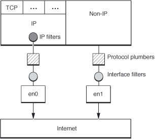

> 导航：[总目录](../../../README.md) · [documentation](../../../_indexes/documentation.md) · [Network Kernel Extensions Programming Guide](Introduction%20to%20Network%20Kernel%20Extensions%20Programming%20Guide.md)

[Next](Interface%20Filters.md)[Previous](Socket%20Filters.md)

# IP Filters

An IP filter is used to filter inbound or outbound IP traffic. It resides within the IP protocol stack, as shown in [Figure 5-1](#apple-f4xwc4dqnrsv64tfmyxwi33df52wszbpkridimbqgaytqnjyfvbuqmrshewueqsbizbemsci). For inbound traffic, it is called after an IP packet has been reassembled. For outbound traffic, it is called just prior to IP fragmentation. If IPSec processing is required for a given packet, the filter is called twice—immediately before and after any IPSec processing.

__Figure 5-1__  IP Filters in the Networking Stack

There are two basic categories of IP filters: IPv4 filters and IPv6 filters. With the exception of their handling of addresses, they are essentially equivalent. The same basic data structure, [ipf_filter](https://developer.apple.com/documentation/kernel/ipf_filter), is used to describe both.

The data structure contains five fields: `cookie`, `name`, `ipf_input`, `ipf_output`, and `ipf_detach`.

The first field, `cookie`, can contain arbitrary data. Your KEXT assigns it a value when it attaches the filter to the IP stack. The IP stack then passes that value as an argument whenever the networking stack calls any function in your KEXT. This allows a single filter to have multiple behaviors depending on where it is attached by testing values stored in the cookie.

The structure referenced by this field can be arbitrarily defined by your KEXT. As far as the kernel is concerned, it is essentially a void pointer. This mechanism is commonly used to store information about memory allocations associated with a particular filter instance.

The second field, `name`, is the name of your filter. This is used only for debugging purposes, but should always be filled in. It should contain either the identifier for the KEXT or something similar, for ease of identification.

The remaining fields, `ipf_input`, `ipf_output`, and `ipf_detach`, are pointers to callback functions in your KEXT. Those callbacks are called whenever your filter is asked to handle inbound packets, handle outbound packets, or detach, respectively.

The `ipf_input`, `ipf_output`, and `ipf_detach` function pointers are described in their data type declarations—respectively, [ipf_input_func](https://developer.apple.com/documentation/kernel/ipf_input_func), [ipf_output_func](https://developer.apple.com/documentation/kernel/ipf_output_func), and [ipf_detach_func](https://developer.apple.com/documentation/kernel/ipf_detach_func).

Generally, your [ipf_input_func](https://developer.apple.com/documentation/kernel/ipf_input_func) callback will be called as soon as a packet has been identified as being a IP packet and reassembled. Similarly, your [ipf_output_func](https://developer.apple.com/documentation/kernel/ipf_output_func) function will be called just prior to sending it to the data link interface layer (where it may be further processed by interface filters). However, in some cases, such as IPSec encapsulation, your IP filter will be called once as each layer of encapsulation is decoded.

A registered filter is identified by the opaque type [ipfilter_t](https://developer.apple.com/documentation/kernel/ipfilter_t). This is used later when you unregister the filter.

There are several quirks specific to modifying traffic in an IP filter. Some of these include:

**Reinjecting modified traffic**
: If your filter modifies the protocol of inbound traffic or the destination of outbound traffic, the packet may be misdelivered as a result of caching in the IP stack.

To prevent this problem, your filter must use [ipf_inject_input](https://developer.apple.com/documentation/kernel/1429066-ipf_inject_input) or [ipf_inject_output](https://developer.apple.com/documentation/kernel/1429082-ipf_inject_output), as appropriate. Your [ipf_input_func](https://developer.apple.com/documentation/kernel/ipf_input_func) or [ipf_output_func](https://developer.apple.com/documentation/kernel/ipf_output_func) callback should then swallow the previous version by returning `EJUSTRETURN`.

**Packet Fragmentation**
: IP filters only receive reassembled packets. It is not possible to filter on packet fragments.

**Filter Loops**
: It is possible to create filter loops in which one filter changes a value and reinjects the packet, which causes a second filter to change the value back and reinject it in an endless loop.

To reduce the likelihood of such a loop, when reinjecting packets, your filter should always specify itself as the `filter_ref`parameter.

[Next](Interface%20Filters.md)[Previous](Socket%20Filters.md)

