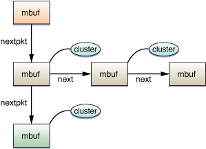

> 导航：[总目录](../../../README.md) · [documentation](../../../_indexes/documentation.md) · [Network Kernel Extensions Programming Guide](Introduction%20to%20Network%20Kernel%20Extensions%20Programming%20Guide.md)


[Next](KEXT%20Controls%20and%20Notifications.md)[Previous](Network%20Kernel%20Extensions%20Overview.md)

# Memory Buffers, Socket Manipulation, and Socket Input/Output

Most of the networking KPIs enable you to write extensions that change the behavior of the networking stack. The mbuf KPI routines are central to these KPIs, providing functions to manipulate individual network packets within the kernel. You may also sometimes find it useful to perform socket communication in the kernel, for example, to contact a remote server in a network filesystem client such as AFS. The socket KPI routines were designed to help you work with sockets at the kernel level, using mbufs as the fundamental unit of data.

The mbuf KPIs may be unfamiliar territory for you if you are used to user-space network programming. Conceptually, they are just linked lists of objects that can either contain packet data or pointers to external buffers that contain packet data. For incoming traffic, the packet header is also encapsulated in the mbuf structure.

All of the networking KPIs are built on top of a shared data structure called a memory buffer, or mbuf. An mbuf is the fundamental unit of data flow through the networking stack and represents a packet (or portion thereof). This section describes the way mbufs and mbuf chains are organized and describes a number of common operations on mbufs. For a complete list of mbuf operations, see `kpi_mbuf.h`.

A memory buffer, or mbuf, represents the contents of a single data packet. Its structure consists of a packet header (which may be absent for newly-generated outgoing traffic) and a payload (which contains the actual data).

__Figure 2-1__  A chain of mbuf chains



For smaller payloads, the data may be encapsulated in the mbuf structure itself as an offset from the start of the structure. For a larger payload (beyond the length of the mbuf itself), the payload can be stored separately by associating the mbuf with an external buffer, called a cluster. You can learn whether an mbuf has a cluster by calling [mbuf_flags](https://developer.apple.com/documentation/kernel/1535785-mbuf_flags) and checking to see if the [MBUF_EXT](https://developer.apple.com/documentation/kernel/1644527-anonymous/mbuf_ext) bit is set.

An mbuf can be part of a singly-linked list, called an mbuf chain. This allows you to chain data together that does not exist in a physically contiguous buffer without copying the data. You can find the next node in an mbuf chain by calling [mbuf_next](https://developer.apple.com/documentation/kernel/1535627-mbuf_next). (You cannot obtain the previous node because an mbuf chain is a singly-linked list.)

When moving more data than will fit in a single packet, these mbufs and mbuf chains can, in turn, be combined to form a larger singly-linked list that represents a stream of packets. You can find the next packet by calling [mbuf_nextpkt](https://developer.apple.com/documentation/kernel/1535633-mbuf_nextpkt).

The packet represented by an mbuf or mbuf chain may be a fragment of a larger packet.

Using routines in `kpi_mbuf.h`, you can manipulate an mbuf or mbuf chain in a number of ways, including copying data to or from an mbuf or mbuf chain, adding new mbufs to a chain, freeing an mbuf or mbuf chain, shifting data between mbufs in a chain to make a byte range contiguous (if space is available), and so on. This section explains some of the more common mbuf operations.

The most common operation you will need to perform is copying data into and out of an mbuf. To copy data from an mbuf or mbuf chain into a local buffer of your choosing, use [mbuf_copydata](https://developer.apple.com/documentation/kernel/1535784-mbuf_copydata). Be careful not to overflow the buffer. To copy data back into the mbuf or mbuf chain, use [mbuf_copyback](https://developer.apple.com/documentation/kernel/1535623-mbuf_copyback). If needed, the `mbuf_copyback` function will extend the chain to accommodate more data. For an example of how to use `mbuf_copydata`, see [Listing 2-1](#apple-f4xwc4dqnrsv64tfmyxwi33df52wszbpkridimbqgaytqnjyfvbuqmrtguwvgvzt).

If you are modifying an existing mbuf in a kernel extension, you should also familiarize yourself with the checksum functions. If your modifications involve changes to packet header information (protocol field, address information, and so on), you must swallow the packet entirely and reinject it.

For payload changes, before modifying the data, your extension should first call [mbuf_inbound_modified](https://developer.apple.com/documentation/kernel/1535780-mbuf_inbound_modified), which disables hardware checksums for a packet, and then call [mbuf_outbound_finalize](https://developer.apple.com/documentation/kernel/1535731-mbuf_outbound_finalize), which performs any outstanding operations on the packet so that it is safe for you to modify it. After modifying data, it should call [mbuf_outbound_finalize](https://developer.apple.com/documentation/kernel/1535731-mbuf_outbound_finalize) again to recompute any checksums invalidated by those data changes.

If you are writing code that must avoid processing an mbuf more than once, the approach you should use depends on the type of filter you are writing. The networking stack will automatically track which IP filters have processed an mbuf. Thus, an IP filter should not see an mbuf more than once. If a socket filter reinjects a packet, however, the system will call all of the socket filters again to process the newly-altered packet.

To guarantee that you will not accidentally process an mbuf more than once, you can use mbuf tagging to attach data to the mbuf as it travels through the system. If you see the mbuf a second time, you can detect that tag and skip that mbuf. This feature is described more fully in [Creating a Socket Filter](Socket%20Filters.md#apple-f4xwc4dqnrsv64tfmyxwi33df52wszbpkridimbqgaytqnjyfvbuqmrshawvgvzs).

Finally, OS X maintains a fair amount of statistical information about these networking-related data structures, including the number of mbufs, the number of clusters, the number of payload bytes available in an mbuf (without using a cluster), and so on. You can obtain this information by calling [mbuf_stats](https://developer.apple.com/documentation/kernel/1535710-mbuf_stats) and examining the information that it returns.

Many mbuf operations—particularly operations that allocate new buffers—take additional flags of type `mbuf_how_t` to request blocking or nonblocking behavior. If you call them in blocking mode, the operations will block until the requested storage is available. If you call them in nonblocking mode, they will immediately return either the requested storage (if available) or an error code indicating why the operation could not be completed. Here are some tips for choosing whether to request blocking or nonblocking behavior:

- If your code is called from a part of the kernel where blocking is prohibited, you _must_ use nonblocking buffer allocation. For example, you must use nonblocking allocation in any function that could be called from the VM system paging path, from an interrupt filter routine, or while holding a spinlock.
- If your code is executing on a performance-critical path, use nonblocking operations:

  - For callback functions marked as “fast path” in the Kernel framework reference documentation.
  - When a higher-level layer can retry the operation without data loss. This will generally result in better performance by allowing other work to occur while you wait.
- If your code is called in a context where failure is not allowed, you should always use blocking operations.
- If none of the above applies, you can choose whichever mode is most compatible with your usage model. When in doubt, choose nonblocking operation.

The socket KPIs are very similar to user-space socket functions except that they are prefixed with `sock_`. For example, the KPI function [sock_accept](https://developer.apple.com/documentation/kernel/1396149-sock_accept) is nearly identical to the function [accept](https://developer.apple.com/library/archive/documentation/System/Conceptual/ManPages_iPhoneOS/man2/accept.2.html#//apple_ref/doc/man/2/accept). Unlike its user-space equivalent, however, `sock_accept` does not return a socket (file descriptor) through its return value. Instead, it returns a [socket_t](https://developer.apple.com/documentation/kernel/socket_t) opaque object through a pointer argument and returns an error code (`errno_t`) through its return value. As a result, the KPI functions are more consistent, and your code can perform better error checking and reporting.

Beyond these differences in coding style, kernel-space socket programming requires a great deal more care because of a few subtle differences from their user-space equivalents. These differences, described in the sections that follow, are in two major areas: socket I/O and manipulation of the sockets and file descriptors themselves.

There are also minor differences in the flags that are supported by various functions, as well as other subtle variations in behavior and syntax. These are documented in the API reference for the relevant functions. See _[Kernel Framework Reference](https://developer.apple.com/documentation/kernel)_ for more information.

In both user-space code and kernel-space code, a socket is an opaque reference to an underlying object. However, the nature of that reference differs somewhat. In kernel-space code, a socket is represented as an opaque type of type [socket_t](https://developer.apple.com/documentation/kernel/socket_t). In user-space code, a socket is represented instead as an integer file descriptor. When user-space code performs any operation on that socket, the kernel looks up that integer in a per-process table, then performs the operation on the underlying kernel-space socket. This relationship between in-kernel sockets and user-space file descriptors affects the way you use sockets in the kernel.

- __In the kernel, you must maintain the relationship between sockets and user-space file descriptors if it exists.__ Because you cannot manually tie a socket to a file descriptor in a process, you cannot perform certain operations on user-space sockets from inside the kernel. In particular, if you are manipulating sockets passed in from user-space applications (within a network kernel extension, for example), you cannot safely call [sock_close](https://developer.apple.com/documentation/kernel/1396134-sock_close) on these sockets. If you do call `sock_close`, it leaves a dangling file descriptor, which will probably cause a kernel panic.
- __Kernel-space sockets are not bounded by descriptor limits.__ Because kernel sockets are not tied to file descriptors, the number of open sockets inside the kernel is not bounded by limitations on the number of per-process file descriptors.
- __You must close kernel-space sockets to avoid leaks.__ Because kernel-space sockets are not tied to a process (and thus are not destroyed when the process exits), the burden of maintaining those sockets falls squarely on the shoulders of the developer of the kernel extension that allocates them.

  If you create a socket with [sock_socket](https://developer.apple.com/documentation/kernel/1396122-sock_socket) and do not call [sock_close](https://developer.apple.com/documentation/kernel/1396134-sock_close) on that socket, it will live on _until the next reboot_, stealing precious resources from other kernel extensions and running applications. You _must_ clean up after yourself. The kernel cannot do it for you. This means:

  - If you create a socket with [sock_socket](https://developer.apple.com/documentation/kernel/1396122-sock_socket), you must close it with [sock_close](https://developer.apple.com/documentation/kernel/1396134-sock_close).
  - If you allocate an mbuf, you must either free it explicitly or pass it to a send function that frees it implicitly.

Socket I/O in the kernel differs from user-space socket I/O in two main ways:

- In the kernel, the [read](https://developer.apple.com/library/archive/documentation/System/Conceptual/ManPages_iPhoneOS/man2/read.2.html#//apple_ref/doc/man/2/read) and [write](https://developer.apple.com/library/archive/documentation/System/Conceptual/ManPages_iPhoneOS/man2/write.2.html#//apple_ref/doc/man/2/write) system calls are not available. Instead, you must copy data between the [mbuf_t](https://developer.apple.com/documentation/kernel/mbuf_t) object and a local buffer using [mbuf_copydata](https://developer.apple.com/documentation/kernel/1535784-mbuf_copydata) and [mbuf_copyback](https://developer.apple.com/documentation/kernel/1535623-mbuf_copyback).
- In the kernel, asynchronous socket reads are handled differently. The kernel does not provide the equivalent of [select](https://developer.apple.com/library/archive/documentation/System/Conceptual/ManPages_iPhoneOS/man2/select.2.html#//apple_ref/doc/man/2/select) for writing wait loops. Instead, it provides a callback mechanism that calls a function in your extension whenever data becomes available on a socket.

If your code is in a performance-critical part of the kernel (as opposed to a call from user space), you should generally perform socket I/O asynchronously. In the kernel, this asynchronous I/O is based on a callback mechanism, using callbacks of the type [sock_upcall](https://developer.apple.com/documentation/kernel/sock_upcall). Listing 2-1 shows how to open a socket asynchronously and perform an asynchronous read on the socket using [sock_receivembuf](https://developer.apple.com/documentation/kernel/1396114-sock_receivembuf).

__Listing 2-1__  Reading from a kernel-space socket asynchronously

```c
#include <kern/debug.h>
#include <sys/errno.h>
#include <sys/kpi_mbuf.h>
#include <sys/kpi_socket.h>
#include <net/kpi_protocol.h>
#include <net/ethernet.h>
#include <sys/param.h>
#include <sys/filio.h>

#define ULTIMATE_ANSWER 0x00000042

/* Forward declarations */
errno_t set_nonblocking(socket_t so, int value);
static void my_sock_callback(socket_t so, void* cookie, int waitf);

/* This function opens a connection and sets it up to wait
   for data.  When data is received, the network stack will
   call the callback function my_sock_callback(). */
errno_t open_socket_and_start_listener(void)
{
    socket_t so;
    errno_t err;
    int protocol = 0; // usually the right choice
    struct sockaddr to;
    uint32_t cookie = ULTIMATE_ANSWER; // Normally, we would
                                       // point to a private
                                       // data structure here.

    if ((err = sock_socket(PF_INET, SOCK_STREAM, protocol,
        (sock_upcall)&my_sock_callback, (void *)cookie, &so))) {
            return err;
    }

    /* Set the socket to non-blocking mode */
    set_nonblocking(so, 1);

    /* ... Fill in sockaddr value here ... */

    err = sock_connect(so, &to, MSG_DONTWAIT);
    if (err == EINPROGRESS) return 0; // it worked.
    return err;
}

/* This function is called when data is available on the socket.
   It reads data from the socket. */
static void my_sock_callback(socket_t so, void* cookie, int waitf)
{
    errno_t err;
    size_t len = sizeof(value);
    mbuf_t data;
    int value;

    /* The socket should have some data available now. */
    if (cookie == (void *)ULTIMATE_ANSWER) {
        // This socket's cookie matches the desired magic value,
        // so read data from the socket here.
        err = sock_receivembuf(so, NULL, &data, MSG_WAITALL, &len);
        if (err == EWOULDBLOCK) {
            // The kernel hasn't seen enough data yet.
            return;
        } else if (err || len < sizeof(value)) {
            /* This example does no error recovery.  Your code should. */
            panic("Something is very wrong.  Maybe the other end closed the connection....\n");
        }
    }

    // Copy the data from the mbuf chain into local storage.
    err = mbuf_copydata(data, 0, sizeof(value), &value); // Copy 4 bytes at start

    // Call a function with the value received.
    dont_panic(htonl(value));

    // We no longer need this socket, so close it.
    sock_close(so);
}

/* This is a short example of how to use the sock_ioctl()
   function on a socket within the kernel.  This is the
   KPI equivalent of the ioctl() system call. */
errno_t set_nonblocking(socket_t so, int value)
{
    errno_t err;
    int val = value; // taking the address of parameters is bad

    if (value != 0 && value != 1) return EINVAL;
    err = sock_ioctl(so, FIONBIO, &val);
    return err;
}
```

Listing 2-1 also shows the use of the mbuf routine [mbuf_copydata](https://developer.apple.com/documentation/kernel/1535784-mbuf_copydata). This routine copies data from an mbuf chain to a buffer. When using this function, you _must_ make sure you do not overflow the destination buffer.

Handling incoming connections works similarly. If you want to block until a connection is pending, you can use [sock_accept](https://developer.apple.com/documentation/kernel/1396149-sock_accept) in blocking mode to wait for an incoming connection. If you would prefer to handle incoming connections asynchronously, you can pass in a callback of type [sock_upcall](https://developer.apple.com/documentation/kernel/sock_upcall) when you create the socket with [sock_socket](https://developer.apple.com/documentation/kernel/1396122-sock_socket). That callback will be called whenever a client connects to your listen socket. From your callback handler, you should then call `sock_accept` (optionally with the `MSG_DONTWAIT` flag).

Writing data to a socket is similar to reading data synchronously. The steps for writing data to a socket are as follows:

1. If you do not already have an mbuf, call [mbuf_allocpacket](https://developer.apple.com/documentation/kernel/1535712-mbuf_allocpacket) to create an mbuf with a cluster to hold external data. This need not be as large as your data; the next step will expand the chain as needed.
2. Call [mbuf_copyback](https://developer.apple.com/documentation/kernel/1535623-mbuf_copyback) to copy data from a local buffer into the mbuf. To copy data from additional buffers, simply repeat this step for each subsequent buffer, specifying the offset from the start of the mbuf where the contents of the buffer should be stored.
3. Call [sock_sendmbuf](https://developer.apple.com/documentation/kernel/1396128-sock_sendmbuf) to send the data.

For information about user-space socket programming in general, you should read the [UNIX Socket FAQ](http://www.developerweb.net/forum/forumdisplay.php?f=70&daysprune=-1&order=asc&sort=title). This bulletin board provides the answers to a lot of basic, intermediate, and advanced user-space socket programming questions, and includes numerous examples. You can also find details about user-space socket functions in _OS X Man Pages_.

To learn more about the KPI networking functions, read _[Kernel Framework Reference](https://developer.apple.com/documentation/kernel)_—in particular, the kernel mbuf data structures and associated functions, described in `kpi_mbuf.h`, and socket APIs, described in `kpi_socket.h`.

[Next](KEXT%20Controls%20and%20Notifications.md)[Previous](Network%20Kernel%20Extensions%20Overview.md)

