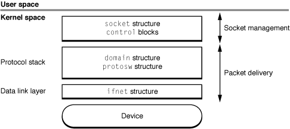
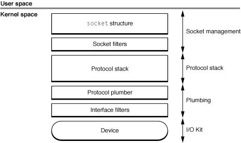
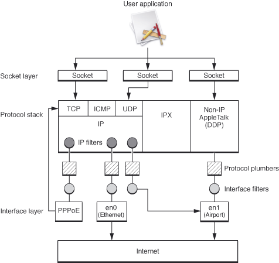

> 导航：[总目录](../../../README.md) · [documentation](../../../_indexes/documentation.md) · [Network Kernel Extensions Programming Guide](Introduction%20to%20Network%20Kernel%20Extensions%20Programming%20Guide.md)

[Next](Memory%20Buffers%2C%20Socket%20Manipulation%2C%20and%20Socket%20Input-Output.md)[Previous](Introduction%20to%20Network%20Kernel%20Extensions%20Programming%20Guide.md)

# Network Kernel Extensions Overview

Network kernel extension (NKE) is a term used to describe any OS X kernel extension that interacts with the networking stack. It is a separately compiled module (produced, for example, by Xcode using the Kernel Extension (KEXT) project type).

Loading a kernel extension is handled by the `kextload` command line utility, which adds the NKE to the running OS X kernel as part of the kernel's address space. Eventually, the system will provide automatic mechanisms for loading extensions. Currently, automatic loading is possible only for I/O Kit KEXTs and other KEXTs that they depend on.

As a kernel extension, an NKE provides initialization and termination routines that the kernel invokes when an NKE is loaded or unloaded. The initialization routine handles initializing local data structures and registering controls, filters, and interfaces. Similarly, the termination routine must free any allocated memory and unregister the extension along with any kernel controls associated with it.

OS X is based on the 4.4BSD UNIX operating system. The following structures control the 4.4BSD network architecture:

- `socket` structure, which the kernel uses to keep track of sockets. The `socket` structure is referenced by file descriptors from user mode.
- `domain` structure, which describes protocol families.
- `protosw` structure, which describes protocol handlers. (A protocol handler is the implementation of a particular protocol in a protocol family.)
- `ifnet` structure, which describes a network device and contains pointers to interface device driver routines.

None of these structures is used uniformly throughout the 4.4BSD networking infrastructure. Instead, each structure is used at a specific level, as shown in [Figure 1-1](#apple-f4xwc4dqnrsv64tfmyxwi33df52wszbpkridimbqgaytqnjyfvbuqmrsgywugsceireucq2g).

__Figure 1-1__  Traditional 4.4BSD Networking Architecture

In OS X, the structures themselves are hidden behind opaque types (or in some cases, integer identifiers). However, from a conceptual perspective, equivalent data structures exist and are accessible through accessor functions. The OS X architecture is summarized in [Figure 1-2](#apple-f4xwc4dqnrsv64tfmyxwi33df52wszbpkridimbqgaytqnjyfvbuqmrsgywugsceizbuqq2g).

__Figure 1-2__  OS X Networking Architecture

The `socket` structure is used to manage the socket. The `domain`, `protosw`, and `ifnet` structures are used to manage packet delivery to and from the network device.

OS X, beginning in version 10.4, supports several networking-related kernel programming interfaces (KPIs). This KPI mechanism consists of opaque data types and functions for manipulating the underlying data structures. Unlike the direct structure access used in previous versions, the KPI mechanism allows for maintaining binary compatibility across OS releases.

Each of the networking KPI mechanisms performs a specific task. The basic networking KPI mechanisms are:

- Socket filter KPI, which permits a KEXT to filter inbound or outbound traffic on a given socket, depending on how they are attached. Socket filters can also filter out-of-band communication such as calls to `setsockopt` or `bind`. The resulting filters lie between the socket layer and the protocol.
- IP filter KPI, which enables a KEXT to perform TCP/IP packet filtering on full (non-fragmented) IP frames. The resulting filters are invoked each time a TCP/IP packet enters the protocol handler layer (usually from the data link layer after the packet is reassembled), and again each time a packet leaves the protocol handler layer (usually going back out to the data link layer).
- Interface filter KPI, which allows a KEXT to add a filter to a specific network interface. These interface filters (previously known as data link NKEs) can passively observe traffic (regardless of packet type) as it flows into and out of the system. They can also modify the traffic (for example, encrypting or performing address translation). They essentially act as filters between a protocol stack and a device.
- Interface KPIs, which allow a KEXT to register a network interface, attach protocols to interfaces, gather information about interfaces, and send packets on an interface. A virtual device created using this mechanism defines a number of media-specific support callbacks (demultiplexing, framing, and pre-output functions such as ARP). Virtual devices can be written entirely using the Interface KPI mechanism.
- Protocol plumber KPIs, which allow a KEXT to register code to handle existing protocols on new interface types.

[Figure 1-3](#apple-f4xwc4dqnrsv64tfmyxwi33df52wszbpkridimbqgaytqnjyfvbuqmrsgywueqkciveuusce) shows the NKE architecture in detail.

__Figure 1-3__  NKE architecture

The most important aspect of removing a networking filter, pseudo-interface, and similar components is ensuring that all system resources allocated by the KEXT are returned to the system.

To support the dynamic loading and unloading of KEXTs in OS X, the kernel keeps track of the use of registered filters and similar components by other parts of the system. However, while this protects against dangling dependencies on your KEXT, your KEXT must still release any data structures that it has retained from elsewhere. The KEXT must track its use of resources, such as socket structures and mbufs so that the KEXT’s termination routine can eliminate references and return system resources.

Typically, for socket filters, most resources will be specific to a given socket. However, there is a mechanism provided for per-filter allocation. When the networking stack has disposed of all instances of your filter, it will call the filter’s `sf_unregistered_func` callback. At that time, your filter should deallocate any resources that are global to the filter.

When the networking stack finishes with a particular instance of your filter, it will call its `sf_detach_func`, `iff_detach_func`, or `ipf_detach_func` callback, respectively. Your extension most not unload until it has received detached or unregistered callbacks for every filter or interface that it has registered. Further, it should track any resources it uses and free those resources before unloading.

Resources that are not per-interface or per-filter can be allocated and freed in the KEXT’s start and stop routines.

The networking KPI mechanism provides some rudimentary support for tracking memory and data associated with a particular instance of filters. When a filter is attached (regardless of filter type), a cookie is assigned to that particular instance. In the case of socket filters, the attach callback returns this value. For other filter types, the value is passed into the attach function by the caller. While this cookie can contain arbitrary KEXT-specific data, it is generally used to hold a pointer to the data structure of your choice.

The cookie value will be passed as an argument whenever any of your filter’s functions are subsequently called on a given filter instance. You can then cast the value to a pointer to the appropriate structure and use this to recover the information stored therein.

As far as the networking stack is concerned, the cookie is a black box that only has meaning within the context of your kernel extension. It will not attempt to manipulate the cookie in any way, and more importantly, if it contains a pointer to a dynamically-allocated object, your KEXT is expected to manage the deallocation of the underlying data object after the filter instance is detached.

The dependencies for KPI-based KEXTs are different from those used for pre-KPI KEXTs in prior versions of OS X.

The KPI dependencies for OS X v10.4 are:

__Table 1-1__  KEXT Dependencies

| Bundle Identifier | Version | Description |
| com.apple.kpi.bsd | 8.0.0 | BSD APIs |
| com.apple.kpi.iokit | 8.0.0 | I/O Kit APIs |
| com.apple.kpi.libkern | 8.0.0 | User/Kernel Boundary Crossing APIs |
| com.apple.kpi.mach | 8.0.0 | Mach APIs |
| com.apple.kpi.unsupported | 8.0.0 | Unsupported and legacy APIs |

For dependency versions for other releases of OS X, see _[Kernel Extension Programming Topics](../Kernel%20Extension%20Programming%20Topics/Introduction.md#apple-f4xwc4dqnrsv64tfmyxwi33df52wszbpkridimbqgaytanrt)_.

[Next](Memory%20Buffers%2C%20Socket%20Manipulation%2C%20and%20Socket%20Input-Output.md)[Previous](Introduction%20to%20Network%20Kernel%20Extensions%20Programming%20Guide.md)

